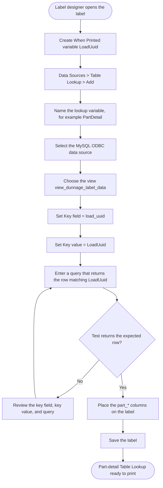
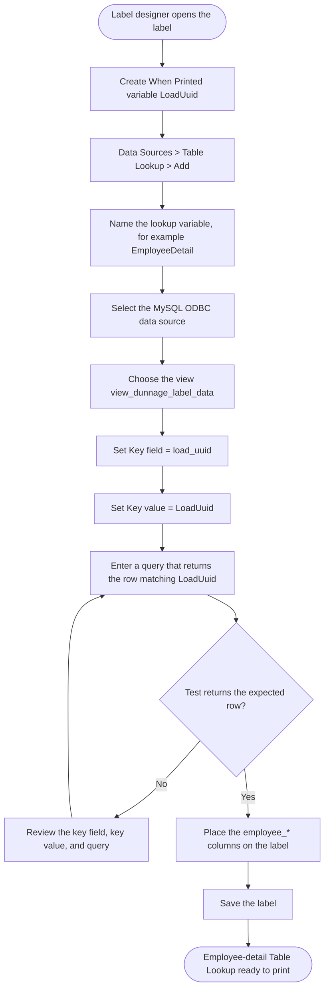
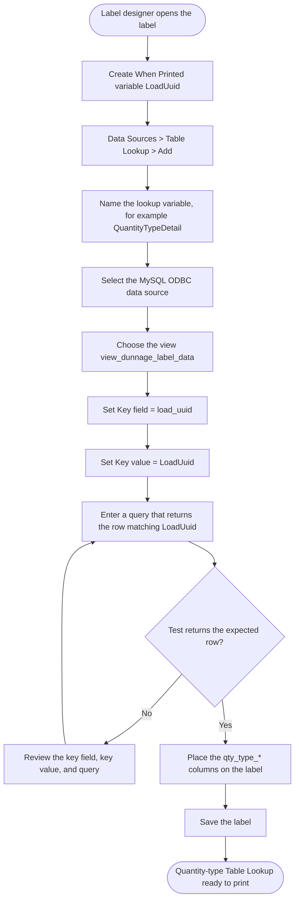
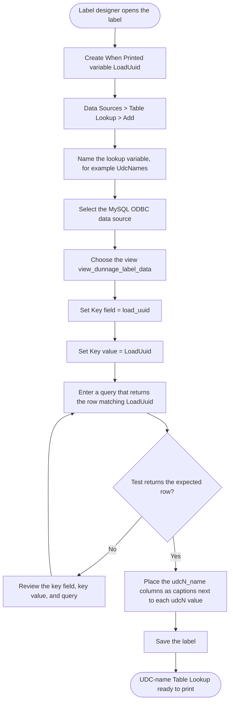
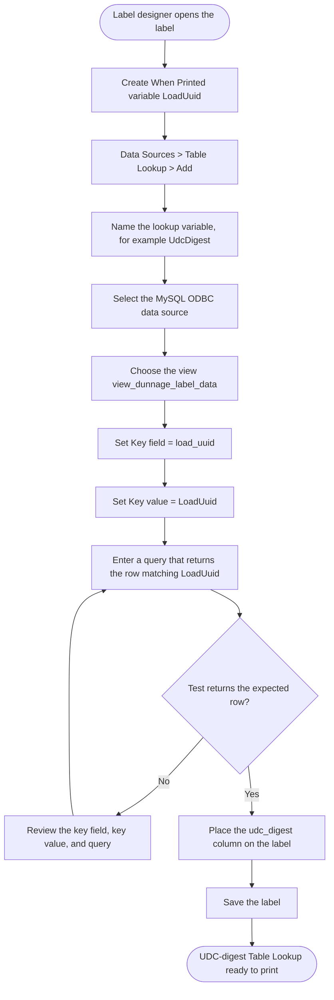
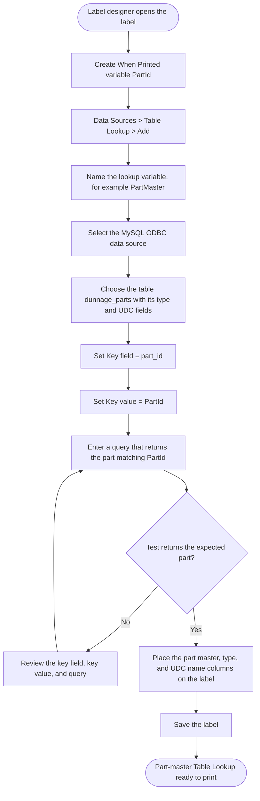
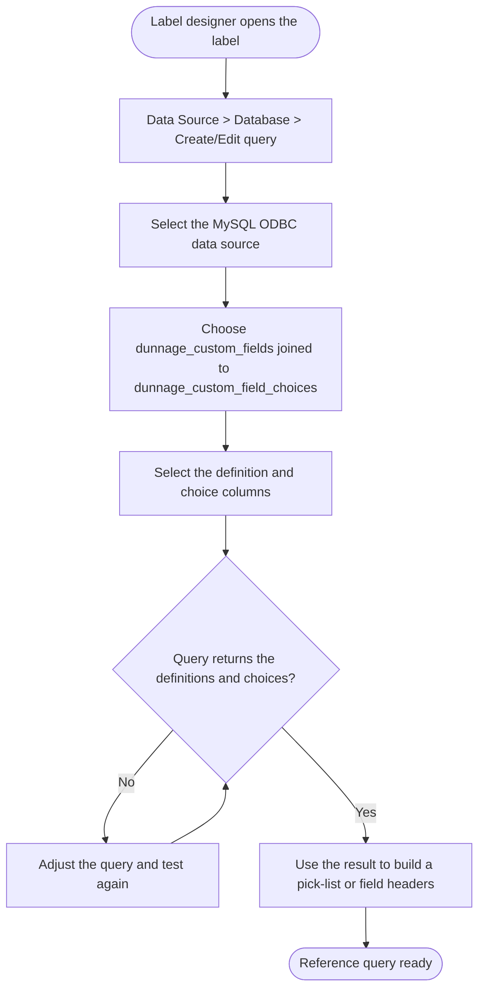
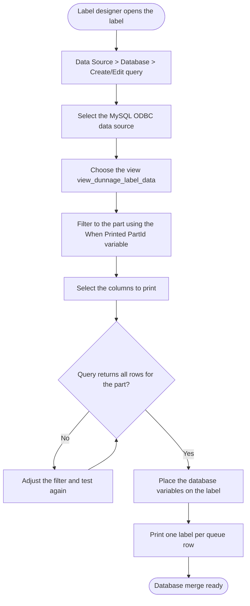
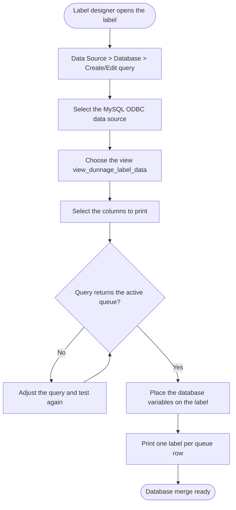

# Dunnage Label Data — LabelView 2022 MySQL View

One MySQL view houses every field you need on a dunnage label: the whole
`dunnage_label_data` row plus the linked data from `dunnage_parts`,
`dunnage_types`, `auth_users`, `dunnage_quantity_types`, and the UDC display
names from `dunnage_custom_fields`. A single LabelView 2022 Table Lookup
against the view returns all of it for the row being printed.

Built from the UDC logic in `Module_Dunnage` and the schemas under
`Database/Database_Deployment/Sql_Files/`. The MySQL ODBC connection format is
verified against Microsoft Learn.

## The View

Defined in
`Database/Database_Deployment/Sql_Files/Schemas/48_View_dunnage_label_data.sql`.
The deploy tooling (`Deploy-Database-GUI-Workbench.ps1`) applies every `.sql`
in `Sql_Files/Schemas` in name order, so the view is created automatically.

The view returns, for every active queue row:

- All `dunnage_label_data` columns, with their original names (`load_uuid`,
  `part_id`, `quantity`, `udc1..udc10`, ...) so existing label bindings stay
  stable.
- Part data (`dunnage_parts`): `part_home_location`, `part_image_path`,
  `part_quantity_type`, `part_udc1..10` (current master values), and audit
  columns.
- Type data (`dunnage_types`): `type_name_live`, `type_icon_live`,
  `type_image_path`.
- Employee data (`auth_users`): `employee_full_name`, `employee_department`,
  `employee_shift`, `employee_active`.
- Quantity-type data (`dunnage_quantity_types`): `qty_type_created_by`,
  `qty_type_created_date`.
- UDC display names (`dunnage_custom_fields`): `udc1_name..udc10_name`.

All joins are `LEFT JOIN`, so a row still returns even if a related record is
missing (for example a non-provisioned user).

## LabelView Table Lookup

LabelView's Table Lookup SQL does **not** use `?` placeholders. Reference the
When Printed variable directly with `APPLICATION.DOCUMENT.[<variable>]` — the
same pattern as `Where p.ID = APPLICATION.DOCUMENT.[part_id]`.

1. Create a **When Printed** variable named `LoadUuid` (the workflow session
   GUID the MTM app passes for the label being printed).
2. Add a Table Lookup against the MySQL ODBC data source with this SQL:

```sql
SELECT * FROM view_dunnage_label_data
WHERE load_uuid = APPLICATION.DOCUMENT.[LoadUuid]
```

3. Place the returned columns on the label (text / barcode / image).
4. The lookup re-runs per printed label, keyed by the current `LoadUuid`.

A Table Lookup shows the **first** matching record, so filter on the unique
`load_uuid` as shown.

## Reprints (dunnage_history)

The active queue moves to `dunnage_history` on Clear Label Data. To reprint,
create an equivalent view against `dunnage_history` (swap the `FROM`
`dunnage_label_data` for `dunnage_history`) and point the lookup at it.

## Data Source Setup (MySQL 5.7)

- MySQL server is `172.16.1.104:3306` (from `appsettings.json`).
- Database: `mtm_receiving_application` (production) or
  `mtm_receiving_application_test` (dev/test). Pick whichever DSN you configure.
- The DSN/connection string format used by the MySQL ODBC driver (Microsoft
  Learn, "Connect to a MySQL Data Source"):

```text
Driver={MySQL ODBC 8.0 Unicode Driver};Server=172.16.1.104;Port=3306;Database=mtm_receiving_application;Uid=<user>;Pwd=<password>;CharSet=utf8mb4;
```

Do not store real credentials in the label file — configure them in the DSN and
reference the DSN from LabelView.

### MySQL 5.7 Compatibility Constraints

The view uses only MySQL 5.7-supported constructs:

- No `WITH` (CTEs), no window functions, no `PIVOT`.
- UDC display names are resolved with static `LEFT JOIN`s to
  `dunnage_custom_fields` (one join per slot 1–10).
- Read-only `SELECT` view — safe for LabelView to query.

## UDC Logic (from Module_Dunnage)

- `dunnage_label_data.udc1..udc10` hold **snapshot values** captured at save
  time (`sp_Dunnage_LabelData_Insert`).
- The **display name** for each slot comes from `dunnage_custom_fields`:
  `DunnageTypeID = dunnage_label_data.dunnage_type_id` and `DisplayOrder` =
  slot number; `FieldName` is the name shown in the UI
  (`sp_Dunnage_CustomFields_GetByType`, `Helper_Dunnage_PartSpecs`).
- `dunnage_custom_field_choices` holds pick-list options per custom field.
- If a slot has no definition, the scripts fall back to the literal
  `UDC{n}` label.

## Schema and FK Map

Full `dunnage_label_data` reference (source:
`Database/Database_Deployment/Sql_Files/Schemas/31_Table_dunnage_label_data.sql`):

| Column | Type | Notes / FK target |
| --- | --- | --- |
| `id` | INT PK | Surrogate key |
| `load_uuid` | CHAR(36) | Workflow session GUID — primary print key |
| `part_id` | VARCHAR(50) | FK-ish to `dunnage_parts.part_id` (VARCHAR, UNIQUE) |
| `dunnage_type_id` | INT NULL | FK to `dunnage_types.id` (snapshot) |
| `dunnage_type_name` | VARCHAR(100) | Type name snapshot |
| `dunnage_type_icon` | VARCHAR(100) | Icon snapshot |
| `quantity` | DECIMAL(10,2) | Received quantity |
| `quantity_type` | VARCHAR(100) | FK-ish to `dunnage_quantity_types.quantity_type` |
| `po_number` | VARCHAR(50) | PO, NULL for non-PO |
| `received_date` | DATETIME | Receive timestamp |
| `user_id` | VARCHAR(100) | FK-ish to `auth_users.windows_username` |
| `employee_number` | INT NULL | FK-ish to `auth_users.employee_number` |
| `location` | VARCHAR(100) | Warehouse location |
| `label_number` | VARCHAR(50) | Secondary key (multi-label splits, reprint) |
| `part_skid_sequence` / `part_skid_total` | INT | Skid position / total |
| `udc1..udc10` | VARCHAR(255) | UDC value snapshots |
| `created_at` | TIMESTAMP | Queue insert time |

Related tables resolved by the scripts:

| Target table | Join key | Exposed as |
| --- | --- | --- |
| `dunnage_parts` | `part_id` | `part_home_location`, `part_image_path`, `part_quantity_type`, `part_udc1..10`, audit columns |
| `dunnage_types` | `dunnage_type_id` | `live_type_name`, `live_type_icon`, `type_image_path` |
| `auth_users` | `user_id` | `employee_full_name`, `employee_department`, `employee_shift`, `employee_active` |
| `dunnage_quantity_types` | `quantity_type` | `qty_type_created_by`, `qty_type_created_date` |
| `dunnage_custom_fields` | `dunnage_type_id` + `DisplayOrder` | `udc1_name..udc10_name` |

> The view works the same way against `dunnage_history` for reprints — it
> carries the same `udc1..udc10` plus the compatibility aliases
> `dunnage_type_id` / `dunnage_type_name` / `dunnage_type_icon` (source:
> `06_Table_dunnage_history.sql`). Swap the `FROM` table to build a history
> view.

---

## Script 1 — Table Lookup: full label data (row + linked)

Returns every `dunnage_label_data` column plus the linked data (part, type,
employee, quantity type, and UDC display names) in one Table Lookup against
the view.


To look up by a different key instead of `load_uuid`, set the Key field to
`id` or `label_number` and bind the matching When Printed variable. For
reprints, point the lookup at an equivalent `dunnage_history` view.

## Supplemental linked-data lookups (add as extra Table Lookups)

Your existing row lookup already returns the `dunnage_label_data` row keyed on
`load_uuid`. Each script below returns the **linked data from one other
table** for that same row. Add one Table Lookup variable per script (all keyed
on the same When Printed `LoadUuid`), then place the returned columns on the
label as extra fields. Every script returns a single row.

## Script 2 — Table Lookup: part detail

Adds the part master data (`dunnage_parts`) for the printed row.



## Script 3 — Table Lookup: type detail

Adds the dunnage type data (`dunnage_types`) for the printed row.


## Script 4 — Table Lookup: employee detail

Adds the user / employee data (`auth_users`) for the printed row.



## Script 5 — Table Lookup: quantity-type detail

Adds the reusable quantity-type data (`dunnage_quantity_types`) for the
printed row.



## Script 6 — Table Lookup: UDC display names

Adds the UDC display name (`FieldName`) for each slot so the label can caption
the `udc1..udc10` values already returned by the row lookup.



## Script 7 — Table Lookup: UDC digest

Adds a single combined string of the populated UDC slots (`FieldName: value`,
separated by `|`).



## Script 8 — Table Lookup: part master (by part_id)

Pulls the part master row directly by `part_id` for a part-master label that
is not tied to a specific load.



## Script 9 — Reference: UDC definitions and choices

Returns the custom-field definitions and pick-list choices for a type. A type
can have up to 10 fields, each with several choices, so this returns multiple
rows and is **not** a per-label Table Lookup — build it as a Database query
and use it for pick-lists or field headers.



## Multi-record queries (Database merge)

Scripts 10 and 11 return multiple rows on purpose. Do not use them as Table
Lookup variables — a lookup would silently use the first row. Use them with
the Database merge feature (one label per record) or external tooling.

## Script 10 — Database merge: all queue rows for one part

Returns every active queue row for a part (useful for multi-skid labels).
This is a **multi-record** Database merge — do not use it as a Table Lookup
variable, which would silently show only the first row.



## Script 11 — Database merge: entire active queue

Returns every row in the active queue for batch printing. This is a
**multi-record** Database merge (one label per record) — do not use it as a
Table Lookup variable.



## LabelView Binding Notes

- The recommended approach is one Table Lookup on the view
  `view_dunnage_label_data`, keyed on the **When Printed** variable
  `LoadUuid` against the view column `load_uuid`. The lookup re-runs per
  printed label whenever `LoadUuid` changes.
- LabelView's Table Lookup SQL does **not** use `?` placeholders — reference
  the When Printed variable directly, for example
  `APPLICATION.DOCUMENT.[LoadUuid]`.
- A Table Lookup shows the **first** matching record, so key on the unique
  `load_uuid` (or `id` / `label_number`).
- Result columns map to LabelView variables **by name**. `udc1..udc10` are
  the value fields; `udc1_name..udc10_name` are the captions; `part_*` /
  `type_*` / `employee_*` / `qty_type_*` are the linked fields.
- All joins are `LEFT JOIN`, so the label still prints if a related record is
  missing (e.g., a non-provisioned user).
- For reprints, point the lookup at an equivalent `dunnage_history` view.
- Scripts 10 and 11 are **Database merge** flows (print one label per
  record), not Table Lookups.

## See Also

- [View definition](Database/Database_Deployment/Sql_Files/Schemas/48_View_dunnage_label_data.sql)
- TEKLYNX: [Differences between Databases & Table Lookups (KA-02321)](https://teklynx.microsoftcrmportals.com/knowledgebase/article/KA-02321/en-us)
- TEKLYNX: [Creating a Table Lookup (KA-02506)](https://teklynx.microsoftcrmportals.com/knowledgebase/article/KA-02506/en-us)
- TEKLYNX: [Queries, Sorting, and Joining for Databases (KA-01839)](https://teklynx.microsoftcrmportals.com/knowledgebase/article/KA-01839/en-us)
- TEKLYNX: [LabelView 2022 tutorial (PDF)](https://www.teklynx.com/-/media/Files/Manuals-and-Guides/LABELVIEW/2022/LV2022_tutorial_en.pdf)
- [Module_Dunnage UDC helper](Module_Dunnage/Helpers/Helper_Dunnage_PartSpecs.cs)
- [dunnage_label_data schema](Database/Database_Deployment/Sql_Files/Schemas/31_Table_dunnage_label_data.sql)
- [dunnage_custom_fields schema](Database/Database_Deployment/Sql_Files/Schemas/09_Table_dunnage_custom_fields.sql)
- [dunnage_custom_field_choices schema](Database/Database_Deployment/Sql_Files/Schemas/10_Table_dunnage_custom_field_choices.sql)
- [LabelView reverse-engineering analysis](docs/development/LabelView/ReverseEngThis_Analysis.md)
- [ODBC data source configuration](docs/development/InforVisual/Interaction_Guides/UI_Interaction_Guide.md)
- Microsoft Learn: [Connect to a MySQL Data Source (ODBC driver connection string)](https://learn.microsoft.com/sql/integration-services/import-export-data/connect-to-a-mysql-data-source-sql-server-import-and-export-wizard)
