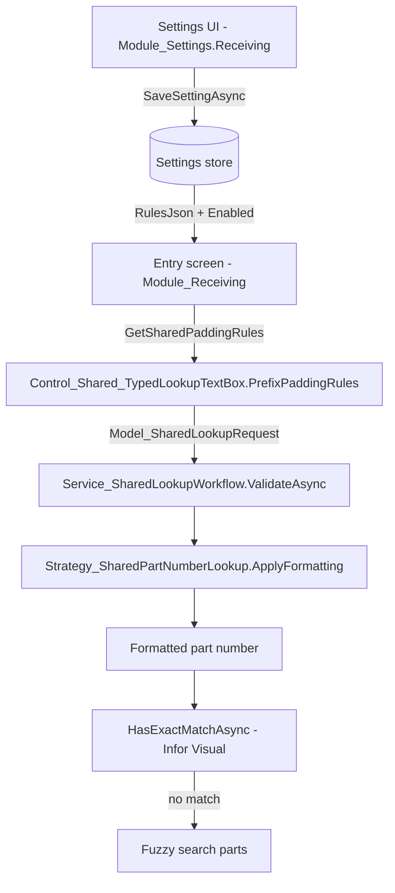

# Part Padding Feature Report

Last Updated: 2026-08-26

## Overview

"Part Padding" (also referred to as **Part Number Auto-Padding** or **Part Number Padding**)
normalizes user-typed Infor Visual part numbers into a canonical form by padding the
numeric suffix up to a fixed length. When an operator types `MMC1000` and a rule exists for
prefix `MMC` with `MaxLength = 10`, the app rewrites it to `MMC0001000` before it is
validated and sent.

The feature is configured in `Module_Settings.Receiving` (the Receiving settings UI) and is
applied at runtime by the shared typed-lookup infrastructure in `Module_Shared`, which is
used by the Receiving entry screens and the Scanner module.

## How It Works (End to End)

1. An admin/operator configures rules and an on/off flag in the settings UI.
2. The rules are saved to two settings keys as a JSON array.
3. Each part-number entry screen loads those settings and passes the rules into a shared
   typed-lookup text box control.
4. When the operator leaves the field (validation runs), the shared lookup workflow formats
   the typed value using the best-matching rule, then validates the formatted value against
   Infor Visual (exact match, then fuzzy).



## Settings Storage

### Keys

Defined in `Module_Receiving/Settings/ReceivingSettingsKeys.cs`:

| Key | Type | Purpose |
| --- | --- | --- |
| `Receiving.PartNumberPadding.Enabled` | Bool | Master on/off switch |
| `Receiving.PartNumberPadding.RulesJson` | String (JSON) | Serialized array of padding rules |

### Defaults

- `Module_Receiving/Settings/ReceivingSettingsDefaults.cs`:
  - `Enabled = true`
  - Default rules JSON with two rules: `Coil` (prefix `MMC`) and `Flatstock` (prefix `MMF`),
    both `MaxLength = 10`, pad char `0`, enabled.
- `Module_Settings.Core/Defaults/settings.manifest.json` declares the same keys with a richer
  default rule set: `MMC`, `MMCCS`, `MMCSR`, `MMF`, `MMFCS`, `MMFSR`, `MMR`, `MMS` (all
  `MaxLength = 10`, pad char `0`).
- Database seed rows exist in `Database/Database_Deployment/OldSchema/mtm_receiving_application.sql`
  for the same two keys.

## The Rule Model

`Module_Receiving/Models/Model_PartNumberPrefixRule.cs` is the settings-side, observable
rule used by the UI:

| Property | Type | Description |
| --- | --- | --- |
| `Name` | string | Friendly name shown in the rule list |
| `Prefix` | string | Leading letters a part must start with (case-insensitive) |
| `MaxLength` | int | Total target length after padding (includes the prefix) |
| `PadChar` | char | Character used to pad (default `'0'`) |
| `IsEnabled` | bool | Whether the rule is active |
| `StatusColor` / `StatusTooltip` | computed | UI status indicator (green/red) |

### Padding Algorithm (`FormatPartNumber`)

1. Trim and uppercase the input and the prefix.
2. Return unchanged if the input does not start with the prefix, or the input length is
   already `>= MaxLength`.
3. `suffix = input.Substring(prefix.Length)`.
4. `paddingCount = MaxLength - prefix.Length - suffix.Length`.
5. If `paddingCount <= 0`, return unchanged.
6. Otherwise return `PREFIX + (PadChar * paddingCount) + suffix`.

Example: prefix `MMC`, `MaxLength 10`, pad `0`, input `MMC1000`:

```
MMC + 000 + 1000  →  MMC0001000
```

### Best-Match Selection (`FindBestMatch`)

Among all enabled rules, the one whose prefix matches the input and has the **longest**
prefix wins. This lets specific prefixes (e.g. `MMCCS`) override generic ones (e.g. `MMC`).
`ApplyBestMatchingRule` applies the winning rule or returns the input unchanged.

## Settings UI (Module_Settings.Receiving)

Two pages expose the feature:

- `Views/View_Settings_Receiving_PartFormatting.xaml` / `ViewModel_Settings_Receiving_PartFormatting.cs`
  - Master "auto-padding" toggle (`IsPaddingEnabled`).
  - Rule list (add/remove/edit rules: name, prefix, max length, pad character, enabled).
  - "Test Padding" card: type a value (`TestInput`) and see the normalized result (`TestOutput`)
    live via `TestPadding()`.
- `Views/View_Settings_Receiving_UserPreferences.xaml` / `ViewModel_Settings_Receiving_UserPreferences.cs`
  - Same padding section (plus ignored locations and vendor variable mappings, which are
    unrelated to padding).

Both load the enabled flag and rules JSON on init, and `SaveAsync` writes them back with
`SaveSettingAsync`. If no rules exist, two defaults (`Coil`/`MMC`, `Flatstock`/`MMF`) are
inserted in memory.

The pages are reachable from the Receiving settings hubs
(`View_Settings_Receiving_CategoryHub.xaml`, `View_Settings_Receiving_WorkflowHub.xaml`,
and `ViewModel_Settings_Receiving_NavigationHub.cs` label "Part Number Auto Padding").

## Shared Lookup Infrastructure (Where Padding Is Applied)

### Shared rule (`Module_Shared/Models/Lookup/Model_SharedLookupPrefixPaddingRule.cs`)

A plain (non-observable) counterpart of the settings rule, used at lookup time:
`Prefix`, `MaxLength`, `PadCharacter`, `IsEnabled`, plus `AppliesTo(value)` (enabled and
starts-with-prefix, case-insensitive).

### Typed lookup control (`Module_Shared/Views/Controls/Control_Shared_TypedLookupTextBox.xaml.cs`)

Exposes a `PrefixPaddingRules` dependency property
(`IReadOnlyList<Model_SharedLookupPrefixPaddingRule>`). During validation it builds a
`Model_SharedLookupRequest` carrying `PrefixPaddingRules`, `LookupType`, `RawInput`,
`WarehouseCode`, and `AutoResolveFuzzyMatches`, and calls the shared lookup workflow.

### Workflow + strategy

- `Module_Shared/Services/Lookup/Service_SharedLookupWorkflow.cs`:
  `ValidateAsync` -> `strategy.ValidateRawInput` -> `strategy.ApplyFormatting` ->
  `strategy.HasExactMatchAsync` (Infor Visual) -> fuzzy fallback.
- `Module_Shared/Services/Lookup/Strategy_SharedPartNumberLookup.cs`:
  `ApplyFormatting` picks the best matching enabled rule (longest prefix), pads the suffix,
  and reports `FormattedValue`, `HasFormattingRule`, `WasFormatted`.
  `HasExactMatchAsync` -> `IService_InforVisual.PartExistsAsync(formattedValue)`.
  `SearchFuzzyAsync` -> `FuzzySearchPartsAsync(formattedValue)`.

## Consumers (Where Rules Are Loaded and Applied)

| File | How it uses the feature |
| --- | --- |
| `Module_Receiving/Views/View_Receiving_ManualEntry.xaml.cs` | `LoadPaddingSettingsAsync` reads `Enabled` + `RulesJson`; `GetSharedPaddingRules()` filters enabled/valid rules and maps them to `Model_SharedLookupPrefixPaddingRule`, then sets `control.PrefixPaddingRules`. |
| `Module_Receiving/Views/View_Receiving_POEntry.xaml.cs` | Reads settings (with defaults fallback) and sets `PartIDLookupControl.PrefixPaddingRules`. |
| `Module_Receiving/Views/View_Receiving_EditMode.xaml.cs` | Reads settings and sets `control.PrefixPaddingRules` from mapped rules. |
| `Module_Scanner/Views/View_Scanner_Workbench.xaml.cs` (legacy reference) | Same pattern on the Scanner `PartIdLookupControl` (`docs/reference/module-scanner-legacy/...`). |
| `Module_Reporting/Services/Service_Reporting.cs` | `GetEnabledPrefixRulesAsync` reads `RulesJson` directly (no lookup control) to normalize part numbers in report summaries. |

## Data Flow Summary

```
Settings UI  →  Receiving.PartNumberPadding.{Enabled, RulesJson}
                     │
                     ▼
Entry screens (ManualEntry / POEntry / EditMode / Scanner)
                     │  read settings + map rules
                     ▼
Control_Shared_TypedLookupTextBox.PrefixPaddingRules
                     │  builds Model_SharedLookupRequest
                     ▼
Service_SharedLookupWorkflow.ValidateAsync
                     │
                     ▼
Strategy_SharedPartNumberLookup.ApplyFormatting   (pad to MaxLength)
                     │
                     ▼
PartExistsAsync / FuzzySearchPartsAsync (Infor Visual)
```

## Key Files

- `Module_Receiving/Settings/ReceivingSettingsKeys.cs`
- `Module_Receiving/Settings/ReceivingSettingsDefaults.cs`
- `Module_Receiving/Models/Model_PartNumberPrefixRule.cs`
- `Module_Settings.Receiving/ViewModels/ViewModel_Settings_Receiving_PartFormatting.cs`
- `Module_Settings.Receiving/ViewModels/ViewModel_Settings_Receiving_UserPreferences.cs`
- `Module_Settings.Receiving/Views/View_Settings_Receiving_PartFormatting.xaml`
- `Module_Settings.Receiving/Views/View_Settings_Receiving_UserPreferences.xaml`
- `Module_Shared/Models/Lookup/Model_SharedLookupPrefixPaddingRule.cs`
- `Module_Shared/Views/Controls/Control_Shared_TypedLookupTextBox.xaml.cs`
- `Module_Shared/Services/Lookup/Service_SharedLookupWorkflow.cs`
- `Module_Shared/Services/Lookup/Strategy_SharedPartNumberLookup.cs`
- `Module_Core/Defaults/...` settings store (settings system)
- Consumers: `Module_Receiving/Views/View_Receiving_ManualEntry.xaml.cs`,
  `View_Receiving_POEntry.xaml.cs`, `View_Receiving_EditMode.xaml.cs`,
  `Module_Reporting/Services/Service_Reporting.cs`
