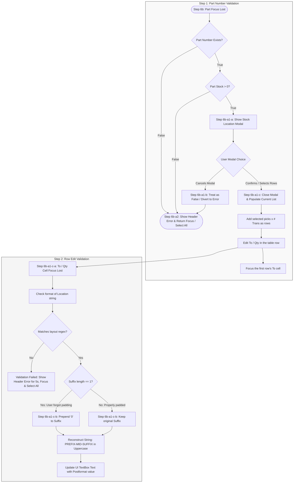

# Reformat Project Task List

> Scope: `Module_Scanner` reformat. File references below point at the current module
> implementation (Workbench view, Workbench viewmodel, validation service). All checkboxes
> remain open — nothing is complete yet.

## Module_Scanner Audit
- [ ] 1) Verify if the app properly locks out user inputs while automation is occurring.
    - **Files to update/add:** `Module_Scanner/Services/Service_ScannerExecution.cs`, `Module_Scanner/Services/Service_ScannerInputEngine.cs`, `Module_Scanner/ViewModels/ViewModel_Scanner_Workbench.cs`, `Module_Scanner/Views/View_Scanner_Workbench.xaml`
- [ ] 2) Check if tests exist to validate this input lockout functionality.
    - **Files to update/add:** `MTM_Receiving_Application.Tests/Integration/Module_Scanner/`
- [ ] 2b) Create asynchronous integration tests verifying elements toggle `Enabled = false` during active automated background processes.
    - **Files to update/add:** `MTM_Receiving_Application.Tests/Integration/Module_Scanner/` (new `WorkbenchInputLockout` fixture)

## Core Feature Removals
- [ ] 3) Remove the "Start Draft" button (spec references it as "Save Draft") and all underlying functionality.
    - **Files to update/add:** `Module_Scanner/Views/View_Scanner_Workbench.xaml` (footer button), `Module_Scanner/ViewModels/ViewModel_Scanner_Workbench.cs` (`StartDraftSessionCommand` / `StartDraftSessionAsync`), `Module_Scanner/Services/Service_ScannerWorkflow.cs` (draft-session creation), `Module_Scanner/Data/Dao_ScannerBatchSession.cs`
- [ ] 4) Remove the "Save For Later" button and all underlying functionality.
    - **Files to update/add:** `Module_Scanner/Views/View_Scanner_Workbench.xaml` (footer button), `Module_Scanner/ViewModels/ViewModel_Scanner_Workbench.cs` (`BuildRunSnapshotCommand`)

## UI & Layout Adjustments
- [ ] 5) Fix "Manage Item" modal window size (content is currently cut off on the UI).
    - **Files to update/add:** `Module_Scanner/Views/View_Scanner_ManageItemsDialog.xaml`
- [ ] 6) Update Workbench inputs to the following baseline state:
    - **Files to update/add:** `Module_Scanner/Views/View_Scanner_Workbench.xaml`, `Module_Scanner/ViewModels/ViewModel_Scanner_Workbench.cs`
    - **Part Number:** Editable. (`PartIdLookupControl`) — the only top-bar input.
    - **From / To / Qty:** Edited per-row in the current-list table; no top-bar textboxes.
    - **Send Button:** Disabled until the selected row validates. (`IsSendEnabled`)

---

## Part Number Validation Workflow (Step 6b)

### Full Sequential Workflow Diagram (Step 1 -> Step 2)


### [Step 6b] Part Focus Lost & Validation
* When the user enters a **Part Number** and focus is lost, validate if the part number exists.

#### [Step 6b-a1] Case A: Part Number Exists & Has Stock

**Files to update/add:** `Module_Scanner/ViewModels/ViewModel_Scanner_Workbench.cs` (`FromLocationInventoryPickerRequested` event, `ApplyStockLocationSelectionAsync`, `ValidateSessionItemAsync`, `IsSendEnabled`, `SendSelectedAsync`), `Module_Scanner/Views/View_Scanner_Workbench.xaml.cs` (`OnFromLocationInventoryPickerRequestedAsync` — `ContentDialog` picker, `SessionItemToTextBox_LostFocus`, `SessionItemQtyTextBox_LostFocus`), `Module_Scanner/Models/Model_ScannerStockPick.cs` (`TransactionCount`), `Module_Scanner/Models/Model_ScannerBatchItem.cs` (`ObservableObject` for the editable table columns).

* **[Step 6b-a1-a] Display Modal Window:** Show a modal listing all current locations holding `> 0` on hand.
  * Column-header row above the list: **Location**, **Total Qty**, **Qty**, **# Trans**.
  * Each row has a **checkbox** (multi-select), the location, the **Total Qty** formatted without trailing zeros (e.g. `16452.0000000` → `16452`, `12554.5` stays `12554.5`), an editable **Qty** textbox auto-filled with that location's on-hand, and a **# of Transactions** `NumberBox` (default `1`, minimum `1`).
  * The **# Trans** value states how many transaction lines that location produces in the current list. When `# Trans > 1`, every created line is added with quantity `1` (the operator sets them later in the table).
  * Quantity boundaries are clamped to `0`..on-hand before the lines are created.
* **[Step 6b-a1-b] User Cancels Modal:** Treat as if the part number had no stock, show an informational status, and **clear the Part Number input** on the Workbench so the shared lookup cannot re-validate and reopen the modal. No lines are added.
* **[Step 6b-a1-c] Close Modal / Confirm Action (Use Selected):** Populate the current list immediately (no Add step):
  1. Add one row per checked location (picks × # transactions) with the source location and quantity; the destination is left empty.
  2. Clear the **Part Number** input (prevents modal reopen) and focus the first row's destination cell.
  3. The operator edits **To** and **Qty** directly in the table; each edit re-validates the row on focus loss and updates its **Status**.
  4. **Send** is enabled only when the selected row has validated (`Valid`) and sends that selected row only.

#### [Step 6b-a2] Case B: Part Number Has No Stock / Invalid

**Files to update/add:** `Module_Scanner/Views/View_Scanner_Workbench.xaml` (header/status error `TextBlock`), `Module_Scanner/ViewModels/ViewModel_Scanner_Workbench.cs` (`HeaderErrorText`, `IsHeaderErrorVisible`, `ClearHeaderError`).

1. Show an inline error message in the **Workbench header/status area** stating that the part number does not have any quantity in-house. 
2. Clear the error message automatically after a **5-second timeout**, or early if the user starts typing a new Part Number.
3. Return focus to the **Part lookup control** (`PartIdLookupControl`) and execute a **Select All**.

---

## Workbench Table Interaction (headers, navigation, status)

**Files to update/add:** `Module_Scanner/Views/View_Scanner_Workbench.xaml` (`ItemContainerStyle`, editable To/Qty columns, status column), `Module_Scanner/Views/View_Scanner_Workbench.xaml.cs` (`SessionItemTextBox_KeyDown`, `MoveFocusToCell`), `Module_Scanner/Models/Model_ScannerBatchItem.cs` (`StatusText`, `StatusIsValid`, `MaxQuantity`), `Module_Core/Converters/Converter_ValidationStatusToBrush.cs`.

* **Column header alignment:** Rows were shifted off the header because `ListViewItem` defaults to left-aligned content with horizontal padding. The `ListView.ItemContainerStyle` now sets `HorizontalContentAlignment=Stretch` and `Padding=0,2`, so the row grids line up exactly with the header grid.
* **Cell navigation:**
  * **Tab:** `To` -> `Qty` (same row) -> next row's `To` -> `Qty` (repeat). Past the last row focus returns to the Part lookup.
  * **Enter:** goes down to the next line — `To` -> next row's `Qty`; `Qty` -> next row's `To`. Past the last row focus returns to the Part lookup.
  * **Click:** normal behavior — focus goes wherever clicked.
* **Focus preservation:** Row validation on focus loss persists silently and does NOT rebuild `SessionItems` (the row model is observable), so the control you were tabbing/entering to keeps focus.
* **Friendly status (colored):**
  * `✅ Ready!` — green when the row validates.
  * `! Qty too High` — red (checked against the on-hand captured from the stock modal).
  * `! Qty less than 1` — red.
  * `! To location required` — red.
  * `⏳ Enter destination` — gray before a destination is entered.
  * The reason is derived from the row's own data first (so it states the actual issue even after an app restart), then falls back to the stored validation message.
* **Send / Validate button:** The primary button label is **Validate** whenever the selected row is not valid; clicking it shows a **"Fix the issues before sending"** popup listing the issue instead of sending. When the selected row validates, the button becomes **Send** and sends that row only.
* **Remove Selected** lives in the top bar (beside the Part lookup), not the table header, so the header grid has exactly the same columns as the rows.

## Search Mode Toggle (Part / Location)

**Files to update/add:** `Module_Scanner/Views/View_Scanner_Workbench.xaml` (`ToggleSwitch`, `LookupType`), `Module_Scanner/ViewModels/ViewModel_Scanner_Workbench.cs` (`IsLocationModeEnabled`, `SearchMode`, `LookupType`, `LocationValidationCompletedAsync`, `GetPartsAtLocationForPickerAsync`), `Module_Scanner/Views/View_Scanner_Workbench.xaml.cs` (`OnLocationPartsPickerRequestedAsync`, `ShowLocationPartsPickerDialogAsync`), `Module_Scanner/Services/Service_ScannerValidation.cs` (`GetPartsAtLocationAsync`), `Module_Scanner/Models/Enum_ScannerSearchMode.cs`.

* A **Part / Location** `ToggleSwitch` next to the Part lookup switches the search domain. The shared lookup control auto-updates its header/placeholder from `LookupType`.
* **Part mode** (default): the existing workflow — enter a part, pick source locations from the stock modal.
* **Location mode**: works exactly the same but in reverse — enter a location, it is validated, and a modal lists every part with stock at that location. The modal supports **Select All / Select None** (the button toggles label when all parts are checked). Chosen parts are added as rows with that source location.
* Switching modes clears the lookup input so a stale value is not re-validated in the other mode.

## Open Inventory (VMINVENT) Button

**Files to update/add:** `Module_Scanner/Views/View_Scanner_Workbench.xaml` (footer button), `Module_Scanner/ViewModels/ViewModel_Scanner_Workbench.cs` (`OpenInventoryCommand`), `Module_Scanner/Services/Service_ScannerExecution.cs` (`OpenInventoryWindowAsync`), `Module_Scanner/Contracts/IService_ScannerExecution.cs`.

* Footer **Open Inventory** button launches VMINVENT when it is not running, activates the target window, and sends the open-window shortcut (`Alt+I`) so the operator can reach the Inventory Transfers window.
* If VMINVENT is already running, the existing window is activated and the shortcut is sent.
* Failures (could not launch, window not found) are reported as a friendly status.

## To Location / Qty Row Edit Workflow (Step 6b-a1-c-a)

**Files to update/add:** `Module_Scanner/Views/View_Scanner_Workbench.xaml` (editable To/Qty columns), `Module_Scanner/Views/View_Scanner_Workbench.xaml.cs` (`SessionItemToTextBox_LostFocus`, `SessionItemQtyTextBox_BeforeTextChanging`, `SessionItemQtyTextBox_LostFocus`), `Module_Scanner/ViewModels/ViewModel_Scanner_Workbench.cs` (`ValidateSessionItemAsync`, `Helper_ScannerLocationFormat`), `Module_Scanner/Models/Model_ScannerBatchItem.cs` (`ObservableObject`).

* **[Step 6b-a1-c-a] Format Verification:** When focus is lost on a row's **To** cell, the value is sanitized (`PREFIX-MID-SUFFIX`), the row is re-validated, its **Status** column updates, and Send enablement refreshes.
  * If validation fails, no blocking modal popup is used; the row's Status shows the failure.
* **[Step 6b-a1-c-b] Sanitation Logic:** Use the following reference tables to automatically sanitize and fix improper user formatting layouts:

### Standard 2-Digit Padded Group

| User Variant | Example User Input (Preformat) | Should Return (Postformat) |
| :--- | :--- | :--- |
| **User Variant** <br> *The structural pattern of letters (L), numbers (N), and hyphens typed by the user.* | **Example User Input (Preformat)** <br> *A real-world example of raw, unformatted text entered into the location field.* | **Should Return (Postformat)** <br> *The final, cleaned up, and standardized string saved to the database.* |
| **L-LN-NN** | `V-A0-01` | `V-A0-01` |
| **LL-LN-NN** | `VA-A0-01` | `VA-A0-01` |
| **LL-LNN** | `VA-A001` | `VA-A0-01` |
| **L-LNN** | `V-A001` | `V-A0-01` |
| **LLN-NN** | `VAA0-01` | `VA-A0-01` |
| **LN-NN** | `VA0-01` | `V-A0-01` |
| **LLNNN** | `VAA001` | `VA-A0-01` |
| **LNNN** | `VA001` | `V-A0-01` |

### Unpadded Group (Auto-Corrected & Padded)

| User Variant | Example User Input (Preformat) | Should Return (Postformat) |
| :--- | :--- | :--- |
| **User Variant** <br> *The structural pattern where the user forgot to add a leading zero to the final section.* | **Example User Input (Preformat)** <br> *The raw input string containing a single trailing digit instead of two.* | **Should Return (Postformat)** <br> *The normalized string with the missing zero automatically added and hyphens inserted.* |
| **L-LN-N** | `V-A0-1` | `V-A0-01` |
| **LL-LN-N** | `VA-A0-1` | `VA-A0-01` |
| **LL-LN** | `VA-A01` | `VA-A0-01` |
| **L-LN** | `V-A01` | `V-A0-01` |
| **LLN-N** | `VAA0-1` | `VA-A0-01` |
| **LN-N** | `VA0-1` | `V-A0-01` |
| **LLNN** | `VAA01` | `VA-A0-01` |
| **LNN** | `VA01` | `V-A0-01` |

---

### Implementation Reference (C# Location Format Sanitizer)

> The canonical implementation already exists in the codebase — prefer it over a new helper:
> `Service_ScannerValidation.FormatLocation(string)` (file:
> `Module_Scanner/Services/Service_ScannerValidation.cs`) delegates to
> `Strategy_SharedLocationLookup.ApplyFormatting` (file:
> `Module_Shared/Services/Lookup/Strategy_SharedLocationLookup.cs`).
>
> The sample below documents the sanitization algorithm that resolves all 16 layout
> variations. The original trailing `\$` and `\$"` escapes were corrected to `$` so the
> sample is valid C# (in a verbatim string `\$` matches a literal dollar sign, not the
> end-of-string anchor).

```csharp
using System;
using System.Text.RegularExpressions;

public static class LocationParser
{
    private static readonly Regex LocationRegex = new Regex(
        @"^(?<prefix>[A-Za-z]{1,2})-?(?<mid>[A-Za-z][0-9])-?(?<suffix>[0-9]{1,2})$",
        RegexOptions.Compiled
    );

    public static string SanitizeLocationFormat(string rawInput)
    {
        if (string.IsNullOrWhiteSpace(rawInput)) return null;

        string input = rawInput.Trim();
        Match match = LocationRegex.Match(input);

        if (!match.Success) return null;

        string prefix = match.Groups["prefix"].Value.ToUpper();
        string mid    = match.Groups["mid"].Value.ToUpper();
        string suffix = match.Groups["suffix"].Value;

        if (suffix.Length == 1)
        {
            suffix = "0" + suffix;
        }

        return $"{prefix}-{mid}-{suffix}";
    }
}
```

### UI Integration Reference (WinUI 3 MVVM, Non-Blocking Error Loop)

Bind the Workbench to the viewmodel for the non-blocking header warning requirement. Keep
business logic in `ViewModel_Scanner_Workbench.cs`; the code-behind only handles focus and
selection.

**View (`Module_Scanner/Views/View_Scanner_Workbench.xaml`):**

```xaml
<!-- Table row: editable To and Qty columns, validated on focus loss -->
<TextBox
    Grid.Column="3"
    PlaceholderText="To"
    Text="{x:Bind PayloadToLocation, Mode=TwoWay}"
    LostFocus="SessionItemToTextBox_LostFocus" />
<TextBox
    Grid.Column="4"
    PlaceholderText="Qty"
    Text="{x:Bind PayloadQuantity, Mode=TwoWay}"
    BeforeTextChanging="SessionItemQtyTextBox_BeforeTextChanging"
    LostFocus="SessionItemQtyTextBox_LostFocus" />
<TextBlock Grid.Column="5" Text="{x:Bind ValidationState}" />

<!-- Non-blocking header/status error area (5-second auto-clear) -->
<TextBlock
    Text="{x:Bind ViewModel.HeaderErrorText, Mode=OneWay}"
    Visibility="{x:Bind ViewModel.IsHeaderErrorVisible, Mode=OneWay, Converter={StaticResource BooleanToVisibilityConverter}}" />
```

**Code-behind (`Module_Scanner/Views/View_Scanner_Workbench.xaml.cs`) — focus/selection only:**

```csharp
private async void SessionItemToTextBox_LostFocus(object sender, RoutedEventArgs e)
{
    if (sender is not TextBox toBox || toBox.DataContext is not Model_ScannerBatchItem item)
    {
        return;
    }

    item.PayloadToLocation = toBox.Text;

    // Sanitizes the destination, re-validates the row, updates its Status, and refreshes
    // whether Send is enabled.
    await ViewModel.ValidateSessionItemAsync(item);
}
```

**Viewmodel (`Module_Scanner/ViewModels/ViewModel_Scanner_Workbench.cs`) — per-row
validation and Send gating:**

```csharp
[ObservableProperty]
private string _headerErrorText = string.Empty;

[ObservableProperty]
private bool _isHeaderErrorVisible;

private CancellationTokenSource? _headerErrorTokenSource;

// Send is enabled only when the selected row has validated.
public bool IsSendEnabled =>
    SelectedSessionItem is { ValidationState: Enum_ScannerValidationState.Valid }
    && !_executionService.IsAutomationRunning
    && !IsSendPromptVisible
    && !IsBusy;

public async Task<Model_ScannerItemValidationResult?> ValidateSessionItemAsync(
    Model_ScannerBatchItem item)
{
    // Sanitize the destination, validate the row via ValidateNewItemAsync, persist it, and
    // refresh Send enablement. The row's ValidationState is observable, so the Status
    // column updates in place.
    ...
}

// 5-second auto-clear for the non-blocking header/status error area.
public void ClearHeaderError()
{
    _headerErrorTokenSource?.Cancel();
    HeaderErrorText = string.Empty;
    IsHeaderErrorVisible = false;
}
```
