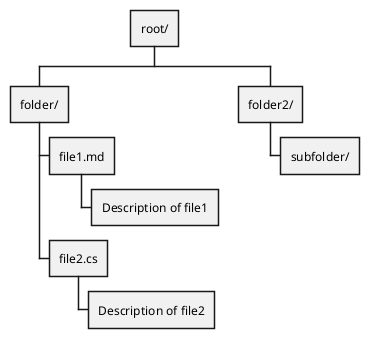
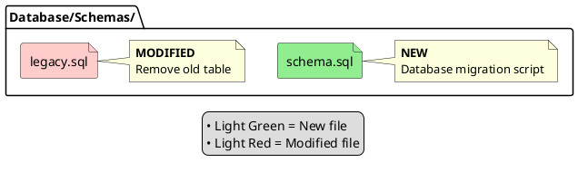
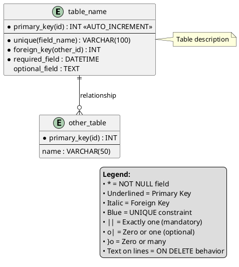
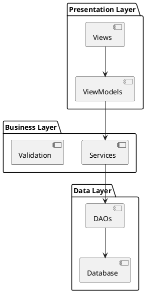
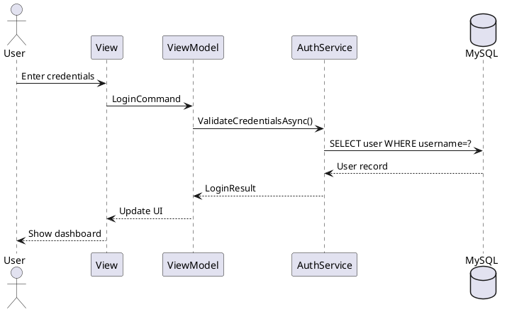
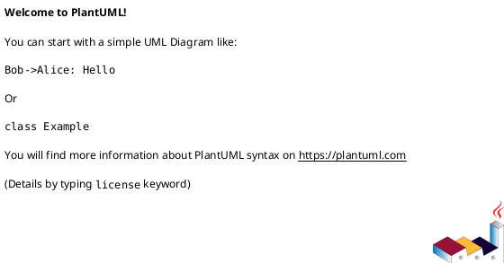

# Markdown Documentation Standards

## Overview

All markdown documentation in this repository should follow these standards to ensure consistency, readability, and AI-friendly parsing. **PlantUML diagrams are strongly preferred over ASCII art** for any visual representations.

## When to Use PlantUML

### ✅ ALWAYS Use PlantUML For:

1. **Database Schemas / ERDs**
   - Entity relationship diagrams
   - Table structures with foreign keys
   - Database constraints visualization
   
2. **File/Directory Structures**
   - Project layouts
   - Folder hierarchies
   - Component organization
   
3. **System Architecture**
   - Component diagrams
   - Service dependencies
   - Integration flows
   
4. **Workflows & Processes**
   - Sequence diagrams
   - Activity diagrams
   - State machines
   
5. **Class/Object Relationships**
   - Class diagrams
   - Inheritance hierarchies
   - Design patterns

### ❌ Use Plain Text/Code Blocks For:

1. **Linear Content**
   - Installation steps
   - Command sequences
   - Checklists
   - Bulleted lists
   
2. **Code Examples**
   - C# code snippets
   - SQL queries
   - PowerShell commands
   - XAML markup
   
3. **Simple Tables**
   - Configuration options
   - Comparison matrices
   - Small datasets

## PlantUML Standards

### File Structure Diagrams

Use **Work Breakdown Structure (WBS)** for hierarchical file/folder representations:



Use **Component Diagrams** for file relationships with annotations:



### Database ERD Diagrams

Use **Entity Relationship Diagrams** with proper notation:



### Architecture Diagrams

Use **Component Diagrams** for system architecture:



Use **Sequence Diagrams** for workflows:



## Markdown Formatting Standards

### Headers

- Use ATX-style headers (`#` syntax)
- One H1 per document (title)
- Hierarchical structure (H1 → H2 → H3)
- No header deeper than H4

```markdown
# Document Title (H1)

## Major Section (H2)

### Subsection (H3)

#### Detail (H4)
```

### Code Blocks

Always specify language for syntax highlighting:

```markdown
```csharp
// C# code here
```

```sql
-- SQL code here
```

```powershell
# PowerShell code here
```


```

### Lists

- Use `-` for unordered lists
- Use `1.` for ordered lists
- Indent with 2 spaces for nested items
- Add blank line before/after lists

```markdown
- Item 1
  - Sub-item 1.1
  - Sub-item 1.2
- Item 2

1. First step
2. Second step
   - Detail A
   - Detail B
3. Third step
```

### Tables

Use GitHub Flavored Markdown tables with alignment:

```markdown
| Column 1 | Column 2 | Column 3 |
|----------|----------|----------|
| Left     | Center   | Right    |
| Data     | Data     | Data     |
```

Alignment:
- `:---` = Left-aligned
- `:---:` = Center-aligned
- `---:` = Right-aligned

### Links

Prefer reference-style links for readability:

```markdown
See [data-model.md](data-model.md) for schema details.

Or with reference:
See [data model][1] for schema details.

[1]: data-model.md
```

### Emphasis

- `*italic*` or `_italic_` for emphasis
- `**bold**` for strong emphasis
- `***bold italic***` for both
- `` `code` `` for inline code

### Admonitions

Use blockquotes for callouts:

```markdown
> **Note**: This is important information.

> ⚠️ **Warning**: Critical constraint - do not violate.

> ✅ **Success**: Operation completed successfully.
```

## Documentation Structure

### Feature Specifications

All feature specifications in `specs/` should include:

1. **Metadata** (feature name, branch, date, status)
2. **Overview** (summary paragraph)
3. **User Scenarios & Testing** (Given/When/Then format)
4. **Requirements** (functional, non-functional, constraints)
5. **Success Criteria** (measurable outcomes)
6. **Dependencies & Assumptions**
7. **PlantUML Diagrams** (ERDs, file structures, workflows)

### Implementation Plans

All plans in `specs/*/plan.md` should include:

1. **Summary** (feature description)
2. **Technical Context** (language, dependencies, constraints)
3. **Constitution Check** (alignment verification)
4. **Project Structure** (PlantUML WBS or component diagram)
5. **Complexity Tracking** (violations justification)

### Quickstart Guides

All quickstart guides should include:

1. **Prerequisites** (bulleted list)
2. **Installation Steps** (numbered sequence with code blocks)
3. **Verification** (SQL/PowerShell commands)
4. **Usage Examples** (complete working examples)
5. **Troubleshooting** (common issues with solutions)

## Why PlantUML Over ASCII Art

### For AI Agents

- **More parseable**: Structured syntax vs. ambiguous spacing
- **Semantic clarity**: Explicit relationships (`||--o{`) vs. interpreted arrows
- **No alignment issues**: No whitespace/tab inconsistencies
- **Validation**: Can programmatically verify correctness

### For Humans

- **Professional rendering**: Clean diagrams vs. monospace text art
- **Scalability**: Diagrams auto-layout vs. manual redrawing
- **Accessibility**: Screen readers can parse structure
- **Version control**: Meaningful diffs vs. jumbled ASCII changes

### For Tooling

- **IDE support**: VS Code extensions render inline
- **GitHub support**: Automatic rendering in markdown preview
- **Export options**: PNG, SVG, PDF generation
- **CI/CD integration**: Diagram validation in build pipelines

## PlantUML Best Practices

### Always Include Legends

Every PlantUML diagram should have a legend explaining symbols:

```plantuml
legend right
  **Legend:**
  • Symbol = Meaning
  • Color = Purpose
  • Line type = Relationship
end legend
```

### Use Annotations

Add notes to provide context:

```plantuml
note right of ComponentName
  Additional context
  or explanation
end note
```

### Color Coding

Use consistent colors across all diagrams:

- `#lightgreen` or `#ccffcc` = New/Added
- `#ffcccc` or `#lightred` = Modified/Changed
- `#lightyellow` or `#ffffcc` = Warning/Attention
- `#lightblue` or `#ccccff` = Information
- `#lightgray` or `#cccccc` = Deprecated/Removed

### Keep It Readable

- Don't overcomplicate diagrams
- Split complex diagrams into multiple focused views
- Use meaningful entity/component names
- Add descriptions to all major elements

## Tools & Extensions

### VS Code Extensions

- **PlantUML** (jebbs.plantuml) - Render diagrams inline
- **Markdown All in One** - Enhanced markdown editing
- **markdownlint** - Linting and style checking

### Online Tools

- [PlantUML Online Editor](http://www.plantuml.com/plantuml/uml/)
- [Real-time PlantUML Editor](https://www.planttext.com/)

### Local Rendering

```powershell
# Install PlantUML (requires Java)
choco install plantuml

# Generate PNG from .puml file
plantuml diagram.puml
```

## Examples from This Project

### ✅ Good Examples

- [specs/004-database-foundation/data-model.md](../../specs/004-database-foundation/data-model.md) - ERD with PlantUML
- [specs/004-database-foundation/plan.md](../../specs/004-database-foundation/plan.md) - WBS and component diagrams
- [specs/004-database-foundation/spec.md](../../specs/004-database-foundation/spec.md) - File changes diagram

### ❌ Avoid

- ASCII box drawings for ERDs
- Manual spacing for file trees
- Text-based relationship arrows
- Ambiguous diagram notations

## Review Checklist

Before committing markdown documentation:

- [ ] All diagrams use PlantUML (no ASCII art)
- [ ] All code blocks have language specified
- [ ] All PlantUML diagrams have legends
- [ ] Headers follow hierarchical structure (H1 → H2 → H3 → H4)
- [ ] Lists have consistent formatting
- [ ] Tables use proper alignment
- [ ] Links are functional and relative
- [ ] No hardcoded absolute paths
- [ ] Admonitions use blockquotes with emoji
- [ ] File follows template structure for its type

## Rationale

These standards ensure:

1. **Consistency** across all project documentation
2. **AI-friendliness** for automated parsing and analysis
3. **Human readability** for developers and stakeholders
4. **Maintainability** through structured, validated diagrams
5. **Accessibility** for screen readers and assistive tools
6. **Version control** with meaningful diffs and change tracking

---

**Version**: 1.0  
**Last Updated**: 2025-12-26  
**Applies To**: All markdown files in repository
