# Mermaid Diagram Creation Guidelines

Instructions for creating clear, maintainable, and correctly-rendered Mermaid diagrams for workflow visualization, system architecture, and technical documentation.

## General Principles

- **Clarity Over Complexity**: Diagrams should be immediately understandable
- **Consistent Naming**: Use descriptive, consistent node IDs throughout
- **Proper Syntax**: Follow Mermaid syntax precisely to ensure rendering
- **Business Language**: Use business terms, not technical jargon in labels
- **Complete Paths**: Show all decision branches (success, failure, cancel)

## Critical Rule: Unique Node IDs

**⚠️ MOST IMPORTANT RULE:** Every node in a Mermaid diagram MUST have a unique ID, even if the nodes appear to represent different outcomes.

### Multi-Diagram File Naming Convention

**CRITICAL for files with multiple diagrams**: When a single file contains multiple Mermaid diagrams (common in specifications with multiple workflow diagrams), use a **namespace prefix** to ensure complete isolation between diagrams.

**Format**: `W[UserStory]_[Workflow]_[NodeName]`

**Examples**:
- User Story 1, Workflow 1.1: `W1_1_Start`, `W1_1_SuccessEnd`
- User Story 2, Workflow 2.3: `W2_3_Start`, `W2_3_SuccessEnd`
- User Story 4, Workflow 4.2: `W4_2_Start`, `W4_2_ErrorEnd`

**Why this matters**: Mermaid parsers may cache or merge node definitions across diagrams in the same file. Without unique prefixes, `Start` in Workflow 1.1 could conflict with `Start` in Workflow 2.1, causing unexpected rendering behavior or connection errors.

```mermaid
<!-- ✅ CORRECT - Namespace prefix prevents conflicts -->
flowchart TD
  W1_1_Start([User begins]) --> W1_1_Check{Valid?}
  W1_1_Check -->|Yes| W1_1_Process[Process data]
  W1_1_Process --> W1_1_SuccessEnd([Success])
```

```mermaid
<!-- ✅ CORRECT - Different workflow, different prefix -->
flowchart TD
  W2_1_Start([User on screen]) --> W2_1_Action[User action]
  W2_1_Action --> W2_1_SuccessEnd([Complete])
```

**Rule**: Use workflow prefixes when:
- File contains 2+ Mermaid diagrams
- Diagrams are part of a specification or multi-workflow document
- Diagrams may be viewed/rendered together

**Exception**: Single standalone diagram files don't require prefixes.

### ❌ WRONG - Multiple Nodes with Same ID

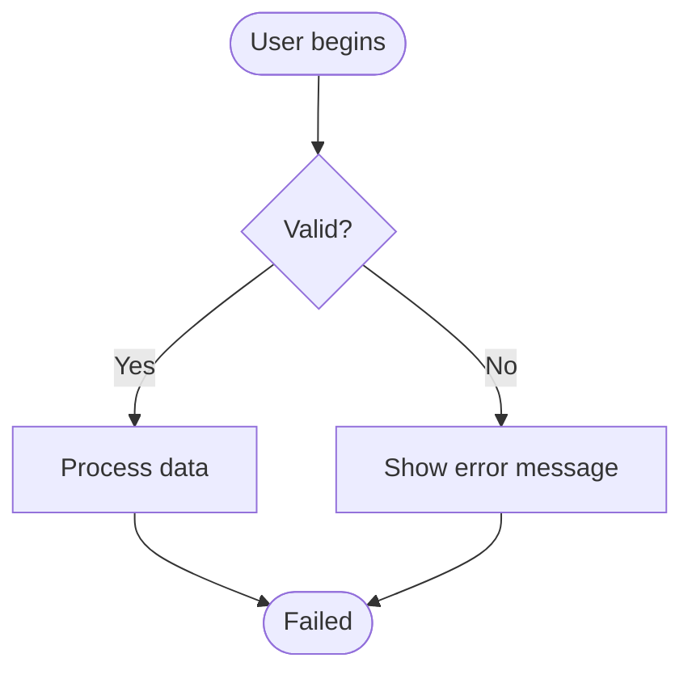

**Problem**: Two nodes both use `End` as the ID but with different labels. Mermaid will merge these into a single node, breaking the diagram.

### ✅ CORRECT - Unique IDs for Each End State

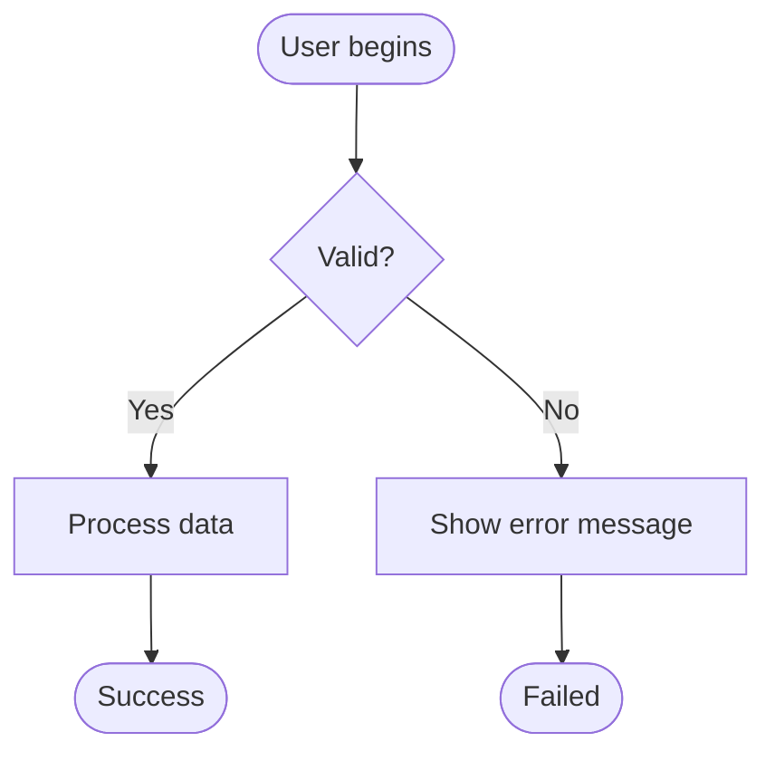

**Solution**: Use unique IDs (`SuccessEnd`, `ErrorEnd`) even though both are terminal nodes.

## Flowchart Best Practices

### Node Types and Shapes

Use appropriate node shapes for semantic meaning:

- **Start/End nodes**: `([Description])` - Stadium/rounded rectangle
- **Process nodes**: `[Action/Step]` - Rectangle
- **Decision nodes**: `{Question?}` - Diamond
- **Sub-process/Group**: `[[Subprocess]]` - Double rectangle

### Example Workflow Structure

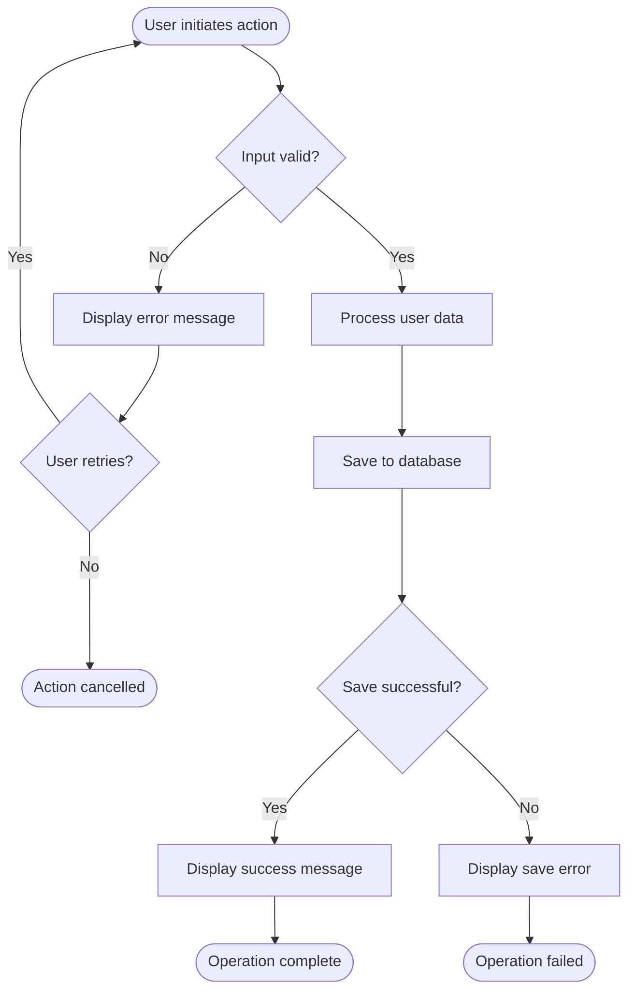

**Key Points:**
- Every end state has a unique ID (`CancelEnd`, `SuccessEnd`, `ErrorEnd`)
- Decision nodes use `{Question?}` format
- All branches are labeled with `|Label|` syntax
- Descriptive action verbs in process nodes

## Common Diagram Types

### 1. User Workflow Diagrams

**Purpose**: Document user interaction flows and decision points

**Guidelines**:
- Start with user entry point: `Start([User on Screen X])`
- Show all user actions as process nodes: `[Click Submit button]`
- Decision nodes represent system checks: `{Data valid?}`
- Include user notifications: `[Show: 'Success message']`
- End with clear outcome: `SuccessEnd([User completes task])`

**Template**:
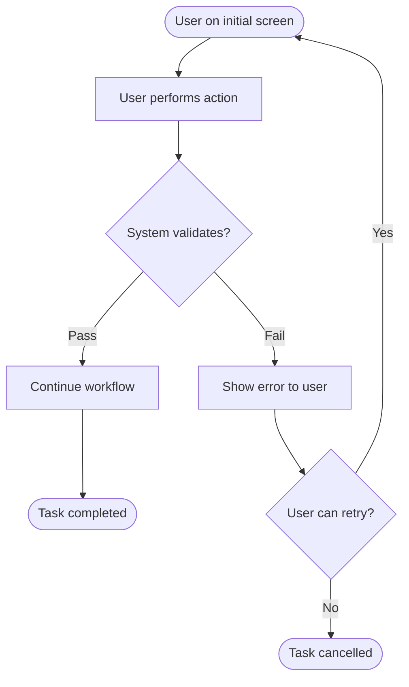

### 2. System Architecture Diagrams

**Purpose**: Show component relationships and data flow

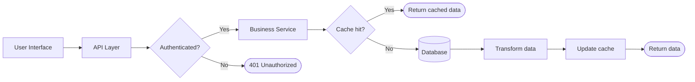

### 3. State Transition Diagrams

**Purpose**: Document state machines and lifecycle flows

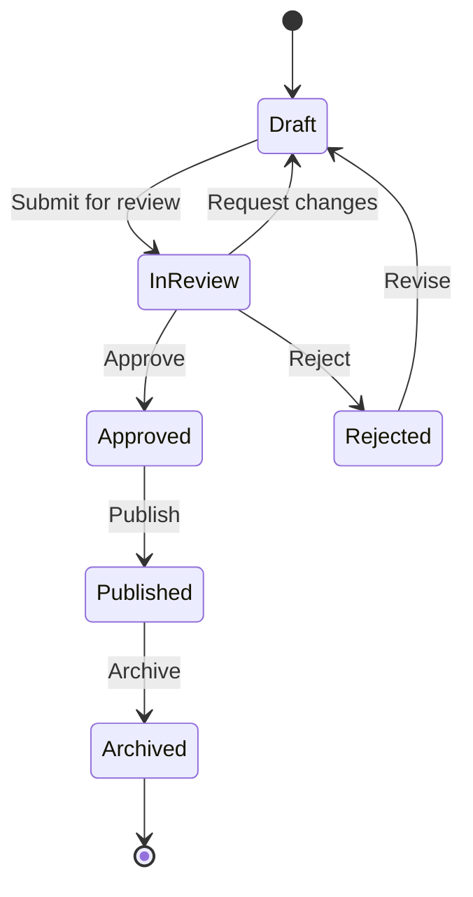

## Naming Conventions

### Node IDs (Code Names)

**Format**: PascalCase or camelCase, descriptive

**Good Examples**:
- `ValidateInput`, `ProcessData`, `SaveToDatabase`
- `CheckPermissions`, `ShowSuccessMessage`
- `SuccessEnd`, `ErrorEnd`, `CancelEnd`, `TimeoutEnd`

**Bad Examples**:
- `End`, `End`, `End` (not unique!)
- `n1`, `n2`, `n3` (not descriptive)
- `step1`, `step2` (too generic)

### Node Labels (Display Text)

**Format**: Clear, concise business language

**Good Examples**:
- `[Enter customer information]`
- `{Order total > $100?}`
- `([Order processed successfully])`
- `[Show: 'Invalid email address']`

**Bad Examples**:
- `[Execute SQL query]` (too technical for user workflow)
- `[Do stuff]` (vague)
- `[Check if valid]` (what is being validated?)

## Multi-Branch End States Pattern

When a workflow has multiple terminal states, use descriptive suffixes:

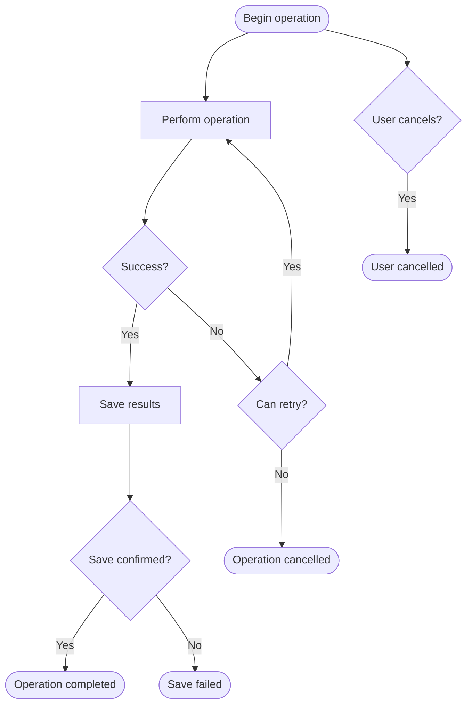

**End State IDs**:
- `SuccessEnd` - Normal successful completion
- `SaveErrorEnd` - Failure during save
- `OperationFailEnd` - Operation-level failure
- `UserCancelEnd` - User-initiated cancellation

## Common Mistakes to Avoid

### ❌ Mistake 1: Reusing End Node IDs

```mermaid
flowchart TD
  A --> B{Check?}
  B -->|Yes| C[Process]
  B -->|No| D[Error]
  C --> End([Done])
  D --> End([Failed])  <!-- WRONG: Duplicate ID -->
```

**Fix**: Use `SuccessEnd` and `FailEnd`

### ❌ Mistake 2: Missing Branch Labels

```mermaid
flowchart TD
  A{Check?} --> B[Yes path]  <!-- Missing |Yes| label -->
  A --> C[No path]           <!-- Missing |No| label -->
```

**Fix**: Always label decision branches:
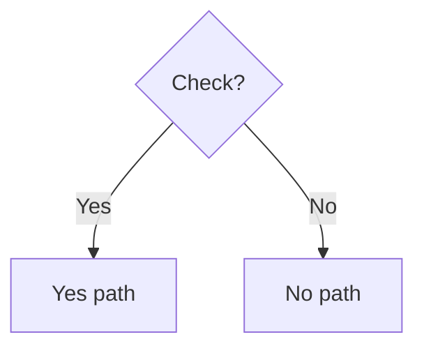

### ❌ Mistake 3: Unclear Decision Questions

```mermaid
flowchart TD
  A --> B{Check}  <!-- Vague -->
  A --> C{Valid}  <!-- Not a question -->
```

**Fix**: Use clear questions:
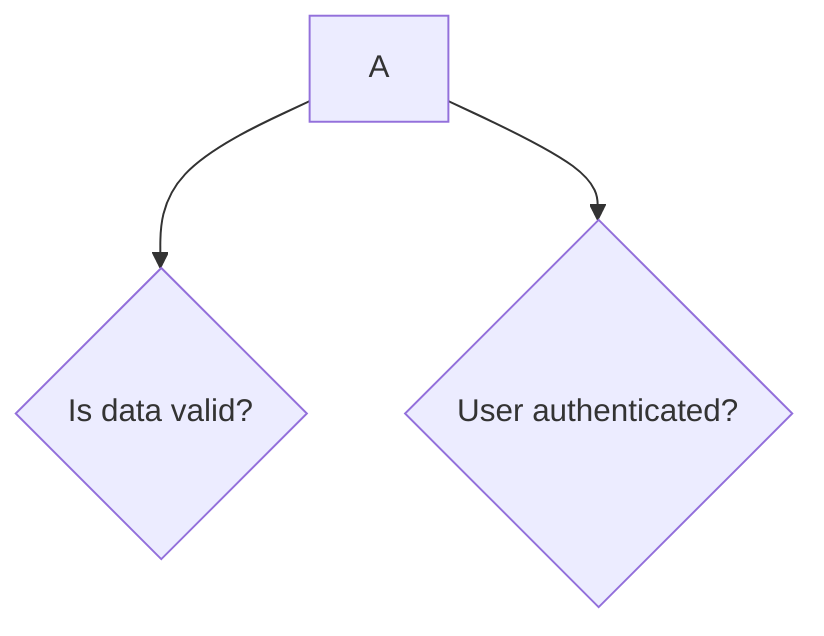

### ❌ Mistake 4: Inconsistent Direction

```mermaid
flowchart TD
  A --> B
  C --> D
  D --> E
  B --> F
  E --> F  <!-- Converging from different directions -->
```

**Fix**: Keep flow direction consistent (top-down or left-right)

## Advanced Patterns

### Sub-graphs for Grouping

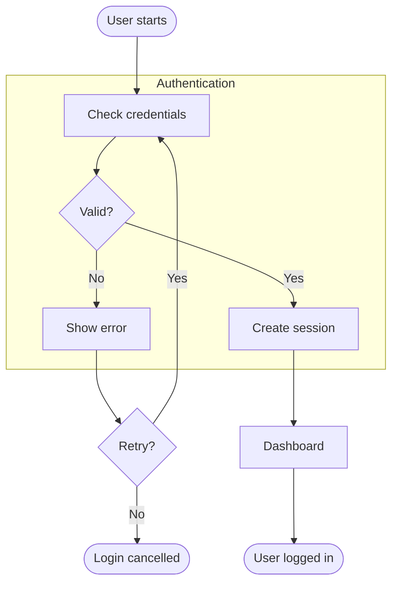

### Parallel Flows

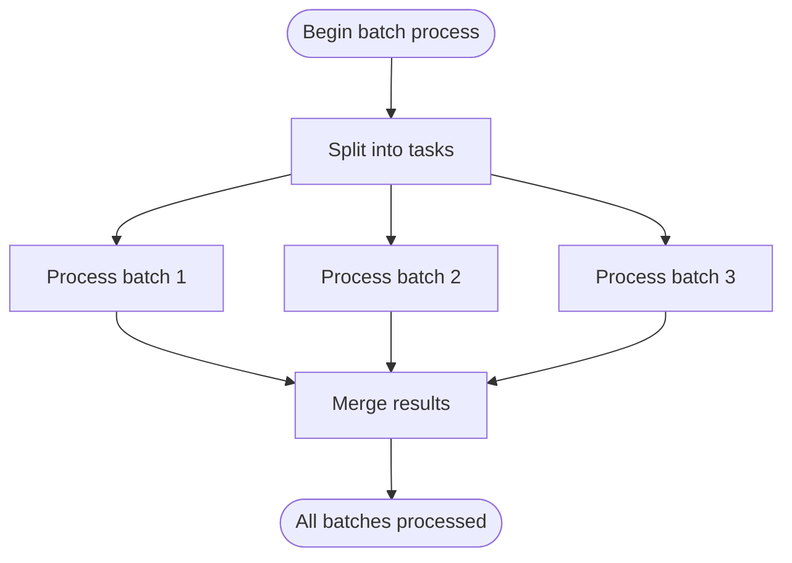

## Diagram Quality Checklist

Before finalizing a Mermaid diagram, verify:

- [ ] **Unique IDs**: Every node has a unique ID (no duplicates)
- [ ] **Namespace Prefixes**: All nodes use W{UserStory}_{Workflow}_ prefix (multi-diagram files)
- [ ] **Descriptive Labels**: All nodes have clear, business-friendly labels
- [ ] **Complete Branches**: All decision nodes have labeled yes/no branches
- [ ] **Consistent Direction**: Flow is consistently top-down or left-right
- [ ] **Start/End Clarity**: Clear entry and exit points
- [ ] **No Orphans**: All nodes are connected to the flow
- [ ] **Renders Correctly**: Test the diagram renders without errors
- [ ] **Readable Size**: Not too large (split into multiple diagrams if >20 nodes)

## Automation Tools

The repository includes automated scripts for applying namespace prefixes and validating diagrams.

### PowerShell Scripts (Cross-Platform)

Located in `.specify/scripts/mermaid/`:

**Process all diagrams in a specification file:**
```powershell
.\.specify\scripts\mermaid\MermaidProcessor.ps1 -FilePath "specs/001-workflow-consolidation/spec.md"
```

**Preview changes without applying:**
```powershell
.\.specify\scripts\mermaid\MermaidProcessor.ps1 -FilePath "specs/001-workflow-consolidation/spec.md" -DryRun
```

**Validate diagrams:**
```powershell
.\.specify\scripts\mermaid\MermaidProcessor.ps1 -FilePath "specs/001-workflow-consolidation/spec.md" -Action Validate
```

**Restore from backup:**
```powershell
.\.specify\scripts\mermaid\MermaidProcessor.ps1 -FilePath "specs/001-workflow-consolidation/spec.md" -Action Restore
```

### Bash Wrapper (Linux/macOS/WSL)

```bash
chmod +x .specify/scripts/mermaid/mermaid-processor.sh
./specify/scripts/mermaid/mermaid-processor.sh -f specs/001-workflow-consolidation/spec.md
```

### Automated Actions

| Action | Description | Use Case |
|--------|-------------|----------|
| `Parse` | Extract diagram metadata | Understanding structure |
| `ApplyNamespaces` | Add prefixes to node IDs | Converting existing diagrams |
| `Validate` | Check against quality rules | Pre-commit validation |
| `ProcessAll` | Full pipeline (default) | Initial setup |
| `Restore` | Rollback changes | Undo mistakes |

### Markdown File Format Requirements

For automation to work, spec files must follow this structure:

```markdown
### Workflow {UserStory}.{WorkflowNum}: {Description}

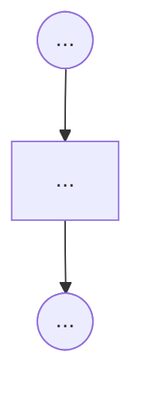
```

**Examples:**
- `### Workflow 1.1: Complete 3-Step Guided Workflow`
- `### Workflow 2.3: Copy with Preservation of Existing Data`
- `### Workflow 6.4: Backward Navigation with Validation Errors`

**Rules:**
- Header MUST start with `###` (exactly 3 hash marks)
- Format: `Workflow {number}.{number}: {title}`
- Mermaid block MUST start with triple backticks + `mermaid` on same line
- Mermaid block MUST end with triple backticks on their own line
- One blank line between header and code block (optional but recommended)

See `.specify/scripts/mermaid/README.md` for complete automation documentation.

## Testing Your Diagram

### Syntax Validation

Use online validators or VS Code extensions:
- [Mermaid Live Editor](https://mermaid.live/)
- VS Code Extension: "Markdown Preview Mermaid Support"

### Common Syntax Errors

**Missing quote in label**:
```mermaid
A --> B[User clicks button]  <!-- ✅ OK -->
A --> B[User's action]        <!-- ❌ Error: unescaped quote -->
A --> B["User's action"]      <!-- ✅ Fixed -->
```

**Invalid characters in ID**:
```mermaid
A-B --> C  <!-- ❌ Error: hyphen in ID -->
A_B --> C  <!-- ✅ OK: underscore allowed -->
AB --> C   <!-- ✅ OK: no separator needed -->
```

## Recommended Tools

- **VS Code Extensions**:
  - Markdown Preview Mermaid Support
  - Mermaid Markdown Syntax Highlighting
  
- **Online Tools**:
  - [Mermaid Live Editor](https://mermaid.live/)
  - [Mermaid Chart Editor](https://www.mermaidchart.com/)

## Examples from Real Projects

### Bulk Copy Operation with Validation

```mermaid
flowchart TD
  Start([User on data entry screen<br/>with 10 rows]) --> EnterData[Enter data in Row 1]
  EnterData --> ClickCopy[Click 'Copy to All' button]
  ClickCopy --> ValidateSource{Row 1<br/>has errors?}
  ValidateSource -->|Yes| DisableButton[Button disabled<br/>with tooltip]
  ValidateSource -->|No| ShowOptions[Show copy options:<br/>• All fields<br/>• Field 1 only<br/>• Field 2 only]
  ShowOptions --> SelectOption[User selects option]
  SelectOption --> CheckOccupied{Other rows<br/>have data?}
  CheckOccupied -->|All empty| CopyToAll[Copy to all rows]
  CheckOccupied -->|Some occupied| CopyToEmpty[Copy to empty cells only]
  CopyToAll --> ShowFullSuccess[Show: 'Copied to 10 rows']
  CopyToEmpty --> ShowPartialSuccess[Show: 'Copied to empty cells<br/>Preserved 3 rows']
  ShowFullSuccess --> AllCopiedEnd([All rows populated])
  ShowPartialSuccess --> PartialCopiedEnd([Mixed data preserved])
  DisableButton --> ErrorEnd([Cannot copy with errors])
```

### Edit Mode with Navigation

```mermaid
flowchart TD
  Start([User on Review screen]) --> NoticeError[User notices error<br/>in previous step]
  NoticeError --> ClickEdit[Click 'Edit Details' button]
  ClickEdit --> SaveContext[System saves review state<br/>and sets edit mode flag]
  SaveContext --> NavigateBack[Navigate to Edit screen<br/>with data preserved]
  NavigateBack --> ShowEditIndicator[Show 'Edit Mode' indicator<br/>Change 'Next' to 'Return to Review']
  ShowEditIndicator --> UserCorrects[User corrects error]
  UserCorrects --> ClickReturn[Click 'Return to Review']
  ClickReturn --> ValidateChanges{Changes<br/>valid?}
  ValidateChanges -->|No| ShowErrors[Show validation errors<br/>Disable 'Return to Review']
  ValidateChanges -->|Yes| NavigateToReview[Navigate directly to Review<br/>bypassing intermediate steps]
  NavigateToReview --> HighlightChanges[Highlight corrected fields<br/>for 3-5 seconds]
  HighlightChanges --> SuccessEnd([Edit complete,<br/>ready to save])
  ShowErrors --> ErrorEnd([Fix errors to continue])
```

## Additional Resources

- [Mermaid Official Documentation](https://mermaid.js.org/)
- [Mermaid Flowchart Syntax](https://mermaid.js.org/syntax/flowchart.html)
- [Mermaid State Diagram Syntax](https://mermaid.js.org/syntax/stateDiagram.html)
- [Mermaid Sequence Diagram Syntax](https://mermaid.js.org/syntax/sequenceDiagram.html)

---

**Remember**: The most important rule is **unique node IDs**. When in doubt, add a descriptive suffix to your end nodes (e.g., `SuccessEnd`, `ErrorEnd`, `CancelEnd`, `TimeoutEnd`).
