# PlantUML Diagram Implementation Guide

**Purpose**: Comprehensive reference for implementing PlantUML diagrams in GitHub repositories, specification documents, and technical documentation.

**Last Updated**: 2025-12-26

---

## Table of Contents

1. [Quick Start](#quick-start)
2. [Diagram Types Overview](#diagram-types-overview)
3. [When to Use Each Diagram Type](#when-to-use-each-diagram-type)
4. [Implementation Patterns](#implementation-patterns)
5. [GitHub Integration](#github-integration)
6. [Best Practices](#best-practices)
7. [Common Patterns Library](#common-patterns-library)
8. [Troubleshooting](#troubleshooting)

---

## Quick Start

### Basic Syntax

All PlantUML diagrams start and end with:

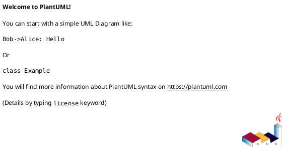

### Rendering Options

**In GitHub Markdown** (with PlantUML server):
```markdown

```

**In VS Code** (with PlantUML extension):
- Install "PlantUML" extension
- Create `.puml` file
- Press `Alt+D` to preview

**Command Line**:
```bash
java -jar plantuml.jar diagram.puml
```

---

## Diagram Types Overview

### 1. Sequence Diagram
**Purpose**: Show interactions between objects/actors over time
**Best For**: API flows, user interactions, workflow steps, message passing

**Basic Syntax**:
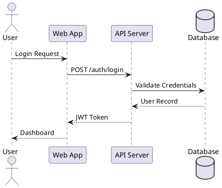

**Arrow Types**:
- `->` Solid arrow (synchronous call)
- `-->` Dotted arrow (return/response)
- `->>` Solid arrow with open head
- `-->>` Dotted arrow with open head
- `->x` Message to destroyed participant
- `<->` Bidirectional

**Advanced Features**:
```plantuml
@startuml
' Activation boxes
User -> API: Request
activate API
API -> DB: Query
activate DB
DB --> API: Result
deactivate DB
API --> User: Response
deactivate API

' Grouping
group Authentication
    User -> API: Login
    API --> User: Token
end

' Alternative paths
alt Success
    API --> User: Data
else Failure
    API --> User: Error
end

' Parallel processing
par
    API -> Service1: Process
and
    API -> Service2: Process
end
@enduml
```

**When to Use**:
- ✅ API request/response flows
- ✅ User authentication workflows
- ✅ Service-to-service communication
- ✅ Event-driven architectures
- ✅ Wizard step transitions
- ❌ Static system structure (use Component Diagram)
- ❌ Database schemas (use ER Diagram)

---

### 2. Class Diagram
**Purpose**: Show static structure of classes, attributes, methods, and relationships
**Best For**: Object-oriented design, data models, inheritance hierarchies

**Basic Syntax**:
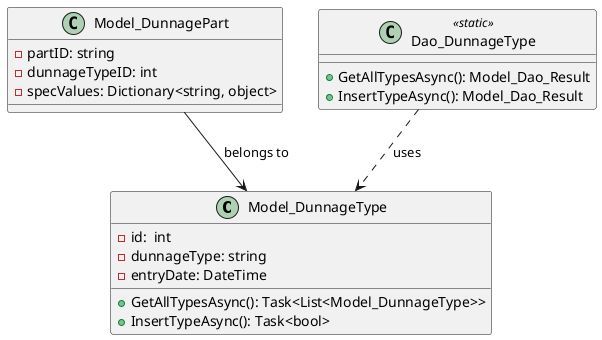

**Relationship Types**:
- `-->` Association (solid arrow, "has a")
- `<|--` Inheritance/Extends (closed arrow)
- `<|.. ` Interface Implementation (dotted closed arrow)
- `o--` Aggregation (hollow diamond, "has, can exist independently")
- `*--` Composition (filled diamond, "has, cannot exist independently")
- `..>` Dependency (dotted arrow, "uses")

**Visibility Modifiers**:
- `-` Private
- `#` Protected
- `~` Package
- `+` Public

**When to Use**:
- ✅ C# class hierarchies (models, services, DAOs)
- ✅ Database table relationships (logical model)
- ✅ Design patterns (Factory, Strategy, Observer)
- ✅ Interface contracts
- ❌ Runtime behavior (use Sequence Diagram)
- ❌ Deployment architecture (use Component/Deployment Diagram)

---

### 3. Use Case Diagram
**Purpose**: Show user interactions with a system
**Best For**: Requirements gathering, feature mapping, stakeholder communication

**Basic Syntax**:
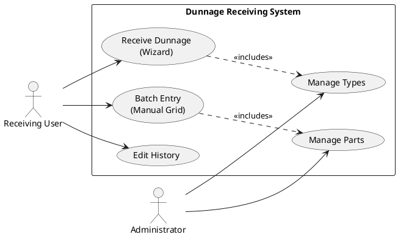

**Relationship Types**:
- `-->` Association (actor to use case)
- `..>` Include (<<include>>)
- `..|>` Extend (<<extend>>)
- `--|>` Generalization

**When to Use**:
- ✅ Feature specification documents
- ✅ User story mapping
- ✅ Stakeholder presentations
- ✅ System boundary definition
- ❌ Detailed workflows (use Activity/Sequence Diagram)
- ❌ Technical architecture (use Component Diagram)

---

### 4. Activity Diagram
**Purpose**: Show step-by-step workflows with decisions and parallel paths
**Best For**: Business processes, algorithms, user workflows, approval flows

**Basic Syntax**:
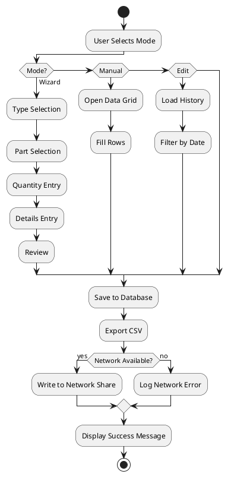

**Advanced Features**:
```plantuml
@startuml
start

' Parallel processing
fork
    :Task A;
fork again
    :Task B;
fork again
    :Task C;
end fork

' Partitions (swimlanes)
|User|
: Enter Data;
|System|
: Validate;
|Database|
:Store;

' Repeat loops
repeat
    :Process Record;
backward : Get Next Record;
repeat while (More Records?)

stop
@enduml
```

**When to Use**:
- ✅ Wizard workflow logic
- ✅ Data processing pipelines
- ✅ Decision trees
- ✅ State machines (simple)
- ❌ Object interactions (use Sequence Diagram)
- ❌ System architecture (use Component Diagram)

---

### 5. Component Diagram
**Purpose**: Show high-level system components and their dependencies
**Best For**: System architecture, module dependencies, layer separation

**Basic Syntax**:
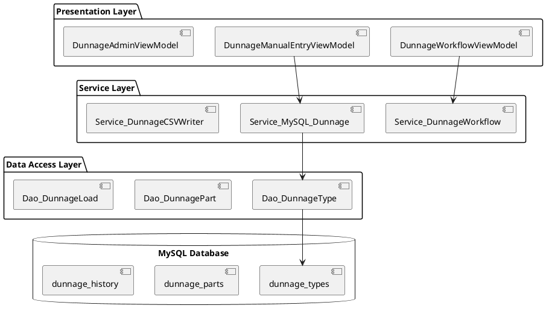

**Component Types**:
- `[]` Component
- `()` Interface (lollipop notation)
- `package` Grouping
- `node` Physical node
- `database` Database
- `cloud` Cloud service

**When to Use**:
- ✅ Software architecture documentation
- ✅ Layer separation (MVVM, MVC, Clean Architecture)
- ✅ Microservice boundaries
- ✅ Plugin architectures
- ❌ Detailed class relationships (use Class Diagram)
- ❌ Deployment infrastructure (use Deployment Diagram)

---

### 6. State Diagram
**Purpose**: Show state transitions of an object or system
**Best For**: Workflow states, entity lifecycle, validation states

**Basic Syntax**:
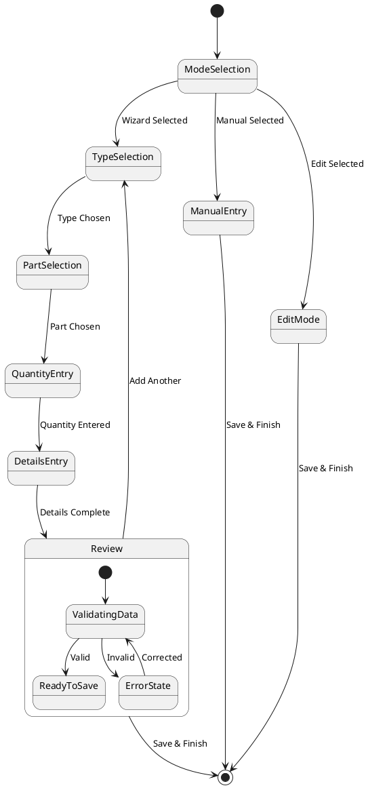

**Advanced Features**:
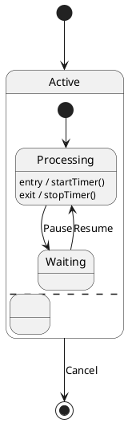

**When to Use**:
- ✅ Workflow state machines (wizard steps)
- ✅ Entity status tracking (Draft → Published → Archived)
- ✅ Connection states (Disconnected → Connecting → Connected)
- ✅ Validation states
- ❌ Static structure (use Class Diagram)
- ❌ Process flows with parallel paths (use Activity Diagram)

---

### 7. Entity-Relationship Diagram (ER)
**Purpose**: Show database table relationships and schema
**Best For**: Database design, data modeling, schema documentation

**Basic Syntax**:
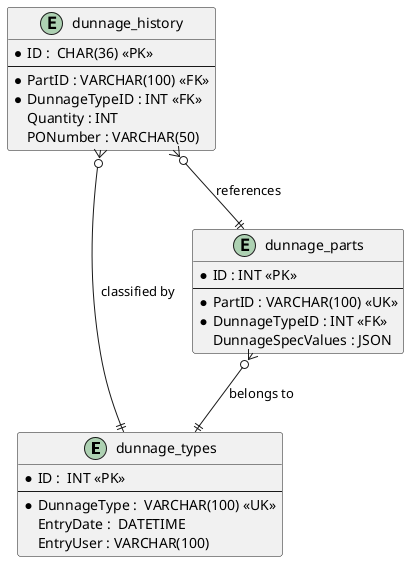

**Cardinality Notation**:
- `||--||` One to one
- `}|--||` Many to one
- `||--|{` One to many
- `}|--|{` Many to many
- `}o--||` Zero or many to one
- `||--o{` One to zero or many

**When to Use**:
- ✅ Database schema documentation
- ✅ Data model design
- ✅ Foreign key relationships
- ✅ Normalization analysis
- ❌ Object-oriented class design (use Class Diagram)
- ❌ Logical architecture (use Component Diagram)

---

### 8. Deployment Diagram
**Purpose**: Show physical deployment of artifacts on nodes
**Best For**: Infrastructure, server topology, network architecture

**Basic Syntax**:
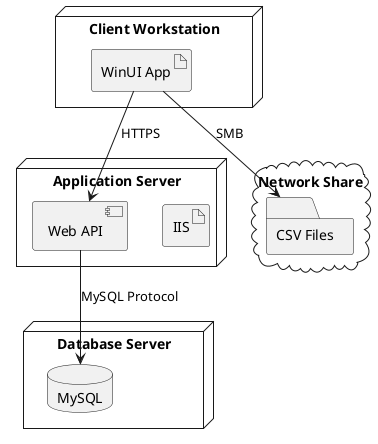

**When to Use**:
- ✅ Infrastructure documentation
- ✅ Deployment topology
- ✅ Network architecture
- ✅ DevOps documentation
- ❌ Software components (use Component Diagram)
- ❌ Code structure (use Class Diagram)

---

### 9. Timing Diagram
**Purpose**: Show timing constraints and state changes over time
**Best For**: Real-time systems, protocol timing, performance analysis

**Basic Syntax**:
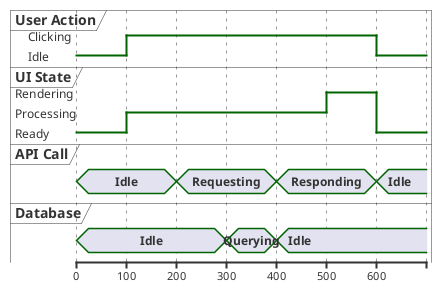

**When to Use**:
- ✅ Performance analysis
- ✅ Real-time system timing
- ✅ Protocol specifications
- ✅ Race condition analysis
- ❌ General workflows (use Activity Diagram)
- ❌ Object interactions (use Sequence Diagram)

---

### 10. Gantt Chart
**Purpose**: Show project timeline and task dependencies
**Best For**: Project planning, milestone tracking, resource allocation

**Basic Syntax**:
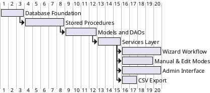

**When to Use**:
- ✅ Project schedules
- ✅ Implementation roadmaps
- ✅ Dependency tracking
- ✅ Resource planning
- ❌ Technical workflows (use Activity Diagram)
- ❌ System behavior (use Sequence Diagram)

---

### 11. Mind Map
**Purpose**: Show hierarchical breakdown of concepts
**Best For**: Brainstorming, feature decomposition, knowledge organization

**Basic Syntax**:
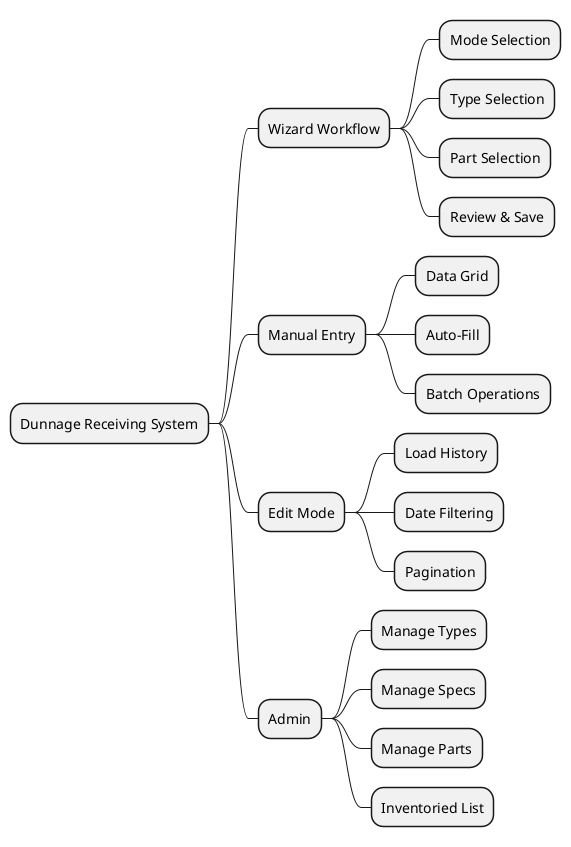

**When to Use**:
- ✅ Feature brainstorming
- ✅ Concept organization
- ✅ Documentation structure
- ✅ Knowledge maps
- ❌ Technical workflows (use Activity Diagram)
- ❌ System relationships (use Component Diagram)

---

### 12. JSON/YAML Diagram
**Purpose**:  Visualize JSON/YAML data structures
**Best For**: API payload documentation, configuration schemas

**Basic Syntax**:
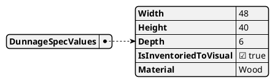

**When to Use**:
- ✅ API documentation
- ✅ Configuration examples
- ✅ Data structure visualization
- ✅ Schema documentation
- ❌ Database schemas (use ER Diagram)
- ❌ Process flows (use Activity Diagram)

---

### 13. WBS (Work Breakdown Structure)
**Purpose**: Show hierarchical task decomposition
**Best For**: Project planning, task organization, deliverable tracking

**Basic Syntax**:
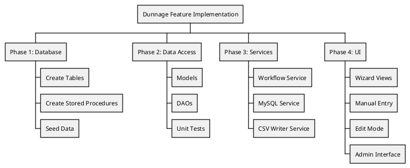

**When to Use**:
- ✅ Project breakdown
- ✅ Deliverable organization
- ✅ Task hierarchy
- ✅ Estimation planning
- ❌ Technical architecture (use Component Diagram)
- ❌ Timelines (use Gantt Chart)

---

### 14. Network Diagram (nwdiag)
**Purpose**: Show network topology and connections
**Best For**: Network architecture, infrastructure documentation

**Basic Syntax**:
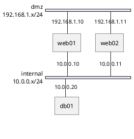

**When to Use**:
- ✅ Network topology documentation
- ✅ VLAN design
- ✅ Firewall rules
- ✅ IP addressing schemes
- ❌ Software architecture (use Component Diagram)
- ❌ Application deployment (use Deployment Diagram)

---

### 15. Salt (UI Mockup/Wireframe)
**Purpose**: Show UI layout and form structure
**Best For**:  Wireframes, form design, UI specifications

**Basic Syntax**:
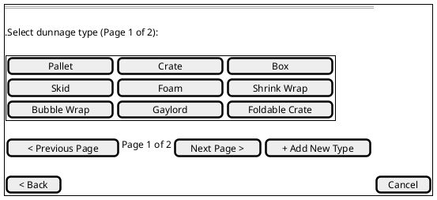

**UI Elements**:
- `[]` Button
- `()` Radio button
- `^` Dropdown
- `"text"` Text input
- `{+}` or `{-}` Grid layout
- `{/}` Tabs
- `{#}` Table

**When to Use**:
- ✅ UI specifications in feature docs
- ✅ Wireframe mockups
- ✅ Form layout design
- ✅ User interface documentation
- ❌ High-fidelity designs (use design tools)
- ❌ Interactive prototypes (use prototyping tools)

---

## When to Use Each Diagram Type

### Decision Matrix

| Diagram Type | Purpose | Best Use Cases | Avoid For |
|-------------|---------|----------------|-----------|
| **Sequence** | Time-based interactions | API flows, authentication, event handling | Static structure, database schema |
| **Class** | Static code structure | OOP design, inheritance, models | Runtime behavior, deployment |
| **Use Case** | User-system interactions | Requirements, features, user stories | Technical details, workflows |
| **Activity** | Process workflows | Business processes, algorithms, decisions | Object interactions, architecture |
| **Component** | High-level architecture | Layers, modules, dependencies | Detailed classes, deployment |
| **State** | State transitions | Workflow states, entity lifecycle | Static structure, processes |
| **ER** | Database schema | Table relationships, data model | Code structure, infrastructure |
| **Deployment** | Physical topology | Servers, infrastructure, networks | Software components, code |
| **Timing** | Time constraints | Performance, protocols, real-time | General workflows |
| **Gantt** | Project timeline | Schedules, milestones, dependencies | Technical flows |
| **Mind Map** | Concept hierarchy | Brainstorming, organization | Detailed workflows |
| **JSON/YAML** | Data structures | API payloads, configs | Process flows |
| **WBS** | Task breakdown | Project planning, deliverables | Technical architecture |
| **Network** | Network topology | IP schemes, VLANs, infrastructure | Software architecture |
| **Salt** | UI mockups | Wireframes, forms, layouts | High-fidelity designs |

---

## Implementation Patterns

### Pattern 1: Embed in Markdown (GitHub)

```markdown
# Feature Specification

## Architecture Overview


## Workflow


```

### Pattern 2: Inline Diagrams (Spec Documents)

````markdown
## Database Schema

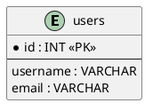


### Pattern 3: Separate Diagram Files

**File Structure**:

```text
docs/
├── diagrams/
│   ├── architecture.puml
│   ├── workflow.puml
│   ├── database-schema.puml
│   └── README.md
├── specs/
│   └── 001-feature-spec.md
```

**architecture.puml**:

```plantuml
@startuml
!include https://raw.githubusercontent.com/plantuml-stdlib/C4-PlantUML/master/C4_Container.puml

Container(webapp, "Web Application", "WinUI 3")
Container(api, "API Service", "ASP.NET Core")
ContainerDb(db, "Database", "MySQL")

Rel(webapp, api, "Uses", "HTTPS")
Rel(api, db, "Reads/Writes", "MySQL")
@enduml
```

## GitHub Integration

### Option 1: PlantUML Proxy Server

**Advantages**:
- ✅ No build step required
- ✅ Works immediately in GitHub
- ✅ Auto-updates when .puml file changes

**Disadvantages**:
- ❌ Depends on external server
- ❌ Slower rendering
- ❌ Privacy concerns (diagrams sent to public server)

**Usage**:

```markdown

```

### Option 2: Pre-Rendered Images (GitHub Actions)

**Advantages**:
- ✅ Fast loading (static images)
- ✅ No external dependencies
- ✅ Privacy preserved

**Disadvantages**:
- ❌ Requires build step
- ❌ Images can get out of sync

**GitHub Action** (`.github/workflows/plantuml.yml`):

```yaml
name: Generate PlantUML Diagrams

on:
  push:
    paths:
      - 'docs/diagrams/*.puml'

jobs:
  build:
    runs-on: ubuntu-latest
    steps:
      - uses: actions/checkout@v3

      - name: Generate diagrams
        uses: cloudbees/plantuml-github-action@master
        with:
          args: -v -tpng docs/diagrams/*.puml

      - name: Commit images
        run: |
          git config user.name github-actions
          git config user.email github-actions@github.com
          git add docs/diagrams/*.png
          git commit -m "Auto-generate PlantUML diagrams" || exit 0
          git push
```

### Option 3: Embedded SVG (Best of Both Worlds)

**Usage**:

```markdown
<details>
<summary>Click to view diagram</summary>


</details>
```

## Best Practices

### 1. File Organization

```text
repo/
├── docs/
│   ├── diagrams/
│   │   ├── architecture/
│   │   │   ├── component-diagram.puml
│   │   │   ├── deployment-diagram.puml
│   │   │   └── README.md
│   │   ├── workflows/
│   │   │   ├── wizard-sequence.puml
│   │   │   ├── manual-entry-activity.puml
│   │   │   └── README.md
│   │   ├── database/
│   │   │   ├── er-diagram.puml
│   │   │   ├── table-relationships.puml
│   │   │   └── README.md
│   │   └── ui/
│   │       ├── wizard-wireframes.salt.puml
│   │       ├── admin-wireframes.salt.puml
│   │       └── README.md
│   └── specs/
│       ├── 004-database-foundation.md
│       └── 002-stored-procedures.md
```

### 2. Naming Conventions
- Use descriptive names: `wizard-workflow-sequence.puml` not `diagram1.puml`
- Include diagram type in filename: `architecture-component.puml`
- Use consistent extension: `.puml` for all PlantUML files
- For Salt diagrams: `.salt.puml` to indicate wireframe

### 3. Comments and Documentation

```plantuml
@startuml
' ================================================================
' Dunnage Wizard Workflow - Sequence Diagram
' Purpose: Shows interaction between User, ViewModels, and Services
' Author: Development Team
' Last Updated: 2025-12-26
' ================================================================

title Dunnage Wizard Workflow

actor User
participant "WorkflowViewModel" as VM
participant "DunnageService" as SVC
database "MySQL" as DB

' Step 1: Type Selection
User -> VM: Select Type "Pallet"
activate VM
VM -> SVC: GetPartsByTypeAsync(1)
activate SVC
SVC -> DB:  sp_dunnage_parts_get_by_type
DB --> SVC: Parts List
deactivate SVC
VM --> User: Display Parts
deactivate VM

note right of User
    User sees dropdown with
    all Pallet parts
end note

@enduml
```

### 4. Reusable Components (Includes)

`common/styles.puml`:

```plantuml
@startuml
skinparam backgroundColor #FEFEFE
skinparam actorStyle awesome
skinparam packageStyle rectangle
skinparam shadowing false
skinparam roundcorner 10

' Color scheme
skinparam class {
    BackgroundColor<<Service>> LightBlue
    BackgroundColor<<ViewModel>> LightGreen
    BackgroundColor<<DAO>> LightYellow
}
@enduml
```

`architecture.puml`:

```plantuml
@startuml
!include common/styles.puml

class Service_DunnageWorkflow <<Service>>
class DunnageWorkflowViewModel <<ViewModel>>
class Dao_DunnageType <<DAO>>

DunnageWorkflowViewModel --> Service_DunnageWorkflow
Service_DunnageWorkflow --> Dao_DunnageType
@enduml
```

### 5. Versioning

```plantuml
@startuml
title System Architecture v2.0

note right
    Version: 2.0
    Date: 2025-12-26
    Changes:
    - Added CSV export service
    - Replaced legacy table
end note

' Diagram content...
@enduml
```

### 6. Keep Diagrams Focused

**Bad (too complex)**:

```plantuml
@startuml
' Single diagram showing EVERYTHING:
' - All classes
' - All relationships
' - All methods
' - All dependencies
' Result: Unreadable mess
@enduml
```

**Good (focused)**:

```plantuml
@startuml
' architecture-layers. puml
' Shows only layer separation
package "Presentation" {}
package "Service" {}
package "Data Access" {}
@enduml
```

```plantuml
@startuml
' models-relationships.puml
' Shows only model relationships
class Model_DunnageType {}
class Model_DunnagePart {}
Model_DunnagePart --> Model_DunnageType
@enduml
```

## Common Patterns Library

### Pattern: MVVM Architecture

```plantuml
@startuml
package "View Layer" {
    [DunnageWorkflowView. xaml]
}

package "ViewModel Layer" {
    [DunnageWorkflowViewModel]
}

package "Service Layer" {
    [Service_DunnageWorkflow]
    [Service_MySQL_Dunnage]
}

package "Data Access Layer" {
    [Dao_DunnageType]
    [Dao_DunnagePart]
}

database "MySQL Database"

[DunnageWorkflowView.xaml] --> [DunnageWorkflowViewModel] : x: Bind
[DunnageWorkflowViewModel] --> [Service_DunnageWorkflow] : DI
[DunnageWorkflowViewModel] --> [Service_MySQL_Dunnage] : DI
[Service_MySQL_Dunnage] --> [Dao_DunnageType] : Static Call
[Dao_DunnageType] --> [MySQL Database] : Stored Procedure
@enduml
```

### Pattern: Wizard State Machine

```plantuml
@startuml
[*] --> ModeSelection

state "Wizard Flow" as Wizard {
    ModeSelection --> TypeSelection :  Select Wizard
    TypeSelection --> PartSelection : Type Chosen
    PartSelection --> QuantityEntry : Part Chosen
    QuantityEntry --> DetailsEntry :  Quantity Entered
    DetailsEntry --> Review : Details Complete

    Review --> TypeSelection : Add Another
    Review --> [*] : Save & Finish
}

ModeSelection --> ManualEntry : Select Manual
ModeSelection --> EditMode : Select Edit

ManualEntry --> [*] : Save & Finish
EditMode --> [*] : Save & Finish

note right of Review
    Validates all data
    before allowing save
end note
@enduml
```

### Pattern: Service Layer Communication

```plantuml
@startuml
participant "ViewModel" as VM
participant "Workflow Service" as WF
participant "MySQL Service" as SQL
participant "DAO Layer" as DAO
database "Database" as DB

VM -> WF:  SaveSessionAsync()
activate WF

WF -> WF: ValidateSession()

loop For each load
    WF -> SQL: InsertLoadAsync(load)
    activate SQL
    SQL -> DAO:  Dao_DunnageLoad. InsertLoadAsync()
    activate DAO
    DAO -> DB: sp_dunnage_history_insert
    DB --> DAO: Success
    deactivate DAO
    SQL --> WF: Model_Dao_Result
    deactivate SQL
end

WF -> WF: ExportToCSV()
WF --> VM: SaveResult
deactivate WF
@enduml
```

### Pattern: Database Schema with Relationships

```plantuml
@startuml
entity "dunnage_types" {
    * ID :  INT <<PK>>
    --
    * DunnageType :  VARCHAR(100) <<UK>>
    EntryDate :  DATETIME
}

entity "dunnage_specs" {
    * ID : INT <<PK>>
    --
    * DunnageTypeID :  INT <<FK>>
    * DunnageSpecs : JSON
}

entity "dunnage_parts" {
    * ID : INT <<PK>>
    --
    * PartID : VARCHAR(100) <<UK>>
    * DunnageTypeID : INT <<FK>>
    DunnageSpecValues : JSON
}

entity "dunnage_history" {
    * ID :  CHAR(36) <<PK>>
    --
    * PartID : VARCHAR(100) <<FK>>
    * DunnageTypeID : INT <<FK>>
    Quantity : INT
    ReceivedDate : DATETIME
}

dunnage_specs }o--|| dunnage_types : CASCADE
dunnage_parts }o--|| dunnage_types :  RESTRICT
dunnage_history }o--|| dunnage_parts :  RESTRICT
dunnage_history }o--|| dunnage_types : RESTRICT
@enduml
```

## Troubleshooting

### Issue 1: Diagram Not Rendering in GitHub
**Problem**: Image shows broken link or "Error" message

**Solutions**:
- Verify `.puml` file is in main branch
- Check file permissions (must be public)
- Ensure URL is correct: `https://raw.githubusercontent.com/user/repo/main/path/file.puml`
- Try syntax validator: http://www.plantuml.com/plantuml/uml/

### Issue 2: Syntax Errors
**Problem**: "Syntax error at line X"

**Solutions**:
- Check matching `@startuml` and `@enduml`
- Verify arrow syntax (`->`, `-->`, etc.)
- Ensure proper quoting for spaces: `"My Label"`
- Check for special characters needing escaping

### Issue 3: Diagram Too Large/Complex
**Problem**: Diagram is unreadable

**Solutions**:
- Split into multiple focused diagrams
- Use packages/groups to organize
- Hide implementation details
- Use `!include` to modularize

### Issue 4: Slow Rendering
**Problem**: PlantUML proxy is slow

**Solutions**:
- Use pre-rendered images with GitHub Actions
- Host own PlantUML server
- Generate locally and commit PNGs
- Use SVG format for smaller file sizes

### Issue 5: Styling Not Applied
**Problem**: Custom styles ignored

**Solutions**:
- Check `skinparam` spelling
- Verify style block syntax: `<style>...</style>`
- Ensure theme is compatible: `!theme cerulean`
- Check for conflicting styles

## Quick Reference

### Common Arrow Types

| Syntax | Type | Use |
|--------|------|-----|
| `->` | Solid | Association, call |
| `-->` | Dotted | Return, response |
| `<--` | Closed solid | Inheritance |
| `<..` | Closed dotted | Implementation |
| `o--` | Hollow diamond | Aggregation |
| `*--` | Filled diamond | Composition |
| `..>` | Dotted open | Dependency |

### Common Styling

```plantuml
@startuml
' Background color
skinparam backgroundColor #FEFEFE

' Sequence diagram
skinparam sequenceArrowThickness 2
skinparam sequenceParticipantBorderThickness 2
skinparam shadowing false

' Class diagram
skinparam classBackgroundColor LightBlue
skinparam classBorderColor DarkBlue

' Modern style
skinparam roundcorner 5
skinparam linetype ortho
@enduml
```

### Useful Preprocessor Commands

```plantuml
@startuml
' Variables
!$serviceName = "Dunnage Service"
title $serviceName

' Conditionals
!if %variable_exists("DEBUG")
    note: Debug mode enabled
!endif

' Procedures (functions)
!procedure $service($name)
    component "$name" <<Service>>
!endprocedure

$service("Workflow Service")
$service("MySQL Service")

' Includes
!include common/styles.puml
@enduml
```

## Additional Resources

- **Official Documentation**: https://plantuml.com/
- **Language Reference**: https://pdf.plantuml.net/PlantUML_Language_Reference_Guide_en.pdf
- **Hitchhiker's Guide**: https://crashedmind.github.io/PlantUMLHitchhikersGuide/
- **Online Editor**: http://www.plantuml.com/plantuml/uml/
- **VS Code Extension**: "PlantUML" by jebbs
- **GitHub Action**: cloudbees/plantuml-github-action
- **Icon Libraries**:
    - AWS: https://github.com/awslabs/aws-icons-for-plantuml
    - Azure: https://github.com/plantuml-stdlib/Azure-PlantUML
    - C4 Model: https://github.com/plantuml-stdlib/C4-PlantUML
