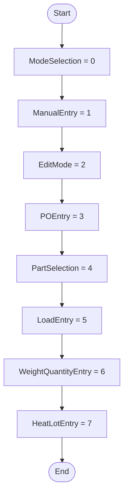

# Enum ReceivingWorkflowStep Workflow

## Diagram (Mermaid)

## Things to fix

- None detected.

## User-Friendly Steps

1. ModeSelection = 0.
2. ManualEntry = 1.
3. EditMode = 2.
4. POEntry = 3.
5. PartSelection = 4.
6. LoadEntry = 5.
7. WeightQuantityEntry = 6.
8. HeatLotEntry = 7.

## Required Info for Fixing Incorrect Workflows

| Step | UI / Action | Command / Query | Validator Rules (Actual) | Handler / Data Path | Actual Data (from code) |
|---|---|---|---|---|---|
| ModeSelection = 0 | Invoke ModeSelection = 0 | n/a | n/a | Method: ModeSelection = 0 | See implementation | 
| ManualEntry = 1 | Invoke ManualEntry = 1 | n/a | n/a | Method: ManualEntry = 1 | See implementation | 
| EditMode = 2 | Invoke EditMode = 2 | n/a | n/a | Method: EditMode = 2 | See implementation | 
| POEntry = 3 | Invoke POEntry = 3 | n/a | n/a | Method: POEntry = 3 | See implementation | 
| PartSelection = 4 | Invoke PartSelection = 4 | n/a | n/a | Method: PartSelection = 4 | See implementation | 
| LoadEntry = 5 | Invoke LoadEntry = 5 | n/a | n/a | Method: LoadEntry = 5 | See implementation | 
| WeightQuantityEntry = 6 | Invoke WeightQuantityEntry = 6 | n/a | n/a | Method: WeightQuantityEntry = 6 | See implementation | 
| HeatLotEntry = 7 | Invoke HeatLotEntry = 7 | n/a | n/a | Method: HeatLotEntry = 7 | See implementation | 

## Source

- Repomix file: C:\Users\johnk\source\repos\MTM_Receiving_Application\.repomix\outputs\code-only\repomix-output-code-only.md
- Type: Core
- Generated: 2026-01-17

