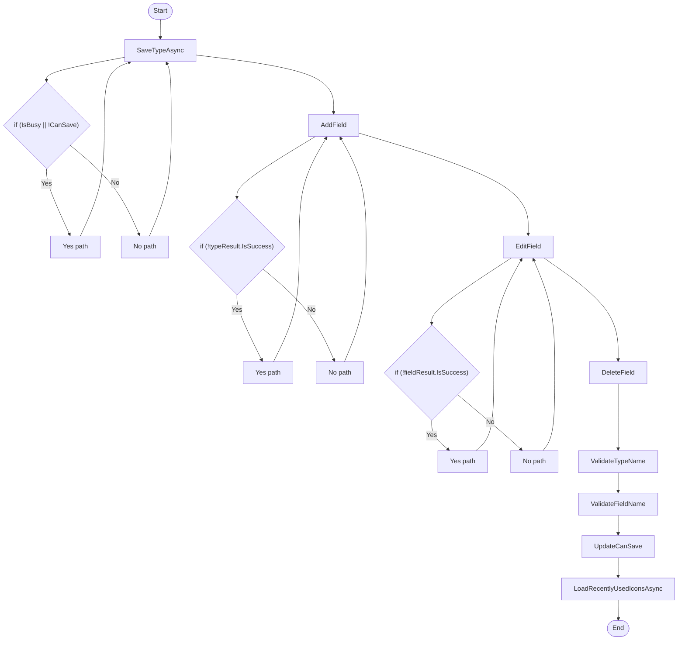

# Dunnage AddTypeDialogViewModel Workflow

## Diagram (Mermaid)

## Things to fix

- None detected.

## User-Friendly Steps

1. SaveTypeAsync.
2. AddField.
3. EditField.
4. DeleteField.
5. ValidateTypeName.
6. ValidateFieldName.
7. UpdateCanSave.
8. LoadRecentlyUsedIconsAsync.

## Required Info for Fixing Incorrect Workflows

| Step | UI / Action | Command / Query | Validator Rules (Actual) | Handler / Data Path | Actual Data (from code) |
|---|---|---|---|---|---|
| SaveTypeAsync | Invoke SaveTypeAsync | n/a | n/a | Method: SaveTypeAsync | See implementation | 
| AddField | Invoke AddField | n/a | n/a | Method: AddField | See implementation | 
| EditField | Invoke EditField | n/a | n/a | Method: EditField | See implementation | 
| DeleteField | Invoke DeleteField | n/a | n/a | Method: DeleteField | See implementation | 
| ValidateTypeName | Invoke ValidateTypeName | n/a | n/a | Method: ValidateTypeName | See implementation | 
| ValidateFieldName | Invoke ValidateFieldName | n/a | n/a | Method: ValidateFieldName | See implementation | 
| UpdateCanSave | Invoke UpdateCanSave | n/a | n/a | Method: UpdateCanSave | See implementation | 
| LoadRecentlyUsedIconsAsync | Invoke LoadRecentlyUsedIconsAsync | n/a | n/a | Method: LoadRecentlyUsedIconsAsync | See implementation | 

## Source

- Repomix file: C:\Users\johnk\source\repos\MTM_Receiving_Application\.repomix\outputs\code-only\repomix-output-code-only.md
- Type: Dunnage
- Generated: 2026-01-17

