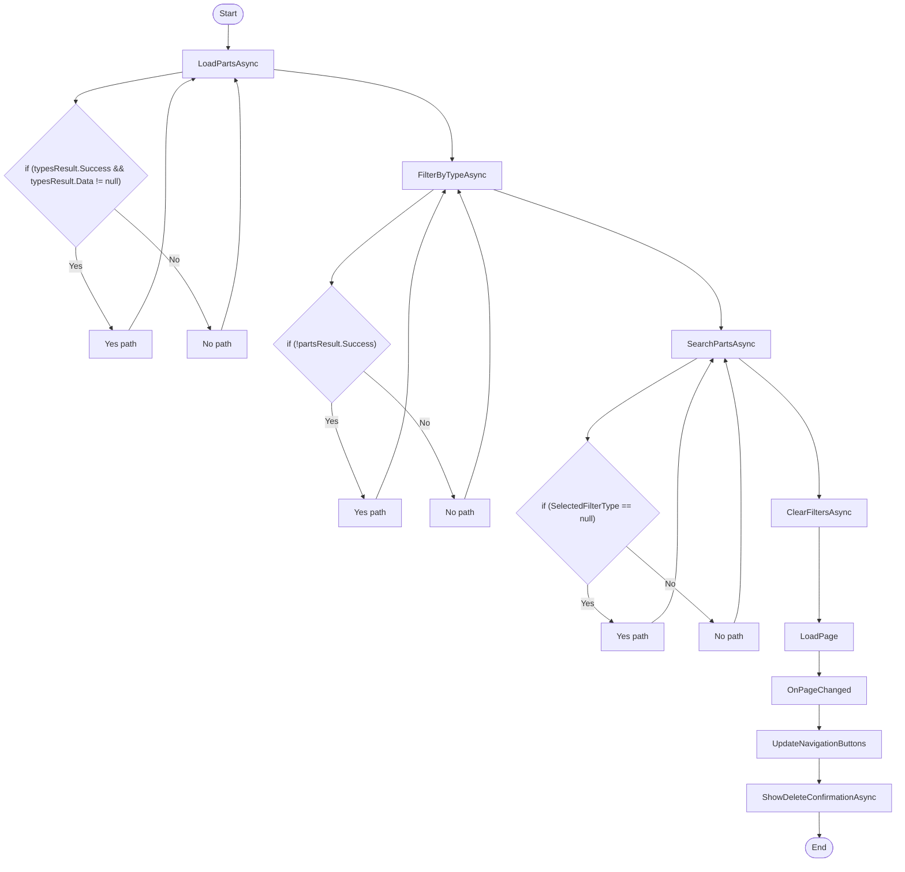

# Dunnage AdminPartsViewModel Workflow

## Diagram (Mermaid)

## Things to fix

- None detected.

## User-Friendly Steps

1. LoadPartsAsync.
2. FilterByTypeAsync.
3. SearchPartsAsync.
4. ClearFiltersAsync.
5. LoadPage.
6. OnPageChanged.
7. UpdateNavigationButtons.
8. ShowDeleteConfirmationAsync.

## Required Info for Fixing Incorrect Workflows

| Step | UI / Action | Command / Query | Validator Rules (Actual) | Handler / Data Path | Actual Data (from code) |
|---|---|---|---|---|---|
| LoadPartsAsync | Invoke LoadPartsAsync | n/a | n/a | Method: LoadPartsAsync | See implementation | 
| FilterByTypeAsync | Invoke FilterByTypeAsync | n/a | n/a | Method: FilterByTypeAsync | See implementation | 
| SearchPartsAsync | Invoke SearchPartsAsync | n/a | n/a | Method: SearchPartsAsync | See implementation | 
| ClearFiltersAsync | Invoke ClearFiltersAsync | n/a | n/a | Method: ClearFiltersAsync | See implementation | 
| LoadPage | Invoke LoadPage | n/a | n/a | Method: LoadPage | See implementation | 
| OnPageChanged | Invoke OnPageChanged | n/a | n/a | Method: OnPageChanged | See implementation | 
| UpdateNavigationButtons | Invoke UpdateNavigationButtons | n/a | n/a | Method: UpdateNavigationButtons | See implementation | 
| ShowDeleteConfirmationAsync | Invoke ShowDeleteConfirmationAsync | n/a | n/a | Method: ShowDeleteConfirmationAsync | See implementation | 

## Source

- Repomix file: C:\Users\johnk\source\repos\MTM_Receiving_Application\.repomix\outputs\code-only\repomix-output-code-only.md
- Type: Dunnage
- Generated: 2026-01-17

