# Dunnage DetailsEntryViewModel Workflow

## Diagram (Mermaid)

```mermaid
flowchart TD
    Start([Start])
    Step1["OnWorkflowStepChanged"]
    Start --> Step1
    Decision2{"if (_workflowService.CurrentStep == Enum_DunnageWorkflowStep.DetailsEntry)"}
    Step1 --> Decision2
    Yes2["Yes path"]
    No2["No path"]
    Decision2 -->|Yes| Yes2
    Decision2 -->|No| No2
    Yes2 --> Step1
    No2 --> Step1
    Step2["LoadSpecsForSelectedPartAsync"]
    Step1 --> Step2
    Decision3{"if(selectedTypeId&lt;=0)"}
    Step2 --> Decision3
    Yes3["Yes path"]
    No3["No path"]
    Decision3 -->|Yes| Yes3
    Decision3 -->|No| No3
    Yes3 --> Step2
    No3 --> Step2
    Step3["UpdateInventoryMessage"]
    Step2 --> Step3
    Decision4{"if (!specsResult.IsSuccess || specsResult.Data == null)"}
    Step3 --> Decision4
    Yes4["Yes path"]
    No4["No path"]
    Decision4 -->|Yes| Yes4
    Decision4 -->|No| No4
    Yes4 --> Step3
    No4 --> Step3
    Step4["ValidateInputs"]
    Step3 --> Step4
    Step5["GoNextAsync"]
    Step4 --> Step5
    End([End])
    Step5 --> End
```

## Things to fix

- None detected.

## User-Friendly Steps

1. OnWorkflowStepChanged.
2. LoadSpecsForSelectedPartAsync.
3. UpdateInventoryMessage.
4. ValidateInputs.
5. GoNextAsync.

## Required Info for Fixing Incorrect Workflows

| Step | UI / Action | Command / Query | Validator Rules (Actual) | Handler / Data Path | Actual Data (from code) |
|---|---|---|---|---|---|
| OnWorkflowStepChanged | Invoke OnWorkflowStepChanged | n/a | n/a | Method: OnWorkflowStepChanged | See implementation | 
| LoadSpecsForSelectedPartAsync | Invoke LoadSpecsForSelectedPartAsync | n/a | n/a | Method: LoadSpecsForSelectedPartAsync | See implementation | 
| UpdateInventoryMessage | Invoke UpdateInventoryMessage | n/a | n/a | Method: UpdateInventoryMessage | See implementation | 
| ValidateInputs | Invoke ValidateInputs | n/a | n/a | Method: ValidateInputs | See implementation | 
| GoNextAsync | Invoke GoNextAsync | n/a | n/a | Method: GoNextAsync | See implementation | 

## Source

- Repomix file: C:\Users\johnk\source\repos\MTM_Receiving_Application\.repomix\outputs\code-only\repomix-output-code-only.md
- Type: Dunnage
- Generated: 2026-01-17

