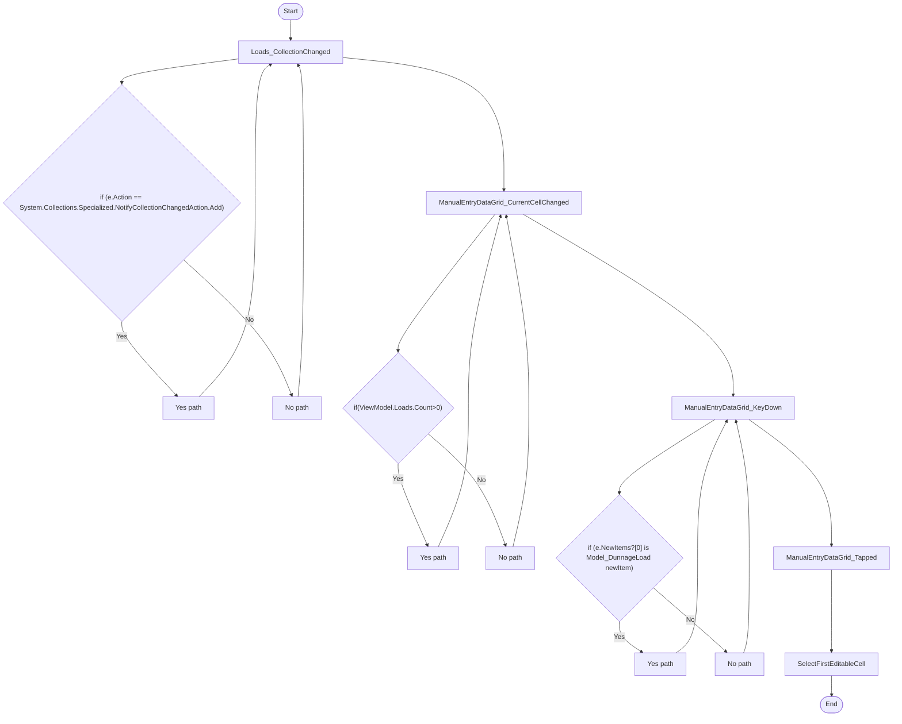

# Dunnage ManualEntryView Workflow

## Diagram (Mermaid)

## Things to fix

- None detected.

## User-Friendly Steps

1. Loads_CollectionChanged.
2. ManualEntryDataGrid_CurrentCellChanged.
3. ManualEntryDataGrid_KeyDown.
4. ManualEntryDataGrid_Tapped.
5. SelectFirstEditableCell.

## Required Info for Fixing Incorrect Workflows

| Step | UI / Action | Command / Query | Validator Rules (Actual) | Handler / Data Path | Actual Data (from code) |
|---|---|---|---|---|---|
| Loads_CollectionChanged | Invoke Loads_CollectionChanged | n/a | n/a | Method: Loads_CollectionChanged | See implementation | 
| ManualEntryDataGrid_CurrentCellChanged | Invoke ManualEntryDataGrid_CurrentCellChanged | n/a | n/a | Method: ManualEntryDataGrid_CurrentCellChanged | See implementation | 
| ManualEntryDataGrid_KeyDown | Invoke ManualEntryDataGrid_KeyDown | n/a | n/a | Method: ManualEntryDataGrid_KeyDown | See implementation | 
| ManualEntryDataGrid_Tapped | Invoke ManualEntryDataGrid_Tapped | n/a | n/a | Method: ManualEntryDataGrid_Tapped | See implementation | 
| SelectFirstEditableCell | Invoke SelectFirstEditableCell | n/a | n/a | Method: SelectFirstEditableCell | See implementation | 

## Source

- Repomix file: C:\Users\johnk\source\repos\MTM_Receiving_Application\.repomix\outputs\code-only\repomix-output-code-only.md
- Type: Dunnage
- Generated: 2026-01-17

