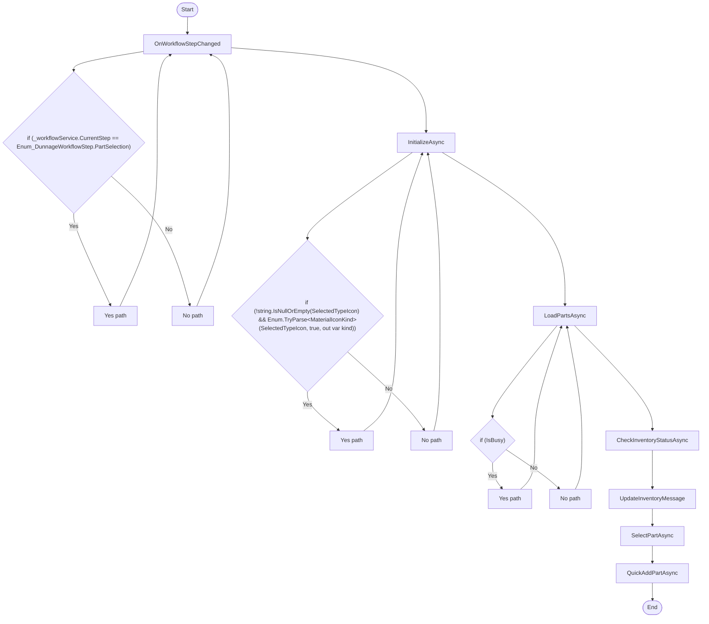

# Dunnage PartSelectionViewModel Workflow

## Diagram (Mermaid)

## Things to fix

- None detected.

## User-Friendly Steps

1. OnWorkflowStepChanged.
2. InitializeAsync.
3. LoadPartsAsync.
4. CheckInventoryStatusAsync.
5. UpdateInventoryMessage.
6. SelectPartAsync.
7. QuickAddPartAsync.

## Required Info for Fixing Incorrect Workflows

| Step | UI / Action | Command / Query | Validator Rules (Actual) | Handler / Data Path | Actual Data (from code) |
|---|---|---|---|---|---|
| OnWorkflowStepChanged | Invoke OnWorkflowStepChanged | n/a | n/a | Method: OnWorkflowStepChanged | See implementation | 
| InitializeAsync | Invoke InitializeAsync | n/a | n/a | Method: InitializeAsync | See implementation | 
| LoadPartsAsync | Invoke LoadPartsAsync | n/a | n/a | Method: LoadPartsAsync | See implementation | 
| CheckInventoryStatusAsync | Invoke CheckInventoryStatusAsync | n/a | n/a | Method: CheckInventoryStatusAsync | See implementation | 
| UpdateInventoryMessage | Invoke UpdateInventoryMessage | n/a | n/a | Method: UpdateInventoryMessage | See implementation | 
| SelectPartAsync | Invoke SelectPartAsync | n/a | n/a | Method: SelectPartAsync | See implementation | 
| QuickAddPartAsync | Invoke QuickAddPartAsync | n/a | n/a | Method: QuickAddPartAsync | See implementation | 

## Source

- Repomix file: C:\Users\johnk\source\repos\MTM_Receiving_Application\.repomix\outputs\code-only\repomix-output-code-only.md
- Type: Dunnage
- Generated: 2026-01-17

