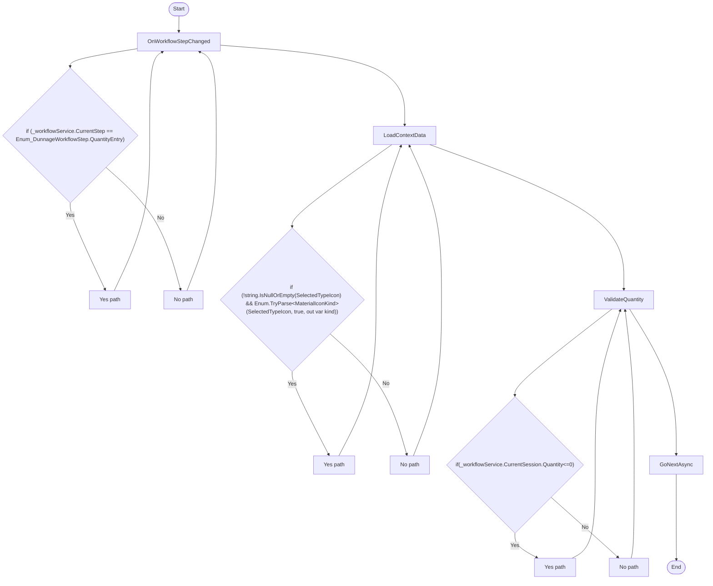

# Dunnage QuantityEntryViewModel Workflow

## Diagram (Mermaid)

## Things to fix

- None detected.

## User-Friendly Steps

1. OnWorkflowStepChanged.
2. LoadContextData.
3. ValidateQuantity.
4. GoNextAsync.

## Required Info for Fixing Incorrect Workflows

| Step | UI / Action | Command / Query | Validator Rules (Actual) | Handler / Data Path | Actual Data (from code) |
|---|---|---|---|---|---|
| OnWorkflowStepChanged | Invoke OnWorkflowStepChanged | n/a | n/a | Method: OnWorkflowStepChanged | See implementation | 
| LoadContextData | Invoke LoadContextData | n/a | n/a | Method: LoadContextData | See implementation | 
| ValidateQuantity | Invoke ValidateQuantity | n/a | n/a | Method: ValidateQuantity | See implementation | 
| GoNextAsync | Invoke GoNextAsync | n/a | n/a | Method: GoNextAsync | See implementation | 

## Source

- Repomix file: C:\Users\johnk\source\repos\MTM_Receiving_Application\.repomix\outputs\code-only\repomix-output-code-only.md
- Type: Dunnage
- Generated: 2026-01-17

