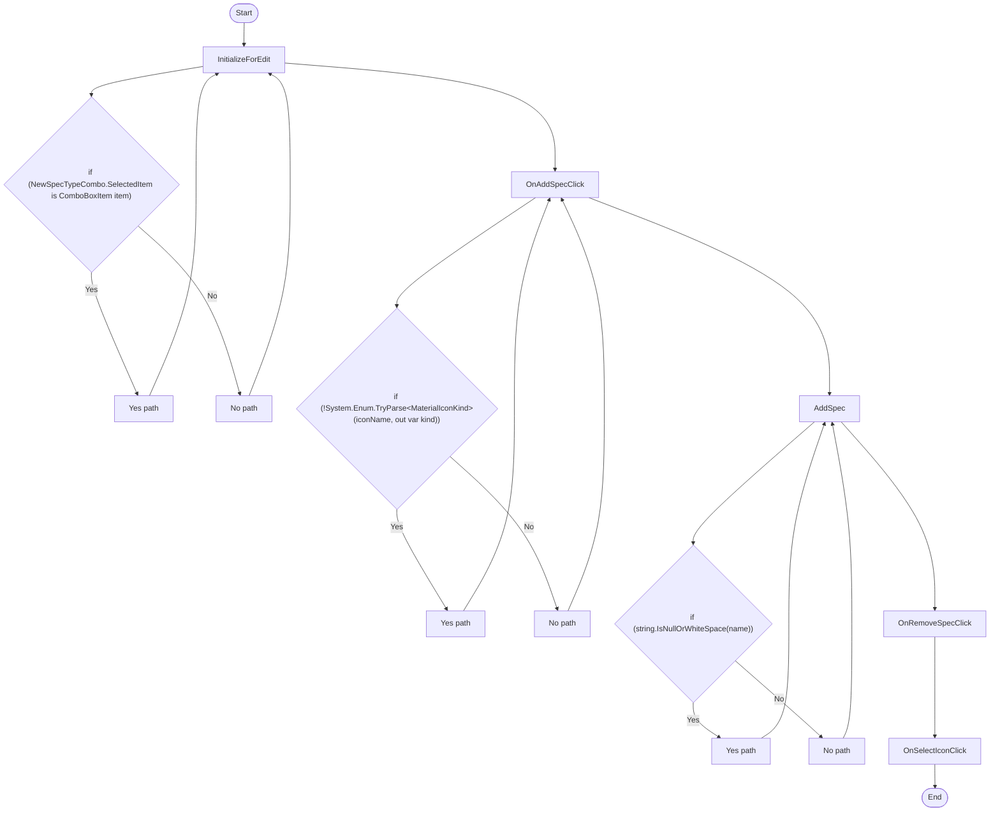

# Dunnage QuickAddTypeDialog Workflow

## Diagram (Mermaid)

## Things to fix

- None detected.

## User-Friendly Steps

1. InitializeForEdit.
2. OnAddSpecClick.
3. AddSpec.
4. OnRemoveSpecClick.
5. OnSelectIconClick.

## Required Info for Fixing Incorrect Workflows

| Step | UI / Action | Command / Query | Validator Rules (Actual) | Handler / Data Path | Actual Data (from code) |
|---|---|---|---|---|---|
| InitializeForEdit | Invoke InitializeForEdit | n/a | n/a | Method: InitializeForEdit | See implementation | 
| OnAddSpecClick | Invoke OnAddSpecClick | n/a | n/a | Method: OnAddSpecClick | See implementation | 
| AddSpec | Invoke AddSpec | n/a | n/a | Method: AddSpec | See implementation | 
| OnRemoveSpecClick | Invoke OnRemoveSpecClick | n/a | n/a | Method: OnRemoveSpecClick | See implementation | 
| OnSelectIconClick | Invoke OnSelectIconClick | n/a | n/a | Method: OnSelectIconClick | See implementation | 

## Source

- Repomix file: C:\Users\johnk\source\repos\MTM_Receiving_Application\.repomix\outputs\code-only\repomix-output-code-only.md
- Type: Dunnage
- Generated: 2026-01-17

