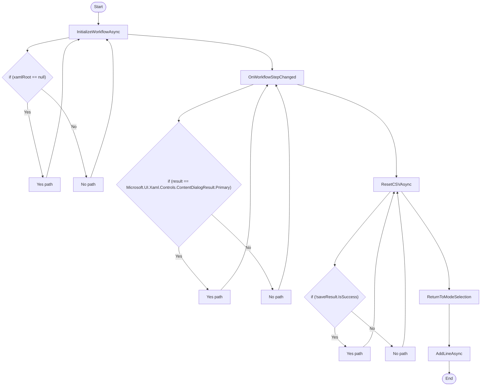

# Dunnage WorkFlowViewModel Workflow

## Diagram (Mermaid)

## Things to fix

- None detected.

## User-Friendly Steps

1. InitializeWorkflowAsync.
2. OnWorkflowStepChanged.
3. ResetCSVAsync.
4. ReturnToModeSelection.
5. AddLineAsync.

## Required Info for Fixing Incorrect Workflows

| Step | UI / Action | Command / Query | Validator Rules (Actual) | Handler / Data Path | Actual Data (from code) |
|---|---|---|---|---|---|
| InitializeWorkflowAsync | Invoke InitializeWorkflowAsync | n/a | n/a | Method: InitializeWorkflowAsync | See implementation | 
| OnWorkflowStepChanged | Invoke OnWorkflowStepChanged | n/a | n/a | Method: OnWorkflowStepChanged | See implementation | 
| ResetCSVAsync | Invoke ResetCSVAsync | n/a | n/a | Method: ResetCSVAsync | See implementation | 
| ReturnToModeSelection | Invoke ReturnToModeSelection | n/a | n/a | Method: ReturnToModeSelection | See implementation | 
| AddLineAsync | Invoke AddLineAsync | n/a | n/a | Method: AddLineAsync | See implementation | 

## Source

- Repomix file: C:\Users\johnk\source\repos\MTM_Receiving_Application\.repomix\outputs\code-only\repomix-output-code-only.md
- Type: Dunnage
- Generated: 2026-01-17

