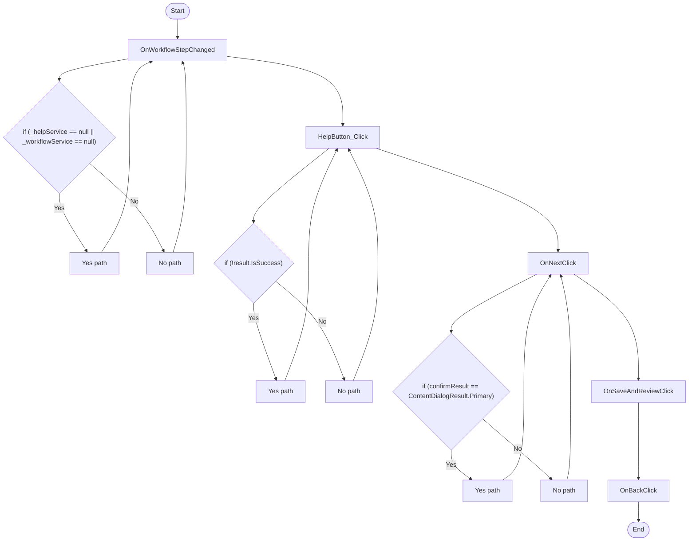

# Dunnage WorkflowView Workflow

## Diagram (Mermaid)

## Things to fix

- None detected.

## User-Friendly Steps

1. OnWorkflowStepChanged.
2. HelpButton_Click.
3. OnNextClick.
4. OnSaveAndReviewClick.
5. OnBackClick.

## Required Info for Fixing Incorrect Workflows

| Step | UI / Action | Command / Query | Validator Rules (Actual) | Handler / Data Path | Actual Data (from code) |
|---|---|---|---|---|---|
| OnWorkflowStepChanged | Invoke OnWorkflowStepChanged | n/a | n/a | Method: OnWorkflowStepChanged | See implementation | 
| HelpButton_Click | Invoke HelpButton_Click | n/a | n/a | Method: HelpButton_Click | See implementation | 
| OnNextClick | Invoke OnNextClick | n/a | n/a | Method: OnNextClick | See implementation | 
| OnSaveAndReviewClick | Invoke OnSaveAndReviewClick | n/a | n/a | Method: OnSaveAndReviewClick | See implementation | 
| OnBackClick | Invoke OnBackClick | n/a | n/a | Method: OnBackClick | See implementation | 

## Source

- Repomix file: C:\Users\johnk\source\repos\MTM_Receiving_Application\.repomix\outputs\code-only\repomix-output-code-only.md
- Type: Dunnage
- Generated: 2026-01-17

