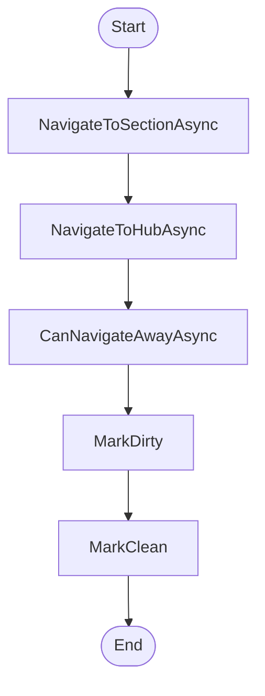

# IService DunnageAdminWorkflow Workflow

## Diagram (Mermaid)

## Things to fix

- None detected.

## User-Friendly Steps

1. NavigateToSectionAsync.
2. NavigateToHubAsync.
3. CanNavigateAwayAsync.
4. MarkDirty.
5. MarkClean.

## Required Info for Fixing Incorrect Workflows

| Step | UI / Action | Command / Query | Validator Rules (Actual) | Handler / Data Path | Actual Data (from code) |
|---|---|---|---|---|---|
| NavigateToSectionAsync | Invoke NavigateToSectionAsync | n/a | n/a | Method: NavigateToSectionAsync | See implementation | 
| NavigateToHubAsync | Invoke NavigateToHubAsync | n/a | n/a | Method: NavigateToHubAsync | See implementation | 
| CanNavigateAwayAsync | Invoke CanNavigateAwayAsync | n/a | n/a | Method: CanNavigateAwayAsync | See implementation | 
| MarkDirty | Invoke MarkDirty | n/a | n/a | Method: MarkDirty | See implementation | 
| MarkClean | Invoke MarkClean | n/a | n/a | Method: MarkClean | See implementation | 

## Source

- Repomix file: C:\Users\johnk\source\repos\MTM_Receiving_Application\.repomix\outputs\code-only\repomix-output-code-only.md
- Type: Dunnage
- Generated: 2026-01-17

