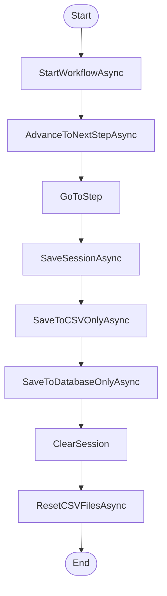

# IService DunnageWorkflow Workflow

## Diagram (Mermaid)

## Things to fix

- None detected.

## User-Friendly Steps

1. StartWorkflowAsync.
2. AdvanceToNextStepAsync.
3. GoToStep.
4. SaveSessionAsync.
5. SaveToCSVOnlyAsync.
6. SaveToDatabaseOnlyAsync.
7. ClearSession.
8. ResetCSVFilesAsync.

## Required Info for Fixing Incorrect Workflows

| Step | UI / Action | Command / Query | Validator Rules (Actual) | Handler / Data Path | Actual Data (from code) |
|---|---|---|---|---|---|
| StartWorkflowAsync | Invoke StartWorkflowAsync | n/a | n/a | Method: StartWorkflowAsync | See implementation | 
| AdvanceToNextStepAsync | Invoke AdvanceToNextStepAsync | n/a | n/a | Method: AdvanceToNextStepAsync | See implementation | 
| GoToStep | Invoke GoToStep | n/a | n/a | Method: GoToStep | See implementation | 
| SaveSessionAsync | Invoke SaveSessionAsync | n/a | n/a | Method: SaveSessionAsync | See implementation | 
| SaveToCSVOnlyAsync | Invoke SaveToCSVOnlyAsync | n/a | n/a | Method: SaveToCSVOnlyAsync | See implementation | 
| SaveToDatabaseOnlyAsync | Invoke SaveToDatabaseOnlyAsync | n/a | n/a | Method: SaveToDatabaseOnlyAsync | See implementation | 
| ClearSession | Invoke ClearSession | n/a | n/a | Method: ClearSession | See implementation | 
| ResetCSVFilesAsync | Invoke ResetCSVFilesAsync | n/a | n/a | Method: ResetCSVFilesAsync | See implementation | 

## Source

- Repomix file: C:\Users\johnk\source\repos\MTM_Receiving_Application\.repomix\outputs\code-only\repomix-output-code-only.md
- Type: Dunnage
- Generated: 2026-01-17

