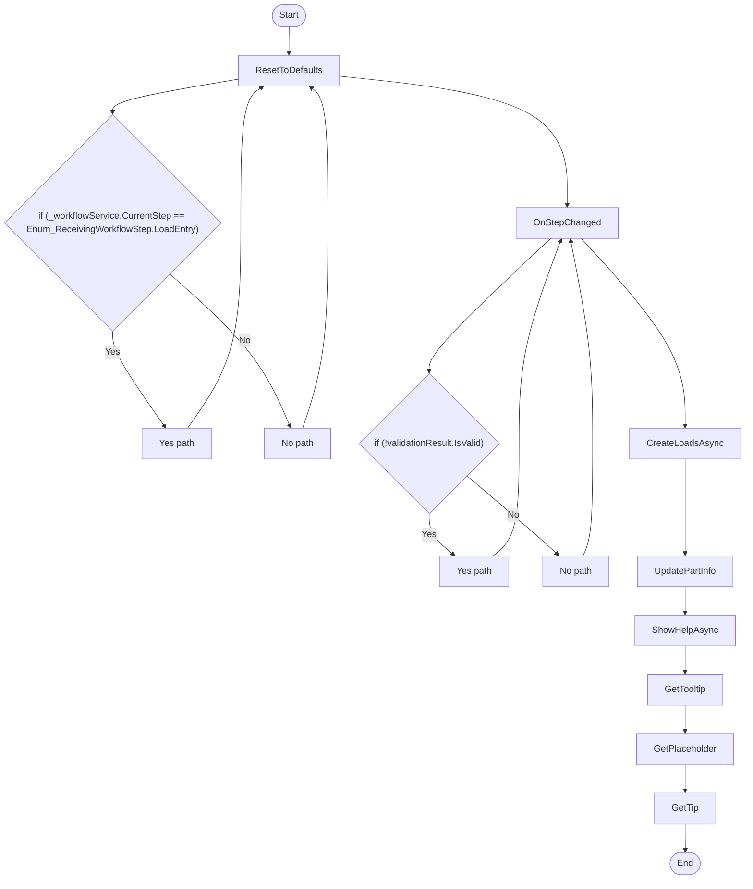

# Receiving LoadEntry Workflow

## Diagram (Mermaid)

## Things to fix

- None detected.

## User-Friendly Steps

1. ResetToDefaults.
2. OnStepChanged.
3. CreateLoadsAsync.
4. UpdatePartInfo.
5. ShowHelpAsync.
6. GetTooltip.
7. GetPlaceholder.
8. GetTip.

## Required Info for Fixing Incorrect Workflows

| Step | UI / Action | Command / Query | Validator Rules (Actual) | Handler / Data Path | Actual Data (from code) |
|---|---|---|---|---|---|
| ResetToDefaults | Invoke ResetToDefaults | n/a | n/a | Method: ResetToDefaults | See implementation | 
| OnStepChanged | Invoke OnStepChanged | n/a | n/a | Method: OnStepChanged | See implementation | 
| CreateLoadsAsync | Invoke CreateLoadsAsync | n/a | n/a | Method: CreateLoadsAsync | See implementation | 
| UpdatePartInfo | Invoke UpdatePartInfo | n/a | n/a | Method: UpdatePartInfo | See implementation | 
| ShowHelpAsync | Invoke ShowHelpAsync | n/a | n/a | Method: ShowHelpAsync | See implementation | 
| GetTooltip | Invoke GetTooltip | n/a | n/a | Method: GetTooltip | See implementation | 
| GetPlaceholder | Invoke GetPlaceholder | n/a | n/a | Method: GetPlaceholder | See implementation | 
| GetTip | Invoke GetTip | n/a | n/a | Method: GetTip | See implementation | 

## Source

- Repomix file: C:\Users\johnk\source\repos\MTM_Receiving_Application\.repomix\outputs\code-only\repomix-output-code-only.md
- Type: Receiving
- Generated: 2026-01-17

