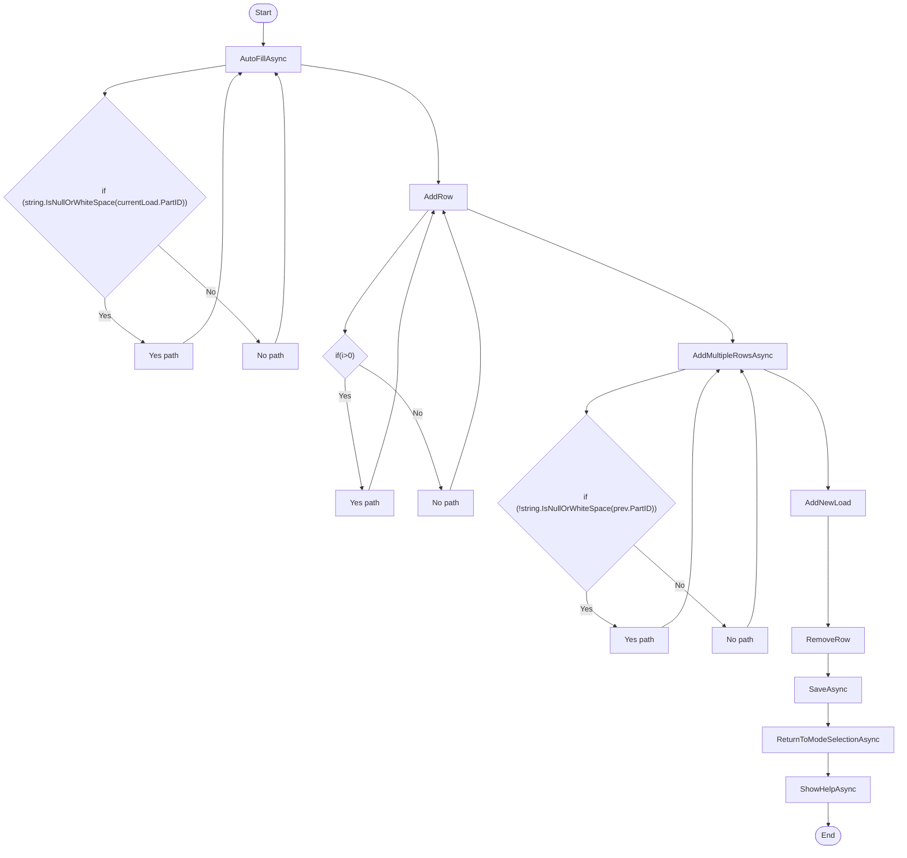

# Receiving ManualEntry Workflow

## Diagram (Mermaid)

## Things to fix

- None detected.

## User-Friendly Steps

1. AutoFillAsync.
2. AddRow.
3. AddMultipleRowsAsync.
4. AddNewLoad.
5. RemoveRow.
6. SaveAsync.
7. ReturnToModeSelectionAsync.
8. ShowHelpAsync.

## Required Info for Fixing Incorrect Workflows

| Step | UI / Action | Command / Query | Validator Rules (Actual) | Handler / Data Path | Actual Data (from code) |
|---|---|---|---|---|---|
| AutoFillAsync | Invoke AutoFillAsync | n/a | n/a | Method: AutoFillAsync | See implementation | 
| AddRow | Invoke AddRow | n/a | n/a | Method: AddRow | See implementation | 
| AddMultipleRowsAsync | Invoke AddMultipleRowsAsync | n/a | n/a | Method: AddMultipleRowsAsync | See implementation | 
| AddNewLoad | Invoke AddNewLoad | n/a | n/a | Method: AddNewLoad | See implementation | 
| RemoveRow | Invoke RemoveRow | n/a | n/a | Method: RemoveRow | See implementation | 
| SaveAsync | Invoke SaveAsync | n/a | n/a | Method: SaveAsync | See implementation | 
| ReturnToModeSelectionAsync | Invoke ReturnToModeSelectionAsync | n/a | n/a | Method: ReturnToModeSelectionAsync | See implementation | 
| ShowHelpAsync | Invoke ShowHelpAsync | n/a | n/a | Method: ShowHelpAsync | See implementation | 

## Source

- Repomix file: C:\Users\johnk\source\repos\MTM_Receiving_Application\.repomix\outputs\code-only\repomix-output-code-only.md
- Type: Receiving
- Generated: 2026-01-17

