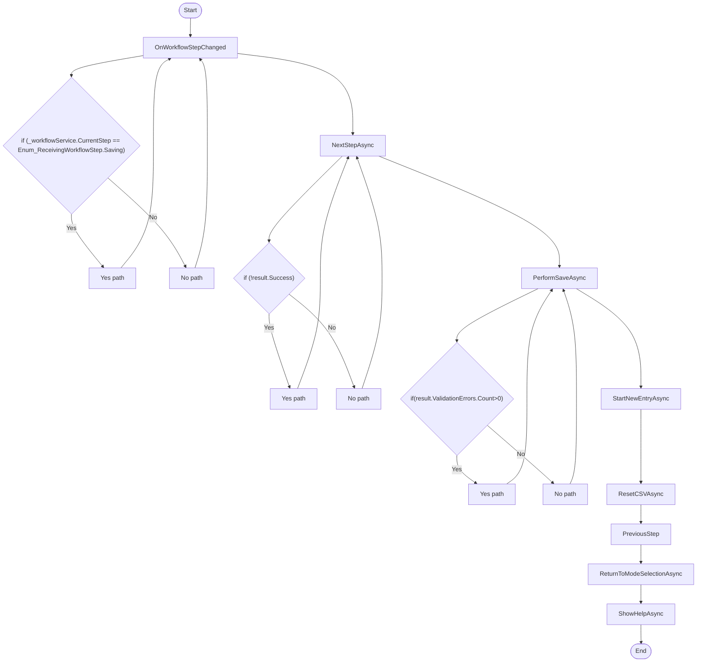

# Receiving Workflow Workflow

## Diagram (Mermaid)

## Things to fix

- None detected.

## User-Friendly Steps

1. OnWorkflowStepChanged.
2. NextStepAsync.
3. PerformSaveAsync.
4. StartNewEntryAsync.
5. ResetCSVAsync.
6. PreviousStep.
7. ReturnToModeSelectionAsync.
8. ShowHelpAsync.

## Required Info for Fixing Incorrect Workflows

| Step | UI / Action | Command / Query | Validator Rules (Actual) | Handler / Data Path | Actual Data (from code) |
|---|---|---|---|---|---|
| OnWorkflowStepChanged | Invoke OnWorkflowStepChanged | n/a | n/a | Method: OnWorkflowStepChanged | See implementation | 
| NextStepAsync | Invoke NextStepAsync | n/a | n/a | Method: NextStepAsync | See implementation | 
| PerformSaveAsync | Invoke PerformSaveAsync | n/a | n/a | Method: PerformSaveAsync | See implementation | 
| StartNewEntryAsync | Invoke StartNewEntryAsync | n/a | n/a | Method: StartNewEntryAsync | See implementation | 
| ResetCSVAsync | Invoke ResetCSVAsync | n/a | n/a | Method: ResetCSVAsync | See implementation | 
| PreviousStep | Invoke PreviousStep | n/a | n/a | Method: PreviousStep | See implementation | 
| ReturnToModeSelectionAsync | Invoke ReturnToModeSelectionAsync | n/a | n/a | Method: ReturnToModeSelectionAsync | See implementation | 
| ShowHelpAsync | Invoke ShowHelpAsync | n/a | n/a | Method: ShowHelpAsync | See implementation | 

## Source

- Repomix file: C:\Users\johnk\source\repos\MTM_Receiving_Application\.repomix\outputs\code-only\repomix-output-code-only.md
- Type: Receiving
- Generated: 2026-01-17

