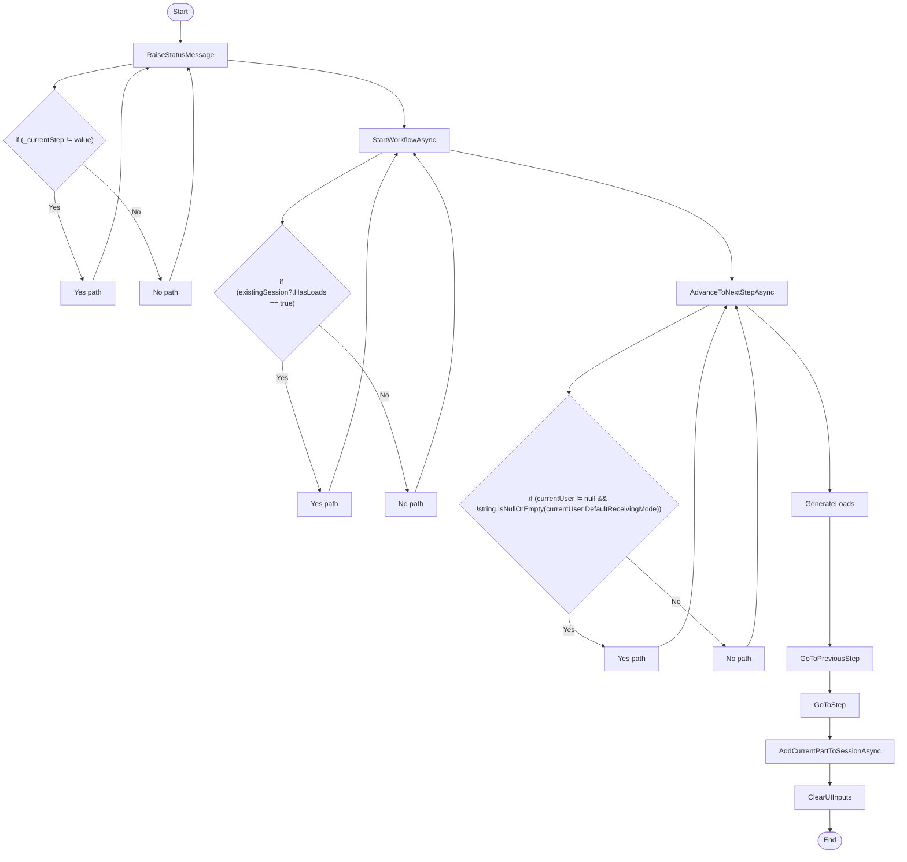

# Service ReceivingWorkflow Workflow

## Diagram (Mermaid)

## Things to fix

- None detected.

## User-Friendly Steps

1. RaiseStatusMessage.
2. StartWorkflowAsync.
3. AdvanceToNextStepAsync.
4. GenerateLoads.
5. GoToPreviousStep.
6. GoToStep.
7. AddCurrentPartToSessionAsync.
8. ClearUIInputs.

## Required Info for Fixing Incorrect Workflows

| Step | UI / Action | Command / Query | Validator Rules (Actual) | Handler / Data Path | Actual Data (from code) |
|---|---|---|---|---|---|
| RaiseStatusMessage | Invoke RaiseStatusMessage | n/a | n/a | Method: RaiseStatusMessage | See implementation | 
| StartWorkflowAsync | Invoke StartWorkflowAsync | n/a | n/a | Method: StartWorkflowAsync | See implementation | 
| AdvanceToNextStepAsync | Invoke AdvanceToNextStepAsync | n/a | n/a | Method: AdvanceToNextStepAsync | See implementation | 
| GenerateLoads | Invoke GenerateLoads | n/a | n/a | Method: GenerateLoads | See implementation | 
| GoToPreviousStep | Invoke GoToPreviousStep | n/a | n/a | Method: GoToPreviousStep | See implementation | 
| GoToStep | Invoke GoToStep | n/a | n/a | Method: GoToStep | See implementation | 
| AddCurrentPartToSessionAsync | Invoke AddCurrentPartToSessionAsync | n/a | n/a | Method: AddCurrentPartToSessionAsync | See implementation | 
| ClearUIInputs | Invoke ClearUIInputs | n/a | n/a | Method: ClearUIInputs | See implementation | 

## Source

- Repomix file: C:\Users\johnk\source\repos\MTM_Receiving_Application\.repomix\outputs\code-only\repomix-output-code-only.md
- Type: Receiving
- Generated: 2026-01-17

