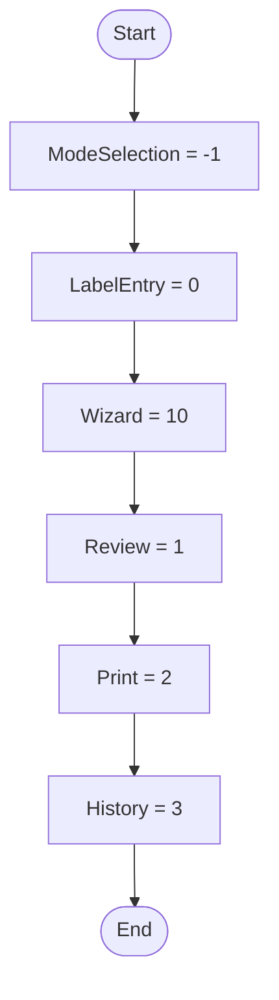

# Enum Routing WorkflowStep Workflow

## Diagram (Mermaid)

## Things to fix

- None detected.

## User-Friendly Steps

1. ModeSelection = -1.
2. LabelEntry = 0.
3. Wizard = 10.
4. Review = 1.
5. Print = 2.
6. History = 3.

## Required Info for Fixing Incorrect Workflows

| Step | UI / Action | Command / Query | Validator Rules (Actual) | Handler / Data Path | Actual Data (from code) |
|---|---|---|---|---|---|
| ModeSelection = -1 | Invoke ModeSelection = -1 | n/a | n/a | Method: ModeSelection = -1 | See implementation | 
| LabelEntry = 0 | Invoke LabelEntry = 0 | n/a | n/a | Method: LabelEntry = 0 | See implementation | 
| Wizard = 10 | Invoke Wizard = 10 | n/a | n/a | Method: Wizard = 10 | See implementation | 
| Review = 1 | Invoke Review = 1 | n/a | n/a | Method: Review = 1 | See implementation | 
| Print = 2 | Invoke Print = 2 | n/a | n/a | Method: Print = 2 | See implementation | 
| History = 3 | Invoke History = 3 | n/a | n/a | Method: History = 3 | See implementation | 

## Source

- Repomix file: C:\Users\johnk\source\repos\MTM_Receiving_Application\.repomix\outputs\code-only\repomix-output-code-only.md
- Type: Routing
- Generated: 2026-01-17

