# RoutingManualEntryViewModel Workflow

## Diagram (Mermaid)

```mermaid
flowchart TD
    Start([Start])
    Step1["InitializeAsync"]
    Start --> Step1
    Decision2{"if (recipientsResult.IsSuccess)"}
    Step1 --> Decision2
    Yes2["Yes path"]
    No2["No path"]
    Decision2 -->|Yes| Yes2
    Decision2 -->|No| No2
    Yes2 --> Step1
    No2 --> Step1
    Step2["AddNewRow"]
    Step1 --> Step2
    Decision3{"if (SelectedLabel != null)"}
    Step2 --> Decision3
    Yes3["Yes path"]
    No3["No path"]
    Decision3 -->|Yes| Yes3
    Decision3 -->|No| No3
    Yes3 --> Step2
    No3 --> Step2
    Step3["DeleteSelectedRow"]
    Step2 --> Step3
    Decision4{"if (string.IsNullOrWhiteSpace(label.PONumber))"}
    Step3 --> Decision4
    Yes4["Yes path"]
    No4["No path"]
    Decision4 -->|Yes| Yes4
    Decision4 -->|No| No4
    Yes4 --> Step3
    No4 --> Step3
    Step4["ValidatePOAsync"]
    Step3 --> Step4
    Step5["SaveAllLabelsAsync"]
    Step4 --> Step5
    Step6["CanSaveAll"]
    Step5 --> Step6
    End([End])
    Step6 --> End
```

## Things to fix

- None detected.

## User-Friendly Steps

1. InitializeAsync.
2. AddNewRow.
3. DeleteSelectedRow.
4. ValidatePOAsync.
5. SaveAllLabelsAsync.
6. CanSaveAll.

## Required Info for Fixing Incorrect Workflows

| Step | UI / Action | Command / Query | Validator Rules (Actual) | Handler / Data Path | Actual Data (from code) |
|---|---|---|---|---|---|
| InitializeAsync | Invoke InitializeAsync | n/a | n/a | Method: InitializeAsync | See implementation | 
| AddNewRow | Invoke AddNewRow | n/a | n/a | Method: AddNewRow | See implementation | 
| DeleteSelectedRow | Invoke DeleteSelectedRow | n/a | n/a | Method: DeleteSelectedRow | See implementation | 
| ValidatePOAsync | Invoke ValidatePOAsync | n/a | n/a | Method: ValidatePOAsync | See implementation | 
| SaveAllLabelsAsync | Invoke SaveAllLabelsAsync | n/a | n/a | Method: SaveAllLabelsAsync | See implementation | 
| CanSaveAll | Invoke CanSaveAll | n/a | n/a | Method: CanSaveAll | See implementation | 

## Source

- Repomix file: C:\Users\johnk\source\repos\MTM_Receiving_Application\.repomix\outputs\code-only\repomix-output-code-only.md
- Type: Routing
- Generated: 2026-01-17

