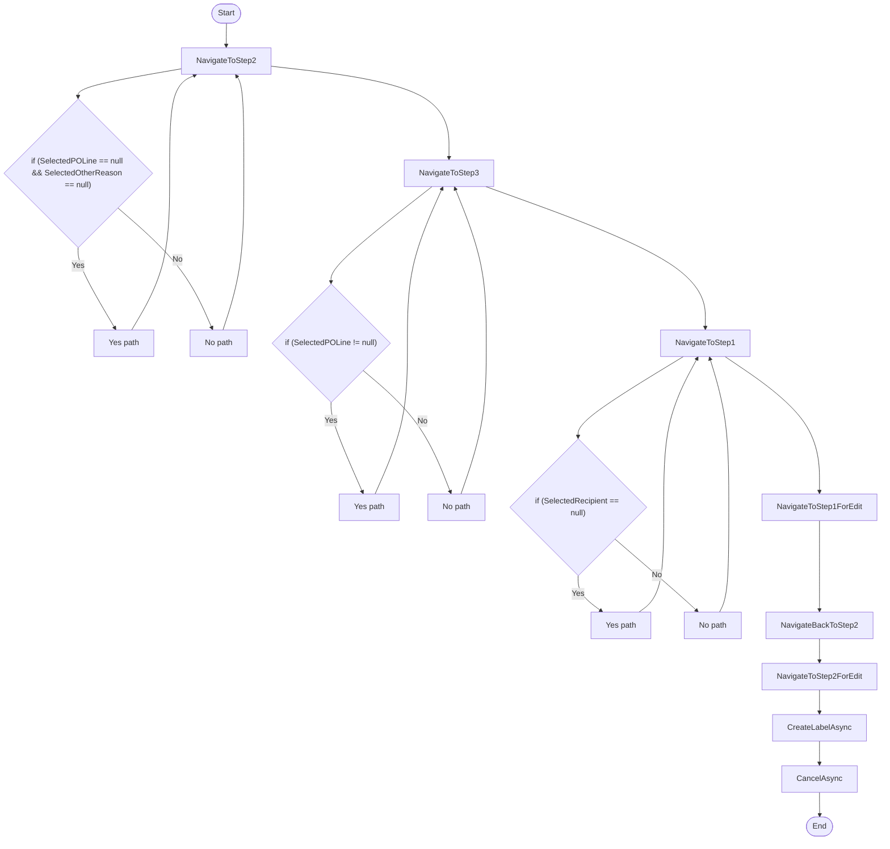

# RoutingWizardContainerViewModel Workflow

## Diagram (Mermaid)

## Things to fix

- None detected.

## User-Friendly Steps

1. NavigateToStep2.
2. NavigateToStep3.
3. NavigateToStep1.
4. NavigateToStep1ForEdit.
5. NavigateBackToStep2.
6. NavigateToStep2ForEdit.
7. CreateLabelAsync.
8. CancelAsync.

## Required Info for Fixing Incorrect Workflows

| Step | UI / Action | Command / Query | Validator Rules (Actual) | Handler / Data Path | Actual Data (from code) |
|---|---|---|---|---|---|
| NavigateToStep2 | Invoke NavigateToStep2 | n/a | n/a | Method: NavigateToStep2 | See implementation | 
| NavigateToStep3 | Invoke NavigateToStep3 | n/a | n/a | Method: NavigateToStep3 | See implementation | 
| NavigateToStep1 | Invoke NavigateToStep1 | n/a | n/a | Method: NavigateToStep1 | See implementation | 
| NavigateToStep1ForEdit | Invoke NavigateToStep1ForEdit | n/a | n/a | Method: NavigateToStep1ForEdit | See implementation | 
| NavigateBackToStep2 | Invoke NavigateBackToStep2 | n/a | n/a | Method: NavigateBackToStep2 | See implementation | 
| NavigateToStep2ForEdit | Invoke NavigateToStep2ForEdit | n/a | n/a | Method: NavigateToStep2ForEdit | See implementation | 
| CreateLabelAsync | Invoke CreateLabelAsync | n/a | n/a | Method: CreateLabelAsync | See implementation | 
| CancelAsync | Invoke CancelAsync | n/a | n/a | Method: CancelAsync | See implementation | 

## Source

- Repomix file: C:\Users\johnk\source\repos\MTM_Receiving_Application\.repomix\outputs\code-only\repomix-output-code-only.md
- Type: Routing
- Generated: 2026-01-17

