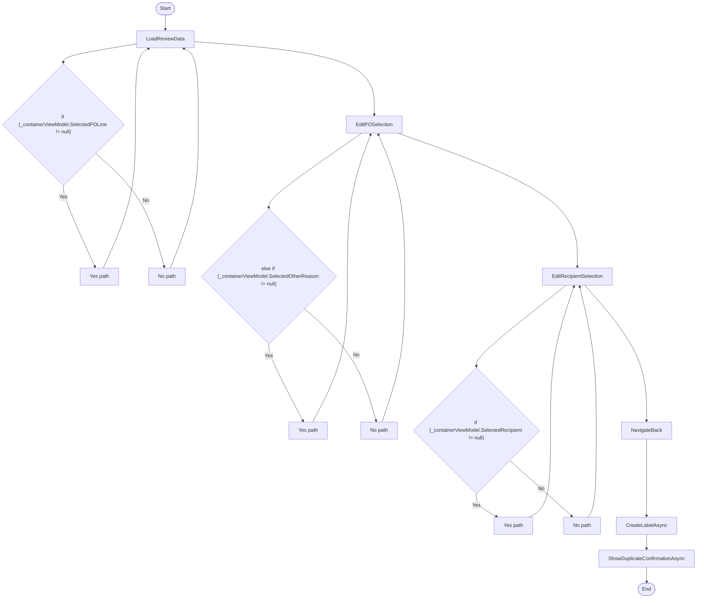

# RoutingWizardStep3ViewModel Workflow

## Diagram (Mermaid)

## Things to fix

- None detected.

## User-Friendly Steps

1. LoadReviewData.
2. EditPOSelection.
3. EditRecipientSelection.
4. NavigateBack.
5. CreateLabelAsync.
6. ShowDuplicateConfirmationAsync.

## Required Info for Fixing Incorrect Workflows

| Step | UI / Action | Command / Query | Validator Rules (Actual) | Handler / Data Path | Actual Data (from code) |
|---|---|---|---|---|---|
| LoadReviewData | Invoke LoadReviewData | n/a | n/a | Method: LoadReviewData | See implementation | 
| EditPOSelection | Invoke EditPOSelection | n/a | n/a | Method: EditPOSelection | See implementation | 
| EditRecipientSelection | Invoke EditRecipientSelection | n/a | n/a | Method: EditRecipientSelection | See implementation | 
| NavigateBack | Invoke NavigateBack | n/a | n/a | Method: NavigateBack | See implementation | 
| CreateLabelAsync | Invoke CreateLabelAsync | n/a | n/a | Method: CreateLabelAsync | See implementation | 
| ShowDuplicateConfirmationAsync | Invoke ShowDuplicateConfirmationAsync | n/a | n/a | Method: ShowDuplicateConfirmationAsync | See implementation | 

## Source

- Repomix file: C:\Users\johnk\source\repos\MTM_Receiving_Application\.repomix\outputs\code-only\repomix-output-code-only.md
- Type: Routing
- Generated: 2026-01-17

