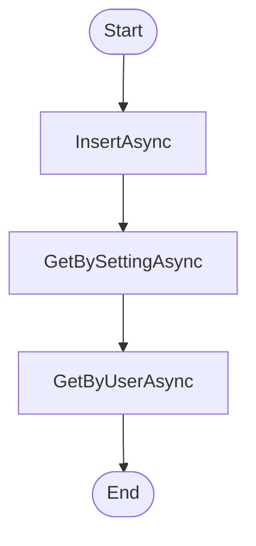

# Dao SettingsCoreAudit Workflow

## Diagram (Mermaid)

## Things to fix

- None detected.

## User-Friendly Steps

1. InsertAsync.
2. GetBySettingAsync.
3. GetByUserAsync.

## Required Info for Fixing Incorrect Workflows

| Step | UI / Action | Command / Query | Validator Rules (Actual) | Handler / Data Path | Actual Data (from code) |
|---|---|---|---|---|---|
| InsertAsync | Invoke InsertAsync | n/a | n/a | Method: InsertAsync | See implementation | 
| GetBySettingAsync | Invoke GetBySettingAsync | n/a | n/a | Method: GetBySettingAsync | See implementation | 
| GetByUserAsync | Invoke GetByUserAsync | n/a | n/a | Method: GetByUserAsync | See implementation | 

## Source

- Repomix file: C:\Users\johnk\source\repos\MTM_Receiving_Application\.repomix\outputs\code-only\repomix-output-code-only.md
- Type: Settings.Core
- Generated: 2026-01-17

