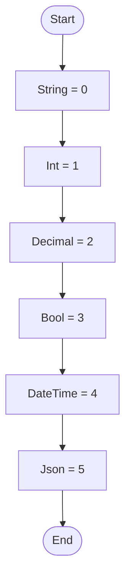

# Enum SettingsDataType Workflow

## Diagram (Mermaid)

## Things to fix

- None detected.

## User-Friendly Steps

1. String = 0.
2. Int = 1.
3. Decimal = 2.
4. Bool = 3.
5. DateTime = 4.
6. Json = 5.

## Required Info for Fixing Incorrect Workflows

| Step | UI / Action | Command / Query | Validator Rules (Actual) | Handler / Data Path | Actual Data (from code) |
|---|---|---|---|---|---|
| String = 0 | Invoke String = 0 | n/a | n/a | Method: String = 0 | See implementation | 
| Int = 1 | Invoke Int = 1 | n/a | n/a | Method: Int = 1 | See implementation | 
| Decimal = 2 | Invoke Decimal = 2 | n/a | n/a | Method: Decimal = 2 | See implementation | 
| Bool = 3 | Invoke Bool = 3 | n/a | n/a | Method: Bool = 3 | See implementation | 
| DateTime = 4 | Invoke DateTime = 4 | n/a | n/a | Method: DateTime = 4 | See implementation | 
| Json = 5 | Invoke Json = 5 | n/a | n/a | Method: Json = 5 | See implementation | 

## Source

- Repomix file: C:\Users\johnk\source\repos\MTM_Receiving_Application\.repomix\outputs\code-only\repomix-output-code-only.md
- Type: Settings.Core
- Generated: 2026-01-17

