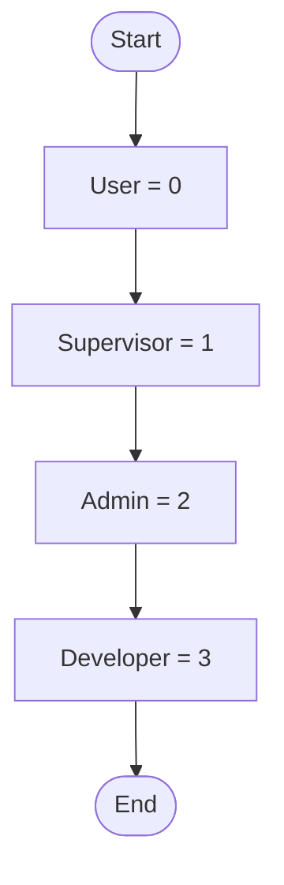

# Enum SettingsPermissionLevel Workflow

## Diagram (Mermaid)

## Things to fix

- None detected.

## User-Friendly Steps

1. User = 0.
2. Supervisor = 1.
3. Admin = 2.
4. Developer = 3.

## Required Info for Fixing Incorrect Workflows

| Step | UI / Action | Command / Query | Validator Rules (Actual) | Handler / Data Path | Actual Data (from code) |
|---|---|---|---|---|---|
| User = 0 | Invoke User = 0 | n/a | n/a | Method: User = 0 | See implementation | 
| Supervisor = 1 | Invoke Supervisor = 1 | n/a | n/a | Method: Supervisor = 1 | See implementation | 
| Admin = 2 | Invoke Admin = 2 | n/a | n/a | Method: Admin = 2 | See implementation | 
| Developer = 3 | Invoke Developer = 3 | n/a | n/a | Method: Developer = 3 | See implementation | 

## Source

- Repomix file: C:\Users\johnk\source\repos\MTM_Receiving_Application\.repomix\outputs\code-only\repomix-output-code-only.md
- Type: Settings.Core
- Generated: 2026-01-17

