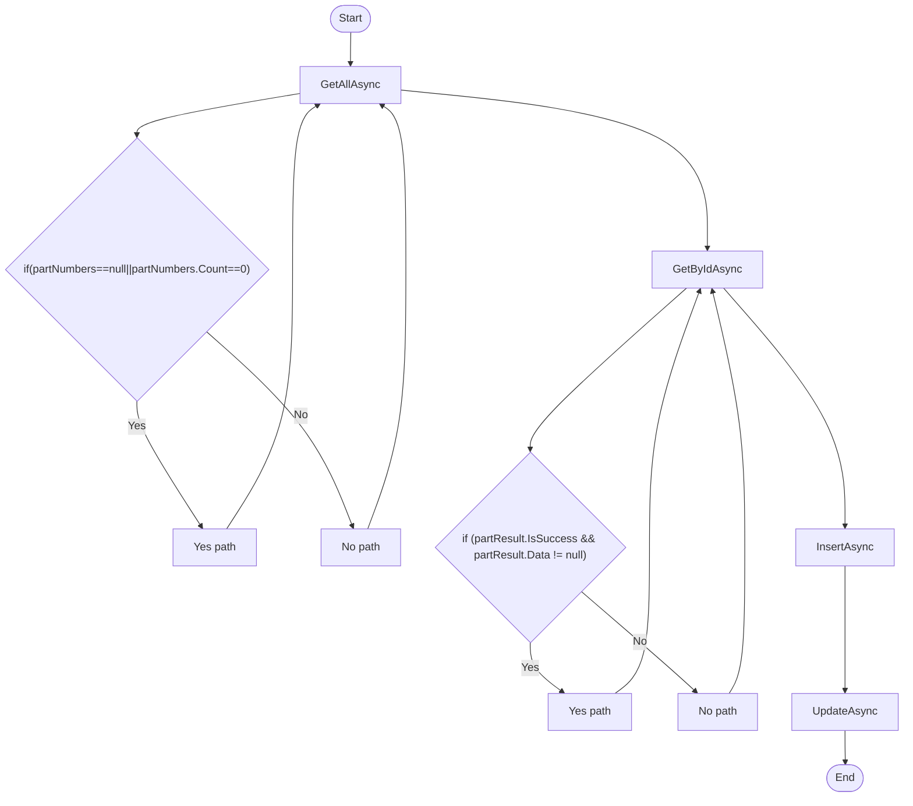

# Dao VolvoPart Workflow

## Diagram (Mermaid)

## Things to fix

- None detected.

## User-Friendly Steps

1. GetAllAsync.
2. GetByIdAsync.
3. InsertAsync.
4. UpdateAsync.

## Required Info for Fixing Incorrect Workflows

| Step | UI / Action | Command / Query | Validator Rules (Actual) | Handler / Data Path | Actual Data (from code) |
|---|---|---|---|---|---|
| GetAllAsync | Invoke GetAllAsync | n/a | n/a | Method: GetAllAsync | See implementation | 
| GetByIdAsync | Invoke GetByIdAsync | n/a | n/a | Method: GetByIdAsync | See implementation | 
| InsertAsync | Invoke InsertAsync | n/a | n/a | Method: InsertAsync | See implementation | 
| UpdateAsync | Invoke UpdateAsync | n/a | n/a | Method: UpdateAsync | See implementation | 

## Source

- Repomix file: C:\Users\johnk\source\repos\MTM_Receiving_Application\.repomix\outputs\code-only\repomix-output-code-only.md
- Type: Volvo
- Generated: 2026-01-17

