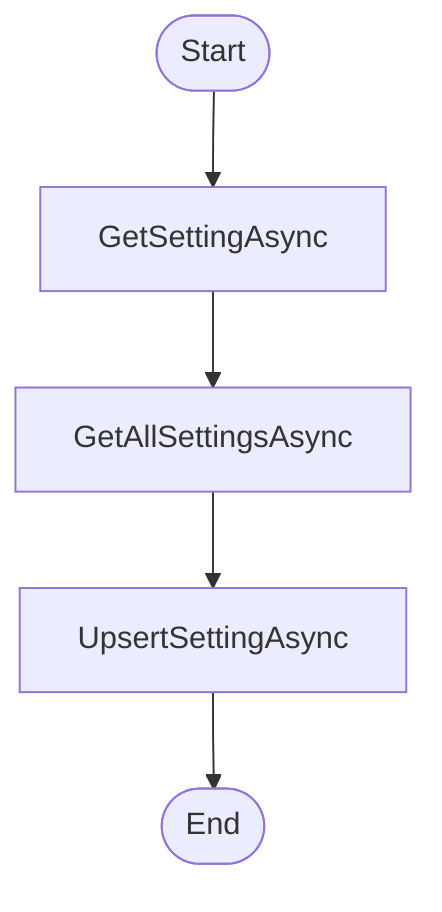

# Dao VolvoSettings Workflow

## Diagram (Mermaid)

## Things to fix

- None detected.

## User-Friendly Steps

1. GetSettingAsync.
2. GetAllSettingsAsync.
3. UpsertSettingAsync.

## Required Info for Fixing Incorrect Workflows

| Step | UI / Action | Command / Query | Validator Rules (Actual) | Handler / Data Path | Actual Data (from code) |
|---|---|---|---|---|---|
| GetSettingAsync | Invoke GetSettingAsync | n/a | n/a | Method: GetSettingAsync | See implementation | 
| GetAllSettingsAsync | Invoke GetAllSettingsAsync | n/a | n/a | Method: GetAllSettingsAsync | See implementation | 
| UpsertSettingAsync | Invoke UpsertSettingAsync | n/a | n/a | Method: UpsertSettingAsync | See implementation | 

## Source

- Repomix file: C:\Users\johnk\source\repos\MTM_Receiving_Application\.repomix\outputs\code-only\repomix-output-code-only.md
- Type: Volvo
- Generated: 2026-01-17

