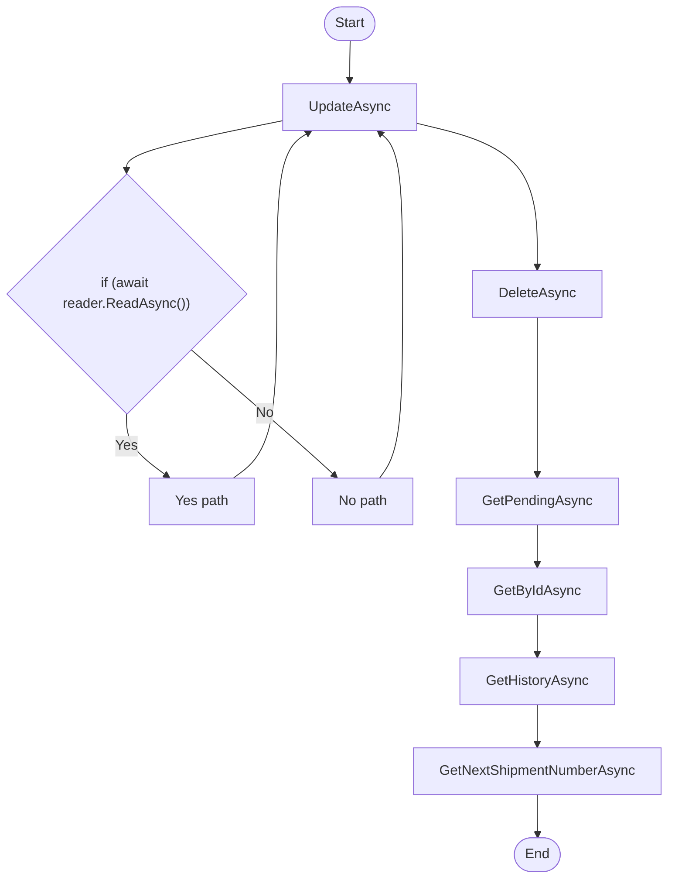

# Dao VolvoShipment Workflow

## Diagram (Mermaid)

## Things to fix

- None detected.

## User-Friendly Steps

1. UpdateAsync.
2. DeleteAsync.
3. GetPendingAsync.
4. GetByIdAsync.
5. GetHistoryAsync.
6. GetNextShipmentNumberAsync.

## Required Info for Fixing Incorrect Workflows

| Step | UI / Action | Command / Query | Validator Rules (Actual) | Handler / Data Path | Actual Data (from code) |
|---|---|---|---|---|---|
| UpdateAsync | Invoke UpdateAsync | n/a | n/a | Method: UpdateAsync | See implementation | 
| DeleteAsync | Invoke DeleteAsync | n/a | n/a | Method: DeleteAsync | See implementation | 
| GetPendingAsync | Invoke GetPendingAsync | n/a | n/a | Method: GetPendingAsync | See implementation | 
| GetByIdAsync | Invoke GetByIdAsync | n/a | n/a | Method: GetByIdAsync | See implementation | 
| GetHistoryAsync | Invoke GetHistoryAsync | n/a | n/a | Method: GetHistoryAsync | See implementation | 
| GetNextShipmentNumberAsync | Invoke GetNextShipmentNumberAsync | n/a | n/a | Method: GetNextShipmentNumberAsync | See implementation | 

## Source

- Repomix file: C:\Users\johnk\source\repos\MTM_Receiving_Application\.repomix\outputs\code-only\repomix-output-code-only.md
- Type: Volvo
- Generated: 2026-01-17

