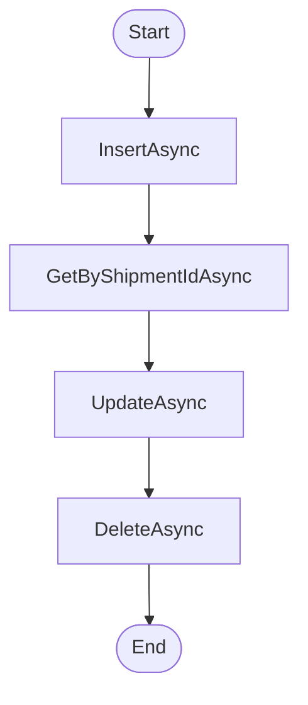

# Dao VolvoShipmentLine Workflow

## Diagram (Mermaid)

## Things to fix

- None detected.

## User-Friendly Steps

1. InsertAsync.
2. GetByShipmentIdAsync.
3. UpdateAsync.
4. DeleteAsync.

## Required Info for Fixing Incorrect Workflows

| Step | UI / Action | Command / Query | Validator Rules (Actual) | Handler / Data Path | Actual Data (from code) |
|---|---|---|---|---|---|
| InsertAsync | Invoke InsertAsync | n/a | n/a | Method: InsertAsync | See implementation | 
| GetByShipmentIdAsync | Invoke GetByShipmentIdAsync | n/a | n/a | Method: GetByShipmentIdAsync | See implementation | 
| UpdateAsync | Invoke UpdateAsync | n/a | n/a | Method: UpdateAsync | See implementation | 
| DeleteAsync | Invoke DeleteAsync | n/a | n/a | Method: DeleteAsync | See implementation | 

## Source

- Repomix file: C:\Users\johnk\source\repos\MTM_Receiving_Application\.repomix\outputs\code-only\repomix-output-code-only.md
- Type: Volvo
- Generated: 2026-01-17

