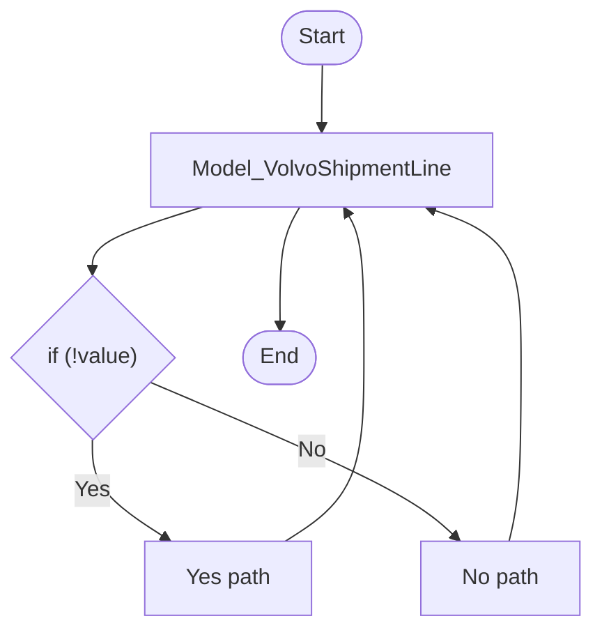

# Model VolvoShipmentLine Workflow

## Diagram (Mermaid)

## Things to fix

- None detected.

## User-Friendly Steps

1. Model_VolvoShipmentLine.

## Required Info for Fixing Incorrect Workflows

| Step | UI / Action | Command / Query | Validator Rules (Actual) | Handler / Data Path | Actual Data (from code) |
|---|---|---|---|---|---|
| Model_VolvoShipmentLine | Invoke Model_VolvoShipmentLine | n/a | n/a | Method: Model_VolvoShipmentLine | See implementation | 

## Source

- Repomix file: C:\Users\johnk\source\repos\MTM_Receiving_Application\.repomix\outputs\code-only\repomix-output-code-only.md
- Type: Volvo
- Generated: 2026-01-17

