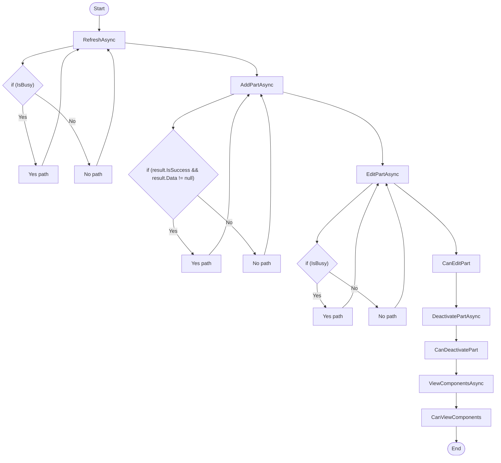

# Volvo Settings Workflow

## Diagram (Mermaid)

## Things to fix

- None detected.

## User-Friendly Steps

1. RefreshAsync.
2. AddPartAsync.
3. EditPartAsync.
4. CanEditPart.
5. DeactivatePartAsync.
6. CanDeactivatePart.
7. ViewComponentsAsync.
8. CanViewComponents.

## Required Info for Fixing Incorrect Workflows

| Step | UI / Action | Command / Query | Validator Rules (Actual) | Handler / Data Path | Actual Data (from code) |
|---|---|---|---|---|---|
| RefreshAsync | Invoke RefreshAsync | n/a | n/a | Method: RefreshAsync | See implementation | 
| AddPartAsync | Invoke AddPartAsync | n/a | n/a | Method: AddPartAsync | See implementation | 
| EditPartAsync | Invoke EditPartAsync | n/a | n/a | Method: EditPartAsync | See implementation | 
| CanEditPart | Invoke CanEditPart | n/a | n/a | Method: CanEditPart | See implementation | 
| DeactivatePartAsync | Invoke DeactivatePartAsync | n/a | n/a | Method: DeactivatePartAsync | See implementation | 
| CanDeactivatePart | Invoke CanDeactivatePart | n/a | n/a | Method: CanDeactivatePart | See implementation | 
| ViewComponentsAsync | Invoke ViewComponentsAsync | n/a | n/a | Method: ViewComponentsAsync | See implementation | 
| CanViewComponents | Invoke CanViewComponents | n/a | n/a | Method: CanViewComponents | See implementation | 

## Source

- Repomix file: C:\Users\johnk\source\repos\MTM_Receiving_Application\.repomix\outputs\code-only\repomix-output-code-only.md
- Type: Volvo
- Generated: 2026-01-17

