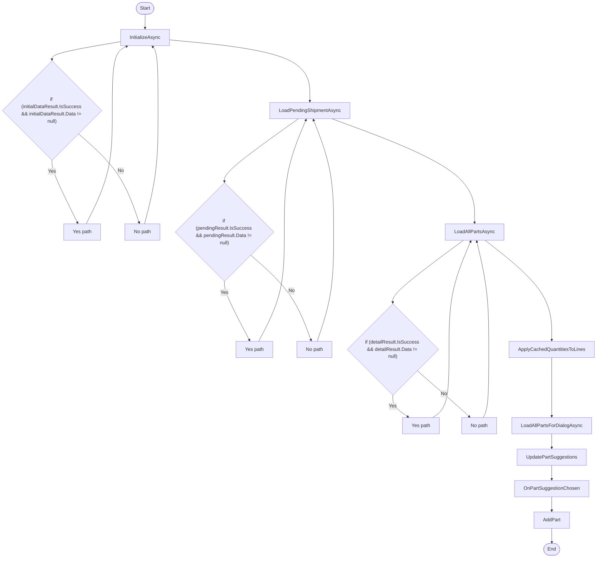

# Volvo ShipmentEntry Workflow

## Diagram (Mermaid)

## Things to fix

- None detected.

## User-Friendly Steps

1. InitializeAsync.
2. LoadPendingShipmentAsync.
3. LoadAllPartsAsync.
4. ApplyCachedQuantitiesToLines.
5. LoadAllPartsForDialogAsync.
6. UpdatePartSuggestions.
7. OnPartSuggestionChosen.
8. AddPart.

## Required Info for Fixing Incorrect Workflows

| Step | UI / Action | Command / Query | Validator Rules (Actual) | Handler / Data Path | Actual Data (from code) |
|---|---|---|---|---|---|
| InitializeAsync | Invoke InitializeAsync | n/a | n/a | Method: InitializeAsync | See implementation | 
| LoadPendingShipmentAsync | Invoke LoadPendingShipmentAsync | n/a | n/a | Method: LoadPendingShipmentAsync | See implementation | 
| LoadAllPartsAsync | Invoke LoadAllPartsAsync | n/a | n/a | Method: LoadAllPartsAsync | See implementation | 
| ApplyCachedQuantitiesToLines | Invoke ApplyCachedQuantitiesToLines | n/a | n/a | Method: ApplyCachedQuantitiesToLines | See implementation | 
| LoadAllPartsForDialogAsync | Invoke LoadAllPartsForDialogAsync | n/a | n/a | Method: LoadAllPartsForDialogAsync | See implementation | 
| UpdatePartSuggestions | Invoke UpdatePartSuggestions | n/a | n/a | Method: UpdatePartSuggestions | See implementation | 
| OnPartSuggestionChosen | Invoke OnPartSuggestionChosen | n/a | n/a | Method: OnPartSuggestionChosen | See implementation | 
| AddPart | Invoke AddPart | n/a | n/a | Method: AddPart | See implementation | 

## Source

- Repomix file: C:\Users\johnk\source\repos\MTM_Receiving_Application\.repomix\outputs\code-only\repomix-output-code-only.md
- Type: Volvo
- Generated: 2026-01-17

