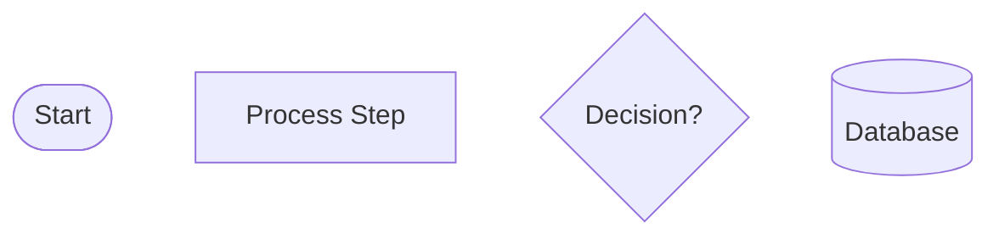
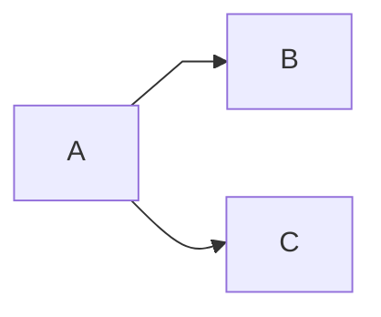
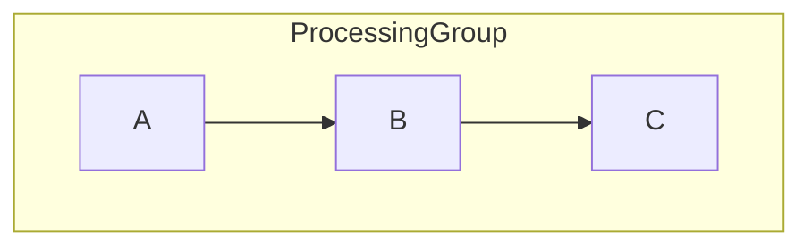
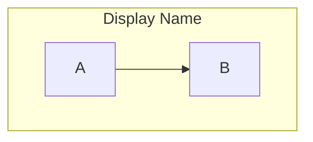
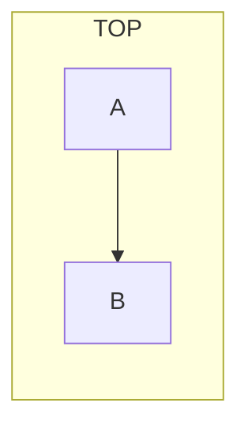
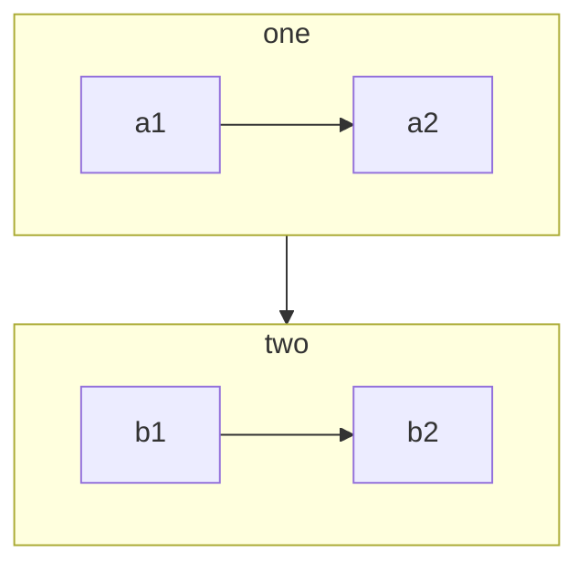
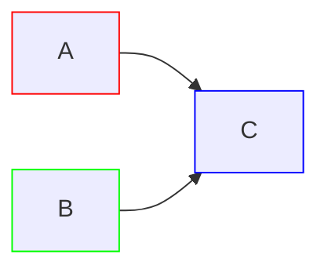
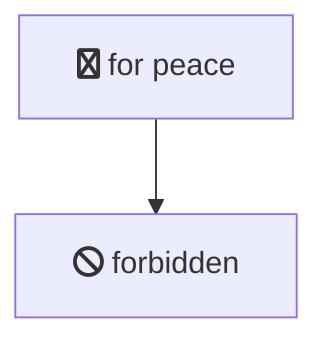

# Mermaid Diagram Auto-Generation Implementation Plan

**Created**: 2026-01-24  
**Updated**: 2026-01-24 (After brainstorming session)  
**Purpose**: Simple, pragmatic solution for automatic Mermaid diagram generation  
**Status**: Ready for Implementation  
**Brainstorming Session**: `_bmad-output/analysis/brainstorming-session-2026-01-24-mermaid-automation.md`

## Executive Summary

**BREAKTHROUGH INSIGHT**: The original complex YAML-based plan was 80% overkill. We already have the infrastructure - just need a simple structured format and one new PowerShell script.

**THE SIMPLE SOLUTION:**
1. Modify `speckit.specify.agent.md` to generate simple key-value WORKFLOW_DATA blocks
2. Create `MermaidGenerator.ps1` to parse blocks → generate raw Mermaid
3. Extend existing `MermaidProcessor.ps1` with `-Action Generate`
4. Let existing tools (MermaidNamespacer, MermaidValidator) handle the rest

**Total Implementation**: ~200 lines of PowerShell code

---

## Problem Statement

Currently, Mermaid diagrams must be manually created for each workflow, which is:
- Time-consuming and error-prone
- Difficult to maintain consistency
- Manual sync when user stories change
- AI agents struggle to generate raw Mermaid syntax correctly

## Solution Architecture

### Core Insight: Leverage Existing Infrastructure

**What We Already Have (Working):**
- ✅ `MermaidProcessor.ps1` - Master orchestrator
**Placed in spec.md after user story acceptance scenarios:**

```markdown
### User Story 1 - Feature Name (Priority: P1)

[Standard user story description]

**Acceptance Scenarios**:
1. [Scenario description as usual]
2. [Scenario description as usual]

## User Story 1 Workflow Data

<!-- WORKFLOW_START: 1.1 -->
WORKFLOW: 1.1
TITLE: Complete 3-Step Guided Workflow
DIRECTION: TD
DEPENDS_ON: NONE
CONFLICTS_WITH: NONE
INTERACTION: Primary happy path for guided mode

NODE: Start
TYPE: start
SHAPE: stadium
LABEL: User selects<br/>Guided Mode

NODE: Step1
TYPE: process
SHAPE: rect
LABEL: Step 1:<br/>Order & Part Selection

NODE: EnterPO
TYPE: process
SHAPE: rect
LABEL: Enter PO Number

NODE: ValidateStep1
TYPE: decision
SHAPE: diamond
LABEL: Step 1<br/>valid?

NODE: ShowErrors1
TYPE: process
SHAPE: rect
LABEL: Show validation errors

NODE: ClickNext1
TYPE: process
SHAPE: rect
LABEL: Click 'Next'

NODE: Step2
TYPE: process
SHAPE: rect
LABEL: Step 2:<br/>Load Details Entry

NODE: End
TYPE: end
SHAPE: stadium
LABEL: 3-step workflow complete<br/>67% fewer steps

CONNECTION: Start -> Step1
CONNECTION: Step1 -> EnterPO
CONNECTION: EnterPO -> SearchPart
CONNECTION: SearchPart -> EnterLoads
CONNECTION: EnterLoads -> ValidateStep1
CONNECTION: ValidateStep1 -> ShowErrors1 [No]
CONNECTION: ValidateStep1 -> ClickNext1 [Yes]
CONNECTION: ShowErrors1 -> Step1
CONNECTION: ClickNext1 -> Step2
CONNECTION: Step2 -> End
<!-- WORKFLOW_END: 1.1 -->

## User Story 1 Workflow Diagrams

### Workflow 1.1: Complete 3-Step Guided Workflow

[Generated Mermaid diagram will be inserted here by MermaidGenerator.ps1]

```

    - from: "SearchPart"
      to: "EnterLoads"
      
    - from: "EnterLoads"
      to: "ValidateStep1"
      
    - from: "ValidateStep1"
      to: "ShowErrors1"
      label: "No"
      style: "conditional"
      
    - from: "ValidateStep1"
      to: "ClickNext1"
      label: "Yes"
      style: "conditional"
      
    - from: "ShowErrors1"
      to: "Step1"
      
    - from: "ClickNext1"
      to: "Step2"
      
    # ... more edges

```
<!-- WORKFLOW_DEF_END: 1.1 -->
```

### Phase 2: Update MermaidProcessor.ps1

The script will:

1. **Parse YAML workflow definitions** from markdown files
2. **Generate namespace-prefixed node IDs** (e.g., `W1_1_Start`, `W1_1_EnterPO`)
3. **Map node types to appropriate Mermaid shapes** using the comprehensive shape library
4. **Generate proper Mermaid syntax** with all features (styling, subgraphs, etc.)
5. **Insert generated diagrams** into the markdown file
6. **Validate syntax** before rendering

## Integration Flow

**Complete workflow from user input to final diagram:**

```
STEP 1: User runs speckit.specify
  ↓
speckit.specify.agent.md generates spec.md containing:
  - Normal user stories
  - WORKFLOW_DATA blocks (key-value format)
  - Placeholder diagram sections
  ↓
  
STEP 2: User runs MermaidProcessor.ps1 -Action Generate
  ↓
MermaidGenerator.ps1:
  - Extracts WORKFLOW_DATA blocks
  - Validates workflow relationships
  - Generates raw Mermaid (simple node IDs: Start, Step1, etc.)
  - Inserts Mermaid code blocks into spec.md
  ↓
  
MermaidNamespacer.ps1: (automatic via ProcessAll)
  - Applies W{US}_{WF}_ prefixes to node IDs
  - Transforms: Start → W1_1_Start, Step1 → W1_1_Step1
  ↓
  
MermaidValidator.ps1: (automatic via ProcessAll)
  - Validates Mermaid syntax
  - Checks for namespace conflicts
  - Reports any issues
  ↓
  
FileBackupManager.ps1: (automatic)
  - Creates backup before modifications
  - Enables restore if needed
  ↓
  
RESULT: spec.md with perfect, namespaced, validated Mermaid diagrams!
```

**Subsequent Updates:**

```
User story changes
  ↓
Update WORKFLOW_DATA blocks (manual or via speckit.clarify)
  ↓
Run: MermaidProcessor.ps1 -Action Generate
  ↓
Diagrams automatically regenerate!
```

**No manual Mermaid syntax required! ✅**

---

## Mermaid Syntax Reference

For complete Mermaid syntax details, see `.github/instructions/mermaid-diagrams.instructions.md`

**Quick reference for WORKFLOW_DATA:**

#### All Node Shapes (60+ shapes available)

**Classic Shapes**:
- Rectangle: `[text]`
- Rounded: `(text)`
- Stadium: `([text])`
- Subroutine: `[[text]]`
- Cylinder/Database: `[(text)]`
- Circle: `((text))`
- Asymmetric: `>text]`
- Rhombus/Diamond: `{text}`
- Hexagon: `{{text}}`
- Parallelogram: `[/text/]` or `[\text\]`
- Trapezoid: `[/text\]` or `[\text/]`
- Double Circle: `(((text)))`

**Modern Shapes (v11.3.0+)** using `@{shape:...}` syntax:

| Shape Type | Short Name | Semantic Meaning | Aliases |
|------------|------------|------------------|---------|
| **Field Definitions

| Field | Required | Format | Description | Examples |
|-------|----------|--------|-------------|----------|
| `WORKFLOW` | ✅ | `{UserStory}.{Workflow}` | Unique workflow identifier | `1.1`, `2.3`, `4.1` |
| `TITLE` | ✅ | Free text | Descriptive workflow name | `Complete 3-Step Guided Workflow` |
| `DIRECTION` | ✅ | `TD\|LR\|RL\|BT` | Mermaid flowchart direction | `TD` (top-down), `LR` (left-right) |
| `DEPENDS_ON` | ✅ | Comma-separated or `NONE` | Workflows that must complete first | `1.1, 1.2` or `NONE` |
| `CONFLICTS_WITH` | ✅ | Comma-separated or `NONE` | Mutually exclusive workflows | `1.3` or `NONE` |
| `INTERACTION` | ✅ | Free text | How this relates to other workflows | `Extends 1.1 by adding bulk operations` |
| `NODE` | ✅ | Simple identifier | Node name (no spaces) | `Start`, `ValidateStep1` |
| `TYPE` | ✅ | See types below | Semantic node type | `start`, `process`, `decision`, `end` |
| `SHAPE` | ✅ | Mermaid shape name | Visual representation | `stadium`, `rect`, `diamond` |
| `LABEL` | ✅ | Text (supports `<br/>`) | Display text in diagram | `User selects<br/>Guided Mode` |
| `CONNECTION` | ✅ | `From -> To [Label]` | Flow between nodes | `Start -> Step1`, `Validate -> Error [No]` |

**Node Types:**
- `start` - Workflow entry point (typically stadium shape)
- `process` - Action or state (typically rect shape)
- `decision` - Branching point (typically diamond shape)
- `end` - Workflow completion (typically stadium shape)
- `subprocess` - Call to another workflow (typically rect with border)

**Common Mermaid Shapes:**
- `stadium` - Rounded pill shape `([text])`
- `rect` - Rectangle `[text]`
- `diamond` - Diamond `{text}`
- `circle` - Circle `((text))`
- `hexagon` - Hexagon `{{text}}`

### Workflow Relationship Tracking

**Purpose**: Track dependencies and conflicts between workflows for validation and planning

**DEPENDS_ON Examples:**

```
DEPENDS_ON: NONE              # Independent workflow
DEPENDS_ON: 1.1               # Requires workflow 1.1 first
DEPENDS_ON: 1.1, 1.2, 2.1     # Requires multiple workflows
```

**CONFLICTS_WITH Examples:**

```
CONFLICTS_WITH: NONE          # No conflicts
CONFLICTS_WITH: 1.3           # Cannot coexist with 1.3
CONFLICTS_WITH: 2.1, 2.2      # Conflicts with multiple workflows
```

**INTERACTION Examples:**

```
INTERACTION: Primary happy path - foundation for all features
INTERACTION: Alternative to 1.1 - expert users skip wizard
INTERACTION: Extends 1.1 by adding bulk copy functionality
INTERACTION: Conflicts with 3.6 - both modify same data simultaneously
```

### Implementation Components

**1. MermaidGenerator.ps1 (NEW - ~150 lines)**

**Purpose**: Parse WORKFLOW_DATA blocks and generate raw Mermaid syntax

**Key Functions:**

```powershell
function Get-WorkflowDataBlocks($FilePath) {
    # Extract all <!-- WORKFLOW_START --> ... <!-- WORKFLOW_END --> blocks
    # Parse key-value pairs
    # Return array of workflow objects
}

function ConvertTo-MermaidSyntax($WorkflowData) {
    # Convert WORKFLOW_DATA to Mermaid flowchart syntax
    # Use simple node IDs (Start, Step1, etc.) - NOT namespaced yet
    # Generate flowchart with direction, nodes, connections
}

function Test-WorkflowRelationships($AllWorkflows) {
    # Validate DEPENDS_ON workflows exist
    # Check CONFLICTS_WITH are bidirectional
    # Detect circular dependencies
    # Generate warnings/errors
}

function Insert-MermaidDiagram($FilePath, $WorkflowID, $MermaidCode) {
    # Find correct insertion point after WORKFLOW_END comment
    # Insert mermaid code block
    # Preserve existing content
}
```

**Algorithm:**
1. Parse spec.md, extract all WORKFLOW_DATA blocks
2. For each workflow:
   - Convert to raw Mermaid syntax (simple node IDs)
   - Insert after corresponding WORKFLOW_END comment
3. Validate workflow relationships
4. Return report of generated diagrams and any warnings

**2. Modified MermaidProcessor.ps1 (~15 lines added)**

Add new action to existing script:

```powershell
[ValidateSet('Parse', 'ApplyNamespaces', 'Validate', 'ProcessAll', 'Restore', 'RemoveDiagrams', 'Generate')]
[string]$Action = 'ProcessAll'

# Add new function:
function Invoke-MermaidGeneration {
    param([string]$Path)
    
    Write-Log "Generating Mermaid diagrams from WORKFLOW_DATA blocks" -Level Info
    
    # Call MermaidGenerator.ps1
    & "$ScriptDir\MermaidGenerator.ps1" -FilePath $Path
    
    # Then run ProcessAll to apply namespaces and validate
    Invoke-ProcessAll -Path $Path
}
```

**3. Modified MermaidParser.ps1 (~30 lines added)**

Add function to parse WORKFLOW_DATA blocks:

```powershell
function Get-WorkflowDataBlocks {
    param([string]$FilePath)
    
    $content = Get-Content -Path $FilePath -Raw
    $pattern = '(?s)<!-- WORKFLOW_START: ([\d.]+) -->(.+?)<!-- WORKFLOW_END: \1 -->'
    
    $matches = [regex]::Matches($content, $pattern)
    
    foreach ($match in $matches) {
        $workflowId = $match.Groups[1].Value
        $data = $match.Groups[2].Value
        
        # Parse key-value pairs: ^WORKFLOW:, ^NODE:, etc.
        # Return structured object
    }
}
```

**4. Modified speckit.specify.agent.md (~20 lines modified)**

Update step 5a to generate WORKFLOW_DATA blocks instead of raw Mermaid:

```markdown
5a. **Generate Workflow Data Blocks**: For EACH user story workflow:
   - After acceptance scenarios, add: `## User Story [N] Workflow Data`
   - Generate WORKFLOW_DATA blocks using simple key-value format
   - Include comment markers: <!-- WORKFLOW_START: X.Y --> ... <!-- WORKFLOW_END: X.Y -->
   - Fill in: WORKFLOW, TITLE, DIRECTION, DEPENDS_ON, CONFLICTS_WITH, INTERACTION
   - For each node: NODE, TYPE, SHAPE, LABEL
   - For each connection: CONNECTION with optional label
   - Add placeholder section: `## User Story [N] Workflow Diagrams`
   - Note: Run MermaidProcessor.ps1 -Action Generate to create diagrams
```join` |
| Junction | `f-circ` | Junction point | `filled-circle`, `junction` |
| **Start/End Points** |
| Terminal Point | `stadium` | Terminal point | `pill`, `terminal` |
| Start (Circle) | `circle` | Starting point | `circ` |
| Start (Small) | `sm-circ` | Small start | `small-circle`, `start` |
| Stop (Double Circle) | `dbl-circ` | Stop point | `double-circle` |
| Stop (Framed) | `fr-circ` | Stop point | `framed-circle`, `stop` |
| **Data & Storage** |
| Database | `cyl` | Database storage | `cylinder`, `database`, `db` |
| Direct Access Storage | `h-cyl` | Direct access | `das`, `horizontal-cylinder` |
| Disk Storage | `lin-cyl` | Disk storage | `disk`, `lined-cylinder` |
| Internal Storage | `win-pane` | Internal storage | `internal-storage`, `window-pane` |
| Stored Data | `bow-rect` | Stored data | `bow-tie-rectangle`, `stored-data` |
| Data Input/Output (Right) | `lean-r` | Input/Output | `in-out`, `lean-right` |
| Data Input/Output (Left) | `lean-l` | Output/Input | `lean-left`, `out-in` |
| **Documents** |
| Document | `doc` | Document | `doc`, `document` |
| Multi-Document | `docs` | Multiple docs | `documents`, `st-doc`, `stacked-document` |
| Lined Document | `lin-doc` | Lined document | `lined-document` |
| Tagged Document | `tag-doc` | Tagged document | `tagged-document` |
| **Special Purpose** |
| Display | `curv-trap` | Display output | `curved-trapezoid`, `display` |
| Delay | `delay` | Delay/wait | `half-rounded-rectangle` |
| Collate | `hourglass` | Collate operation | `collate`, `hourglass` |
| Extract | `tri` | Extract | `extract`, `triangle` |
| Summary | `cross-circ` | Summary | `crossed-circle`, `summary` |
| Comment | `brace` | Comment/note | `brace-l`, `comment` |
| Cloud | `cloud` | Cloud service | `cloud` |
| **Priority & Limits** |
| Priority Action | `trap-b` | Priority action | `priority`, `trapezoid`, `trapezoid-bottom` |
| Loop Limit | `notch-pent` | Loop limit | `loop-limit`, `notched-pentagon` |
| **Other** |
| Text Block | `text` | Text block | - |
| Odd | `odd` | Odd shape | - |
| Paper Tape | `flag` | Paper tape | `paper-tape` |
| Lightning Bolt | `bolt` | Communication | `com-link`, `lightning-bolt` |
| Divided Process | `div-rect` | Divided process | `div-proc`, `divided-process`, `divided-rectangle` |
| Tagged Process | `tag-rect` | Tagged process | `tag-proc`, `tagged-process`, `tagged-rectangle` |
| Card | `notch-rect` | Card | `card`, `notched-rectangle` |
| Lined Process | `lin-rect` | Lined process | `lin-proc`, `lined-process`, `lined-rectangle`, `shaded-process` |
| Multi-Process | `st-rect` | Multiple processes | `processes`, `procs`, `stacked-rectangle` |
| Manual File | `flip-tri` | Manual file | `flipped-triangle`, `manual-file` |

**Using Modern Shapes**:


#### All Edge/Arrow Types

**Basic Arrows**:
- `-->` - Arrow with head
- `---` - Open link (no arrow)
- `-.->` - Dotted arrow
- `-.-` - Dotted link
- `==>` - Thick arrow
- `===` - Thick link
- `~~~` - Invisible link

**With Labels**:
- `-->|text|` or `-- text -->` - Arrow with label
- `---|text|` or `-- text ---` - Link with label
- `-.->|text|` or `-. text .->` - Dotted with label
- `==>|text|` or `== text ==>` - Thick with label

**Multi-directional**:
- `<-->` - Bidirectional arrow
- `o--o` - Circle edges both ends
- `x--x` - Cross edges both ends
- `<-.->` - Bidirectional dotted
- `<==>`- Bidirectional thick

**Special Arrows**:
- `--o` - Circle edge
- `--x` - Cross edge

**Variable Length** (add more dashes):
- `---->` - Longer arrow (2 extra ranks)
- `----->` - Even longer (3 extra ranks)

#### Edge Styling & Animation

**Assign ID to edge**:


**Style edge**:


**Animate edge**:

```mermaid
flowchart LR
  A e1@==> B
  e1@{ animate: true }
  # or
  e1@{ animation: fast }  # fast or slow
```

**Curve styles** (edge-level):



Available curves: `basis`, `bumpX`, `bumpY`, `cardinal`, `catmullRom`, `linear`, `monotoneX`, `monotoneY`, `natural`, `step`, `stepAfter`, `stepBefore`

#### Subgraphs

**Basic subgraph**:



**Named subgraph**:



**Direction in subgraph**:



**Link to/from subgraph**:



#### Styling & Classes

**Style individual node**:


**Define and use class**:


**Apply class to multiple nodes**:



**Style links**:

`` Implementation Checklist

### Phase 1: Core Script Development (Est: 4 hours)

- [ ] **Create MermaidGenerator.ps1**
  - [ ] `Get-WorkflowDataBlocks` function
  - [ ] `ConvertTo-MermaidSyntax` function
  - [ ] `Test-WorkflowRelationships` function
  - [ ] `Insert-MermaidDiagram` function
  - [ ] Error handling and logging
  - [ ] Unit tests for parsing logic

- [ ] **Modify MermaidParser.ps1**
  - [ ] Add `Get-WorkflowDataBlocks` function
  - [ ] Test extraction regex patterns
  - [ ] Validate against sample WORKFLOW_DATA

- [ ] **Modify MermaidProcessor.ps1**
  - [ ] Add `'Generate'` to ValidateSet
  - [ ] Add `Invoke-MermaidGeneration` function
  - [ ] Wire up to call MermaidGenerator.ps1
  - [ ] Test with existing ProcessAll pipeline

### Phase 2: Agent Integration (Est: 2 hours)

- [ ] **Modify speckit.specify.agent.md**
  - [ ] Update step 5a with WORKFLOW_DATA generation instructions
  - [ ] Add format specification and examples
  - [ ] Add validation rules for agents
  - [ ] Test with sample feature description

- [ ] **Create Example Template**
  - [ ] Sample WORKFLOW_DATA blocks
  - [ ] Com of This Approach

### Technical Benefits

1. **Simplicity**: Simple key-value format vs complex YAML parsing
2. **Leverage Existing Tools**: 90% of infrastructure already built
3. **AI-Friendly**: Format pattern AI agents can reliably generate
4. **PowerShell-Native**: Line-based parsing with regex (PowerShell's strength)
5. **Minimal Code**: ~200 lines total vs thousands for YAML approach
6. **Integration**: Slots into existing MermaidProcessor.ps1 pipeline

### Workflow Benefits

1. **Auto-Sync**: Update WORKFLOW_DATA → regenerate diagrams
2. **Consistency**: All diagrams follow same namespace convention
3. **Validation**: Automatic syntax checking and relationship validation
4. **Speed**: Generation is seconds vs minutes of manual work
5. **Maintainability**: Structured data is easier to update than raw Mermaid

### Documentation Benefits

1. **Relationship Tracking**: DEPENDS_ON/CONFLICTS_WITH makes dependencies explicit
2. **Implementation Planning**: Auto-suggest build order from dependencies
3. **Conflict Detection**: Catch contradicting workflows early
4. **Human-Readable**: WORKFLOW_DATA is understandable without tooling

---

## Why This Works (vs Original Plan)

| Original YAML Plan | Simple Key-Value Solution |
|-------------------|---------------------------|
| 1000+ lines of parser code | ~200 lines total |
| Complex YAML schema | Simple regex patterns |
| AI struggles with YAML | AI excels at repetitive patterns |
| New infrastructure | Extends existing tools |
| Steep learning curve | Immediately understandable |
| Hard to validate | Easy regex validation |
| Brittle (indentation matters) | Robust (line-based) |
| Complex error messages | Clear validation errors |

**Key Insight**: We were solving for perceived future complexity instead of actual current needs.

---

## Risks & Mitigation

| Risk | Likelihood | Impact | Mitigation |
|------|-----------|--------|------------|
| Format too simple for complex workflows | Low | Medium | Can extend format with new fields as needed |
| AI agents generate malformed data | Medium | Low | Validation catches errors, provides clear feedback |
| Manual Mermaid customizations lost | Low | Low | Support hybrid mode (can still manually edit Mermaid) |
| PowerShell regex parsing fragile | Low | Medium | Comprehensive error handling and validation |
| Performance with 100+ workflows | Low | Low | Batch processing, caching, parallel parsing |

**Overall Risk**: LOW - Simple, proven patterns with existing infrastructure

---

## Next Steps

1. **Review and approve this simplified plan** ✅
2. **Create MermaidGenerator.ps1** (Est: 3 hours)
3. **Modify existing scripts** (Est: 2 hours)
4. **Update speckit.specify.agent.md** (Est: 1 hour)
5. **Test with existing spec** (Est: 2 hours)
6. **Update documentation** (Est: 1 hour)
7. **Deploy and iterate** (Est: 1 hour)

**Total Timeline**: 1-2 days for complete implementation

---

**Document Version**: 2.0 (Completely revised after brainstorming session)  
**Last Updated**: 2026-01-24  
**Status**: Ready for Implementation  
**Brainstorming Insights**: Killed YAML complexity, leveraged existing tools, focused on simplicity
- [ ] **Create Quick Reference**
  - [ ] WORKFLOW_DATA field reference card
  - [ ] Common shape reference
  - [ ] Troubleshooting guide

**Total Estimated Time**: 10 hours

---

## Success Criteria

### Must Have (P0)

- [ ] MermaidGenerator.ps1 successfully parses WORKFLOW_DATA blocks
- [ ] Generated Mermaid syntax is valid and renders correctly
- [ ] MermaidNamespacer.ps1 applies prefixes to generated diagrams
- [ ] MermaidValidator.ps1 validates generated diagrams
- [ ] speckit.specify.agent.md generates valid WORKFLOW_DATA
- [ ] Integration with existing MermaidProcessor.ps1 pipeline works

### Should Have (P1)

- [ ] Workflow relationship validation (DEPENDS_ON, CONFLICTS_WITH)
- [ ] Circular dependency detection
- [ ] Helpful error messages for malformed WORKFLOW_DATA
- [ ] Backwards compatibility with manual Mermaid diagrams
- [ ] Documentation complete and clear

### Nice to Have (P2)

- [ ] Auto-generate workflow relationship diagram (`-Action GenerateWorkflowMap`)
- [ ] Suggest implementation order based on dependencies
- [ ] Interactive validation mode
- [ ] VS Code syntax highlighting for WORKFLOW_DATA block
flowchart LR
  A["This ❤ Unicode"] --> B
  C["A double quote:#quot;"] --> D["A dec char:#9829;"]

```

**FontAwesome icons**:



**Image shape**:

```mermaid
flowchart TD
  A@{ img: "https://example.com/image.png", label: "Label", pos: "t", h: 60 }
```

**Icon shape**:


### Phase 4: Update Speckit Agent Files

All speckit agents (`speckit.specify.agent.md`, `speckit.plan.agent.md`, `speckit.clarify.agent.md`) need to:

1. **Understand the YAML workflow definition format**
2. **Generate workflow definitions** from acceptance scenarios
3. **Include workflow definitions** in user stories
4. **Reference the MermaidProcessor** for diagram generation

### Phase 5: Implementation Steps

1. **Create YAML parser module** (`Parse-WorkflowDefinition.ps1`)
2. **Create Mermaid generator module** (`New-MermaidDiagram.ps1`)
3. **Update MermaidProcessor.ps1** to orchestrate:
   - Extract YAML definitions
   - Generate diagrams with proper namespacing
   - Insert/update diagrams in markdown
4. **Update speckit.specify.agent.md** with:
   - YAML format specification
   - Instructions for creating workflow definitions
   - Examples of common patterns
5. **Update mermaid-diagrams.instructions.md** with complete syntax reference
6. **Create example templates** for common workflow patterns

## Next Steps

1. Review and approve this plan
2. Create the YAML workflow format specification
3. Implement the parser and generator modules
4. Update all agent files
5. Test with existing spec.md
6. Create comprehensive examples

## Benefits

1. **Consistency**: All diagrams follow the same namespace convention
2. **Maintainability**: Update YAML, regenerate diagrams
3. **Correctness**: Validated syntax before rendering
4. **Speed**: Auto-generation is faster than manual creation
5. **Documentation**: YAML serves as structured documentation

## Risks & Mitigation

| Risk | Impact | Mitigation |
|------|--------|------------|
| Complex workflows hard to define in YAML | High | Provide comprehensive examples and templates |
| Parser errors with malformed YAML | Medium | Robust error handling and validation |
| Loss of manual diagram customizations | Low | Support hybrid mode (YAML + manual Mermaid) |
| Learning curve for YAML format | Medium | Detailed documentation and agent guidance |

## Success Criteria

- [ ] Parser successfully extracts YAML workflow definitions
- [ ] Generator creates valid Mermaid syntax for all node/edge types
- [ ] Namespacing prevents conflicts in multi-diagram files
- [ ] Speckit agents can create workflow definitions
- [ ] Documentation is comprehensive and clear
- [ ] Existing spec.md can be regenerated successfully

---

**Document Version**: 1.0  
**Last Updated**: 2026-01-24  
**Status**: Awaiting approval to proceed with implementation
