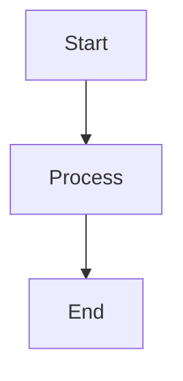

# Mermaid Diagram Processing Scripts - Quick Reference

## 📁 Script Inventory

### PowerShell Scripts (Core)

| Script | Purpose | Key Functions |
|--------|---------|---------------|
| **MermaidProcessor.ps1** | Master orchestrator | `Invoke-MermaidParsing`, `Invoke-NamespaceApplication`, `Invoke-MermaidValidation`, `Invoke-ProcessAll` |
| **MermaidParser.ps1** | Diagram extraction | `Get-MermaidDiagrams`, `Get-MermaidNodes`, `Test-NodeHasNamespace` |
| **MermaidNamespacer.ps1** | Namespace operations | `Apply-MermaidNamespaces`, `Get-NamespacePrefix`, `Remove-MermaidNamespaces` |
| **MermaidValidator.ps1** | Quality validation | `Test-MermaidDiagrams`, `Test-MermaidSyntax` |
| **FileBackupManager.ps1** | Backup management | `New-FileBackup`, `Restore-FileBackup`, `Get-FileBackups`, `Remove-OldBackups` |

### Shell Scripts

| Script | Purpose |
|--------|---------|
| **mermaid-processor.sh** | Bash wrapper for Unix/Linux/macOS |

### Documentation

| File | Purpose |
|------|---------|
| **README.md** | Complete usage guide and examples |
| **EXECUTION-SUMMARY.md** | Deployment summary and results |
| **INDEX.md** | This file - quick navigation |

## 🚀 Common Commands

### Process Diagrams (Full Pipeline)

```powershell
# Windows PowerShell / PowerShell Core
.\MermaidProcessor.ps1 -FilePath "specs\001-workflow-consolidation\spec.md"

# Bash (Linux/macOS/WSL)
./mermaid-processor.sh -f specs/001-workflow-consolidation/spec.md
```

### Validate Only (No Changes)

```powershell
# PowerShell
.\MermaidProcessor.ps1 -FilePath "specs\001-workflow-consolidation\spec.md" -Action Validate

# Bash
./mermaid-processor.sh -f specs/001-workflow-consolidation/spec.md -a Validate
```

### Preview Changes (Dry Run)

```powershell
# PowerShell
.\MermaidProcessor.ps1 -FilePath "specs\001-workflow-consolidation\spec.md" -DryRun

# Bash
./mermaid-processor.sh -f specs/001-workflow-consolidation/spec.md -d
```

### Restore from Backup

```powershell
# PowerShell
.\MermaidProcessor.ps1 -FilePath "specs\001-workflow-consolidation\spec.md" -Action Restore

# Bash
./mermaid-processor.sh -f specs/001-workflow-consolidation/spec.md -a Restore
```

### Parse Only (Extract Metadata)

```powershell
# PowerShell
.\MermaidProcessor.ps1 -FilePath "specs\001-workflow-consolidation\spec.md" -Action Parse
```

### Remove All Diagrams (Clean Slate)

```powershell
# PowerShell - Remove diagrams, keep headers for regeneration
.\MermaidProcessor.ps1 -FilePath "specs\001-workflow-consolidation\spec.md" -Action RemoveDiagrams -PreserveHeaders

# PowerShell - Remove diagrams and headers completely
.\MermaidProcessor.ps1 -FilePath "specs\001-workflow-consolidation\spec.md" -Action RemoveDiagrams

# Bash - Keep headers
./mermaid-processor.sh -f specs/001-workflow-consolidation/spec.md -a RemoveDiagrams -p

# Bash - Remove everything
./mermaid-processor.sh -f specs/001-workflow-consolidation/spec.md -a RemoveDiagrams
```

## 📋 Action Reference

| Action | What It Does | When to Use |
|--------|-------------|-------------|
| `Parse` | Extract diagram metadata | Understanding file structure |
| `ApplyNamespaces` | Add W{US}_{WF}_ prefixes | Converting existing files |
| `Validate` | Check quality rules | Pre-commit checks, CI/CD |
| `ProcessAll` | Parse → Apply → Validate | Initial setup, batch processing |
| `Restore` | Rollback from backup | Undo mistakes |
| `RemoveDiagrams` | Remove all Mermaid diagrams | Clean slate for regeneration |

## 🔍 Troubleshooting Quick Guide

### Problem: Script execution disabled

```powershell
Set-ExecutionPolicy -ExecutionPolicy RemoteSigned -Scope CurrentUser
```

### Problem: Validation fails

```powershell
# Check the log
Get-Content mermaid-processing.log -Tail 50

# Run validation to see specific errors
.\MermaidProcessor.ps1 -FilePath "path\to\spec.md" -Action Validate
```

### Problem: Need to undo changes

```powershell
# Restore from automatic backup
.\MermaidProcessor.ps1 -FilePath "path\to\spec.md" -Action Restore
```

### Problem: Want to see what will change

```powershell
# Use dry run mode
.\MermaidProcessor.ps1 -FilePath "path\to\spec.md" -DryRun
```

## 📐 Namespace Format

**Pattern:** `W{UserStory}_{WorkflowNum}_{NodeName}`

**Examples:**
- `W1_1_Start` - User Story 1, Workflow 1, Start node
- `W2_3_SuccessEnd` - User Story 2, Workflow 3, Success end node
- `W6_4_ErrorEnd` - User Story 6, Workflow 4, Error end node

## ✅ Quality Validation Rules

Scripts check for:

1. **Unique node IDs** within each diagram
2. **Namespace prefixes** on all nodes (multi-diagram files)
3. **Decision branch labels** on decision nodes (`{Question?}` must have `|Label|`)
4. **Unique end node suffixes** (SuccessEnd, ErrorEnd, CancelEnd, not generic `End`)
5. **Syntax correctness** (balanced brackets, valid node IDs)

## 📦 Expected File Format

Markdown files must follow this structure:

```markdown
### Workflow {UserStory}.{WorkflowNum}: {Title}


```

**Rules:**
- Header: `###` + `Workflow X.Y:` + `Title`
- Code block: Triple backticks + `mermaid` (lowercase)
- Flowchart directive: `flowchart TD` or `flowchart LR`

## 🔗 Related Documentation

- [Complete Usage Guide](README.md)
- [Execution Summary](EXECUTION-SUMMARY.md)
- [Mermaid Diagram Instructions](../../../.github/instructions/mermaid-diagrams.instructions.md)

## 🛠️ Advanced Usage

### Batch Process Multiple Files

```powershell
Get-ChildItem -Path "specs" -Recurse -Filter "spec.md" | ForEach-Object {
    .\MermaidProcessor.ps1 -FilePath $_.FullName -Action ProcessAll
}
```

### Clean Old Backups

```powershell
# Import backup manager
. .\FileBackupManager.ps1

# Keep only 5 most recent backups
Remove-OldBackups -FilePath "specs\001-workflow-consolidation\spec.md" -Keep 5
```

### Custom Validation Rules

Edit `MermaidProcessor.ps1` configuration:

```powershell
$Config = @{
    ValidationRules = @{
        RequireUniqueNodeIds = $true
        RequireNamespacePrefix = $true
        RequireDecisionLabels = $false  # Disable this check
        RequireEndNodeSuffixes = $true
    }
}
```

## 📊 Performance Benchmarks

Based on processing `specs/001-workflow-consolidation/spec.md`:

| Metric | Value |
|--------|-------|
| Diagrams processed | 31 |
| Nodes updated | 403 |
| Processing time | <1 second |
| File size increase | 3,965 characters (5%) |
| Validation time | <1 second |
| Backup creation | <100ms |

## 🎯 Integration Examples

### Pre-Commit Hook

```bash
#!/bin/bash
# .git/hooks/pre-commit

for spec in $(git diff --cached --name-only | grep 'specs/.*\.md$'); do
    pwsh -NoProfile -File .specify/scripts/mermaid/MermaidProcessor.ps1 \
        -FilePath "$spec" -Action Validate || exit 1
done
```

### GitHub Actions Workflow

```yaml
# .github/workflows/validate-mermaid.yml
name: Validate Mermaid Diagrams

on:
  pull_request:
    paths: ['specs/**/*.md']

jobs:
  validate:
    runs-on: ubuntu-latest
    steps:
      - uses: actions/checkout@v3
      - name: Validate Diagrams
        run: |
          pwsh -File .specify/scripts/mermaid/MermaidProcessor.ps1 \
            -FilePath "specs/**/*.md" -Action Validate
```

### VS Code Task

```json
// .vscode/tasks.json
{
  "label": "Validate Mermaid Diagrams",
  "type": "shell",
  "command": "pwsh",
  "args": [
    "-File",
    ".specify/scripts/mermaid/MermaidProcessor.ps1",
    "-FilePath",
    "${file}",
    "-Action",
    "Validate"
  ],
  "group": "test"
}
```

## 📞 Support

- **Issues**: Check `mermaid-processing.log` for details
- **Documentation**: See [README.md](README.md)
- **Mermaid Syntax**: See `.github/instructions/mermaid-diagrams.instructions.md`

---

**Last Updated:** 2026-01-24  
**Version:** 1.0.0
