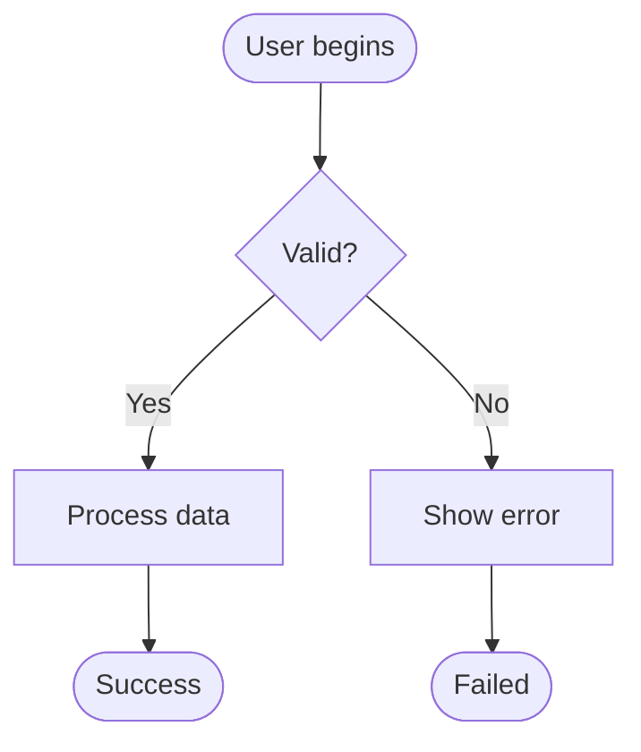

# Mermaid Diagram Processing Scripts

Comprehensive suite of scripts for auto-generating, parsing, processing, validating, and updating Mermaid diagrams in specification files.

## Overview

These scripts implement the Mermaid diagram workflow defined in `.github/instructions/mermaid-diagrams.instructions.md` and the WORKFLOW_DATA format from `.specify/docs/MERMAID_AUTOMATION_IMPLEMENTATION_PLAN.md`.

**Key Features:**
- **Auto-Generation**: Generate Mermaid diagrams from structured WORKFLOW_DATA blocks
- **Namespace Management**: Automatically apply `W{UserStory}_{Workflow}_` prefixes to prevent ID conflicts
- **Validation**: Check diagrams against quality rules and workflow relationships
- **Backup/Restore**: Safe file operations with automatic backup creation

## Scripts

### Master Orchestrator

**`MermaidProcessor.ps1`** - Main entry point that coordinates all operations

### Core Modules

1. **`MermaidGenerator.ps1`** - **NEW** - Generates Mermaid diagrams from WORKFLOW_DATA blocks
2. **`MermaidParser.ps1`** - Extracts Mermaid diagrams from markdown files
3. **`MermaidNamespacer.ps1`** - Applies/removes namespace prefixes to node IDs
4. **`MermaidValidator.ps1`** - Validates diagrams against quality rules
5. **`FileBackupManager.ps1`** - Creates and manages file backups

### Shell Wrapper

**`mermaid-processor.sh`** - Bash wrapper for Unix/Linux compatibility

## Quick Start

### Auto-Generation from WORKFLOW_DATA (NEW)

```powershell
# Generate Mermaid diagrams from WORKFLOW_DATA blocks
# This automatically runs ProcessAll pipeline (namespace + validate)
.\MermaidProcessor.ps1 -FilePath "specs\001-workflow-consolidation\spec.md" -Action Generate

# Preview what would be generated (dry run)
.\MermaidProcessor.ps1 -FilePath "specs\001-workflow-consolidation\spec.md" -Action Generate -DryRun

# Validate workflow relationships only (no generation)
.\MermaidGenerator.ps1 -FilePath "specs\001-workflow-consolidation\spec.md" -Validate
```

### Traditional Processing (Existing Diagrams)

```powershell
# Process all diagrams in a spec file (with automatic backup)
.\MermaidProcessor.ps1 -FilePath "specs\001-workflow-consolidation\spec.md"

# Dry run to preview changes
.\MermaidProcessor.ps1 -FilePath "specs\001-workflow-consolidation\spec.md" -DryRun

# Validate only (no changes)
.\MermaidProcessor.ps1 -FilePath "specs\001-workflow-consolidation\spec.md" -Action Validate

# Restore from backup
.\MermaidProcessor.ps1 -FilePath "specs\001-workflow-consolidation\spec.md" -Action Restore

# Remove all diagrams (preserve headers for regeneration)
.\MermaidProcessor.ps1 -FilePath "specs\001-workflow-consolidation\spec.md" -Action RemoveDiagrams -PreserveHeaders

# Remove all diagrams and headers
.\MermaidProcessor.ps1 -FilePath "specs\001-workflow-consolidation\spec.md" -Action RemoveDiagrams
```

### Bash (Linux/macOS/WSL)

```bash
# Make executable
chmod +x mermaid-processor.sh

# Generate diagrams from WORKFLOW_DATA
./mermaid-processor.sh -f specs/001-workflow-consolidation/spec.md -a Generate

# Process all diagrams
./mermaid-processor.sh -f specs/001-workflow-consolidation/spec.md

# Dry run
./mermaid-processor.sh -f specs/001-workflow-consolidation/spec.md -d

# Validate only
./mermaid-processor.sh -f specs/001-workflow-consolidation/spec.md -a Validate

# Remove all diagrams (preserve headers)
./mermaid-processor.sh -f specs/001-workflow-consolidation/spec.md -a RemoveDiagrams -p

# Remove all diagrams and headers
./mermaid-processor.sh -f specs/001-workflow-consolidation/spec.md -a RemoveDiagrams
```

## Actions

| Action | Description |
|--------|-------------|
| **`Generate`** | **NEW** - Generate Mermaid from WORKFLOW_DATA blocks, then run ProcessAll pipeline |
| `Parse` | Extract and display all Mermaid diagrams with metadata |
| `ApplyNamespaces` | Add namespace prefixes to all node IDs |
| `Validate` | Check diagrams against quality rules |
| `ProcessAll` | **Default** - Parse → Apply → Validate (full pipeline) |
| `Restore` | Restore file from backup |
| `RemoveDiagrams` | Remove all Mermaid diagrams (optionally preserve headers) |

## WORKFLOW_DATA Format (NEW)

Instead of manually creating Mermaid diagrams, use structured WORKFLOW_DATA blocks that MermaidGenerator.ps1 will parse:

### Format Structure

**IMPORTANT**: Wrap the workflow data in HTML comments (`<!--` and `-->`) to hide it from markdown preview while keeping it parseable.

```markdown
<!-- WORKFLOW_START: 1.1 --><!--
WORKFLOW: 1.1
TITLE: Complete 3-Step Guided Workflow
DIRECTION: TD
DEPENDS_ON: NONE
CONFLICTS_WITH: 1.3
INTERACTION: Primary happy path - conflicts with Expert Mode

NODE: Start
TYPE: start
SHAPE: stadium
LABEL: User selects<br/>Guided Mode

NODE: Step1
TYPE: process
SHAPE: rect
LABEL: Step 1: Order & Part Selection

NODE: ValidateStep1
TYPE: decision
SHAPE: diamond
LABEL: Step 1<br/>valid?

NODE: ShowErrors
TYPE: process
SHAPE: rect
LABEL: Show validation errors

NODE: Step2
TYPE: process
SHAPE: rect
LABEL: Step 2: Load Details

NODE: End
TYPE: end
SHAPE: stadium
LABEL: Workflow complete

CONNECTION: Start -> Step1
CONNECTION: Step1 -> ValidateStep1
CONNECTION: ValidateStep1 -> ShowErrors [No]
CONNECTION: ValidateStep1 -> Step2 [Yes]
CONNECTION: ShowErrors -> Step1
CONNECTION: Step2 -> End
--><!-- WORKFLOW_END: 1.1 -->
```

**Why HTML comments?**
- ✅ Hides verbose workflow data from markdown preview
- ✅ Keeps data parseable by MermaidGenerator.ps1
- ✅ Cleaner documentation experience
- ✅ Generator automatically strips comments during parsing

### Field Reference

| Field | Required | Format | Description |
|-------|----------|--------|-------------|
| `WORKFLOW` | ✅ | `{UserStory}.{Workflow}` | Unique ID (e.g., 1.1, 2.3) |
| `TITLE` | ✅ | Text | Workflow description |
| `DIRECTION` | ✅ | TD\|LR\|RL\|BT | Flowchart direction |
| `DEPENDS_ON` | ✅ | IDs or NONE | Prerequisites |
| `CONFLICTS_WITH` | ✅ | IDs or NONE | Mutually exclusive workflows |
| `INTERACTION` | ✅ | Text | Relationship description |
| `NODE` | ✅ | Identifier | Node name (no spaces) |
| `TYPE` | ✅ | start\|process\|decision\|end | Semantic type |
| `SHAPE` | ✅ | stadium\|rect\|diamond\|circle | Mermaid shape |
| `LABEL` | ✅ | Text (supports `<br/>`) | Display text |
| `CONNECTION` | ✅ | `From -> To [Label]` | Flow with optional label |

### Complete Workflow Example

```markdown
## User Story 1 Workflow Data

<!-- WORKFLOW_START: 1.1 -->
WORKFLOW: 1.1
TITLE: Complete 3-Step Guided Workflow
DIRECTION: TD
DEPENDS_ON: NONE
CONFLICTS_WITH: NONE
INTERACTION: Primary workflow path

NODE: Start
TYPE: start
SHAPE: stadium
LABEL: User begins workflow

NODE: End
TYPE: end
SHAPE: stadium
LABEL: Workflow complete

CONNECTION: Start -> End
<!-- WORKFLOW_END: 1.1 -->

## User Story 1 Workflow Diagrams

### Workflow 1.1: Complete 3-Step Guided Workflow

> **Note**: Run `MermaidProcessor.ps1 -Action Generate` to create diagrams from WORKFLOW_DATA blocks.

<!-- Mermaid diagram will be inserted here by MermaidGenerator.ps1 -->
```

### Workflow Relationship Validation

MermaidGenerator.ps1 automatically validates:

- ✅ **DEPENDS_ON** workflows exist
- ✅ **CONFLICTS_WITH** workflows exist and are bidirectional
- ✅ **No circular dependencies** in workflow chains
- ✅ **Node uniqueness** within each workflow

### Generation Pipeline

When you run `-Action Generate`:

1. **MermaidGenerator.ps1** parses WORKFLOW_DATA blocks
2. Generates raw Mermaid syntax with simple node IDs
3. Inserts diagrams into spec.md
4. **MermaidNamespacer.ps1** applies `W{US}_{WF}_` prefixes
5. **MermaidValidator.ps1** validates final syntax
6. Creates backup automatically

**Result:** Perfect, namespaced, validated Mermaid diagrams! ✅

## Expected File Format (Traditional)

For manually created diagrams (legacy support), the scripts expect markdown with this structure:

```markdown
### Workflow {UserStory}.{WorkflowNum}: {Title}

``​`mermaid
flowchart TD
  Start([User begins]) --> Process[Do something]
  Process --> End([Complete])
``​`
```

**Examples:**
- `### Workflow 1.1: Complete 3-Step Guided Workflow`
- `### Workflow 2.3: Copy with Preservation of Existing Data`
- `### Workflow 6.4: Backward Navigation with Validation Errors`

## Namespace Convention

Diagrams are transformed from:



To:


**Format:** `W{UserStory}_{WorkflowNum}_{NodeName}`

## Validation Rules

The validator checks for:

- ✅ **Unique node IDs** within each diagram
- ✅ **Namespace prefixes** on all nodes (when multiple diagrams exist)
- ✅ **Decision branch labels** on all decision nodes
- ✅ **Unique end node suffixes** (SuccessEnd, ErrorEnd, CancelEnd, etc.)
- ✅ **Syntax errors** (mismatched brackets, invalid characters)

## Backup Management

### Automatic Backups

By default, `MermaidProcessor.ps1` creates a backup before making changes:

```
specs/001-workflow-consolidation/spec.md         # Original
specs/001-workflow-consolidation/spec.md.backup  # Auto backup
```

### Manual Backup Operations

```powershell
# Create timestamped backup
$backup = New-FileBackup -FilePath "spec.md" -UseTimestamp
# Creates: spec.md.20260124-143052.backup

# List all backups
Get-FileBackups -FilePath "spec.md"

# Restore from specific backup
Restore-FileBackup -FilePath "spec.md" -BackupPath "spec.md.20260124-143052.backup"

# Clean old backups (keep 5 most recent)
Remove-OldBackups -FilePath "spec.md" -Keep 5
```

## Examples

### Example 1: Process New Specification

```powershell
# Navigate to repository root
cd C:\Users\johnk\source\repos\MTM_Receiving_Application

# Process the spec file
.\.specify\scripts\mermaid\MermaidProcessor.ps1 `
    -FilePath "specs\002-feature-name\spec.md" `
    -Action ProcessAll

# Output:
# [INFO] Creating backup...
# [SUCCESS] Backup created: specs\002-feature-name\spec.md.backup
# [INFO] Step 1/3: Parsing diagrams...
# [SUCCESS] Found 15 Mermaid diagrams
# [INFO] Step 2/3: Applying namespace prefixes...
# [SUCCESS] Successfully applied namespaces to 15 diagrams
# [INFO] Step 3/3: Validating updated diagrams...
# [SUCCESS] All 15 diagrams passed validation
```

### Example 2: Validate Existing Diagrams

```powershell
.\.specify\scripts\mermaid\MermaidProcessor.ps1 `
    -FilePath "specs\001-workflow-consolidation\spec.md" `
    -Action Validate

# Output shows any validation issues:
# [WARNING] 5 of 31 diagrams failed validation
# [ERROR]   - Workflow 2.4: Multiple end nodes with generic 'End' ID
# [ERROR]   - Workflow 6.1: 12 nodes missing namespace prefix
```

### Example 3: Preview Changes (Dry Run)

```powershell
.\.specify\scripts\mermaid\MermaidProcessor.ps1 `
    -FilePath "specs\001-workflow-consolidation\spec.md" `
    -DryRun

# Shows preview of changes without modifying the file
```

### Example 4: Rollback Changes

```powershell
# If something went wrong, restore from backup
.\.specify\scripts\mermaid\MermaidProcessor.ps1 `
    -FilePath "specs\001-workflow-consolidation\spec.md" `
    -Action Restore

# [INFO] Restoring from backup...
# [SUCCESS] File restored from: specs\001-workflow-consolidation\spec.md.backup
```

## Troubleshooting

### Issue: "File not found"

**Solution:** Use absolute paths or ensure you're running from the repository root

```powershell
# From repository root
.\specify\scripts\mermaid\MermaidProcessor.ps1 -FilePath "specs\001-workflow-consolidation\spec.md"

# Or use full path
.\specify\scripts\mermaid\MermaidProcessor.ps1 -FilePath "C:\...\specs\001-workflow-consolidation\spec.md"
```

### Issue: "Cannot be loaded because running scripts is disabled"

**Solution:** Set execution policy

```powershell
Set-ExecutionPolicy -ExecutionPolicy RemoteSigned -Scope CurrentUser
```

### Issue: Validation fails after applying namespaces

**Solution:** Check the log file for details

```powershell
Get-Content .\.specify\scripts\mermaid\mermaid-processing.log -Tail 50
```

### Issue: Need to revert changes

**Solution:** Use the Restore action

```powershell
.\MermaidProcessor.ps1 -FilePath "specs\001-workflow-consolidation\spec.md" -Action Restore
```

## Integration with Development Workflow

### Pre-Commit Hook

Add to `.git/hooks/pre-commit`:

```bash
#!/bin/bash
# Validate Mermaid diagrams before commit

changed_specs=$(git diff --cached --name-only | grep 'specs/.*\.md$')

if [ -n "$changed_specs" ]; then
    echo "Validating Mermaid diagrams..."
    for spec in $changed_specs; do
        pwsh -NoProfile -ExecutionPolicy Bypass \
            -File .specify/scripts/mermaid/MermaidProcessor.ps1 \
            -FilePath "$spec" \
            -Action Validate
        
        if [ $? -ne 0 ]; then
            echo "Mermaid validation failed for $spec"
            exit 1
        fi
    done
fi
```

### CI/CD Pipeline

```yaml
# .github/workflows/validate-diagrams.yml
name: Validate Mermaid Diagrams

on:
  pull_request:
    paths:
      - 'specs/**/*.md'

jobs:
  validate:
    runs-on: ubuntu-latest
    steps:
      - uses: actions/checkout@v3
      
      - name: Install PowerShell
        run: |
          sudo apt-get update
          sudo apt-get install -y powershell
      
      - name: Validate Diagrams
        run: |
          pwsh -NoProfile -ExecutionPolicy Bypass \
            -File .specify/scripts/mermaid/MermaidProcessor.ps1 \
            -FilePath "specs/**/*.md" \
            -Action Validate
```

## Advanced Usage

### Batch Processing Multiple Files

```powershell
# Process all spec files in specs directory
Get-ChildItem -Path "specs" -Recurse -Filter "spec.md" | ForEach-Object {
    Write-Host "Processing $($_.FullName)..." -ForegroundColor Cyan
    .\specify\scripts\mermaid\MermaidProcessor.ps1 `
        -FilePath $_.FullName `
        -Action ProcessAll
}
```

### Custom Validation Rules

```powershell
# Modify validation rules in MermaidProcessor.ps1
$Config = @{
    ValidationRules = @{
        RequireUniqueNodeIds = $true
        RequireNamespacePrefix = $true
        RequireDecisionLabels = $false  # Disable this check
        RequireEndNodeSuffixes = $true
    }
}
```

## Logging

All operations are logged to `.specify/scripts/mermaid/mermaid-processing.log`:

```
[2026-01-24 14:30:15] [Info] Parsing Mermaid diagrams from: specs/001-workflow-consolidation/spec.md
[2026-01-24 14:30:15] [Success] Found 31 Mermaid diagrams
[2026-01-24 14:30:16] [Info] Applying namespace prefixes to diagrams in: specs/001-workflow-consolidation/spec.md
[2026-01-24 14:30:16] [Success] Successfully applied namespaces to 31 diagrams
[2026-01-24 14:30:17] [Info] Validating Mermaid diagrams in: specs/001-workflow-consolidation/spec.md
[2026-01-24 14:30:17] [Success] All 31 diagrams passed validation
```

## Contributing

When adding new validation rules or features:

1. Update the appropriate module (Parser, Namespacer, Validator)
2. Add tests for the new functionality
3. Update this README with examples
4. Update `.github/instructions/mermaid-diagrams.instructions.md` if the convention changes

## License

Part of the MTM Receiving Application project.

---

**Last Updated:** 2026-01-24  
**Version:** 1.0.0
