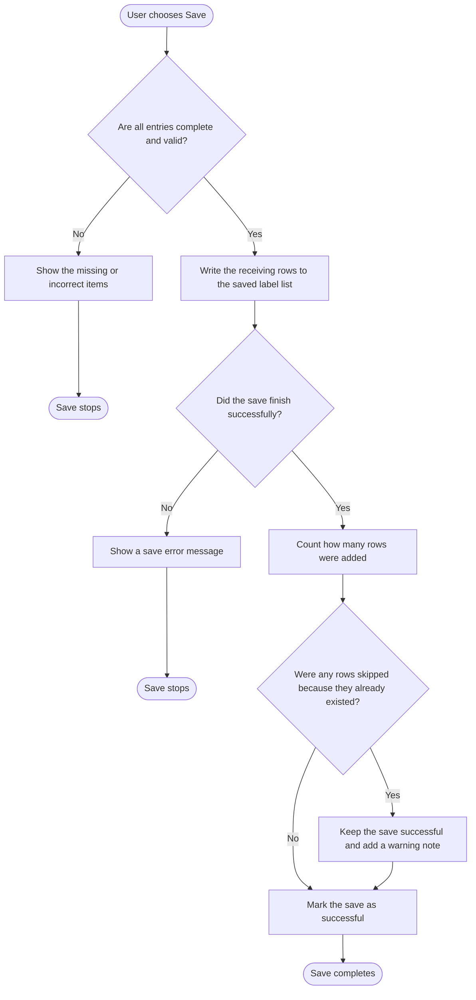
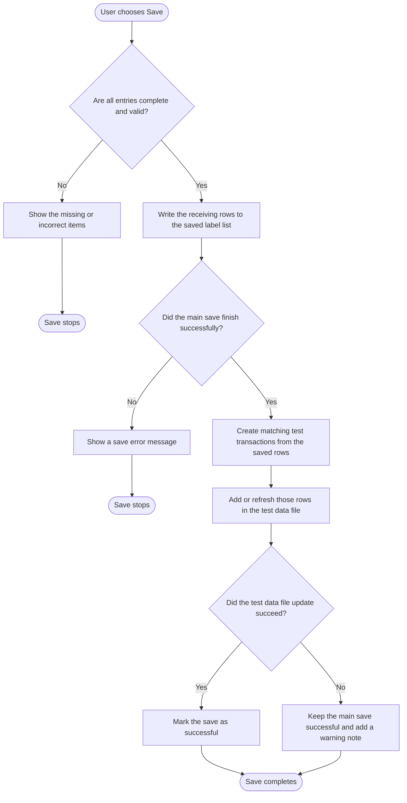

```mermaid
flowchart TD
  Start([User chooses Save]) --> Validate{Are all entries complete and valid?}
  Validate -->|No| ShowValidation[Show the missing or incorrect items]
  ShowValidation --> ValidationEnd([Save stops])

  Validate -->|Yes| SaveRows[Write the receiving rows to the saved label list]
  SaveRows --> SaveWorked{Did the save finish successfully?}

  SaveWorked -->|No| ShowSaveError[Show a save error message]
  ShowSaveError --> SaveFailEnd([Save stops])

  SaveWorked -->|Yes| CountRows[Count how many rows were added]
  CountRows --> WarnIfSkipped{Were any rows skipped because they already existed?}

  WarnIfSkipped -->|Yes| ShowWarning[Keep the save successful and add a warning note]
  WarnIfSkipped -->|No| MarkSuccess[Mark the save as successful]
  ShowWarning --> MarkSuccess

  MarkSuccess --> FinalSuccess([Save completes])
```

```mermaid
flowchart TD
  Start([User chooses Save]) --> Validate{Are all entries complete and valid?}
  Validate -->|No| ShowValidation[Show the missing or incorrect items]
  ShowValidation --> ValidationEnd([Save stops])

  Validate -->|Yes| SaveRows[Write the receiving rows to the saved label list]
  SaveRows --> SaveWorked{Did the main save finish successfully?}

  SaveWorked -->|No| ShowSaveError[Show a save error message]
  ShowSaveError --> SaveFailEnd([Save stops])

  SaveWorked -->|Yes| BuildTestRows[Create matching test transactions from the saved rows]
  BuildTestRows --> WriteTestRows[Add or refresh those rows in the test data file]
  WriteTestRows --> TestWriteWorked{Did the test data file update succeed?}

  TestWriteWorked -->|Yes| MarkSuccess[Mark the save as successful]
  TestWriteWorked -->|No| KeepSaveAndWarn[Keep the main save successful and add a warning note]

  MarkSuccess --> FinalSuccess([Save completes])
  KeepSaveAndWarn --> FinalSuccess
```
