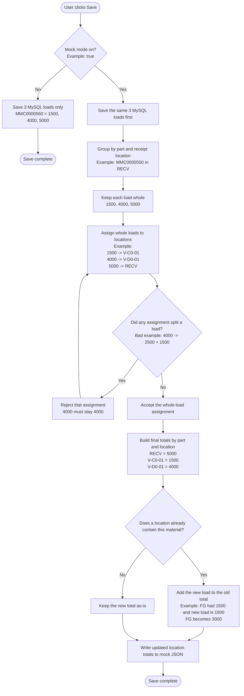
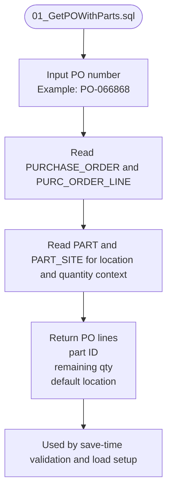
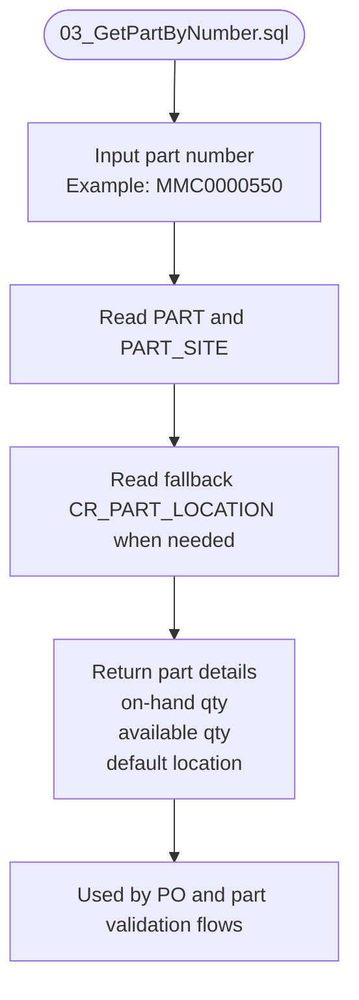
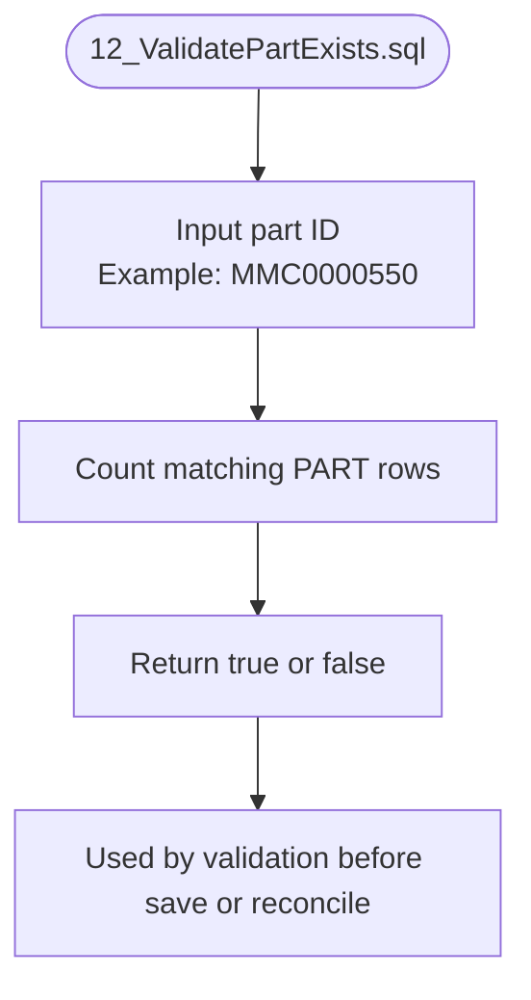
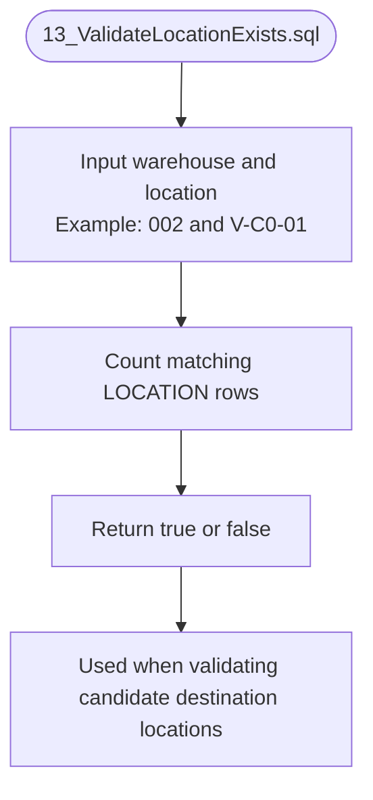
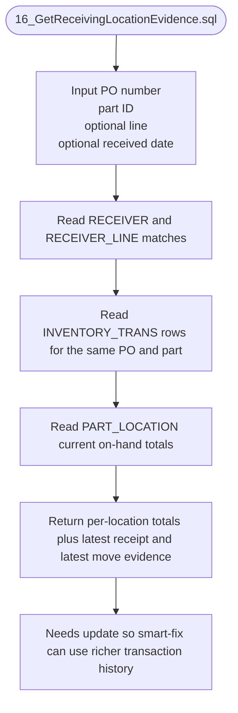
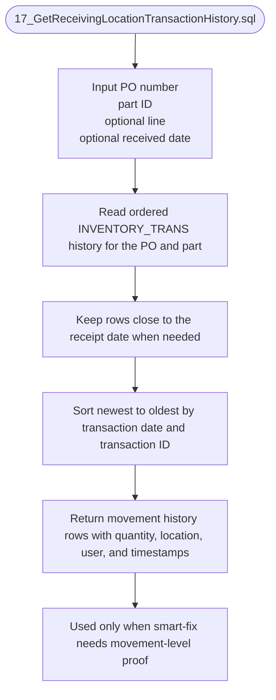
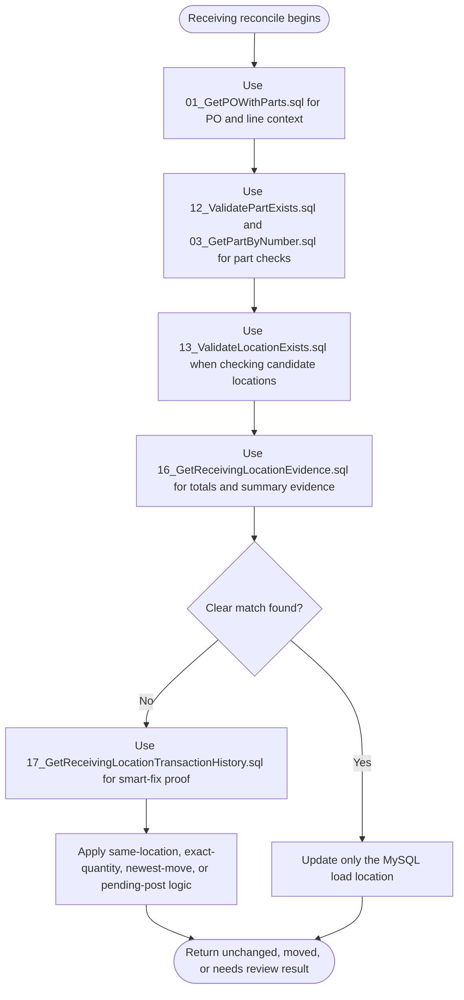

# Receiving Save and Reconcile Working Note

Last Updated: 2026-04-05

## Why This File Exists

This file is the working handoff note for the next coding task.

It explains:

- what Save should do
- what Reconcile should do
- how mock data should behave
- how smart-fix logic should work
- when the app should tell the user that MySQL may be ahead of Infor Visual because the PO receipt has not posted yet

## Fixed Example Data For This Work

### MySQL Saved Loads

- Coil Name: `MMC0000550`
- Load #1: `1500`
- Load #2: `4000`
- Load #3: `5000`

### Infor Visual Totals

- `RECV = 5000`
- `V-C0-01 = 1500`
- `V-D0-01 = 4000`

## Rules That Must Stay True

1. MySQL keeps separate load rows.
2. Infor Visual shows total quantity by material and location.
3. Reconcile must never combine MySQL loads.
4. Reconcile may only change a load's location.
5. Reconcile must never change a load's quantity.
6. Mock-mode Save may randomize destinations, but it must move whole loads only.
7. If a location already contains the same material, new quantity must be added to the existing location total.
8. If MySQL quantity is ahead of Visual quantity, the app should warn the user when the evidence strongly suggests the PO has not posted into Visual yet.

## Save Flow

## Reconcile Flow

```mermaid
flowchart TD
  W2_ReconStart([User clicks Reconcile]) --> W2_CheckMock{Mock mode on?}

  W2_CheckMock -->|No| W2_ReadVisual[Read real Infor Visual totals<br/>RECV = 5000<br/>V-C0-01 = 1500<br/>V-D0-01 = 4000]
  W2_CheckMock -->|Yes| W2_ReadMock[Read mock JSON totals<br/>RECV = 5000<br/>V-C0-01 = 1500<br/>V-D0-01 = 4000]

  W2_ReadVisual --> W2_MatchReal[Match each saved MySQL load against aggregated location totals]
  W2_ReadMock --> W2_MatchMock[Match each saved MySQL load against aggregated location totals]

  W2_MatchReal --> W2_RealRule[Only change the load location<br/>Never merge MySQL rows<br/>Never change 1500, 4000, or 5000]
  W2_MatchMock --> W2_MockRule[Only change the load location<br/>Never merge MySQL rows<br/>Never change 1500, 4000, or 5000]

  W2_RealRule --> W2_Real1500{Does 1500 already fit V-C0-01?}
  W2_Real1500 -->|Yes| W2_Keep1500Real[Keep 1500 in V-C0-01<br/>Mark unchanged]
  W2_Real1500 -->|No| W2_Move1500Real[Move 1500 to the best matching location]

  W2_Keep1500Real --> W2_Real4000{Does 4000 already fit V-D0-01?}
  W2_Move1500Real --> W2_Real4000
  W2_Real4000 -->|Yes| W2_Keep4000Real[Keep 4000 in V-D0-01<br/>Mark unchanged]
  W2_Real4000 -->|No| W2_Move4000Real[Move 4000 to the best matching location]

  W2_Keep4000Real --> W2_Real5000{Does 5000 already fit RECV?}
  W2_Move4000Real --> W2_Real5000
  W2_Real5000 -->|Yes| W2_Keep5000Real[Keep 5000 in RECV<br/>Mark unchanged]
  W2_Real5000 -->|No| W2_Move5000Real[Move 5000 to the best matching location]

  W2_MockRule --> W2_Mock1500{Does 1500 already fit V-C0-01?}
  W2_Mock1500 -->|Yes| W2_Keep1500Mock[Keep 1500 in V-C0-01<br/>Mark unchanged]
  W2_Mock1500 -->|No| W2_Move1500Mock[Move 1500 to the best matching location]

  W2_Keep1500Mock --> W2_Mock4000{Does 4000 already fit V-D0-01?}
  W2_Move1500Mock --> W2_Mock4000
  W2_Mock4000 -->|Yes| W2_Keep4000Mock[Keep 4000 in V-D0-01<br/>Mark unchanged]
  W2_Mock4000 -->|No| W2_Move4000Mock[Move 4000 to the best matching location]

  W2_Keep4000Mock --> W2_Mock5000{Does 5000 already fit RECV?}
  W2_Move4000Mock --> W2_Mock5000
  W2_Mock5000 -->|Yes| W2_Keep5000Mock[Keep 5000 in RECV<br/>Mark unchanged]
  W2_Mock5000 -->|No| W2_Move5000Mock[Move 5000 to the best matching location]

  W2_Move5000Real --> W2_AheadCheck{Does MySQL total look larger than Visual total?}
  W2_Keep5000Real --> W2_AheadCheck
  W2_Move5000Mock --> W2_AmbiguousCheck{Any ambiguity left?}
  W2_Keep5000Mock --> W2_AmbiguousCheck

  W2_AheadCheck -->|No| W2_RealDone[Show unchanged, moved, or not found]
  W2_AheadCheck -->|Yes| W2_ProvePending{Can the app prove the PO likely has not posted into Visual yet?}
  W2_ProvePending -->|Yes| W2_ShowPending[Show warning to user<br/>MTM has more than Visual right now<br/>The PO receipt may not be posted yet]
  W2_ProvePending -->|No| W2_RealDone
  W2_ShowPending --> W2_RealDone

  W2_AmbiguousCheck -->|No| W2_MockDone[Show unchanged or moved only]
  W2_AmbiguousCheck -->|Yes| W2_TryFix[Try smart-fix rules]
  W2_TryFix --> W2_SameSpot{Does one choice already match the saved location and quantity?<br/>Example: 1500 already in V-C0-01}
  W2_SameSpot -->|Yes| W2_KeepSame[Keep that load where it is<br/>Mark unchanged]
  W2_SameSpot -->|No| W2_ExactQty{Does only one choice have the exact load quantity?<br/>Example: only V-D0-01 fits 4000}
  W2_ExactQty -->|Yes| W2_UseExact[Use that exact quantity match]
  W2_ExactQty -->|No| W2_NewestMove{Does only one choice have the newest move date?}
  W2_NewestMove -->|Yes| W2_UseNewest[Use the newest clear match]
  W2_NewestMove -->|No| W2_ReviewNote[Leave the load unchanged<br/>Add review note for user]

  W2_KeepSame --> W2_MockDone
  W2_UseExact --> W2_MockDone
  W2_UseNewest --> W2_MockDone
  W2_ReviewNote --> W2_MockDone

  W2_RealDone --> W2_ReconEnd([Reconcile complete])
  W2_MockDone --> W2_ReconEnd
```

## Smart-Fix Scenarios

### Scenario 1: Same Location and Quantity Already Fit

Saved MySQL load:

- `MMC0000550`
- quantity `1500`
- location `V-C0-01`

Aggregated totals:

- `V-C0-01 = 1500`
- `V-D0-01 = 4000`
- `RECV = 5000`

Fix:

- keep the `1500` load in `V-C0-01`
- mark it unchanged
- do not move anything

### Scenario 2: Exact Quantity Gives One Clear Match

Saved MySQL load:

- `MMC0000550`
- quantity `4000`
- location `RECV`

Aggregated totals:

- `V-C0-01 = 1500`
- `V-D0-01 = 4000`
- `RECV = 5000`

Fix:

- only `V-D0-01` exactly fits `4000`
- move that single MySQL load to `V-D0-01`
- keep the quantity at `4000`

### Scenario 3: Newest Move Date Breaks the Tie

Saved MySQL load:

- `MMC0000550`
- quantity `1500`
- location `RECV`

Possible matches:

- location A fits `1500`
- location B also fits `1500`

Evidence:

- location A moved today at `10:30 AM`
- location B moved yesterday at `3:00 PM`

Fix:

- choose location A because it has newer movement evidence

### Scenario 4: No Clear Winner

Saved MySQL load:

- `MMC0000550`
- quantity `1500`
- location `RECV`

Possible matches:

- two locations both fit `1500`
- neither is the current saved location
- neither has better timing evidence

Fix:

- do not guess
- do not move the load
- add a review note for the user

## When MySQL Looks Larger Than Infor Visual

This may mean MTM already saved the loads, but the PO has not been received into Infor Visual yet.

### Example

MySQL total:

- `1500 + 4000 + 5000 = 10500`

Visual total right now:

- `RECV = 5000`
- `V-C0-01 = 1500`
- `V-D0-01 = 0`
- Visual total = `6500`

Difference:

- `10500 - 6500 = 4000`

### User Message

If the app can prove this is likely a pending Visual receipt, show something like this:

> MTM has saved more quantity than Infor Visual currently shows for this PO and part. This may mean the PO receipt has not posted into Infor Visual yet. Please verify the receipt status before treating this as a location mismatch.

### Good Proof Signals

- the missing amount equals one or more full saved loads
- the extra loads are still sitting in the receipt-side location such as `RECV`
- the PO and part exist in Visual, but the totals are still short
- there is no newer Visual move evidence that explains the difference

## Next Coding Task After This File Is Accepted

1. Keep MySQL loads separate during reconciliation.
2. Use or add a runtime mock JSON store that keeps aggregated part-by-location totals.
3. In mock mode, update that JSON store during Save by adding quantity into existing location totals.
4. During Reconcile, compare each MySQL load against aggregated totals without merging rows.
5. Treat a load as unchanged when its current location and quantity already fit the totals.
6. Add smart-fix order: same location and quantity, then exact quantity, then newest move date, then review note.
7. Show a user warning when MySQL appears ahead of Visual and the evidence suggests the PO has not posted into Visual yet.

## Infor Visual Scripts Needed For This Feature

This section maps the feature to actual Infor Visual SQL files in `Database/InforVisualScripts/Queries/`.

### Existing Script: 01_GetPOWithParts.sql

Purpose:

- validate that the PO exists
- get the PO lines for the saved material
- get ordered, received, and remaining quantities
- get a default location hint for initial receiving

Status:

- existing
- useful as-is
- not the main reconcile script

### Existing Script: 03_GetPartByNumber.sql

Purpose:

- validate that the part exists
- return on-hand and available quantities
- provide default location context when needed

Status:

- existing
- useful as-is
- support script, not the main reconcile script

### Existing Script: 12_ValidatePartExists.sql

Purpose:

- quick exact-match check that a part exists

Status:

- existing
- useful as-is

### Existing Script: 13_ValidateLocationExists.sql

Purpose:

- quick exact-match check that a location exists in a warehouse

Status:

- existing
- useful as-is

### Existing Script Needing Update: 16_GetReceivingLocationEvidence.sql

Purpose today:

- return current inventory locations for a part
- return per-location PO transaction summaries
- return the latest receipt and latest transaction evidence

Why it needs updating:

- the smart-fix logic now depends on movement history, not just final location totals
- the app needs stronger evidence when choosing between multiple valid locations
- the app also needs evidence to detect when MySQL is ahead because the PO may not have posted yet

Likely update goals:

- keep current inventory totals by location
- keep latest receipt evidence
- keep latest PO transaction summary by location
- add enough transaction-history detail to support tie-breaking and pending-post detection

### Newly Needed Script: 17_GetReceivingLocationTransactionHistory.sql

Purpose:

- return ordered transaction-history rows for one PO and part
- help smart-fix choose the most likely movement path when more than one location can fit a saved load
- help prove that MySQL may be ahead of Visual because a receipt has not posted yet

Why a new script is helpful:

- keeps `16_GetReceivingLocationEvidence.sql` focused on totals and summary evidence
- gives reconciliation a second, detailed source only when ambiguity remains
- makes the smart-fix branch easier to reason about and test

Suggested output:

- transaction date
- transaction ID
- warehouse ID
- location ID
- quantity moved
- user ID
- PO number
- PO line number
- part ID
- transaction direction or type if available

## How The Scripts Fit Together

