# Dunnage Feature Specification V2

**Status**: Ready for Implementation  
**Last Updated**: December 26, 2025  
**Purpose**: Complete specification for the Dunnage receiving workflow feature

---

## Table of Contents
1. [Overview](#1-overview)
2. [Database Architecture](#2-database-architecture)
3. [Models](#3-models)
4. [Data Access Layer (DAOs)](#4-data-access-layer-daos)
5. [Services](#5-services)
6. [ViewModels](#6-viewmodels)
7. [Views (XAML)](#7-views-xaml)
8. [UI/UX Features](#8-uiux-features)
9. [Settings Integration](#9-settings-integration)
10. [Open Questions](#10-open-questions)
11. [Implementation Checklist](#11-implementation-checklist)

---

## 1. Overview

The Dunnage feature allows users to receive and track dunnage items (pallets, crates, containers, etc.) with a flexible Type/Part/Specs architecture. This replaces the legacy `label_table_dunnage` Google Sheets structure.

### Key Requirements
- ✅ Type-based dunnage classification
- ✅ Dynamic specification system (JSON-based)
- ✅ Inventory tracking notifications for Visual ERP integration
- ✅ Three workflow modes: Wizard, Manual Entry, Edit Mode
- ✅ CSV export for LabelView label printing
- ✅ Admin management via Settings menu
- ✅ **NO legacy support** - clean slate implementation

### Architecture Pattern
- **MVVM**: Strict separation using CommunityToolkit.Mvvm
- **DI**: All services registered in `App.xaml.cs`
- **DAO Pattern**: Static classes returning `Model_Dao_Result<T>`
- **Stored Procedures**: All MySQL operations via stored procedures

---

## 2. Database Architecture

### 2.1 Migration Strategy

#### Clean Slate Approach
- **DROP** `label_table_dunnage` table completely
- **NO data migration** - all historical data removed permanently
- **NO archive table** - no dual-table logic
- **REMOVE** `label_table_dunnage` from `Database/Schemas/01_create_receiving_tables.sql`

#### Pre-Migration Tasks
1. **Optional Backup**: Manually export `label_table_dunnage` to CSV if historical reference needed
2. **Schema Cleanup**: Remove table definition from `01_create_receiving_tables.sql`
3. **Code Verification**: Ensure no existing code references `label_table_dunnage`

#### Migration Script
File: `Database/Schemas/06_create_dunnage_tables.sql`

### 2.2 Table Definitions

#### Table 1: dunnage_types (Metadata)
Stores dunnage type classifications.

```sql
CREATE TABLE dunnage_types (
    ID INT AUTO_INCREMENT PRIMARY KEY,
    DunnageType VARCHAR(100) NOT NULL UNIQUE,
    EntryDate DATETIME DEFAULT CURRENT_TIMESTAMP,
    EntryUser VARCHAR(100),
    AlterDate DATETIME NULL,
    AlterUser VARCHAR(100) NULL,
    INDEX idx_type (DunnageType)
) ENGINE=InnoDB DEFAULT CHARSET=utf8mb4 COLLATE=utf8mb4_unicode_ci;
```

**Seed Data**:
- Pallet
- Crate
- Box
- Skid
- Foam
- Shrink Wrap
- Bubble Wrap
- Gaylord
- Foldable Crate
- Wooden Crate
- Plastic Totes

#### Table 2: dunnage_specs (Metadata)
Stores the specification schema (JSON) for each type.

```sql
CREATE TABLE dunnage_specs (
    ID INT AUTO_INCREMENT PRIMARY KEY,
    DunnageTypeID INT NOT NULL,
    DunnageSpecs JSON NOT NULL COMMENT 'Schema definition: {"Width": "number", "Height": "number"}',
    SpecAlterDate DATETIME DEFAULT CURRENT_TIMESTAMP ON UPDATE CURRENT_TIMESTAMP,
    SpecAlterUser VARCHAR(100),
    FOREIGN KEY (DunnageTypeID) REFERENCES dunnage_types(ID) ON DELETE CASCADE,
    INDEX idx_type (DunnageTypeID)
) ENGINE=InnoDB DEFAULT CHARSET=utf8mb4 COLLATE=utf8mb4_unicode_ci;
```

**Default Specs** (for all types):
```json
{
    "Width": "number",
    "Height": "number", 
    "Depth": "number",
    "IsInventoriedToVisual": "boolean"
}
```

**Note**: Additional specs can be added per type via Admin UI (e.g., "Color": "text", "Material": "text").

#### Table 3: dunnage_part_numbers (Master Data)
Stores actual dunnage part IDs with their specific spec values.

```sql
CREATE TABLE dunnage_part_numbers (
    ID INT AUTO_INCREMENT PRIMARY KEY,
    PartID VARCHAR(100) NOT NULL UNIQUE,
    DunnageTypeID INT NOT NULL,
    DunnageSpecValues JSON NOT NULL COMMENT 'Actual values: {"Width": 48, "Height": 40}',
    EntryDate DATETIME DEFAULT CURRENT_TIMESTAMP,
    EntryUser VARCHAR(100),
    FOREIGN KEY (DunnageTypeID) REFERENCES dunnage_types(ID) ON DELETE RESTRICT,
    INDEX idx_partid (PartID),
    INDEX idx_type (DunnageTypeID)
) ENGINE=InnoDB DEFAULT CHARSET=utf8mb4 COLLATE=utf8mb4_unicode_ci;
```

**Example Record**:
```json
{
    "PartID": "PALLET-48X40",
    "DunnageTypeID": 1,
    "DunnageSpecValues": {
        "Width": 48,
        "Height": 40,
        "Depth": 6,
        "IsInventoriedToVisual": true
    }
}
```

#### Table 4: dunnage_loads (Transaction Table)
Stores received dunnage transactions. **Replaces `label_table_dunnage`**.

```sql
CREATE TABLE dunnage_loads (
    ID CHAR(36) PRIMARY KEY COMMENT 'UUID',
    PartID VARCHAR(100) NOT NULL,
    DunnageTypeID INT NOT NULL,
    Quantity INT NOT NULL CHECK (Quantity > 0),
    PONumber VARCHAR(50) NULL,
    ReceivedDate DATETIME DEFAULT CURRENT_TIMESTAMP,
    UserId VARCHAR(100) NOT NULL,
    Location VARCHAR(50) NULL,
    LabelNumber INT DEFAULT 1,
    IsDeleted BOOLEAN DEFAULT FALSE,
    CreatedAt TIMESTAMP DEFAULT CURRENT_TIMESTAMP,
    FOREIGN KEY (PartID) REFERENCES dunnage_part_numbers(PartID) ON DELETE RESTRICT,
    FOREIGN KEY (DunnageTypeID) REFERENCES dunnage_types(ID) ON DELETE RESTRICT,
    INDEX idx_partid (PartID),
    INDEX idx_receiveddate (ReceivedDate),
    INDEX idx_ponumber (PONumber),
    INDEX idx_userid (UserId)
) ENGINE=InnoDB DEFAULT CHARSET=utf8mb4 COLLATE=utf8mb4_unicode_ci;
```

#### Table 5: inventoried_dunnage_list (Reference/Configuration)
Master list of parts requiring Infor Visual inventory management. **Manually managed by admins**.

```sql
CREATE TABLE inventoried_dunnage_list (
    ID INT AUTO_INCREMENT PRIMARY KEY,
    PartID VARCHAR(100) NOT NULL UNIQUE,
    RequiresInventory BOOLEAN DEFAULT TRUE,
    InventoryMethod VARCHAR(50) COMMENT 'Adjusted In, Received via PO, Both',
    Notes TEXT NULL,
    DateAdded DATETIME DEFAULT CURRENT_TIMESTAMP,
    AddedBy VARCHAR(100),
    FOREIGN KEY (PartID) REFERENCES dunnage_part_numbers(PartID) ON DELETE CASCADE,
    INDEX idx_partid (PartID)
) ENGINE=InnoDB DEFAULT CHARSET=utf8mb4 COLLATE=utf8mb4_unicode_ci;
```

**Purpose**:
- Lookup table for real-time validation during data entry
- When user enters a PartID, check this table
- If exists, display notification: "⚠️ This part requires inventory in Visual. Method: [Adjusted In / Received via PO]"
- NOT auto-populated when saving loads
- Managed via Settings > Dunnage Management

---

## 3. Models

All models inherit from `ObservableObject` (CommunityToolkit.Mvvm) and use `[ObservableProperty]` attributes.

### 3.1 Model_DunnageType
File: `Models/Receiving/Model_DunnageType.cs`

```csharp
using CommunityToolkit.Mvvm.ComponentModel;
using System;

namespace MTM_Receiving_Application.Models.Receiving;

public partial class Model_DunnageType : ObservableObject
{
    [ObservableProperty] private int _id;
    [ObservableProperty] private string _dunnageType = string.Empty;
    [ObservableProperty] private DateTime _entryDate = DateTime.Now;
    [ObservableProperty] private string _entryUser = string.Empty;
    [ObservableProperty] private DateTime? _alterDate;
    [ObservableProperty] private string? _alterUser;
}
```

### 3.2 Model_DunnageSpec
File: `Models/Receiving/Model_DunnageSpec.cs`

```csharp
using CommunityToolkit.Mvvm.ComponentModel;
using System;
using System.Collections.Generic;

namespace MTM_Receiving_Application.Models.Receiving;

public partial class Model_DunnageSpec : ObservableObject
{
    [ObservableProperty] private int _id;
    [ObservableProperty] private int _dunnageTypeID;
    [ObservableProperty] private string _dunnageSpecs = string.Empty; // JSON string
    [ObservableProperty] private DateTime _specAlterDate = DateTime.Now;
    [ObservableProperty] private string _specAlterUser = string.Empty;
    
    // Deserialized for UI binding
    [ObservableProperty] private Dictionary<string, string> _specsDefinition = new();
}
```

### 3.3 Model_DunnagePart
File: `Models/Receiving/Model_DunnagePart.cs`

```csharp
using CommunityToolkit.Mvvm.ComponentModel;
using System;
using System.Collections.Generic;

namespace MTM_Receiving_Application.Models.Receiving;

public partial class Model_DunnagePart : ObservableObject
{
    [ObservableProperty] private int _id;
    [ObservableProperty] private string _partID = string.Empty;
    [ObservableProperty] private int _dunnageTypeID;
    [ObservableProperty] private string _dunnageSpecValues = string.Empty; // JSON string
    [ObservableProperty] private DateTime _entryDate = DateTime.Now;
    [ObservableProperty] private string _entryUser = string.Empty;
    
    // Deserialized for UI binding
    [ObservableProperty] private Dictionary<string, object> _specValues = new();
    
    // Navigation properties
    [ObservableProperty] private string _dunnageTypeName = string.Empty;
}
```

### 3.4 Model_DunnageLoad
File: `Models/Receiving/Model_DunnageLoad.cs`

```csharp
using CommunityToolkit.Mvvm.ComponentModel;
using System;

namespace MTM_Receiving_Application.Models.Receiving;

public partial class Model_DunnageLoad : ObservableObject
{
    [ObservableProperty] private Guid _id = Guid.NewGuid();
    [ObservableProperty] private string _partID = string.Empty;
    [ObservableProperty] private int _dunnageTypeID;
    [ObservableProperty] private int _quantity;
    [ObservableProperty] private string? _poNumber;
    [ObservableProperty] private DateTime _receivedDate = DateTime.Now;
    [ObservableProperty] private string _userId = string.Empty;
    [ObservableProperty] private string? _location;
    [ObservableProperty] private int _labelNumber = 1;
    [ObservableProperty] private bool _isDeleted;
    [ObservableProperty] private DateTime _createdAt = DateTime.Now;
    
    // Navigation/Display properties
    [ObservableProperty] private string _dunnageTypeName = string.Empty;
    [ObservableProperty] private bool _isSelected;
}
```

### 3.5 Model_InventoriedDunnage
File: `Models/Receiving/Model_InventoriedDunnage.cs`

```csharp
using CommunityToolkit.Mvvm.ComponentModel;
using System;

namespace MTM_Receiving_Application.Models.Receiving;

public partial class Model_InventoriedDunnage : ObservableObject
{
    [ObservableProperty] private int _id;
    [ObservableProperty] private string _partID = string.Empty;
    [ObservableProperty] private bool _requiresInventory = true;
    [ObservableProperty] private string _inventoryMethod = string.Empty; // "Adjusted In", "Received via PO", "Both"
    [ObservableProperty] private string? _notes;
    [ObservableProperty] private DateTime _dateAdded = DateTime.Now;
    [ObservableProperty] private string _addedBy = string.Empty;
}
```

### 3.6 Model_DunnageSession
File: `Models/Receiving/Model_DunnageSession.cs`

```csharp
using CommunityToolkit.Mvvm.ComponentModel;
using System.Collections.ObjectModel;

namespace MTM_Receiving_Application.Models.Receiving;

public partial class Model_DunnageSession : ObservableObject
{
    [ObservableProperty] private int? _selectedTypeID;
    [ObservableProperty] private string _selectedTypeName = string.Empty;
    [ObservableProperty] private Model_DunnagePart? _selectedPart;
    [ObservableProperty] private int _quantity = 1;
    [ObservableProperty] private string? _poNumber;
    [ObservableProperty] private string? _location;
    [ObservableProperty] private ObservableCollection<Model_DunnageLoad> _loads = new();
    
    public bool HasLoads => Loads.Count > 0;
}
```

---

## 4. Data Access Layer (DAOs)

All DAOs are **static classes** returning `Model_Dao_Result` or `Model_Dao_Result<T>`. Use stored procedures for ALL operations.

### 4.1 Dao_DunnageType
File: `Data/Receiving/Dao_DunnageType.cs`

**Methods**:
- `Task<Model_Dao_Result<List<Model_DunnageType>>> GetAllTypesAsync()`
- `Task<Model_Dao_Result<Model_DunnageType>> GetTypeByIdAsync(int id)`
- `Task<Model_Dao_Result> InsertTypeAsync(Model_DunnageType type)`
- `Task<Model_Dao_Result> UpdateTypeAsync(Model_DunnageType type)`
- `Task<Model_Dao_Result> DeleteTypeAsync(int id)`
- `Task<int> GetPartCountByTypeAsync(int typeId)` - Impact analysis
- `Task<int> GetTransactionCountByTypeAsync(int typeId)` - Impact analysis

**Stored Procedures**:
- `sp_dunnage_types_get_all`
- `sp_dunnage_types_get_by_id`
- `sp_dunnage_types_insert`
- `sp_dunnage_types_update`
- `sp_dunnage_types_delete`
- `sp_dunnage_types_count_parts` - Count parts using this type
- `sp_dunnage_types_count_transactions` - Count transaction records using this type

### 4.2 Dao_DunnageSpec
File: `Data/Receiving/Dao_DunnageSpec.cs`

**Methods**:
- `Task<Model_Dao_Result<Model_DunnageSpec>> GetSpecsByTypeIdAsync(int typeId)`
- `Task<Model_Dao_Result<List<Model_DunnageSpec>>> GetAllSpecsAsync()` - For CSV column union
- `Task<Model_Dao_Result> InsertSpecAsync(Model_DunnageSpec spec)`
- `Task<Model_Dao_Result> UpdateSpecAsync(Model_DunnageSpec spec)`
- `Task<Model_Dao_Result> DeleteSpecAsync(int specId)`
- `Task<Model_Dao_Result> DeleteSpecsByTypeIdAsync(int typeId)` - Delete all specs for a type
- `Task<int> GetPartCountUsingSpecAsync(int typeId, string specKey)` - Impact analysis

**Stored Procedures**:
- `sp_dunnage_specs_get_by_type`
- `sp_dunnage_specs_get_all`
- `sp_dunnage_specs_insert`
- `sp_dunnage_specs_update`
- `sp_dunnage_specs_delete` - Delete by spec ID
- `sp_dunnage_specs_delete_by_type` - Delete all specs for a type
- `sp_dunnage_specs_count_parts_using_spec` - Count parts affected by spec deletion

### 4.3 Dao_DunnagePart
File: `Data/Receiving/Dao_DunnagePart.cs`

**Methods**:
- `Task<Model_Dao_Result<List<Model_DunnagePart>>> GetAllPartsAsync()`
- `Task<Model_Dao_Result<List<Model_DunnagePart>>> GetPartsByTypeIdAsync(int typeId)`
- `Task<Model_Dao_Result<Model_DunnagePart>> GetPartByIdAsync(string partId)`
- `Task<Model_Dao_Result> InsertPartAsync(Model_DunnagePart part)`
- `Task<Model_Dao_Result> UpdatePartAsync(Model_DunnagePart part)`
- `Task<Model_Dao_Result> DeletePartAsync(string partId)`
- `Task<int> GetTransactionCountByPartAsync(string partId)` - Impact analysis
- `Task<Model_Dao_Result<List<Model_DunnagePart>>> SearchPartsAsync(string searchText, int? typeId)` - Filtered search

**Stored Procedures**:
- `sp_dunnage_parts_get_all`
- `sp_dunnage_parts_get_by_type`
- `sp_dunnage_parts_get_by_id`
- `sp_dunnage_parts_insert`
- `sp_dunnage_parts_update`
- `sp_dunnage_parts_delete`
- `sp_dunnage_parts_count_transactions` - Count transaction records using this part
- `sp_dunnage_parts_search` - Search with optional type filter

### 4.4 Dao_DunnageLoad
File: `Data/Receiving/Dao_DunnageLoad.cs`

**Methods**:
- `Task<Model_Dao_Result<List<Model_DunnageLoad>>> GetAllLoadsAsync()`
- `Task<Model_Dao_Result<List<Model_DunnageLoad>>> GetLoadsByDateRangeAsync(DateTime start, DateTime end)`
- `Task<Model_Dao_Result> InsertLoadAsync(Model_DunnageLoad load)`
- `Task<Model_Dao_Result> InsertLoadsAsync(List<Model_DunnageLoad> loads)`
- `Task<Model_Dao_Result> UpdateLoadAsync(Model_DunnageLoad load)`
- `Task<Model_Dao_Result> SoftDeleteLoadAsync(Guid id)`

**Stored Procedures**:
- `sp_dunnage_loads_get_all`
- `sp_dunnage_loads_get_by_date_range`
- `sp_dunnage_loads_insert`
- `sp_dunnage_loads_insert_batch`
- `sp_dunnage_loads_update`
- `sp_dunnage_loads_soft_delete`

### 4.5 Dao_InventoriedDunnage
File: `Data/Receiving/Dao_InventoriedDunnage.cs`

**Methods**:
- `Task<Model_Dao_Result<List<Model_InventoriedDunnage>>> GetAllInventoriedPartsAsync()`
- `Task<Model_Dao_Result<bool>> CheckIfInventoriedAsync(string partId)`
- `Task<Model_Dao_Result<Model_InventoriedDunnage>> GetInventoriedPartAsync(string partId)`
- `Task<Model_Dao_Result> InsertInventoriedPartAsync(Model_InventoriedDunnage item)`
- `Task<Model_Dao_Result> UpdateInventoriedPartAsync(Model_InventoriedDunnage item)`
- `Task<Model_Dao_Result> DeleteInventoriedPartAsync(string partId)`

**Stored Procedures**:
- `sp_inventoried_dunnage_get_all`
- `sp_inventoried_dunnage_check`
- `sp_inventoried_dunnage_get_by_part`
- `sp_inventoried_dunnage_insert`
- `sp_inventoried_dunnage_update`
- `sp_inventoried_dunnage_delete`

---

## 5. Services

### 5.1 IService_DunnageWorkflow / Service_DunnageWorkflow
File: `Services/Receiving/Service_DunnageWorkflow.cs`

**Purpose**: State machine orchestration for Dunnage workflow (similar to `Service_ReceivingWorkflow`).

**Properties**:
```csharp
WorkflowStep CurrentStep { get; }
Model_DunnageSession CurrentSession { get; }
string? CurrentDunnageType { get; set; }
Model_DunnagePart? CurrentPart { get; set; }
int Quantity { get; set; }
```

**Methods**:
```csharp
Task<bool> StartWorkflowAsync();
Task<WorkflowStepResult> AdvanceToNextStepAsync();
void GoToStep(WorkflowStep step);
Task<SaveResult> SaveSessionAsync();
void ClearSession();
```

**Events**:
```csharp
event EventHandler StepChanged;
event EventHandler<string> StatusMessageRaised;
```

### 5.2 IService_MySQL_Dunnage / Service_MySQL_Dunnage
File: `Services/Database/Service_MySQL_Dunnage.cs`

**Purpose**: Wraps DAO operations with business logic and error handling.

**Methods**:
```csharp
// Type Operations
Task<Model_Dao_Result<List<Model_DunnageType>>> GetAllTypesAsync();
Task<Model_Dao_Result<Model_DunnageType>> GetTypeByIdAsync(int typeId);
Task<Model_Dao_Result> InsertTypeAsync(Model_DunnageType type);
Task<Model_Dao_Result> UpdateTypeAsync(Model_DunnageType type);
Task<Model_Dao_Result> DeleteTypeAsync(int typeId);

// Spec Operations
Task<Model_Dao_Result<Model_DunnageSpec>> GetSpecsForTypeAsync(int typeId);
Task<Model_Dao_Result> InsertSpecAsync(Model_DunnageSpec spec);
Task<Model_Dao_Result> UpdateSpecAsync(Model_DunnageSpec spec);
Task<Model_Dao_Result> DeleteSpecAsync(int specId);
Task<Model_Dao_Result> DeleteSpecsByTypeIdAsync(int typeId);
Task<List<string>> GetAllSpecKeysAsync(); // Union of all spec keys for CSV

// Part Operations
Task<Model_Dao_Result<List<Model_DunnagePart>>> GetAllPartsAsync();
Task<Model_Dao_Result<List<Model_DunnagePart>>> GetPartsByTypeAsync(int typeId);
Task<Model_Dao_Result<Model_DunnagePart>> GetPartByIdAsync(string partId);
Task<Model_Dao_Result> InsertPartAsync(Model_DunnagePart part);
Task<Model_Dao_Result> UpdatePartAsync(Model_DunnagePart part);
Task<Model_Dao_Result> DeletePartAsync(string partId);

// Load Operations
Task<Model_Dao_Result> SaveLoadsAsync(List<Model_DunnageLoad> loads);
Task<Model_Dao_Result<List<Model_DunnageLoad>>> GetLoadsByDateRangeAsync(DateTime start, DateTime end);

// Inventory Operations
Task<bool> IsPartInventoriedAsync(string partId);
Task<Model_Dao_Result<Model_InventoriedDunnage>> GetInventoryDetailsAsync(string partId);
Task<Model_Dao_Result<List<Model_InventoriedDunnage>>> GetAllInventoriedPartsAsync();
Task<Model_Dao_Result> AddToInventoriedListAsync(Model_InventoriedDunnage item);
Task<Model_Dao_Result> UpdateInventoriedEntryAsync(Model_InventoriedDunnage item);
Task<Model_Dao_Result> RemoveFromInventoriedListAsync(string partId);

// Impact Analysis
Task<int> GetPartCountByTypeIdAsync(int typeId);
Task<int> GetTransactionCountByPartIdAsync(string partId);
Task<int> GetTransactionCountByTypeIdAsync(int typeId);
```

### 5.3 IService_DunnageCSVWriter / Service_DunnageCSVWriter
File: `Services/Receiving/Service_DunnageCSVWriter.cs`

**Purpose**: CSV export for LabelView label printing.

**File Paths**:
- Local: `%APPDATA%\MTM_Receiving_Application\DunnageData.csv`
- Network: `\\mtmanu-fs01\Expo Drive\Receiving\MTM Receiving Application\User CSV Files\{Username}\DunnageData.csv`

**CSV Columns** (Union of all specs):
- `DunnageType`
- `PartID`
- `Quantity`
- `PONumber`
- `ReceivedDate`
- `Employee`
- Dynamic spec columns: `Width`, `Height`, `Depth`, `IsInventoriedToVisual`, etc.

**Methods**:
```csharp
Task<CSVWriteResult> WriteToCSVAsync(List<Model_DunnageLoad> loads);
Task<List<string>> GetAllSpecKeysAsync(); // Union of all possible specs from DB
```

**Logic**:
1. Query all `dunnage_specs` to get union of spec keys
2. Create CSV header with fixed columns + all spec keys
3. For each load, populate spec values from `dunnage_part_numbers.DunnageSpecValues`
4. Leave cells blank if spec not applicable to that part

---

## 6. ViewModels

All ViewModels inherit from `BaseViewModel` and are `partial` classes.

### 6.1 DunnageWorkflowViewModel (Orchestrator)
File: `ViewModels/Dunnage/Dunnage_WorkflowViewModel.cs`

**Purpose**: Main orchestrator, manages step visibility and navigation (similar to `ReceivingWorkflowViewModel`).

**Properties**:
```csharp
[ObservableProperty] private bool _isModeSelectionVisible;
[ObservableProperty] private bool _isTypeSelectionVisible;
[ObservableProperty] private bool _isPartSelectionVisible;
[ObservableProperty] private bool _isQuantityEntryVisible;
[ObservableProperty] private bool _isDetailsEntryVisible;
[ObservableProperty] private bool _isReviewVisible;
[ObservableProperty] private bool _isManualEntryVisible;
[ObservableProperty] private bool _isEditModeVisible;
```

**Injected Services**:
- `IService_DunnageWorkflow`
- `IService_ErrorHandler`
- `ILoggingService`

### 6.2 Step ViewModels

#### 6.2.1 DunnageModeSelectionViewModel
File: `ViewModels/Dunnage/Dunnage_ModeSelectionViewModel.cs`

**Purpose**: Choose Wizard/Manual/Edit mode (C.1)

**Properties**:
```csharp
[ObservableProperty] private string _wizardDescription = "Step-by-step guided entry\nType → Part → Quantity → Details → Review";
[ObservableProperty] private string _manualDescription = "Grid-based batch entry\nFill multiple rows in a data grid";
[ObservableProperty] private string _editDescription = "Review & Edit\nView and modify history records\nSearch and filter";
```

**Commands**:
```csharp
[RelayCommand] private void SelectWizardMode();
[RelayCommand] private void SelectManualMode();
[RelayCommand] private void SelectEditMode();
```

#### 6.2.2 DunnageTypeSelectionViewModel
File: `ViewModels/Dunnage/Dunnage_TypeSelectionViewModel.cs`

**Purpose**: Select Type with dynamic button grid (C.2)

**Properties**:
```csharp
[ObservableProperty] private ObservableCollection<Model_DunnageType> _allTypes = new();
[ObservableProperty] private ObservableCollection<Model_DunnageType> _displayedTypes = new();
[ObservableProperty] private Model_DunnageType? _selectedType;
[ObservableProperty] private int _currentPage = 1;
[ObservableProperty] private int _totalPages = 1;
[ObservableProperty] private int _typesPerPage = 9; // 3x3 grid
```

**Commands**:
```csharp
[RelayCommand] private async Task LoadTypesAsync();
[RelayCommand] private void SelectType(Model_DunnageType type);
[RelayCommand] private void NextPage();
[RelayCommand] private void PreviousPage();
[RelayCommand] private void ShowAddNewType();
[RelayCommand] private void GoBack();
```

**Logic**:
- Load all types from database
- Calculate total pages (ceiling of total / 9)
- Display 9 types per page in button grid
- Update displayed types when page changes

#### 6.2.3 DunnagePartSelectionViewModel
File: `ViewModels/Dunnage/Dunnage_PartSelectionViewModel.cs`

**Purpose**: Select Part ID, check inventory status (C.3)

**Properties**:
```csharp
[ObservableProperty] private ObservableCollection<Model_DunnagePart> _availableParts = new();
[ObservableProperty] private Model_DunnagePart? _selectedPart;
[ObservableProperty] private string _partId = string.Empty;
[ObservableProperty] private bool _isPartInventoried;
[ObservableProperty] private string _inventoryMethod = string.Empty;
[ObservableProperty] private string _inventoryNotificationMessage = string.Empty;
```

**Commands**:
```csharp
[RelayCommand] private async Task LoadPartsForTypeAsync();
[RelayCommand] private async Task SelectPartAsync(Model_DunnagePart part);
[RelayCommand] private async Task CheckInventoryStatusAsync();
[RelayCommand] private void ShowAddNewPart();
[RelayCommand] private void GoBack();
[RelayCommand] private void GoNext();
```

**Logic**:
- When type selected, load all parts for that type
- When part selected, check if in inventoried list
- If inventoried, display notification (method determined by PO in next step)

#### 6.2.4 DunnageQuantityEntryViewModel
File: `ViewModels/Dunnage/Dunnage_QuantityEntryViewModel.cs`

**Purpose**: Enter quantity (C.4)

**Properties**:
```csharp
[ObservableProperty] private int _quantity = 1;
[ObservableProperty] private string _partDisplayName = string.Empty;
[ObservableProperty] private string _typeDisplayName = string.Empty;
```

**Commands**:
```csharp
[RelayCommand] private void GoBack();
[RelayCommand] private void GoNext();
```

#### 6.2.5 DunnageDetailsEntryViewModel
File: `ViewModels/Dunnage/Dunnage_DetailsEntryViewModel.cs`

**Purpose**: PO Number, Location, Dynamic Specs (C.5)

**Properties**:
```csharp
[ObservableProperty] private string? _poNumber;
[ObservableProperty] private string? _location;
[ObservableProperty] private Dictionary<string, object> _specValues = new();
[ObservableProperty] private Dictionary<string, string> _specDefinitions = new(); // Key -> DataType
[ObservableProperty] private bool _isPartInventoried;
[ObservableProperty] private string _inventoryMethod = string.Empty;
[ObservableProperty] private string _inventoryNotificationMessage = string.Empty;
```

**Commands**:
```csharp
[RelayCommand] private async Task LoadSpecsForPartAsync();
[RelayCommand] private void GoBack();
[RelayCommand] private void GoNext();
```

**Logic**:
- Load spec definitions from selected part's type
- Generate UI controls based on data types
- Update inventory method when PO changes
- Validate spec values before proceeding

**Partial Methods**:
```csharp
partial void OnPoNumberChanged(string? value)
{
    UpdateInventoryMethod();
}

private void UpdateInventoryMethod()
{
    if (IsPartInventoried)
    {
        InventoryMethod = string.IsNullOrWhiteSpace(PoNumber) 
            ? "Adjust In" 
            : "Receive In";
        InventoryNotificationMessage = $"⚠️ This part requires inventory in Visual. Method: {InventoryMethod}";
    }
}
```

#### 6.2.6 DunnageReviewViewModel
File: `ViewModels/Dunnage/Dunnage_ReviewViewModel.cs`

**Purpose**: Review and save (C.6)

**Properties**:
```csharp
[ObservableProperty] private ObservableCollection<Model_DunnageLoad> _loads = new();
[ObservableProperty] private bool _canAddAnother = true;
```

**Commands**:
```csharp
[RelayCommand] private void AddAnother();
[RelayCommand] private async Task SaveAllAsync();
[RelayCommand] private void Cancel();
```

### 6.3 Mode ViewModels

#### 6.3.1 DunnageManualEntryViewModel
File: `ViewModels/Dunnage/Dunnage_ManualEntryViewModel.cs`

**Purpose**: DataGrid-based manual entry (C.7)

**Properties**:
```csharp
[ObservableProperty] private ObservableCollection<Model_DunnageLoad> _loads = new();
[ObservableProperty] private Model_DunnageLoad? _selectedLoad;
[ObservableProperty] private int _nextLoadNumber = 1;
```

**Commands**:
```csharp
[RelayCommand] private void AddRow();
[RelayCommand] private async Task AddMultipleRowsAsync(); // Shows dialog
[RelayCommand] private void RemoveRow();
[RelayCommand] private async Task AutoFillAsync(); // Auto-fill from last entry for this Part ID
[RelayCommand] private async Task SaveAsync();
[RelayCommand] private void ReturnToModeSelection();
```

**Logic**:
- Add Row: Creates new empty Model_DunnageLoad with auto-incremented LoadNumber
- Add Multiple: Dialog to specify count, creates N empty rows
- Remove Row: Removes selected row
- Auto-Fill: Finds last entry for selected Part ID, copies values (Heat/Lot, Pkg Type, etc.)
- Save: Validates all rows, saves to database, exports to CSV

**Injected Services**:
- `IService_MySQL_Dunnage`
- `IService_DunnageCSVWriter`
- `IService_ErrorHandler`
- `ILoggingService`

#### 6.3.2 DunnageEditModeViewModel
File: `ViewModels/Dunnage/Dunnage_EditModeViewModel.cs`

**Purpose**: History view with date grouping, filtering, pagination (C.8)

**Properties**:
```csharp
[ObservableProperty] private ObservableCollection<Model_DunnageLoad> _loads = new();
[ObservableProperty] private ObservableCollection<Model_DunnageLoad> _allLoads = new();
[ObservableProperty] private Model_DunnageLoad? _selectedLoad;
[ObservableProperty] private DateTimeOffset? _filterStartDate;
[ObservableProperty] private DateTimeOffset? _filterEndDate;
[ObservableProperty] private string _thisMonthButtonText = string.Empty;
[ObservableProperty] private string _thisQuarterButtonText = string.Empty;
[ObservableProperty] private int _currentPage = 1;
[ObservableProperty] private int _totalPages = 1;
[ObservableProperty] private int _gotoPageNumber = 1;
[ObservableProperty] private int _itemsPerPage = 50;
```

**Commands**:
```csharp
// Data Loading
[RelayCommand] private async Task LoadFromCurrentMemoryAsync();
[RelayCommand] private async Task LoadFromCurrentLabelsAsync();
[RelayCommand] private async Task LoadFromHistoryAsync();

// Edit Actions
[RelayCommand] private void SelectAll();
[RelayCommand] private void RemoveRow();

// Date Filters
[RelayCommand] private void SetFilterLastWeek();
[RelayCommand] private void SetFilterToday();
[RelayCommand] private void SetFilterThisWeek();
[RelayCommand] private void SetFilterThisMonth();
[RelayCommand] private void SetFilterThisQuarter();
[RelayCommand] private void SetFilterShowAll();

// Pagination
[RelayCommand] private void FirstPage();
[RelayCommand] private void PreviousPage();
[RelayCommand] private void NextPage();
[RelayCommand] private void LastPage();
[RelayCommand] private void GoToPage();

// Save
[RelayCommand] private async Task SaveChangesAsync();
[RelayCommand] private void ReturnToModeSelection();
```

**Logic**:
- Matches Receiving_EditModeView.xaml pattern from Receiving
- Load Data From options: Current Memory (unsaved), Current Labels (CSV), History (database)
- Date filters apply to Loads collection with pagination
- Checkbox column for multi-select
- Save updates modified records

**Injected Services**:
- `IService_MySQL_Dunnage`
- `IService_DunnageCSVWriter`
- `IService_ErrorHandler`
- `ILoggingService`

### 6.4 Admin ViewModels

#### 6.4.1 DunnageAdminMainViewModel
File: `ViewModels/Receiving/Admin/DunnageAdminMainViewModel.cs`

**Purpose**: Main navigation hub for dunnage management (C.9)

**Properties**:
```csharp
[ObservableProperty] private bool _isMainNavigationVisible = true;
[ObservableProperty] private bool _isManageTypesVisible;
[ObservableProperty] private bool _isManageSpecsVisible;
[ObservableProperty] private bool _isManagePartsVisible;
[ObservableProperty] private bool _isInventoriedListVisible;
```

**Commands**:
```csharp
[RelayCommand] private void NavigateToManageTypes();
[RelayCommand] private void NavigateToManageSpecs();
[RelayCommand] private void NavigateToManageParts();
[RelayCommand] private void NavigateToInventoriedList();
[RelayCommand] private void ReturnToMainNavigation();
```

#### 6.4.2 DunnageAdminTypesViewModel
File: `ViewModels/Receiving/Admin/DunnageAdminTypesViewModel.cs`

**Purpose**: Manage dunnage types (C.9a, C.10, C.12, C.13)

**Properties**:
```csharp
[ObservableProperty] private ObservableCollection<Model_DunnageType> _types = new();
[ObservableProperty] private Model_DunnageType? _selectedType;
[ObservableProperty] private bool _isAddTypeVisible;
[ObservableProperty] private bool _isEditTypeVisible;
[ObservableProperty] private bool _isDeleteConfirmationVisible;
[ObservableProperty] private string _deleteConfirmationText = string.Empty;
[ObservableProperty] private string _newTypeName = string.Empty;
```

**Commands**:
```csharp
[RelayCommand] private async Task LoadTypesAsync();
[RelayCommand] private void ShowAddType();
[RelayCommand] private void ShowEditType(Model_DunnageType type);
[RelayCommand] private void ShowDeleteConfirmation(Model_DunnageType type);
[RelayCommand] private async Task SaveNewTypeAsync();
[RelayCommand] private async Task SaveTypeChangesAsync();
[RelayCommand] private async Task DeleteTypeAsync();
[RelayCommand] private void CancelOperation();
```

**Injected Services**:
- `IService_MySQL_Dunnage`
- `IService_ErrorHandler`
- `ILoggingService`

#### 6.4.3 DunnageAdminSpecsViewModel
File: `ViewModels/Receiving/Admin/DunnageAdminSpecsViewModel.cs`

**Purpose**: Manage specs per type (C.9b, C.14, C.15, C.16)

**Properties**:
```csharp
[ObservableProperty] private ObservableCollection<Model_DunnageType> _types = new();
[ObservableProperty] private Model_DunnageType? _selectedType;
[ObservableProperty] private Model_DunnageSpec? _currentSpec;
[ObservableProperty] private Dictionary<string, string> _specFields = new();
[ObservableProperty] private string _selectedSpecKey = string.Empty;
[ObservableProperty] private bool _isAddSpecVisible;
[ObservableProperty] private bool _isEditSpecVisible;
[ObservableProperty] private bool _isDeleteConfirmationVisible;
[ObservableProperty] private string _newSpecKey = string.Empty;
[ObservableProperty] private string _newSpecDataType = "number";
[ObservableProperty] private bool _newSpecRequired;
[ObservableProperty] private string _newSpecDefaultValue = string.Empty;
```

**Commands**:
```csharp
[RelayCommand] private async Task LoadSpecsForTypeAsync();
[RelayCommand] private void ShowAddSpec();
[RelayCommand] private void ShowEditSpec(string specKey);
[RelayCommand] private void ShowDeleteConfirmation(string specKey);
[RelayCommand] private async Task SaveNewSpecAsync();
[RelayCommand] private async Task SaveSpecChangesAsync();
[RelayCommand] private async Task DeleteSpecAsync();
[RelayCommand] private async Task DeleteAllSpecsForTypeAsync();
```

#### 6.4.4 DunnageAdminPartsViewModel
File: `ViewModels/Receiving/Admin/DunnageAdminPartsViewModel.cs`

**Purpose**: Manage dunnage parts (C.9c, C.11, C.17, C.18)

**Properties**:
```csharp
[ObservableProperty] private ObservableCollection<Model_DunnagePart> _parts = new();
[ObservableProperty] private ObservableCollection<Model_DunnageType> _types = new();
[ObservableProperty] private Model_DunnagePart? _selectedPart;
[ObservableProperty] private int? _filterTypeId;
[ObservableProperty] private string _searchText = string.Empty;
[ObservableProperty] private bool _isAddPartVisible;
[ObservableProperty] private bool _isEditPartVisible;
[ObservableProperty] private bool _isDeleteConfirmationVisible;
[ObservableProperty] private string _deleteConfirmationText = string.Empty;
[ObservableProperty] private int _currentPage = 1;
[ObservableProperty] private int _totalPages = 1;
[ObservableProperty] private int _itemsPerPage = 20;
```

**Commands**:
```csharp
[RelayCommand] private async Task LoadPartsAsync();
[RelayCommand] private void ShowAddPart();
[RelayCommand] private void ShowEditPart(Model_DunnagePart part);
[RelayCommand] private void ShowDeleteConfirmation(Model_DunnagePart part);
[RelayCommand] private async Task SaveNewPartAsync();
[RelayCommand] private async Task SavePartChangesAsync();
[RelayCommand] private async Task DeletePartAsync();
[RelayCommand] private async Task FilterByTypeAsync();
[RelayCommand] private async Task SearchPartsAsync();
[RelayCommand] private async Task NextPageAsync();
[RelayCommand] private async Task PreviousPageAsync();
```

#### 6.4.5 DunnageAdminInventoriedViewModel
File: `ViewModels/Receiving/Admin/DunnageAdminInventoriedViewModel.cs`

**Purpose**: Manage inventoried parts list (C.9d, C.19, C.20)

**Properties**:
```csharp
[ObservableProperty] private ObservableCollection<Model_InventoriedDunnage> _inventoriedParts = new();
[ObservableProperty] private Model_InventoriedDunnage? _selectedInventoriedPart;
[ObservableProperty] private bool _isAddToListVisible;
[ObservableProperty] private bool _isEditEntryVisible;
[ObservableProperty] private bool _isRemoveConfirmationVisible;
[ObservableProperty] private string _selectedPartId = string.Empty;
[ObservableProperty] private string _inventoryMethod = "Adjust In";
[ObservableProperty] private string _notes = string.Empty;
```

**Commands**:
```csharp
[RelayCommand] private async Task LoadInventoriedPartsAsync();
[RelayCommand] private void ShowAddToList();
[RelayCommand] private void ShowEditEntry(Model_InventoriedDunnage entry);
[RelayCommand] private void ShowRemoveConfirmation(Model_InventoriedDunnage entry);
[RelayCommand] private async Task AddPartToListAsync();
[RelayCommand] private async Task SaveEntryChangesAsync();
[RelayCommand] private async Task RemoveFromListAsync();
```

---

## 7. Views (XAML)

All Views use `x:Bind` (compile-time binding). Standard window size: 1400x900.

### 7.1 Main Container
- `DunnageLabelPage.xaml` - Main container with step visibility bindings

### 7.2 Wizard Steps
- `DunnageModeSelectionView.xaml`
- `DunnageTypeSelectionView.xaml` - **Dynamic button grid, 9 per page with pagination**
- `DunnagePartSelectionView.xaml` - **Dropdown with inventory notification**
- `DunnageQuantityEntryView.xaml`
- `DunnageDetailsEntryView.xaml` - **Dynamic spec inputs generated from JSON, PO-based method display**
- `DunnageReviewView.xaml`

### 7.3 Mode Views
- `DunnageManualEntryView.xaml` - **Matches ManualEntryView.xaml pattern** - DataGrid with toolbar (Add Row, Add Multiple, Remove Row, Auto-Fill)
- `DunnageEditModeView.xaml` - **Matches EditModeView.xaml pattern** - History DataGrid with Load Data toolbar, date filters, pagination

### 7.4 Admin Views

#### 7.4.1 Main Navigation
- `DunnageAdminMainView.xaml` - Main navigation hub with 4 cards (C.9)

#### 7.4.2 Type Management Views
- `DunnageAdminTypesView.xaml` - Type list with toolbar (C.9a)
- `DunnageAddTypeView.xaml` - 3-step add type form (C.10)
- `DunnageEditTypeView.xaml` - Edit type dialog (C.12)
- `DunnageDeleteTypeConfirmationDialog.xaml` - Delete confirmation with impact analysis (C.13)

#### 7.4.3 Spec Management Views
- `DunnageAdminSpecsView.xaml` - Spec management for selected type (C.9b)
- `DunnageAddSpecFieldView.xaml` - Add spec field dialog (C.16)
- `DunnageEditSpecFieldView.xaml` - Edit spec field dialog (C.14)
- `DunnageDeleteSpecConfirmationDialog.xaml` - Delete spec confirmation (C.15)

#### 7.4.4 Part Management Views
- `DunnageAdminPartsView.xaml` - Part list with filter/search/pagination (C.9c)
- `DunnageAddPartView.xaml` - 3-step add part form (C.11)
- `DunnageEditPartView.xaml` - Edit part dialog (C.17)
- `DunnageDeletePartConfirmationDialog.xaml` - Delete confirmation (C.18)

#### 7.4.5 Inventoried Parts Management Views
- `DunnageAdminInventoriedView.xaml` - Inventoried parts list (C.9d)
- `DunnageEditInventoriedEntryView.xaml` - Edit inventory entry dialog (C.19)
- `DunnageRemoveInventoriedConfirmationDialog.xaml` - Remove confirmation (C.20)

---

## 8. UI/UX Features

### 8.1 Dynamic Spec Entry
**Location**: `DunnageDetailsEntryView.xaml`

**Logic**:
1. When Type is selected, load `dunnage_specs` for that Type
2. Parse JSON to get spec keys and data types
3. Generate UI controls:
   - `TextBox` for "number" or "text" types
   - `CheckBox` for "boolean" types
   - `NumberBox` for numeric input with validation
4. Bind to `Model_DunnageSession.SelectedPart.SpecValues`

### 8.2 Inventory Notification
**Location**: `DunnagePartSelectionView.xaml`, `DunnageManualEntryView.xaml`, `DunnageDetailsEntryView.xaml`

**Logic**:
1. When user enters/selects PartID, call `IService_MySQL_Dunnage.IsPartInventoriedAsync(partId)`
2. If `true`, retrieve details with `GetInventoryDetailsAsync(partId)`
3. Check if user has entered a PO Number:
   - **If PO Number exists**: Method = "Receive In"
   - **If PO Number is blank/null**: Method = "Adjust In"
4. Display `InfoBar` with severity `Informational`:
   ```xml
   <InfoBar IsOpen="True" 
            Severity="Informational"
            Title="Inventory Required"
            Message="⚠️ This part requires inventory in Visual. Method: {MethodName}" />
   ```
   Where `{MethodName}` is bound to a ViewModel property that returns "Receive In" or "Adjust In" based on PO presence.

**ViewModel Implementation**:
```csharp
[ObservableProperty] private string? _poNumber;
[ObservableProperty] private bool _isPartInventoried;
[ObservableProperty] private string _inventoryMethod = string.Empty;

partial void OnPoNumberChanged(string? value)
{
    UpdateInventoryMethod();
}

private void UpdateInventoryMethod()
{
    if (IsPartInventoried)
    {
        InventoryMethod = string.IsNullOrWhiteSpace(PoNumber) 
            ? "Adjust In" 
            : "Receive In";
    }
}
```

**UI Binding**:
```xml
<InfoBar IsOpen="{x:Bind ViewModel.IsPartInventoried, Mode=OneWay}" 
         Severity="Informational"
         Title="Inventory Required"
         Message="{x:Bind ViewModel.InventoryNotificationMessage, Mode=OneWay}" />
```

Where `InventoryNotificationMessage` returns: `$"⚠️ This part requires inventory in Visual. Method: {InventoryMethod}"`

### 8.3 History Grouping
**Location**: `DunnageEditModeView.xaml`

**Logic**:
- DataGrid with `AlternatingRowBackground` based on `ReceivedDate`
- Custom `IValueConverter` to alternate colors when date changes
- Add column/icon for parts in `inventoried_dunnage_list`

### 8.4 Quick Add Buttons
**Location**: `DunnageTypeSelectionView.xaml`, `DunnagePartSelectionView.xaml`

**UI**:
```xml
<StackPanel Orientation="Horizontal" Spacing="8">
    <ComboBox ItemsSource="{x:Bind ViewModel.Types}" ... />
    <Button Content="+" 
            ToolTipService.ToolTip="Add New Type"
            Command="{x:Bind ViewModel.ShowQuickAddTypeDialogCommand}" />
</StackPanel>
```

**Logic**:
- Opens `ContentDialog` with input form
- On save, inserts via DAO and refreshes dropdown
- Does NOT navigate away from current workflow step

---

## 9. Settings Integration

### 9.1 MainWindow Navigation
- Settings accessed via `NavigationView` Settings button (already `IsSettingsVisible="True"`)
- Navigate to `Views/Shared/SettingsPage.xaml`
- Add "Dunnage Management" section to Settings page

### 9.2 Settings Page Structure
```
SettingsPage.xaml
├── General Settings
├── User Preferences
└── Dunnage Management (Expander)
    └── [Launch Dunnage Admin] Button
```

**Navigation Flow**:
1. User clicks Settings in MainWindow NavigationView
2. SettingsPage opens
3. User clicks "Launch Dunnage Admin" button
4. Opens `DunnageAdminMainView.xaml` as ContentDialog or new window
5. User navigates through admin sub-views (Types, Specs, Parts, Inventoried List)

### 9.3 DI Registration
File: `App.xaml.cs` - ConfigureServices

```csharp
// Services
services.AddSingleton<IService_DunnageWorkflow, Service_DunnageWorkflow>();
services.AddTransient<IService_MySQL_Dunnage, Service_MySQL_Dunnage>();
services.AddTransient<IService_DunnageCSVWriter, Service_DunnageCSVWriter>();

// ViewModels - Workflow Orchestrator
services.AddTransient<DunnageWorkflowViewModel>();

// ViewModels - Wizard Steps
services.AddTransient<DunnageModeSelectionViewModel>();
services.AddTransient<DunnageTypeSelectionViewModel>();
services.AddTransient<DunnagePartSelectionViewModel>();
services.AddTransient<DunnageQuantityEntryViewModel>();
services.AddTransient<DunnageDetailsEntryViewModel>();
services.AddTransient<DunnageReviewViewModel>();

// ViewModels - Modes
services.AddTransient<DunnageManualEntryViewModel>();
services.AddTransient<DunnageEditModeViewModel>();

// ViewModels - Admin
services.AddTransient<DunnageAdminMainViewModel>();
services.AddTransient<DunnageAdminTypesViewModel>();
services.AddTransient<DunnageAdminSpecsViewModel>();
services.AddTransient<DunnageAdminPartsViewModel>();
services.AddTransient<DunnageAdminInventoriedViewModel>();
```

---

## 10. Open Questions - RESOLVED

### Q1: Dynamic UI Generation for Specs ✅
**Status**: ✅ **RESOLVED**  
**Decision**: **Option A** - Use `ItemsControl` with `DataTemplateSelector` to choose control type based on spec data type

**Implementation**:
- Maintains MVVM pattern and is most maintainable
- `DataTemplateSelector` chooses between TextBox (text/number) and CheckBox (boolean)
- Bind TextBox values back to `Dictionary<string, object> SpecValues`
- Validation triggers for required specs via JSON `required` property
- Unit display via `validation.unit` property in JSON (e.g., "inches" suffix)

---

### Q2: Admin View Display Method ✅
**Status**: ✅ **RESOLVED**  
**Decision**: **Option C** - Navigate within MainWindow content area (replaces current page)

**Implementation**:
- No modal dialogs or separate windows
- Settings page navigates to `DunnageAdminMainView.xaml`
- Admin sub-views navigate within same content area
- Back button returns to Settings page
- Consistent with app navigation patterns

---

### Q3: CSV Column Ordering Strategy ✅
**Status**: ✅ **RESOLVED**  
**Decision**: **Option A** - Fixed columns first, then alphabetically sorted spec keys

**CSV Column Order**:
1. Fixed: `DunnageType`, `PartID`, `Quantity`, `PONumber`, `ReceivedDate`, `Employee`
2. Dynamic: All spec keys in alphabetical order (Depth, Height, IsInventoriedToVisual, Material, Width, etc.)

**Implementation**:
- Query all `dunnage_specs` to get union of spec keys
- Sort spec keys alphabetically
- LabelView template can remap column positions as needed

---

### Q4: Auto-Fill Logic for Manual Entry ✅
**Status**: ✅ **RESOLVED**  
**Decision**: Match `ManualEntryView.xaml` behavior - **Specs auto-fill based on Part ID selection**

**Implementation** (following Receiving pattern):
- **Trigger**: When user selects/enters a Part ID in a row
- **Auto-Fill Source**: 
  1. Load part definition from `dunnage_part_numbers` table
  2. Parse `DunnageSpecValues` JSON
  3. Auto-populate all spec fields for that part
- **Fields Auto-Filled**: 
  - Type (from part definition)
  - All spec values (Width, Height, Depth, etc.)
- **Fields NOT Auto-Filled**: Quantity, PO Number, Location (user-specific each time)
- **Search Scope**: Database part definition (not historical entries)

**Key Difference from Receiving**:
- Receiving auto-fills from last entry (historical data)
- Dunnage auto-fills from part master data (spec values stored in part definition)

**Auto-Fill Button Behavior**:
- Additional feature: Copy PO/Location from last entry for same Part ID
- Search database history for most recent entry

---

### Q5: Edit Mode - Load Data Sources ✅
**Status**: ✅ **RESOLVED**  
**Decision**: **Option A** - Matches Receiving workflow pattern

**Definitions**:
- **Current Memory** = Unsaved loads in current session (from Wizard/Manual Entry before Save)
- **Current Labels** = Last CSV export from this workstation (parse CSV file)
- **History** = Database query with date filter

**Implementation**:
- Current Memory requires session state management via `Service_DunnageWorkflow`
- Current Labels requires CSV parsing (reverse of export operation)
- History is standard DAO call with date range parameters

---

### Q6: Date Grouping Alternating Colors ✅
**Status**: ✅ **RESOLVED - FEATURE REMOVED**  
**Decision**: **None** - User will search/filter by date instead

**Implementation**:
- Remove alternating row background by date
- Use standard DataGrid alternating row colors
- Date filter toolbar provides sufficient date-based organization
- Simpler implementation, clearer UI

---

### Q7: Soft Delete vs Hard Delete for Loads ✅
**Status**: ✅ **RESOLVED**  
**Decision**: **Hard Delete** - Permanently remove records from database

**Implementation**:
- `RemoveRow` in Edit Mode performs DELETE SQL operation
- Remove `IsDeleted` column from `dunnage_loads` table schema
- Remove `sp_dunnage_loads_soft_delete` stored procedure
- Update DAO method: `DeleteLoadAsync(Guid id)` performs hard delete
- No audit trail retention for dunnage labels (not required for this feature)

**Updated DAO**:
```csharp
Task<Model_Dao_Result> DeleteLoadAsync(Guid id) // Hard delete
```

**Updated SP**:
```sql
sp_dunnage_loads_delete -- Hard delete, no soft delete SP needed
```

---

### Q8: Spec Validation Rules Storage ✅
**Status**: ✅ **RESOLVED**  
**Decision**: **Option A** - Expand JSON to include validation rules

**Updated JSON Structure in `dunnage_specs.DunnageSpecs`**:
```json
{
    "Width": {
        "type": "number",
        "required": true,
        "validation": {
            "min": 1,
            "max": 120,
            "unit": "inches"
        }
    },
    "Height": {
        "type": "number",
        "required": true,
        "validation": {
            "min": 1,
            "max": 120,
            "unit": "inches"
        }
    },
    "Depth": {
        "type": "number",
        "required": true,
        "validation": {
            "min": 1,
            "max": 60,
            "unit": "inches"
        }
    },
    "Material": {
        "type": "text",
        "required": false,
        "validation": {
            "maxLength": 50,
            "pattern": "^[A-Za-z\\s]+$"
        }
    },
    "IsInventoriedToVisual": {
        "type": "boolean",
        "required": true
    }
}
```

**Implementation**:
- ViewModel parses JSON to extract validation rules
- UI controls apply validation (min/max for NumberBox, maxLength for TextBox)
- Unit labels displayed as suffix (e.g., "inches")
- Required specs trigger validation on Save

---

### Q9: Type Selection - Page State Management ✅
**Status**: ✅ **RESOLVED**  
**Decision**: **Option A** - Remember state within workflow session

**Implementation**:
- `DunnageTypeSelectionViewModel` stores `_lastSelectedPage` and `_lastSelectedType`
- When user navigates Back from next step, restore previous page/selection
- State persists only within current workflow session
- State clears on Save, Cancel, or Mode Selection

**Properties**:
```csharp
[ObservableProperty] private int _currentPage = 1;
[ObservableProperty] private Model_DunnageType? _selectedType;
private int _lastSelectedPage = 1; // Session state

partial void OnSelectedTypeChanged(Model_DunnageType? value)
{
    if (value != null)
        _lastSelectedPage = CurrentPage;
}
```

---

### Q10: Quick Add Success Behavior ✅
**Status**: ✅ **RESOLVED**  
**Decision**: **Option C** - Auto-select new item, show toast notification, close dialog

**Implementation Flow**:
1. User clicks "+ Add New Type" button
2. `DunnageAddTypeView` dialog/page opens
3. User completes 3-step form
4. On Save:
   - Insert to database via DAO
   - Reload Types list in parent ViewModel
   - Set `SelectedType = newType` (auto-select)
   - Close dialog/navigate back
   - Show `InfoBar` or `TeachingTip` with success message
5. User immediately sees new type selected in current dropdown/button grid

**Toast Notification**:
```xml
<InfoBar IsOpen="True" 
         Severity="Success"
         Message="Type 'Container' added successfully"
         IsClosable="True"/>
```

---

### Q11: Multi-Row Add Dialog Details ✅
**Status**: ✅ **RESOLVED**  
**Decision**: **Option B** - Ask for count + pre-populate common values

**Dialog UI** (`AddMultipleRowsDialog.xaml`):
```xml
<ContentDialog Title="Add Multiple Rows"
               PrimaryButtonText="Add Rows"
               SecondaryButtonText="Cancel">
    <StackPanel Spacing="16">
        <NumberBox Header="Number of rows" 
                   Value="{x:Bind ViewModel.RowCount, Mode=TwoWay}"
                   Minimum="1" Maximum="100"/>
        
        <TextBlock Text="Pre-populate common values (optional):" 
                   Style="{StaticResource BodyStrongTextBlockStyle}"/>
        
        <ComboBox Header="Type" 
                  ItemsSource="{x:Bind ViewModel.Types}"
                  SelectedItem="{x:Bind ViewModel.PrePopulateType, Mode=TwoWay}"/>
        
        <ComboBox Header="Part ID" 
                  ItemsSource="{x:Bind ViewModel.Parts}"
                  SelectedItem="{x:Bind ViewModel.PrePopulatePart, Mode=TwoWay}"/>
        
        <TextBox Header="Location" 
                 Text="{x:Bind ViewModel.PrePopulateLocation, Mode=TwoWay}"/>
    </StackPanel>
</ContentDialog>
```

**Logic**:
- User specifies count (1-100 rows)
- Optionally select Type and/or Part ID and/or Location
- On confirm, create N rows with LoadNumber auto-incremented
- If Type/Part selected, auto-fill spec values from part definition
- If Location entered, pre-populate all rows

---

### Q12: Inventoried Parts - Method "Both" Logic ✅
**Status**: ✅ **RESOLVED**  
**Decision**: **Option A** - Dynamic switching provides just-in-time guidance

**Notification Behavior**:
- **With PO Entered**: 
  ```
  ⚠️ This part requires inventory in Visual. Method: Receive In
  ```
  
- **Without PO (blank/null)**: 
  ```
  ⚠️ This part requires inventory in Visual. Method: Adjust In
  ```

**Implementation**:
```csharp
private void UpdateInventoryMethod()
{
    if (IsPartInventoried)
    {
        if (InventoriedDunnage.Method == "Both")
        {
            InventoryMethod = string.IsNullOrWhiteSpace(PoNumber) 
                ? "Adjust In" 
                : "Receive In";
        }
        else
        {
            InventoryMethod = InventoriedDunnage.Method; // "Adjust In" or "Receive In"
        }
        
        InventoryNotificationMessage = $"⚠️ This part requires inventory in Visual. Method: {InventoryMethod}";
    }
}
```

---

**ALL QUESTIONS RESOLVED - READY FOR IMPLEMENTATION**

**END OF SPECIFICATION**

## 11. Implementation Checklist

### Phase 1: Database & Foundation
- [ ] 1.1 Export `label_table_dunnage` to CSV (optional backup)
- [ ] 1.2 Remove `label_table_dunnage` from `01_create_receiving_tables.sql`
- [ ] 1.3 Create `06_create_dunnage_tables.sql` with DROP and CREATE statements
- [ ] 1.4 Create all stored procedures
- [ ] 1.5 Run migration on dev database
- [ ] 1.6 Seed data (11 Types: Pallet, Crate, Box, Skid, Foam, Shrink Wrap, Bubble Wrap, Gaylord, Foldable Crate, Wooden Crate, Plastic Totes + Default Specs)

### Phase 2: Models & DAOs
- [ ] 2.1 Create all Models (5 files)
- [ ] 2.2 Create all DAOs (5 files)
- [ ] 2.3 Unit test DAOs with dev database

### Phase 3: Services
- [ ] 3.1 Create `Service_DunnageWorkflow`
- [ ] 3.2 Create `Service_MySQL_Dunnage`
- [ ] 3.3 Create `Service_DunnageCSVWriter`
- [ ] 3.4 Register services in `App.xaml.cs`

### Phase 4: ViewModels
- [ ] 4.1 Create `DunnageWorkflowViewModel`
- [ ] 4.2 Create Step ViewModels (6 files)
- [ ] 4.3 Create Mode ViewModels (2 files)
- [ ] 4.4 Create `DunnageAdminViewModel`
- [ ] 4.5 Register ViewModels in `App.xaml.cs`

### Phase 5: Views
- [ ] 5.1 Create `DunnageLabelPage.xaml`
- [ ] 5.2 Create Wizard Step Views (6 files)
- [ ] 5.3 Create Mode Views (2 files)
- [ ] 5.4 Create `DunnageAdminView.xaml`
- [ ] 5.5 Implement dynamic spec UI generation

### Phase 6: Integration
- [ ] 6.1 Add Dunnage navigation to MainWindow
- [ ] 6.2 Add Settings page section
- [ ] 6.3 Implement Quick Add dialogs
- [ ] 6.4 Test inventory notification logic

### Phase 7: Testing
- [ ] 7.1 Test Wizard workflow (Type → Part → Qty → Details → Review → Save)
- [ ] 7.2 Test Manual Entry workflow
- [ ] 7.3 Test Edit Mode (history, filtering, date grouping)
- [ ] 7.4 Test CSV export with dynamic columns
- [ ] 7.5 Test Admin UI (CRUD for Types, Specs, Parts, Inventoried List)
- [ ] 7.6 Test inventory notification
- [ ] 7.7 Build solution - verify no errors/warnings

### Phase 8: Documentation
- [ ] 8.1 Update `REUSABLE_SERVICES.md` with Dunnage services
- [ ] 8.2 Create user workflow documentation
- [ ] 8.3 Update database schema documentation

---

## Appendix A: Workflow Diagrams

### Wizard Workflow
```
[Mode Selection]
    ↓ (Wizard)
[Type Selection] → (Quick Add Type)
    ↓
[Part Selection] → (Quick Add Part) → (Inventory Check)
    ↓
[Quantity Entry]
    ↓
[Details Entry] → (Dynamic Spec Inputs)
    ↓
[Review & Add to Batch]
    ↓
[Save All] → (CSV Export)
```

### Manual Entry Workflow
```
[DataGrid with Rows]
    ↓
[Fill: Type, Part, Qty, PO, Location, Specs]
    ↓
[Quick Add Buttons for Type/Part]
    ↓
[Save All] → (CSV Export)
```

### Edit Mode Workflow
```
[Load History by Date Range]
    ↓
[DataGrid with Date Grouping]
    ↓
[Filter, Search, Pagination]
    ↓
[Edit Row] → (Update)
    ↓
[Delete Row] → (Soft Delete)
```

---

## Appendix B: File Structure

```
Models/Receiving/
├── Model_DunnageType.cs
├── Model_DunnageSpec.cs
├── Model_DunnagePart.cs
├── Model_DunnageLoad.cs
├── Model_InventoriedDunnage.cs
└── Model_DunnageSession.cs

Data/Receiving/
├── Dao_DunnageType.cs
├── Dao_DunnageSpec.cs
├── Dao_DunnagePart.cs
├── Dao_DunnageLoad.cs
└── Dao_InventoriedDunnage.cs

Services/Receiving/
├── Service_DunnageWorkflow.cs
└── Service_DunnageCSVWriter.cs

Services/Database/
└── Service_MySQL_Dunnage.cs

Contracts/Services/
├── IService_DunnageWorkflow.cs
├── IService_MySQL_Dunnage.cs
└── IService_DunnageCSVWriter.cs

ViewModels/Receiving/
├── DunnageWorkflowViewModel.cs
├── DunnageModeSelectionViewModel.cs
├── DunnageTypeSelectionViewModel.cs
├── DunnagePartSelectionViewModel.cs
├── DunnageQuantityEntryViewModel.cs
├── DunnageDetailsEntryViewModel.cs
├── DunnageReviewViewModel.cs
├── DunnageManualEntryViewModel.cs
├── DunnageEditModeViewModel.cs
└── Admin/
    ├── DunnageAdminMainViewModel.cs
    ├── DunnageAdminTypesViewModel.cs
    ├── DunnageAdminSpecsViewModel.cs
    ├── DunnageAdminPartsViewModel.cs
    └── DunnageAdminInventoriedViewModel.cs

Views/Receiving/
├── DunnageLabelPage.xaml[.cs]
├── DunnageModeSelectionView.xaml[.cs]
├── DunnageTypeSelectionView.xaml[.cs]
├── DunnagePartSelectionView.xaml[.cs]
├── DunnageQuantityEntryView.xaml[.cs]
├── DunnageDetailsEntryView.xaml[.cs]
├── DunnageReviewView.xaml[.cs]
├── DunnageManualEntryView.xaml[.cs]
├── DunnageEditModeView.xaml[.cs]
└── Admin/
    ├── DunnageAdminMainView.xaml[.cs]
    ├── DunnageAdminTypesView.xaml[.cs]
    ├── DunnageAddTypeView.xaml[.cs]
    ├── DunnageEditTypeView.xaml[.cs]
    ├── DunnageDeleteTypeConfirmationDialog.xaml[.cs]
    ├── DunnageAdminSpecsView.xaml[.cs]
    ├── DunnageAddSpecFieldView.xaml[.cs]
    ├── DunnageEditSpecFieldView.xaml[.cs]
    ├── DunnageDeleteSpecConfirmationDialog.xaml[.cs]
    ├── DunnageAdminPartsView.xaml[.cs]
    ├── DunnageAddPartView.xaml[.cs]
    ├── DunnageEditPartView.xaml[.cs]
    ├── DunnageDeletePartConfirmationDialog.xaml[.cs]
    ├── DunnageAdminInventoriedView.xaml[.cs]
    ├── DunnageEditInventoriedEntryView.xaml[.cs]
    └── DunnageRemoveInventoriedConfirmationDialog.xaml[.cs]

Database/Schemas/
├── 01_create_receiving_tables.sql (UPDATE: remove label_table_dunnage)
└── 06_create_dunnage_tables.sql (NEW)

Database/StoredProcedures/Receiving/
├── sp_dunnage_types_*.sql (7 SPs: get_all, get_by_id, insert, update, delete, count_parts, count_transactions)
├── sp_dunnage_specs_*.sql (7 SPs: get_by_type, get_all, insert, update, delete, delete_by_type, count_parts_using_spec)
├── sp_dunnage_parts_*.sql (8 SPs: get_all, get_by_type, get_by_id, insert, update, delete, count_transactions, search)
├── sp_dunnage_loads_*.sql (6 SPs: get_all, get_by_date_range, insert, insert_batch, update, soft_delete)
└── sp_inventoried_dunnage_*.sql (6 SPs: get_all, check, get_by_part, insert, update, delete)
```

---

## Appendix C: UI Wireframes (PlantUML SALT)

### C.1 DunnageModeSelectionView

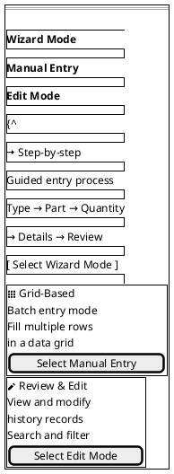

### C.2 DunnageTypeSelectionView

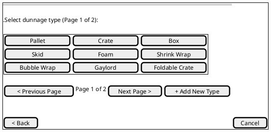

### C.3 DunnagePartSelectionView

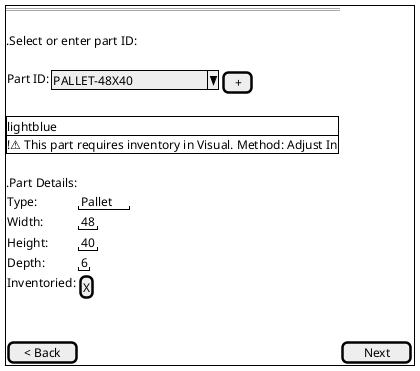

### C.4 DunnageQuantityEntryView

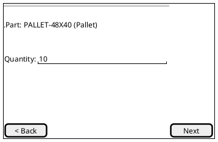

### C.5 DunnageDetailsEntryView

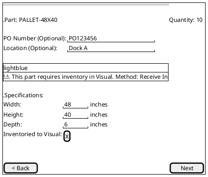

### C.6 DunnageReviewView

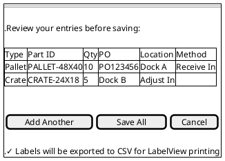

### C.7 DunnageManualEntryView

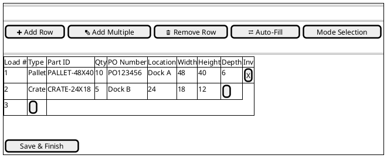

### C.8 DunnageEditModeView

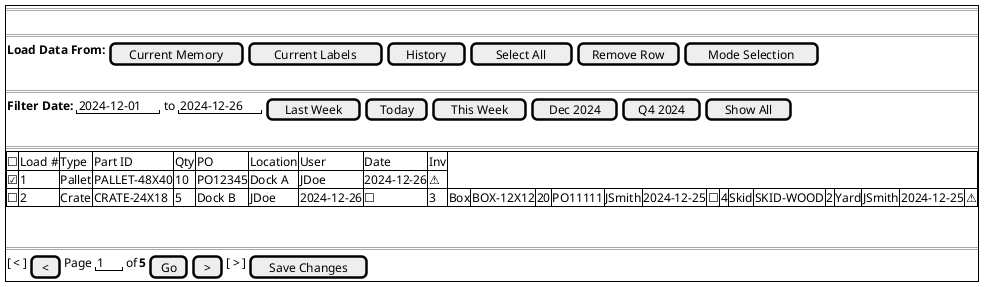

### C.9 DunnageAdminView - Main Navigation

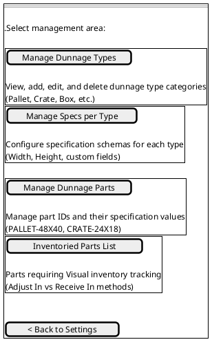

### C.9a DunnageAdminView - Manage Types

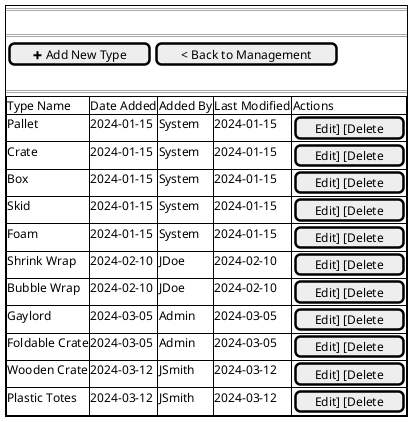

### C.9b DunnageAdminView - Manage Specs

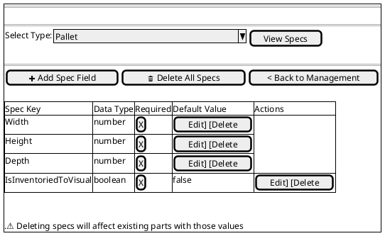

### C.9c DunnageAdminView - Manage Parts

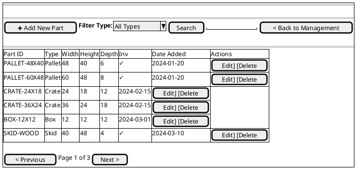

### C.9d DunnageAdminView - Inventoried Parts List

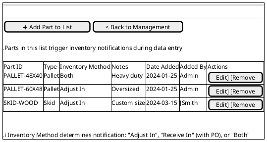

### C.10 Add New Type View (Full Form)

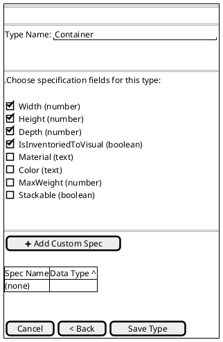

### C.11 Add New Part View (Full Form)

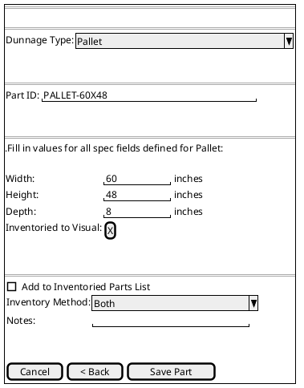

### C.12 Edit Dunnage Type View

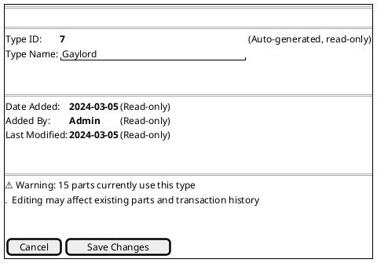

### C.13 Delete Dunnage Type Confirmation

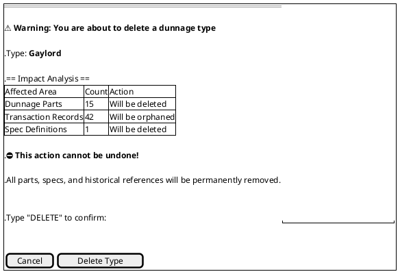

### C.14 Edit Spec Field View

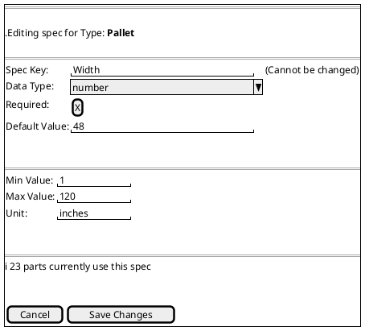

### C.15 Delete Spec Field Confirmation

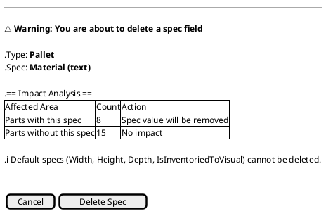

### C.16 Add New Spec Field View

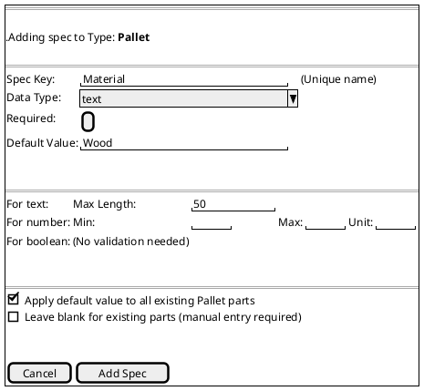

### C.17 Edit Dunnage Part View

```plantuml
@startsalt
{+
  == Edit Dunnage Part ==
  .
  == Part Identification ==
  {
    Part ID: | <b>PALLET-48X40 | (Cannot be changed)
    Type:    | <b>Pallet | (Cannot be changed)
  }
  .
  .
  == Specifications ==
  {
    Width:                    | "48        " | inches
    Height:                   | "40        " | inches
    Depth:                    | "6         " | inches
    Inventoried to Visual:    | [X]
    Material:                 | "Wood      "
  }
  .
  .
  == Metadata ==
  {
    Date Added:  | <b>2024-01-20 | (Read-only)
    Added By:    | <b>Admin | (Read-only)
  }
  .
  .
  == Inventory Settings ==
  {
    [X] Part is on Inventoried Parts List
    {
      Inventory Method: | ^Both                    ^
      Notes:            | "Heavy duty standard     "
    }
  }
  .
  .
  == Affected Records ==
  ℹ️ 127 transaction records reference this part
  .
  .
  {
    [ Cancel ] | [  Save Changes  ]
  }
}
@endsalt
```

### C.18 Delete Dunnage Part Confirmation

```plantuml
@startsalt
{+
  == Delete Dunnage Part ==
  .
  ⚠️ <b>Warning: You are about to delete a dunnage part
  .
  .Part ID: <b>PALLET-48X40
  .Type: <b>Pallet
  .
  .== Impact Analysis ==
  {#
    | Affected Area              | Count | Action
    | Transaction Records (Loads)| 127   | Will be orphaned
    | Inventoried Parts List     | 1     | Entry will be removed
  }
  .
  .⛔ <b>Recommended: Instead of deleting, consider:
  .  • Marking as discontinued/inactive (future feature)
  .  • Archiving transaction records first
  .
  .Type "DELETE" to confirm: | "                    "
  .
  .
  {
    [ Cancel ] | [  Delete Part  ]
  }
}
@endsalt
```

### C.19 Edit Inventoried Part Entry

```plantuml
@startsalt
{+
  == Edit Inventoried Part ==
  .
  == Part Information ==
  {
    Part ID: | <b>PALLET-48X40 | (Read-only)
    Type:    | <b>Pallet | (Read-only)
  }
  .
  .
  == Inventory Settings ==
  {
    Requires Inventory: | [X]
    Inventory Method:   | ^Both                           ^
  }
  .
  .Available methods:
  .  • <b>Adjust In: Manual inventory adjustment in Visual
  .  • <b>Receive In: Receive against PO in Visual
  .  • <b>Both: Either method can be used
  .
  .
  == Notes ==
  {
    {+
      "Heavy duty standard pallet used for
      large shipments. Must be tracked in
      Visual inventory system.              
                                             "
    }
  }
  .
  .
  == Metadata ==
  {
    Date Added: | <b>2024-01-25 | (Read-only)
    Added By:   | <b>Admin | (Read-only)
  }
  .
  .
  {
    [ Cancel ] | [  Save Changes  ]
  }
}
@endsalt
```

### C.20 Remove from Inventoried List Confirmation

```plantuml
@startsalt
{+
  == Remove from Inventoried Parts List ==
  .
  ℹ️ <b>Confirmation: Remove part from inventory tracking?
  .
  .Part ID: <b>PALLET-48X40
  .Current Method: <b>Both
  .
  .== Impact ==
  .• Part will no longer trigger inventory notifications
  .• Users will not see warnings during data entry
  .• No impact on existing transaction records
  .
  .This part can be re-added to the list at any time.
  .
  .
  {
    [ Cancel ] | [  Remove from List  ]
  }
}
@endsalt
```

---

**END OF SPECIFICATION**
