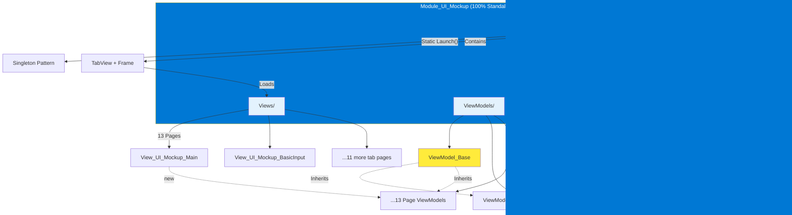

# WinUI 3 UI Mockup Module (All WinUI 3 Gallery Controls)

Generate a comprehensive WinUI 3 control mockup module for the `MTM_Receiving_Application` repository that demonstrates **all** WinUI 3 controls and UI patterns from the official **WinUI 3 Gallery** (not just the ones currently used in the app).

## 1. Research & design guidelines

1. Review the WinUI 3 Gallery (Microsoft Store app and/or GitHub repository)
1. Reference the Fluent Design System documentation
1. Study Microsoft Design Language guidelines
1. Research modern enterprise desktop application UI patterns
1. Review existing patterns in MTM_Receiving_Application:
    - Module_Receiving (guided wizard pattern)
    - Module_Routing (master-detail with CSV export)
    - Module_Dunnage (admin grid with pagination)
    - Module_Settings (4-card navigation)
    - Module_Shared (dialog patterns, login screens)
1. Focus on both:
    - Manufacturing / ERP workflows
    - Complete WinUI control library showcase


## 2. Module structure (standalone window architecture)



### File structure

```text
Module_UI_Mockup/
├── Window_UI_Mockup.xaml                             (Main Window - contains TabView)
├── Window_UI_Mockup.xaml.cs
├── Views/
│   ├── View_UI_Mockup_Main.xaml                      (Landing/Welcome Page)
│   ├── View_UI_Mockup_Main.xaml.cs
│   ├── View_UI_Mockup_BasicInput.xaml                (Tab 1)
│   ├── View_UI_Mockup_BasicInput.xaml.cs
│   ├── View_UI_Mockup_TextControls.xaml              (Tab 2)
│   ├── View_UI_Mockup_TextControls.xaml.cs
│   ├── View_UI_Mockup_Collections.xaml               (Tab 3)
│   ├── View_UI_Mockup_Collections.xaml.cs
│   ├── View_UI_Mockup_Navigation.xaml                (Tab 4)
│   ├── View_UI_Mockup_Navigation.xaml.cs
│   ├── View_UI_Mockup_DialogsFlyouts.xaml            (Tab 5)
│   ├── View_UI_Mockup_DialogsFlyouts.xaml.cs
│   ├── View_UI_Mockup_DateTime.xaml                  (Tab 6)
│   ├── View_UI_Mockup_DateTime.xaml.cs
│   ├── View_UI_Mockup_Media.xaml                     (Tab 7)
│   ├── View_UI_Mockup_Media.xaml.cs
│   ├── View_UI_Mockup_Layout.xaml                    (Tab 8)
│   ├── View_UI_Mockup_Layout.xaml.cs
│   ├── View_UI_Mockup_Status.xaml                    (Tab 9)
│   ├── View_UI_Mockup_Status.xaml.cs
│   ├── View_UI_Mockup_Advanced.xaml                  (Tab 10)
│   ├── View_UI_Mockup_Advanced.xaml.cs
│   └── View_UI_Mockup_Patterns.xaml                  (Tab 11 - App-specific patterns)
│       └── View_UI_Mockup_Patterns.xaml.cs
├── ViewModels/
│   ├── ViewModel_UI_Mockup_Window.cs                 (Window ViewModel)
│   ├── ViewModel_UI_Mockup_Main.cs                   (Welcome Page)
│   ├── ViewModel_UI_Mockup_BasicInput.cs
│   ├── ViewModel_UI_Mockup_TextControls.cs
│   ├── ViewModel_UI_Mockup_Collections.cs
│   ├── ViewModel_UI_Mockup_Navigation.cs
│   ├── ViewModel_UI_Mockup_DialogsFlyouts.cs
│   ├── ViewModel_UI_Mockup_DateTime.cs
│   ├── ViewModel_UI_Mockup_Media.cs
│   ├── ViewModel_UI_Mockup_Layout.cs
│   ├── ViewModel_UI_Mockup_Status.cs
│   ├── ViewModel_UI_Mockup_Advanced.cs
│   ├── ViewModel_UI_Mockup_Patterns.cs
│   └── ViewModel_UI_Mockup_CustomControls.cs
├── Helpers/
│   └── WindowHelper.cs                               (Window sizing and positioning)
├── Controls/
│   ├── Control_MetricCard.xaml                       (Custom metric display card)
│   ├── Control_MetricCard.xaml.cs
│   ├── Control_StatusBadge.xaml                      (Custom status indicator)
│   ├── Control_StatusBadge.xaml.cs
│   ├── Control_PartHeader.xaml                       (Custom part info header)
│   ├── Control_PartHeader.xaml.cs
│   ├── Control_POSummaryCard.xaml                    (Custom PO summary)
│   ├── Control_POSummaryCard.xaml.cs
│   ├── Control_QuantityInput.xaml                    (Custom quantity entry)
│   ├── Control_QuantityInput.xaml.cs
│   ├── Control_SearchBox.xaml                        (Enhanced search with filters)
│   ├── Control_SearchBox.xaml.cs
│   ├── Control_DataTable.xaml                        (Custom styled data table)
│   ├── Control_DataTable.xaml.cs
│   ├── Control_WizardStep.xaml                       (Custom wizard step indicator)
│   ├── Control_WizardStep.xaml.cs
│   ├── Control_ActionButton.xaml                     (Custom manufacturing action button)
│   ├── Control_ActionButton.xaml.cs
│   ├── Control_SkeletonLoader.xaml                   (Loading placeholder shimmer)
│   ├── Control_SkeletonLoader.xaml.cs
│   ├── Control_ToastNotification.xaml                (In-app toast/snackbar)
│   ├── Control_ToastNotification.xaml.cs
│   ├── Control_EmptyState.xaml                       (Empty state placeholder)
│   ├── Control_EmptyState.xaml.cs
│   ├── Control_LoadingOverlay.xaml                   (Loading overlay)
│   ├── Control_LoadingOverlay.xaml.cs
│   ├── Control_Timeline.xaml                         (Vertical timeline)
│   └── Control_Timeline.xaml.cs
└── Models/
     ├── Model_UI_SampleData.cs                        (Mock manufacturing data)
     └── README.md                                      (Module documentation and setup)
```

**🎯 100% Standalone Module - No External Dependencies**

This module is **completely self-contained** and can be copied to any WinUI 3 project. It has:

- ✅ No dependencies on existing services (IService_ErrorHandler, IService_Navigation, etc.)
- ✅ No dependencies on base classes from other modules (ViewModel_Shared_Base)
- ✅ No dependencies on helper classes (WindowHelper_WindowSizeAndStartupLocation)
- ✅ Self-contained ViewModels using CommunityToolkit.Mvvm
- ✅ Internal WindowHelper for window management
- ✅ Can be launched via simple `new Window_UI_Mockup().Activate()`


## 3. Complete control inventory by tab

### Tab 1: Basic input controls

- Button (standard, accent, subtle, disabled states)
- ToggleButton
- RadioButton (groups, inline, vertical)
- CheckBox (standard, 3-state/indeterminate)
- Slider (horizontal, vertical, with labels)
- RepeatButton
- SplitButton
- ToggleSplitButton
- DropDownButton
- ToggleSwitch
- HyperlinkButton
- Hyperlink (in text)
- AppBarButton (icon buttons with labels)
- AppBarToggleButton (toggleable icon buttons)
- AppBarSeparator (visual separator for toolbars)

### Tab 2: Text controls

- TextBox (standard, multi-line, read-only, validation, icons)
- PasswordBox (with reveal button)
- RichEditBox (formatted text editing)
- RichTextBlock (rich text display)
- TextBlock (styles, wrapping, trimming)
- NumberBox (spin buttons, min/max, decimal places)
- AutoSuggestBox (filtering, custom templates)
- ComboBox (standard, editable, grouped)
- RatingControl (star ratings, custom glyphs)

### Tab 3: Collections & data display

- ListView (standard, grid layout, custom `ItemTemplate`, selection modes)
- GridView (tile layout, wrap grid)
- TreeView (expandable nodes, custom templates)
- ItemsRepeater (virtualized, custom layouts)
- FlipView (carousel/slideshow)
- PipsPager (pagination indicator)
- SemanticZoom (zoom in/out between views)
- Expander (collapsible sections)
- DataGrid (CommunityToolkit: sorting, filtering, editing)

### Tab 4: Navigation controls

- NavigationView (Left, Top, LeftCompact modes, hierarchical items)
- TabView (closable tabs, custom headers, drag-drop)
- BreadcrumbBar (hierarchical navigation)
- CommandBar (primary/secondary commands, overflow)
- MenuBar (classic menu structure)
- MenuFlyout (context menus, sub-menus)

### Tab 5: Dialogs & flyouts

- ContentDialog (primary/secondary/close buttons, custom content)
- Flyout (standard popups)
- MenuFlyout (context-sensitive)
- CommandBarFlyout (rich command popup)
- TeachingTip (contextual help, light-dismiss, actionable)

### Tab 6: Date & time pickers

- CalendarDatePicker (date selection with calendar)
- CalendarView (full calendar display, range selection)
- DatePicker (dropdown date selector)
- TimePicker (time selection)

### Tab 7: Media & visual elements

- Image (various sources, stretch modes)
- PersonPicture (contact photos, initials)
- AnimatedIcon (interactive icons with state changes)
- AnimatedVisualPlayer (Lottie animations)
- MediaPlayerElement (video/audio playback)
- WebView2 (embedded web content)
- BingMapsControl (from CommunityToolkit - location visualization for shipping/receiving)
- Shapes (Rectangle, Ellipse, Line, Path, Polygon)

### Tab 8: Layout containers & panels

- ScrollViewer (horizontal, vertical, both, zoom)
- SplitView (pane modes: overlay, inline, compact)
- TwoPaneView (responsive dual-pane)
- ParallaxView (parallax scrolling effects)
- Grid (rows/columns, spanning)
- StackPanel (horizontal/vertical)
- RelativePanel (relative positioning)
- Canvas (absolute positioning)
- VariableSizedWrapGrid
- Border (rounded corners, backgrounds)

### Tab 9: Status & feedback

- ProgressBar (determinate, indeterminate)
- ProgressRing (loading spinner)
- InfoBar (Informational, Success, Warning, Error)
- ToolTip (standard, rich content)
- TeachingTip (see Tab 5)
- Badge (notification badges on icons/buttons)
- Chip/PillButton (removable filter tags, status indicators)

### Tab 10: Advanced & special controls

- SwipeControl (swipe actions on list items)
- InkCanvas (inking/drawing)
- InkToolbar (pen tools)
- ContactCard (contact popover)
- AnnotatedScrollBar (scrollbar with annotations)
- PullToRefresh (mobile-style refresh gesture)
- RefreshContainer (pull-to-refresh wrapper)
- SelectorBar (horizontal tab-like selector)
- Pivot (tabbed navigation - mobile pattern)
- Hub (sectioned scrollable content)
- ScrollBar (customizable scrollbar)

### Tab 11: Design elements & patterns

- Typography ramp (all TextBlock styles: Title, Subtitle, Body, Caption, etc.)
- Color palette (ThemeResource colors, accent colors)
- Brushes (Solid, Gradient, Acrylic, Reveal)
- ThemeShadow (depth/elevation)
- Rounded corners (CornerRadius examples)
- Spacing system (4px grid: 4, 8, 12, 16, 24, 32)
- Icons (FontIcon, SymbolIcon, BitmapIcon, IconSourceElement)
- Adaptive layouts (responsive breakpoints)
- Card patterns (elevation, borders, backgrounds)
- Form layouts (label alignment, validation, error states)
- Master-detail pattern
- Wizard / multi-step pattern (from Receiving module)
- Admin grid pattern (pagination, search, filter - from Dunnage admin)
- 4-card navigation (from Settings module)

### Tab 12: Custom controls & components

- **MetricCard** - Display KPIs and metrics (count, percentage, trend indicators)
- **StatusBadge** - Visual status indicators (Pending, In Progress, Completed, Error)
- **PartHeader** - Part information display with image, number, description, specs
- **POSummaryCard** - Purchase order summary with vendor, date, total items
- **QuantityInput** - Enhanced quantity entry with +/- buttons, UOM selector, validation
- **SearchBox** - Advanced search with filter chips, recent searches, suggestions
- **DataTable** - Styled data table with zebra striping, hover effects, action columns
- **WizardStep** - Custom wizard step indicator (active, completed, pending states)
- **ActionButton** - Manufacturing-specific action buttons (Receive, Ship, Print, Validate)
- **AlertBanner** - System-wide alerts and notifications
- **NavigationCard** - Large touch-friendly navigation cards (for main menu)
- **EmployeePicker** - Employee selection with photo, name, employee number
- **DateRangePicker** - Date range selector with presets (Today, This Week, This Month)
- **BarcodeInput** - Barcode input field with validation (Code 128/Code 39/QR format validation)
  - Auto-submit on scan completion (detecting barcode scanner enter/tab suffix)
  - Visual feedback for valid/invalid formats
  - Recent scans history dropdown
  - Manual entry mode with format helper text
- **SignaturePad** - Digital signature capture area using InkCanvas
  - Clear/Undo buttons
  - Save as image (PNG/SVG)
  - Signature validation (minimum stroke count)
- **SkeletonLoader** - Placeholder shimmer animation for loading states
  - Card skeleton, list skeleton, text skeleton
  - Animated shimmer effect
- **ToastNotification** - In-app toast/snackbar notifications
  - Slide-in from bottom or top
  - Auto-dismiss with timer
  - Action buttons (Undo, Retry, etc.)
- **EmptyState** - Placeholder for empty lists/data
  - Icon, title, description, action button
  - Different states: no data, no results, error
- **LoadingOverlay** - Full-screen or panel loading overlay
  - Semi-transparent backdrop
  - Spinner with message
  - Cancellable operations
- **Breadcrumb** - Navigation breadcrumb trail
  - Clickable path segments
  - Overflow handling for long paths
- **Stepper** - Numeric stepper input
  - +/- buttons with keyboard support
  - Min/max/step values
- **ColorPicker** - Color selection control
  - Preset color swatches
  - Custom color selector
  - Hex/RGB input
- **AvatarGroup** - Overlapping avatar stack
  - Show first N avatars, +X more indicator
  - Click to expand full list
- **SplitButton** - Button with dropdown menu
  - Primary action + additional options
- **SegmentedControl** - iOS-style segmented button group
  - Mutually exclusive selection
  - Smooth animation
- **FileUploader** - Drag-and-drop file upload area
  - File type filtering
  - Progress indicators
  - Preview thumbnails
- **RichTextEditor** - Formatted text editor toolbar
  - Bold, italic, underline, alignment
  - Font/size selectors
  - Undo/redo
- **TagInput** - Multi-tag input with autocomplete
  - Add/remove tags
  - Duplicate prevention
- **Timeline** - Vertical timeline component
  - Event markers with dates
  - Connection lines
  - Expandable details
- **Carousel** - Image/content carousel
  - Touch/swipe support
  - Indicator dots
  - Auto-play option
- **ContextMenu** - Right-click context menu
  - Hierarchical submenus
  - Icons and keyboard shortcuts
- **SplashScreen** - App startup splash
  - Logo/branding
  - Progress indicator
  - Version number
- **OnboardingTour** - First-run user onboarding
  - Step-by-step highlights
  - Skip/next/previous
  - Progress dots
- **KeyboardShortcuts** - Keyboard shortcut overlay
  - Display available shortcuts
  - Grouped by category

## 4. Custom controls architecture


### Custom control implementation pattern

#### Example: MetricCard.xaml

```xml
<UserControl
    x:Class="MTM_Receiving_Application.Module_UI_Mockup.Controls.Control_MetricCard"
    xmlns="http://schemas.microsoft.com/winfx/2006/xaml/presentation"
    xmlns:x="http://schemas.microsoft.com/winfx/2006/xaml">

    <Border
        Background="{ThemeResource CardBackgroundFillColorDefaultBrush}"
        BorderBrush="{ThemeResource CardStrokeColorDefaultBrush}"
        BorderThickness="1"
        CornerRadius="8"
        Padding="16">
        <Grid RowDefinitions="Auto,Auto,Auto" RowSpacing="8">
            <!-- Metric Label -->
            <TextBlock
                Grid.Row="0"
                Text="{x:Bind Label, Mode=OneWay}"
                Style="{StaticResource CaptionTextBlockStyle}"
                Foreground="{ThemeResource TextFillColorSecondaryBrush}" />
            
            <!-- Metric Value -->
            <TextBlock
                Grid.Row="1"
                Text="{x:Bind Value, Mode=OneWay}"
                Style="{StaticResource TitleTextBlockStyle}"
                Foreground="{x:Bind AccentColor, Mode=OneWay}" />
            
            <!-- Trend Indicator -->
            <StackPanel Grid.Row="2" Orientation="Horizontal" Spacing="4">
                <FontIcon
                    Glyph="{x:Bind TrendIcon, Mode=OneWay}"
                    FontSize="12"
                    Foreground="{x:Bind TrendColor, Mode=OneWay}" />
                <TextBlock
                    Text="{x:Bind TrendText, Mode=OneWay}"
                    Style="{StaticResource CaptionTextBlockStyle}"
                    Foreground="{x:Bind TrendColor, Mode=OneWay}" />
            </StackPanel>
        </Grid>
    </Border>
</UserControl>
```

**Code-behind with Dependency Properties:**

```csharp
public sealed partial class Control_MetricCard : UserControl
{
    public static readonly DependencyProperty LabelProperty =
        DependencyProperty.Register(nameof(Label), typeof(string), 
            typeof(Control_MetricCard), new PropertyMetadata(string.Empty));

    public static readonly DependencyProperty ValueProperty =
        DependencyProperty.Register(nameof(Value), typeof(string), 
            typeof(Control_MetricCard), new PropertyMetadata("0"));

    public static readonly DependencyProperty TrendTextProperty =
        DependencyProperty.Register(nameof(TrendText), typeof(string), 
            typeof(Control_MetricCard), new PropertyMetadata(string.Empty));

    public static readonly DependencyProperty TrendIconProperty =
        DependencyProperty.Register(nameof(TrendIcon), typeof(string), 
            typeof(Control_MetricCard), new PropertyMetadata("\uE098")); // Up arrow

    public string Label
    {
        get => (string)GetValue(LabelProperty);
        set => SetValue(LabelProperty, value);
    }

    public string Value
    {
        get => (string)GetValue(ValueProperty);
        set => SetValue(ValueProperty, value);
    }

    public string TrendText
    {
        get => (string)GetValue(TrendTextProperty);
        set => SetValue(TrendTextProperty, value);
    }

    public string TrendIcon
    {
        get => (string)GetValue(TrendIconProperty);
        set => SetValue(TrendIconProperty, value);
    }

    public SolidColorBrush AccentColor { get; set; } = new SolidColorBrush(Colors.DodgerBlue);
    public SolidColorBrush TrendColor { get; set; } = new SolidColorBrush(Colors.Green);

    public Control_MetricCard()
    {
        InitializeComponent();
    }
}
```

**Usage in Views:**

```xml
<controls:Control_MetricCard
    Label="Packages Received Today"
    Value="142"
    TrendText="+12% from yesterday"
    TrendIcon="&#xE098;"
    Width="200" />
```

### Custom control design guidelines

1. **Dependency Properties** - All bindable properties must be DependencyProperty
1. **Default Styling** - Use ThemeResource for colors, consistent CornerRadius
1. **Touch-Friendly** - Minimum 44×44 touch targets for manufacturing floor
1. **Accessibility** - AutomationProperties on all interactive elements
1. **Reusability** - Parameterized via properties, not hardcoded values
1. **Visual States** - Support Normal, PointerOver, Pressed, Disabled, Focused
1. **Fluent Design** - Acrylic backgrounds, reveal effects, smooth animations
1. **Themeable** - Respect Light/Dark/High Contrast themes

### Manufacturing-specific custom controls

**StatusBadge** - Color-coded status indicators:

- `Pending` - Yellow/Amber
- `InProgress` - Blue
- `Completed` - Green
- `Error` - Red
- `OnHold` - Gray

**QuantityInput** - Enhanced numeric input:

- Large +/- buttons (touch-friendly)
- Unit of measure dropdown (EA, LB, FT, etc.)
- Min/Max validation with visual feedback
- Quick increment buttons (±1, ±10, ±100)

**PartHeader** - Manufacturing part info display:

- Part thumbnail image with fallback:

  ```xml
  <Image Source="{x:Bind PartImageUri, Mode=OneWay, FallbackValue='/Assets/Icons/part-placeholder.png'}" 
         Width="80" Height="80" Stretch="UniformToFill" />
  ```

- Part number with copy button
- Description with truncation
- Specifications (material, weight, dimensions)
- Stock status indicator

**WizardStep** - Multi-step process indicator:

- Step number badge
- Step title
- Active/Completed/Pending visual states
- Progress connector lines
- Click to navigate (if allowed)

## 5. Window design requirements

### Window specifications

**Window class**: `Window_UI_Mockup` (inherits from `Window`)

```xml
<Window
    x:Class="MTM_Receiving_Application.Module_UI_Mockup.Window_UI_Mockup"
    xmlns="http://schemas.microsoft.com/winfx/2006/xaml/presentation"
    xmlns:x="http://schemas.microsoft.com/winfx/2006/xaml">
    
    <!-- Window content -->
</Window>
```

**Required window features**:

- **Title**: "WinUI 3 Control Gallery - MTM Manufacturing"
- **Size**: 1400×900 (using `WindowHelper_WindowSizeAndStartupLocation.SetWindowSize(1400, 900)`)
- **Mica backdrop**: Enable system backdrop for modern appearance
- **Custom title bar**: Use `Window.ExtendsContentIntoTitleBar="True"` with custom drag region
- **Window icon**: Set via AppWindow.SetIcon():

  ```csharp
  var appWindow = GetAppWindowForCurrentWindow();
  if (appWindow != null)
  {
      appWindow.SetIcon(Path.Combine(AppContext.BaseDirectory, "Assets/app-icon.ico"));
  }
  ```

- **Min size**: 1024×768 to ensure controls are visible
- **Centered startup**: Use `WindowHelper_WindowSizeAndStartupLocation.CenterWindow()`

### Window layout structure


**Window XAML structure**:

```xml
<Window>
  <Grid RowDefinitions="Auto,Auto,*,Auto">
    <!-- Row 0: Custom Title Bar -->
    <Grid
      x:Name="AppTitleBar"
      Grid.Row="0"
      Height="48"
      Background="{ThemeResource LayerFillColorDefaultBrush}">
      <Grid.ColumnDefinitions>
        <ColumnDefinition Width="Auto"/>
        <ColumnDefinition Width="*"/>
        <ColumnDefinition Width="Auto"/>
      </Grid.ColumnDefinitions>
      
      <!-- App Icon + Title (drag region) -->
      <StackPanel Grid.Column="1" Orientation="Horizontal" Spacing="12">
        <Image Source="/Assets/app-icon.png" Width="20" Height="20" />
        <TextBlock
          Text="WinUI 3 Control Gallery - MTM Manufacturing"
          Style="{StaticResource CaptionTextBlockStyle}"
          VerticalAlignment="Center" />
      </StackPanel>
    </Grid>
    
    <!-- Row 1: TabView Navigation -->
    <TabView
      x:Name="MainTabView"
      Grid.Row="1"
      SelectionChanged="OnTabSelectionChanged"
      Margin="8,0,8,0">
      <!-- Tab items -->
    </TabView>
    
    <!-- Row 2: Content Frame -->
    <Frame x:Name="ContentFrame" Grid.Row="2" />
    
    <!-- Row 3: Status Bar -->
    <Grid Grid.Row="3" Height="32" Background="{ThemeResource LayerFillColorDefaultBrush}">
      <TextBlock
        x:Name="StatusText"
        Text="{x:Bind ViewModel.StatusMessage, Mode=OneWay}"
        Style="{StaticResource CaptionTextBlockStyle}"
        Margin="12,0"
        VerticalAlignment="Center" />
    </Grid>
  </Grid>
</Window>
```

### Window ViewModel (`ViewModel_UI_Mockup_Window`)

```csharp
using CommunityToolkit.Mvvm.ComponentModel;
using CommunityToolkit.Mvvm.Input;

namespace MTM_Receiving_Application.Module_UI_Mockup.ViewModels;

public partial class ViewModel_UI_Mockup_Window : ViewModel_Base
{
    [ObservableProperty]
    private int _totalControlsShown = 150; // Approximate count
    
    [ObservableProperty]
    private string _currentTabName = "Welcome";
    
    public ViewModel_UI_Mockup_Window()
    {
        StatusMessage = "Ready";
    }
    
    [RelayCommand]
    private void UpdateStatus(string tabName)
    {
        CurrentTabName = tabName;
        StatusMessage = $"Viewing: {tabName} | Total Controls: {TotalControlsShown}";
    }
}
```

### Window code-behind

```csharp
public sealed partial class Window_UI_Mockup : Window
{
    public ViewModel_UI_Mockup_Window ViewModel { get; }

    public Window_UI_Mockup()
    {
        ViewModel = App.GetService<ViewModel_UI_Mockup_Window>();
        InitializeComponent();
        
        // Set window size and position
        WindowHelper_WindowSizeAndStartupLocation.SetWindowSize(this, 1400, 900);
        WindowHelper_WindowSizeAndStartupLocation.CenterWindow(this);
        
        // Enable Mica backdrop
        SystemBackdrop = new MicaBackdrop();
        
        // Configure custom title bar
        ExtendsContentIntoTitleBar = true;
        SetTitleBar(AppTitleBar);
        
        // Set minimum size
        var appWindow = GetAppWindowForCurrentWindow();
        if (appWindow != null)
        {
            appWindow.Resize(new Windows.Graphics.SizeInt32 { Width = 1024, Height = 768 });
            
            // Set window icon
            var iconPath = Path.Combine(AppContext.BaseDirectory, "Assets/app-icon.ico");
            if (File.Exists(iconPath))
            {
                appWindow.SetIcon(iconPath);
            }
        }
        
        // Navigate to welcome page
        ContentFrame.Navigate(typeof(View_UI_Mockup_Main));
    }
    
    private void OnTabSelectionChanged(object sender, SelectionChangedEventArgs e)
    {
        if (MainTabView.SelectedItem is TabViewItem selectedTab && 
            selectedTab.Tag is string pageTypeName)
        {
            Type pageType = Type.GetType(
                $"MTM_Receiving_Application.Module_UI_Mockup.Views.{pageTypeName}");
            
            if (pageType != null)
            {
                ContentFrame.Navigate(pageType);
                ViewModel.UpdateStatusCommand.Execute(selectedTab.Header?.ToString() ?? "Unknown");
            }
        }
    }
    
    private Microsoft.UI.Windowing.AppWindow GetAppWindowForCurrentWindow()
    {
        IntPtr hWnd = WinRT.Interop.WindowNative.GetWindowHandle(this);
        Microsoft.UI.WindowId windowId = Microsoft.UI.Win32Interop.GetWindowIdFromWindow(hWnd);
        return Microsoft.UI.Windowing.AppWindow.GetFromWindowId(windowId);
    }
}
```

## 6. Architecture requirements (100% standalone - no external dependencies)

### Standalone base ViewModel

**Create `ViewModel_Base.cs`** (internal to module):

```csharp
using CommunityToolkit.Mvvm.ComponentModel;

namespace MTM_Receiving_Application.Module_UI_Mockup.ViewModels;

/// <summary>
/// Standalone base ViewModel for UI Mockup module.
/// No dependencies on external services - fully self-contained.
/// </summary>
public partial class ViewModel_Base : ObservableObject
{
    [ObservableProperty]
    private bool _isBusy;

    [ObservableProperty]
    private string _statusMessage = string.Empty;

    protected void SetStatus(string message)
    {
        StatusMessage = message;
    }

    protected void SetBusy(bool busy, string message = "")
    {
        IsBusy = busy;
        if (!string.IsNullOrEmpty(message))
        {
            StatusMessage = message;
        }
    }
}
```

### ViewModels must

- Inherit from `ViewModel_Base` (internal to module - no external dependencies)
- Use CommunityToolkit.Mvvm attributes:
  - `[ObservableProperty]` for properties
  - `[RelayCommand]` for commands
- **No constructor injection** - fully self-contained
- Example:

```csharp
using CommunityToolkit.Mvvm.ComponentModel;
using CommunityToolkit.Mvvm.Input;
using System.Collections.ObjectModel;

namespace MTM_Receiving_Application.Module_UI_Mockup.ViewModels;

public partial class ViewModel_UI_Mockup_BasicInput : ViewModel_Base
{
    [ObservableProperty]
    private string _sampleText = "Hello, WinUI 3!";

    [ObservableProperty]
    private ObservableCollection<string> _items = new();

    public ViewModel_UI_Mockup_BasicInput()
    {
        LoadSampleData();
    }

    [RelayCommand]
    private void LoadSampleData()
    {
        SetBusy(true, "Loading sample data...");
        
        Items.Clear();
        for (int i = 1; i <= 10; i++)
        {
            Items.Add($"Sample Item {i}");
        }
        
        SetBusy(false, $"Loaded {Items.Count} items");
    }
}
```

### Views must

- Use a code-behind pattern with minimal logic
- Get ViewModel from DI:

  ```csharp
  ViewModel = App.GetService<ViewModel_UI_Mockup_[Name]>();
  ```

- Use `x:Bind` for all data binding (not `Binding`)
- Follow naming: `View_UI_Mockup_[Purpose].xaml`
- Each tab view should be a separate **Page** (not `UserControl`) for consistency

### Service registration in `App.xaml.cs`

### Window instantiation (no DI required)

**The module is completely standalone** - no service registration needed!

To use in any WinUI 3 project:

```csharp
// Simply create and show the window
var uiGalleryWindow = new MTM_Receiving_Application.Module_UI_Mockup.Window_UI_Mockup();
uiGalleryWindow.Activate();
```

**Alternative: Static launcher method** in `Window_UI_Mockup.xaml.cs`:

```csharp
public sealed partial class Window_UI_Mockup : Window
{
    private static Window_UI_Mockup? _instance;
    
    /// <summary>
    /// Launches the UI Gallery window (singleton pattern).
    /// </summary>
    public static void Launch()
    {
        if (_instance == null)
        {
            _instance = new Window_UI_Mockup();
            _instance.Closed += (s, e) => _instance = null;
        }
        _instance.Activate();
    }
    
    // ... rest of implementation
}
```

Usage:

```csharp
Window_UI_Mockup.Launch(); // From anywhere in the app
```

## 7. TabView implementation (in Window)

The `Window_UI_Mockup` contains the TabView. `View_UI_Mockup_Main.xaml` is the welcome/landing page that loads first.

**Welcome Page (`View_UI_Mockup_Main.xaml`)**:

```xml
<Page
    x:Class="MTM_Receiving_Application.Module_UI_Mockup.Views.View_UI_Mockup_Main"
    xmlns="http://schemas.microsoft.com/winfx/2006/xaml/presentation"
    xmlns:x="http://schemas.microsoft.com/winfx/2006/xaml">

  <ScrollViewer>
    <StackPanel Padding="40" Spacing="24" MaxWidth="1000">
      <TextBlock
        Text="WinUI 3 Control Gallery"
        Style="{StaticResource TitleLargeTextBlockStyle}" />
      
      <TextBlock
        Text="Complete reference for all WinUI 3 controls and design patterns used in MTM manufacturing applications."
        Style="{StaticResource BodyTextBlockStyle}"
        TextWrapping="Wrap" />
      
      <!-- Quick navigation cards -->
      <ItemsRepeater ItemsSource="{x:Bind ViewModel.QuickNavItems, Mode=OneWay}">
        <!-- Card templates for each tab -->
      </ItemsRepeater>
    </StackPanel>
  </ScrollViewer>
</Page>
```

```xml
<Page>
  <Grid>
     <TabView SelectionChanged="{x:Bind ViewModel.OnTabSelectionChanged}">
        <TabView.TabItems>
          <TabViewItem Header="Basic Input" IconSource="Keyboard" />
          <TabViewItem Header="Text Controls" IconSource="Font" />
          <TabViewItem Header="Collections" IconSource="List" />
          <TabViewItem Header="Navigation" IconSource="Navigation" />
          <TabViewItem Header="Dialogs & Flyouts" IconSource="Message" />
          <TabViewItem Header="Date & Time" IconSource="Calendar" />
          <TabViewItem Header="Media & Visual" IconSource="Pictures" />
          <TabViewItem Header="Layout & Panels" IconSource="View" />
          <TabViewItem Header="Status & Feedback" IconSource="Important" />
          <TabViewItem Header="Advanced" IconSource="Repair" />
          <TabViewItem Header="App Patterns" IconSource="Design" />
        </TabView.TabItems>
     </TabView>

     <!-- Content Frame -->
     <Frame x:Name="ContentFrame" Grid.Row="1" />
  </Grid>
</Page>
```

**Tab pages** are the same as previously defined (Basic Input, Text Controls, Collections, etc.) plus the new **Tab 12: Custom Controls**.

## 8. Sample data (manufacturing context)

```mermaid
flowchart LR
    subgraph SampleData["Model_UI_SampleData.cs (Standalone)"]
        PO[PO Data]
        Parts[Parts Data]
        Trans[Transactions]
        Emp[Employees]
        Dunn[Dunnage Types]
        Route[Routing Recipients]
        Volvo[Volvo Shipments]
        Tree[Hierarchical Data]
        Images[Image Helpers]
    end
    
    PO --> |"Format: PO-123456"| UI1[ListView/ComboBox]
    Parts --> |"Format: ABC-12345-XYZ"| UI2[AutoSuggestBox]
    Trans --> |"Date/Qty/Status"| UI3[DataGrid]
    Emp --> |"Name/Number/Role"| UI4[PersonPicture]
    Tree --> |"Dept → Line → Station"| UI5[TreeView]
    Images --> |"Fallback pattern"| UI6[Image Controls]
    
    style SampleData fill:#0078d4,color:#fff
```



Create `Model_UI_SampleData.cs` with:

- **PO numbers** (format: `PO-123456`, `PO-066868`)
- **Part numbers** (format: `ABC-12345-XYZ`, `MCC-45678-A`, `MMF-98765-B`)
- **Receiving transactions** (dates, quantities, statuses: `Pending`, `In Progress`, `Completed`, receivers)
- **Employee data** (names, employee numbers 1000-9999, roles: `Operator`, `Lead`, `Material Handler`, `Quality`)
- **Dunnage types/specs** (box sizes: `12x8x6`, pallet types: `48x40 Standard`, `48x48 Euro`)
- **Routing recipients** (departments: `Press Floor`, `Assembly`, `Shipping`, stations: `Press 1`, `Line A`)
- **Volvo shipment data** (shipment numbers, container IDs, status)
- **Hierarchical data** (for TreeView: departments → lines → stations → workcenters)
- **Image URIs** with fallback pattern:

  ```csharp
  public static string GetImageUri(string imageName) =>
      File.Exists($"Assets/Images/{imageName}") 
          ? $"ms-appx:///Assets/Images/{imageName}" 
          : "ms-appx:///Assets/Icons/placeholder-image.png";
  
  // PersonPicture images
  public static string GetEmployeePhoto(int employeeNumber) =>
      $"https://api.dicebear.com/7.x/initials/svg?seed=Employee{employeeNumber}";
  ```

- **Date ranges** (for CalendarView: last 30 days, next 7 days)
- **Rating data** (1-5 stars for quality metrics)
- **Progress values** (0-100 for ProgressBar examples)
- **Status messages** (for InfoBar: Info, Success, Warning, Error scenarios)

## 9. Integration with MainWindow (launch standalone window)


Add to `MainWindow.xaml` (around line 90+, after existing NavigationViewItems):

```xml
<!-- UI Design Reference Section (Admin/Developer Only) -->
<NavigationViewItemSeparator />

<NavigationViewItem
  Content="UI Design Reference"
  Tag="LaunchUIGallery"
  Margin="0,0,0,4"
  Visibility="{x:Bind ViewModel.IsAdminUser, Mode=OneWay}">
  <NavigationViewItem.Icon>
     <FontIcon Glyph="&#xE771;" />
  </NavigationViewItem.Icon>
  <ToolTipService.ToolTip>
      <ToolTip Content="Open WinUI 3 control gallery in new window" />
  </ToolTipService.ToolTip>
</NavigationViewItem>
```

**Update `MainWindow.xaml.cs` `NavView_SelectionChanged` method:**

```csharp
private void NavView_SelectionChanged(NavigationView sender, NavigationViewSelectionChangedEventArgs args)
{
    if (args.SelectedItem is NavigationViewItem selectedItem)
    {
        string? tag = selectedItem.Tag?.ToString();
        
        // Handle UI Gallery window launch - NO DEPENDENCIES!
        if (tag == "LaunchUIGallery")
        {
            Module_UI_Mockup.Window_UI_Mockup.Launch();
            return;
        }
        
        // ... rest of existing navigation logic
    }
}
```

**Alternative: Add menu item or keyboard shortcut**:

```xml
<!-- In MainWindow CommandBar or MenuBar -->
<MenuBarItem Title="Developer">
  <MenuFlyoutItem
    Text="UI Control Gallery"
    Icon="Design"
    Click="OnLaunchUIGalleryClick">
    <MenuFlyoutItem.KeyboardAccelerators>
      <KeyboardAccelerator Key="G" Modifiers="Control,Shift" />
    </MenuFlyoutItem.KeyboardAccelerators>
  </MenuFlyoutItem>
</MenuBarItem>
```

```csharp
private void OnLaunchUIGalleryClick(object sender, RoutedEventArgs e)
{
    Module_UI_Mockup.Window_UI_Mockup.Launch();
}
```

**Note:** The UI Gallery window is independent and can remain open while users work in the main application.

## 10. Code quality standards (match repository conventions)

### Naming conventions

- ViewModels: `ViewModel_UI_Mockup_[Purpose]`
- Views: `View_UI_Mockup_[Purpose]`
- Models: `Model_UI_[Purpose]`

### Documentation

- XML comments (`/// <summary>`) on all public members
- Region organization:
  - `#region Properties`
  - `#region Commands`
  - `#region Initialization`
  - `#region Event Handlers`

### Error handling

- Use `_errorHandler.HandleException()` for errors
- Use `_logger.LogInfo` / `_logger.LogWarning` / `_logger.LogError` for logging

### Async patterns

- All async methods end with `Async`
- Properly `await` all async calls
- Use `[RelayCommand]` for async commands (generates `...Command` and `...CommandAsync`)

## 11. WinUI 3 Fluent Design features (demonstrate in all tabs)

- Acrylic brush effects (backgrounds)
- Mica backdrop (already in MainWindow)
- Rounded corners:
  - `CornerRadius="4"` for buttons
  - `CornerRadius="8"` for cards
  - `CornerRadius="12"` for panels
- Card-style containers:
  - `Background="{ThemeResource CardBackgroundFillColorDefaultBrush}"`
  - `BorderBrush="{ThemeResource CardStrokeColorDefaultBrush}"`
  - `BorderThickness="1"`
- Spacing: multiples of 4 (4, 8, 12, 16, 24, 32, 48)
- Theme awareness: Use `{ThemeResource}` for all colors
- Shadows:

  ```xml
  <Border.Shadow>
     <ThemeShadow />
  </Border.Shadow>
  ```

- Typography: Demonstrate all text styles:
  - `TitleLargeTextBlockStyle`
  - `TitleTextBlockStyle`
  - `SubtitleTextBlockStyle`
  - `BodyStrongTextBlockStyle`
  - `BodyTextBlockStyle`
  - `CaptionTextBlockStyle`
  - `BaseTextBlockStyle`

## 12. Accessibility requirements

For every interactive control:

- `AutomationProperties.Name`
- `AutomationProperties.HelpText` (where applicable)
- Proper tab order (`TabIndex` if needed)
- Keyboard shortcuts (AccessKey for navigation)
- High contrast mode compatibility
- Screen reader friendly labels

## 13. Deliverables checklist


**Required deliverables:**

- ✅ Complete `Module_UI_Mockup/` folder structure with **100% standalone architecture**
  - ✅ No external service dependencies
  - ✅ No base class dependencies
  - ✅ No helper class dependencies
  - ✅ Can be copied to any WinUI 3 project
- ✅ **Standalone Window** (`Window_UI_Mockup.xaml` + `.xaml.cs` + ViewModel)
  - Custom title bar with drag region
  - Mica backdrop enabled
  - 1400×900 size, centered, min 1024×768
  - TabView navigation integrated
  - Status bar showing current tab and control count
  - Static `Launch()` method for easy access
- ✅ **Standalone base classes**:
  - `ViewModel_Base.cs` - No external dependencies
  - `WindowHelper.cs` - Window sizing/positioning/centering
- ✅ 12 XAML views:
  - `View_UI_Mockup_Main.xaml` (Welcome/Landing page)
  - 12 tab page views (Basic Input, Text, Collections, Navigation, Dialogs, DateTime, Media, Layout, Status, Advanced, Patterns, **Custom Controls**)
- ✅ 13 ViewModels inheriting from **standalone `ViewModel_Base`** with comprehensive sample data
  - No external dependencies - completely self-contained
- ✅ **14 Custom Controls** in `Controls/` folder:
  - MetricCard, StatusBadge, PartHeader, POSummaryCard, QuantityInput
  - SearchBox, DataTable, WizardStep, ActionButton
  - SkeletonLoader, ToastNotification, EmptyState, LoadingOverlay, Timeline
  - All with DependencyProperties, proper styling, and modern app patterns
  - Touch-friendly (44×44 minimum), themeable, accessible
- ✅ **No service registration required** - completely standalone module!
  - Launch via: `Module_UI_Mockup.Window_UI_Mockup.Launch()`
  - Or: `new Window_UI_Mockup().Activate()`
- ✅ Integration code snippets for `MainWindow.xaml` and `MainWindow.xaml.cs`
- ✅ `Model_UI_SampleData.cs` with rich manufacturing mock data (PO, parts, employees, transactions)
- ✅ `README.md` in `Module_UI_Mockup/` explaining:
  - **Standalone architecture** - how to copy/paste to other projects
  - Purpose of the mockup module (UI reference & pattern library)
  - How to launch: `Window_UI_Mockup.Launch()` or `new Window_UI_Mockup().Activate()`
  - Description of each tab and the WinUI 3 controls demonstrated
  - Code patterns and MVVM best practices shown
  - Manufacturing-specific UI patterns (wizard, admin grid, master-detail)
  - How to use this as a reference during development
  - **Portability checklist**:
    - ✅ Requires CommunityToolkit.Mvvm NuGet package
    - ✅ Requires CommunityToolkit.WinUI.UI.Controls for DataGrid
    - ✅ Requires Material.Icons.WinUI3 for modern iconography
    - ✅ Requires Lottie-Windows for animated visuals
    - ✅ No project-specific dependencies
    - ✅ All namespaces can be renamed via Find/Replace
  - Links to:
    - [WinUI 3 Gallery (Microsoft Store)](https://www.microsoft.com/store/productId/9P3JFPWWDZRC)
    - [WinUI 3 Gallery GitHub](https://github.com/microsoft/WinUI-Gallery)
    - [Fluent Design System](https://www.microsoft.com/design/fluent/)
    - [WinUI 3 API Reference](https://learn.microsoft.com/windows/winui/api/)
- ✅ Inline XML documentation (`/// <summary>`) for all public classes/methods/properties
- ✅ Code comments explaining complex UI patterns and binding scenarios
- ✅ **Window launcher integration** in MainWindow (NavigationViewItem or MenuBarItem with Ctrl+Shift+G shortcut)
  - Uses `Module_UI_Mockup.Window_UI_Mockup.Launch()` - no DI required!

## 14. Special notes

### External package dependencies


**Controls requiring external packages:**

- **DataGrid**: ✅ `CommunityToolkit.WinUI.UI.Controls` (version 7.1.2+) - **Required**
- **Material Icons**: ✅ `Material.Icons.WinUI3` (version 2.4.1+) - **Required**
- **Lottie Animations**: ✅ `Lottie-Windows` - **Required** for AnimatedVisualPlayer
- **WebView2**: ✅ Included in WindowsAppSDK 1.8+ - use directly:

  ```xml
  <WebView2 x:Name="Browser" Source="https://example.com" />
  ```

  Requires initialization in code-behind:

  ```csharp
  await Browser.EnsureCoreWebView2Async();
  ```

- **AnimatedVisualPlayer**: Install `Microsoft.UI.Xaml.Controls.AnimatedVisualPlayer` or use AnimatedIcon:

  ```xml
  <AnimatedIcon x:Name="SearchIcon">
      <AnimatedIcon.Source>
          <controls:AnimatedSearchIconSource />
      </AnimatedIcon.Source>
  </AnimatedIcon>
  ```

  Alternative: Use Lottie-Windows package for JSON animations:

  ```xml
  <lottie:LottieVisualSource x:Name="LottieSource" 
                             UriSource="ms-appx:///Assets/Animations/loading.json" />
  ```

- **BingMapsControl**: Install `Microsoft.Toolkit.Uwp.UI.Controls.DataGrid` NuGet, then:

  ```xml
  <maps:MapControl ZoomLevel="10" Center="{x:Bind MapCenter, Mode=OneWay}" />
  ```

**Implementation pattern for controls with async initialization:**

**Implementation pattern for controls with async initialization:**

```csharp
// WebView2 initialization in Page.Loaded event
private async void OnPageLoaded(object sender, RoutedEventArgs e)
{
    try
    {
        await WebViewControl.EnsureCoreWebView2Async();
        WebViewControl.CoreWebView2.Navigate("https://example.com");
    }
    catch (Exception ex)
    {
        // Show fallback UI
        WebViewControl.Visibility = Visibility.Collapsed;
        FallbackPanel.Visibility = Visibility.Visible;
        _errorHandler.HandleException(ex, Enum_ErrorSeverity.Low, 
            nameof(OnPageLoaded), nameof(View_UI_Mockup_Media));
    }
}
```

**Conditional XAML for optional controls:**

```xml
<!-- WebView2 with fallback UI -->
<Grid>
    <WebView2 x:Name="WebViewControl" Source="https://example.com" />
    
    <Border x:Name="FallbackPanel" Visibility="Collapsed"
            Background="{ThemeResource CardBackgroundFillColorDefaultBrush}"
            BorderBrush="{ThemeResource CardStrokeColorDefaultBrush}"
            BorderThickness="1" CornerRadius="8" Padding="24">
        <StackPanel Spacing="12" HorizontalAlignment="Center" VerticalAlignment="Center">
            <FontIcon Glyph="&#xE774;" FontSize="48" 
                      Foreground="{ThemeResource AccentFillColorDefaultBrush}" />
            <TextBlock Text="WebView2 Control" 
                       Style="{StaticResource SubtitleTextBlockStyle}"
                       HorizontalAlignment="Center" />
            <TextBlock Text="This control requires initialization" 
                       Style="{StaticResource BodyTextBlockStyle}"
                       Foreground="{ThemeResource TextFillColorSecondaryBrush}"
                       HorizontalAlignment="Center" />
        </StackPanel>
    </Border>
</Grid>
```

### Performance considerations

- Use `x:Load="False"` for heavy controls (WebView2, MediaPlayerElement) and load on-demand
- Virtualize collections (`ListView`, `GridView`) using `ItemsStackPanel` or `ItemsWrapGrid`
- Defer loading of media assets until tab is selected
- Use `BitmapImage` with `DecodePixelWidth`/`DecodePixelHeight` for image optimization:

  ```csharp
  var bitmap = new BitmapImage(new Uri("ms-appx:///Assets/Images/part.jpg"))
  {
      DecodePixelWidth = 200, // Match display size
      DecodePixelType = DecodePixelType.Logical
  };
  ImageControl.Source = bitmap;
  ```

- For PersonPicture, use initials fallback when photo unavailable:

  ```xml
  <PersonPicture DisplayName="{x:Bind EmployeeName}" 
                 ProfilePicture="{x:Bind PhotoUri, Mode=OneWay}" />
  ```

### Testing recommendations

1. Test all tabs for layout responsiveness (resize window)
1. Test theme switching (Light/Dark/High Contrast)
1. Test keyboard navigation (Tab order, AccessKeys)
1. Test screen reader announcements
1. Verify all x:Bind bindings compile successfully
1. Test on different DPI scaling (100%, 125%, 150%, 200%)
1. Verify sample data loads correctly in all controls
