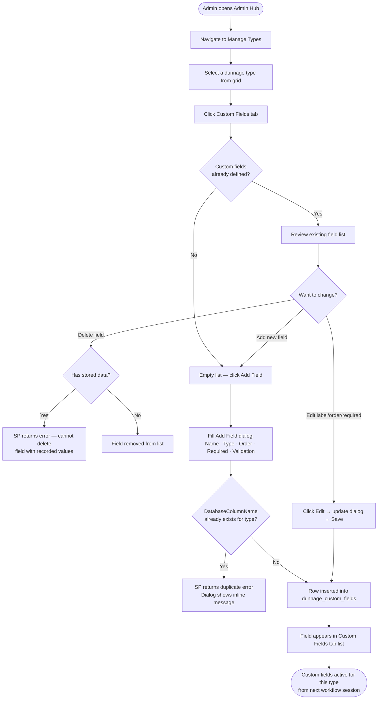
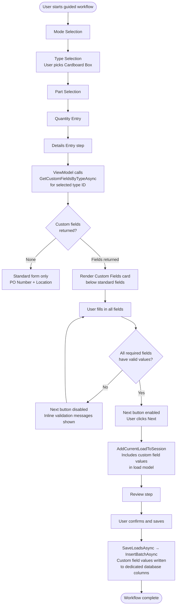
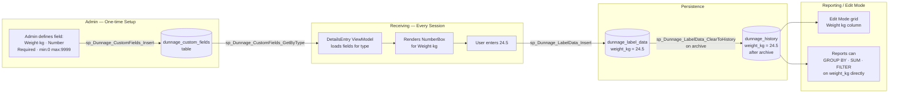

# Module_Dunnage — Open TODOs v2.0

Last Updated: 2026-03-13

---

## Progress Checklist

| ID | Title | Severity | Blocking | Status |
|---|---|---|---|---|
| DB-01 | Service UpdateLoadAsync / DeleteLoadAsync Are Dead Stubs | HIGH | Yes | ✅ Fixed |
| DB-02 | Dao_DunnageCustomField Has No Service, Interface, or UI | MEDIUM | No | ⬜ Open |
| DB-03 | sp_Dunnage_LabelData_GetAll Missing Index | LOW | No | ⬜ Open |
| WF-01 | Workflow Session Not Cleared on Partial Cancel | MEDIUM | No | ✅ Fixed |
| WF-02 | DetailsEntry Step Has No Validation Before Advancing | MEDIUM | No | ✅ Fixed |
| WF-03 | No Confirmation Before Archiving Active Print Queue | HIGH | No | ✅ Already Resolved |
| UX-01 | Edit Mode Date Filter Buttons Trigger Concurrent DB Calls | LOW | No | ⬜ Open |
| UX-02 | Two Overlapping Sets of Date Setter Commands | LOW | No | ⬜ Open |
| UX-03 | Review Step Single-View Has No "N of Total" Label | LOW | No | ⬜ Open |
| ARCH-01 | ViewModel_Dunnage_Review Leaks StepChanged Event Subscription | MEDIUM | No | ⬜ Open |
| ARCH-02 | Model_DunnageSession Uses Manual INotifyPropertyChanged | LOW | No | ⬜ Open |
| ARCH-03 | Service_DunnageWorkflow Has a using for Module_Dunnage.Data | MEDIUM | No | ⬜ Open |
| SEC-01 | Workflow Singleton Holds Previous User Session Loads | LOW | No | ⬜ Open |
| PERF-01 | ManualEntry Loads All Parts at Startup Instead of On Type Select | MEDIUM | No | ⬜ Open |

---

## How to Read This Document

This is the v2.0 rewrite of the TODO tracker. It covers every open work item found across the full Module_Dunnage surface (ViewModels, Services, DAOs, SPs, Models, Views, and XAML). Items are grouped by area of the application. All items from v1.0 are resolved and listed at the bottom.

Blocking column: **Yes** = feature is broken or missing in a currently-wired UI path. **No** = degraded experience or missing enhancement with a workaround available.

---

## Category: Database

### DB-01 — Service_MySQL_Dunnage.UpdateLoadAsync / DeleteLoadAsync Are Dead Stubs

**Files:** `Module_Dunnage\Services\Service_MySQL_Dunnage.cs`
**Blocking:** Yes — Edit Mode save and delete always return a failure message to the user.

Both methods return `Model_Dao_Result_Factory.Failure(...)` with a literal string and never call the DAO. `Dao_DunnageLoad.UpdateAsync` and `Dao_DunnageLoad.DeleteAsync` exist and call the correct SPs (`sp_dunnage_loads_update`, `sp_dunnage_loads_delete`). The fix is a one-line wiring call in each service method, identical to the pattern used by every other load operation.

**Fix path:**
1. In `UpdateLoadAsync`, call `_daoDunnageLoad.UpdateAsync(Guid.Parse(load.LoadUuid.ToString()), load.Quantity, CurrentUser)`
2. In `DeleteLoadAsync`, call `_daoDunnageLoad.DeleteAsync(Guid.Parse(loadUuid))`
3. Add standard try/catch wrapper matching other load methods.

### DB-02 — Dao_DunnageCustomField Has No Service, No Interface Method, No UI

**Files:** `Module_Dunnage\Data\Dao_DunnageCustomField.cs`, `Module_Dunnage\Contracts\IService_MySQL_Dunnage.cs`, `Infrastructure\DependencyInjection\ModuleServicesExtensions.cs`
**Blocking:** No — feature is simply missing.

The DAO is registered in DI, injected into `Service_MySQL_Dunnage`, but the private field `_daoCustomField` is never read. No service interface methods exist for custom field CRUD. No ViewModel calls the service. No Admin UI surface exposes custom fields. The `Model_CustomFieldDefinition` model and the stored procedures suggest this was scaffolded for a future Admin → Custom Fields section that was never built.

**What this feature does for the user:**
Custom Fields let an admin define extra, typed data-capture fields per dunnage type that appear in the DetailsEntry step of the receiving workflow. Unlike Specs (free-text JSON), Custom Fields are validated, can be required, have a declared data type (Text / Number / Date), and their values are stored in dedicated database columns — making them reportable and filterable without JSON parsing. An admin creating a "Foam Padding" type could add a required `Weight (kg)` numeric field; every time a user receives Foam Padding, the workflow enforces that weight is entered before they can advance.

---

#### User Stories

**US-01 — Admin defines a custom field for a dunnage type**
> As an Admin, when I am on the Admin → Manage Types page and select a type, I want to open a "Custom Fields" tab so that I can define additional data-capture fields specific to that type.

Acceptance criteria:
- A "Custom Fields" tab is visible when a type is selected in the Admin Types view.
- I can add a new custom field by specifying: Field Name (label shown to user), Field Type (Text / Number / Date), Display Order (integer), Is Required (checkbox), and Validation Rules (optional, e.g. `min:0 max:9999`).
- The system prevents duplicate `DatabaseColumnName` values for the same type.
- I can reorder fields using Display Order.
- I can delete a field that has no recorded values (SP enforces this check).
- Changes are reflected immediately in the field list without a full page reload.

**US-02 — Admin edits an existing custom field**
> As an Admin, I want to edit the label, display order, or required flag of an existing custom field so that I can correct mistakes without deleting and re-adding the field.

Acceptance criteria:
- Clicking a row in the Custom Fields grid opens an inline edit or a dialog pre-populated with current values.
- I cannot change the `Field Type` or `DatabaseColumnName` after creation (would break stored data).
- Changes are saved and visible immediately.

**US-03 — Receiving user sees custom fields at the DetailsEntry step**
> As a receiving user, when I reach the DetailsEntry step of the guided workflow and my selected dunnage type has custom fields defined, I want those fields to appear in the form so that I can capture the required information.

Acceptance criteria:
- Custom fields appear as a card section below the standard PO Number / Location fields.
- Required fields are visually marked (asterisk, or InfoBadge).
- The correct input control renders for each type: `TextBox` for Text, `NumberBox` for Number, `DatePicker` for Date.
- The "Next" button is disabled until all required custom fields have a value.
- Validation rules (min/max, regex) are applied on input and shown inline.

**US-04 — Receiving user sees custom fields in Manual Entry mode**
> As a receiving user working in Manual Entry, when I select a dunnage type that has custom fields, I want those fields to appear as additional columns in the entry grid so that I can fill them in per row.

Acceptance criteria:
- Custom field columns appear to the right of the standard columns.
- Required fields show a warning indicator on the row if left blank.
- The Save button is disabled if any required custom field on any row is empty.

**US-05 — Custom field values appear in Edit Mode history grid**
> As a receiving user or supervisor reviewing historical records in Edit Mode, I want to see the values captured for custom fields so that I can verify what was recorded.

Acceptance criteria:
- Each custom field appears as a column in the Edit Mode DataGrid.
- Columns are labelled using `FieldName`, not `DatabaseColumnName`.
- Null / blank values render as an em-dash (—) rather than empty cells.

---

#### UI Mockups

**Mockup A — Admin Types View with Custom Fields Tab**

```
┌─────────────────────────────────────────────────────────────────────────┐
│  Manage Dunnage Types                                                   │
│  Add, edit, and delete dunnage types with impact analysis               │
├─────────────────────────────────────────────────────────────────────────┤
│  [+ Add New Type]  [✏ Edit Type]  [🗑 Delete Type]  [← Back to Admin]  │
├─────────────────────────────────────────────────────────────────────────┤
│                                                                         │
│  ┌─── Types ─────────────────────────────────────────────────────────┐  │
│  │  ID │ Name          │ Icon        │ Parts │ Transactions          │  │
│  │  ─────────────────────────────────────────────────────────────── │  │
│  │   1 │ Foam Padding  │ 🗂 Layers   │    12 │ 847                   │  │
│  │ ► 2 │ Cardboard Box │ 📦 Package  │     8 │ 1,203                 │  │
│  │   3 │ Plastic Wrap  │ 🔄 Sync     │     3 │ 412                   │  │
│  └───────────────────────────────────────────────────────────────────┘  │
│                                                                         │
│  Selected: Cardboard Box                                                │
│  ┌─ [ Type Info ] [ Custom Fields ] [ Parts ] [ Impact ] ───────────┐  │
│  │                                           ◄── NEW TAB            │  │
│  │  [+ Add Field]  [✏ Edit]  [🗑 Delete]                            │  │
│  │                                                                   │  │
│  │  Order │ Field Name      │ Type   │ Required │ Validation         │  │
│  │  ─────────────────────────────────────────────────────────────   │  │
│  │    1   │ Weight (kg)     │ Number │    ✔     │ min:0 max:9999     │  │
│  │    2   │ Box Grade       │ Text   │    ✔     │ —                  │  │
│  │    3   │ Received On     │ Date   │          │ —                  │  │
│  │                                                                   │  │
│  └───────────────────────────────────────────────────────────────────┘  │
└─────────────────────────────────────────────────────────────────────────┘
```

**Mockup B — Add Custom Field Dialog**

```
┌─────────────────────────────────────────────────┐
│  Add Custom Field — Cardboard Box               │
├─────────────────────────────────────────────────┤
│                                                 │
│  Field Name *                                   │
│  ┌─────────────────────────────────────────┐   │
│  │ Weight (kg)                             │   │
│  └─────────────────────────────────────────┘   │
│                                                 │
│  Field Type *                                   │
│  ┌──────────────┐                              │
│  │ Number     ▼ │                              │
│  └──────────────┘                              │
│  (Cannot be changed after creation)             │
│                                                 │
│  Display Order *                                │
│  ┌──────────────┐                              │
│  │ 1            │                              │
│  └──────────────┘                              │
│                                                 │
│  ☑ Required                                    │
│                                                 │
│  Validation Rules  (optional)                   │
│  ┌─────────────────────────────────────────┐   │
│  │ min:0 max:9999                          │   │
│  └─────────────────────────────────────────┘   │
│  Hint: min:0 max:100 | regex:^[A-Z]+$           │
│                                                 │
├─────────────────────────────────────────────────┤
│                   [Cancel]  [Save Field]        │
└─────────────────────────────────────────────────┘
```

**Mockup C — DetailsEntry Step with Custom Fields Section**

```
┌─────────────────────────────────────────────────────────┐
│  Enter Details                                          │
│  Fill in receiving details for Cardboard Box            │
├─────────────────────────────────────────────────────────┤
│                                                         │
│  ┌─ Standard Fields ───────────────────────────────┐   │
│  │  PO Number          Location                    │   │
│  │  ┌──────────────┐   ┌──────────────────────┐   │   │
│  │  │ 12345-A      │   │ Dock 3 — Bay 12      │   │   │
│  │  └──────────────┘   └──────────────────────┘   │   │
│  └─────────────────────────────────────────────────┘   │
│                                                         │
│  ┌─ Cardboard Box — Custom Fields ─────────────────┐   │
│  │                                                  │   │
│  │  Weight (kg) *                                   │   │
│  │  ┌──────────────────┐                           │   │
│  │  │ 24.5             │  ← NumberBox (min 0)      │   │
│  │  └──────────────────┘                           │   │
│  │                                                  │   │
│  │  Box Grade *                                     │   │
│  │  ┌──────────────────┐                           │   │
│  │  │                  │  ← Required, empty         │   │
│  │  └──────────────────┘                           │   │
│  │  ⚠ Box Grade is required                        │   │
│  │                                                  │   │
│  │  Received On                                     │   │
│  │  ┌──────────────────┐                           │   │
│  │  │ 07/14/2025     ▼ │  ← DatePicker             │   │
│  │  └──────────────────┘                           │   │
│  └──────────────────────────────────────────────────┘  │
│                                                         │
│           [← Back]   [Next ➜]  ← disabled until valid  │
└─────────────────────────────────────────────────────────┘
```

**Mockup D — Manual Entry Grid with Custom Field Columns**

```
┌──────────┬──────────┬──────┬─────────────┬───────────┬────────────┐
│ Part ID  │ Quantity │ PO # │ Weight (kg) │ Box Grade │ Received On│
│          │          │      │  * Required │ * Required│            │
├──────────┼──────────┼──────┼─────────────┼───────────┼────────────┤
│ BOX-001  │       50 │ 123  │        24.5 │ B-Flute   │ 07/14/2025 │
│ BOX-002  │       30 │ 123  │          ⚠ │ ⚠         │            │
│ BOX-003  │       10 │ 456  │        18.0 │ C-Flute   │            │
└──────────┴──────────┴──────┴─────────────┴───────────┴────────────┘
  ⚠ Row 2 has required custom fields that are empty. Save is disabled.
```

---

#### Workflow Diagrams

**Diagram 1 — Admin Setup Flow**



**Diagram 2 — Receiving User Flow (Guided Workflow)**



**Diagram 3 — Data Flow (Definition → Capture → Storage)**



---

#### Fix Path

1. Add to `IService_MySQL_Dunnage`:
   - `GetCustomFieldsByTypeAsync(int typeId)`
   - `InsertCustomFieldAsync(int typeId, Model_CustomFieldDefinition field)`
   - `UpdateCustomFieldAsync(Model_CustomFieldDefinition field)`
   - `DeleteCustomFieldAsync(int fieldId)`
2. Implement each in `Service_MySQL_Dunnage` wrapping `_daoCustomField` with standard try/catch logging.
3. Fix `sp_Dunnage_CustomFields_Insert` — the C# DAO does not pass `p_database_column_name`, `p_validation_rules`, or the two OUT params (`p_status`, `p_error_msg`) that the SP declares. Either update the DAO to pass all parameters or simplify the SP to match (see SP-Validation-and-Edge-Cases-v2.0.md DB-DAO-01).
4. Create `ViewModel_Dunnage_AdminCustomFields` — CRUD list, Add/Edit dialog, Delete with impact check.
5. Add a "Custom Fields" tab to `View_Dunnage_AdminTypesView.xaml` (Pivot/TabView item, visible when a type is selected).
6. Extend `ViewModel_Dunnage_DetailsEntryViewModel` to load custom fields for the selected type on initialisation and render them dynamically.
7. Render custom field inputs in `View_Dunnage_DetailsEntryView.xaml` as a dynamic `ItemsControl` bound to `ViewModel.CustomFields`, templated by `FieldType`.
8. Pass captured custom field values through `Model_DunnageLoad` (extend model or use `SpecValues` dictionary as interim) into `InsertBatchAsync`.
9. Register `ViewModel_Dunnage_AdminCustomFields` and its view as Transient in `ModuleServicesExtensions.cs`.


### DB-03 — sp_Dunnage_LabelData_GetAll Missing Index Warning

**Files:** `Database\StoredProcedures\Dunnage\sp_Dunnage_LabelData_GetAll.sql`
**Blocking:** No — performance degrades as queue grows, not a correctness issue.

The active-queue SELECT performs a full table scan ordered by `received_date`. An index on `dunnage_label_data(received_date)` should be added. This is a schema migration task, not a code fix.

**Fix path:**
1. Add `CREATE INDEX idx_dunnage_label_data_received_date ON dunnage_label_data (received_date);` to the database setup scripts.

---

## Category: Workflow

### WF-01 — Workflow Session Not Cleared on Partial Cancel

**Files:** `Module_Dunnage\Services\Service_DunnageWorkflow.cs`, `Module_Dunnage\ViewModels\ViewModel_Dunnage_WorkFlowViewModel.cs`
**Blocking:** No — can be reproduced but requires specific navigation sequence.

If a user reaches the Review step and then navigates away using a path that does not go back through `StartWorkflowAsync` (e.g., directly jumping to TypeSelection from a button), `ClearSession` is not called. The stale loads from the prior run will be visible if the user returns to Review without restarting from ModeSelection.

**Fix path:**
1. Call `ClearSession()` at the start of `GoToStep(Enum_DunnageWorkflowStep.TypeSelection)` when the current step is not `ModeSelection`.
2. Or: bind the return-to-start button to a new `RestartWorkflowCommand` that explicitly calls `StartWorkflowAsync`.

### WF-02 — DetailsEntry Step Has No Validation Before Advancing

**Files:** `Module_Dunnage\Services\Service_DunnageWorkflow.cs`
**Blocking:** No — saves succeed with blank metadata.

`AdvanceToNextStepAsync` in the `DetailsEntry` case calls `AddCurrentLoadToSession()` without any guard on required fields. Other steps validate their required fields (type selected, part selected, quantity > 0) before advancing. DetailsEntry should validate PO number (if required by settings), location (if required), and at minimum that the load quantity is still valid.

**Fix path:**
1. Add a validation block in the `DetailsEntry` case of `AdvanceToNextStepAsync` before calling `AddCurrentLoadToSession`.
2. Return `Model_WorkflowStepResult { IsSuccess = false, ErrorMessage = "..." }` if required fields are empty.
3. Wire validation rules to `IService_ReceivingSettings` or a new dunnage-specific settings key.

### WF-03 — No Confirmation Before Archiving Active Print Queue

**Files:** `Module_Dunnage\ViewModels\ViewModel_Dunnage_ReviewViewModel.cs`
**Blocking:** No — accidental data loss is possible but recoverable from history.

The "Archive / Complete" action calls `ClearLabelDataAsync` which permanently moves all active queue rows to history. There is no "Are you sure?" confirmation dialog. The archive is not destructive (rows survive in history), but recovering them for re-print requires manual work.

**Fix path:**
1. Before calling `ClearLabelDataAsync`, show a `ContentDialog` asking "This will archive all N labels. Continue?"
2. Proceed only if the user confirms.

---

## Category: User Experience

### UX-01 — Edit Mode Date Filter Buttons Trigger Concurrent DB Calls

**Files:** `Module_Dunnage\ViewModels\ViewModel_Dunnage_EditModeViewModel.cs`
**Blocking:** No — results in stale or jumbled data if buttons are clicked rapidly.

Each of the six date filter commands immediately calls `LoadFromHistoryAsync()`. There is no `CancellationToken` to cancel a prior in-flight query when a new filter is selected. A click-happy user can produce a race where a slower query from an earlier click overwrites the results of a faster, more-recent query.

**Fix path:**
1. Introduce a `CancellationTokenSource _loadCts` field on the ViewModel.
2. At the start of `LoadFromHistoryAsync`, cancel `_loadCts` and create a fresh one.
3. Pass the token to the service call and handle `OperationCanceledException`.

### UX-02 — Two Overlapping Sets of Date Setter Commands

**Files:** `Module_Dunnage\ViewModels\ViewModel_Dunnage_EditModeViewModel.cs`
**Blocking:** No — inconsistent UX only.

The ViewModel has `SetFilterLastWeekAsync` (loads immediately) and `SetDateRangeLastWeek` (sets dates only, no load). Both are bound in XAML, giving inconsistent button behaviour depending on which surface is used. Consolidate to a single set that sets dates and re-loads.

**Fix path:**
1. Remove the non-loading `SetDateRangeToday / SetDateRangeLastWeek / SetDateRangeLastMonth` commands (or make them call the async versions).
2. Verify XAML bindings are updated to point to the consolidated commands.

### UX-03 — Review Step Single-View Has No "N of Total" Label

**Files:** `Module_Dunnage\Views\View_Dunnage_ReviewView.xaml`
**Blocking:** No — usability gap only.

The carousel shows `CurrentEntryIndex` but no total count. Users cannot see at a glance that they are on entry 2 of 7. Add a `x:Bind ViewModel.LoadCount` display next to the index.

---

## Category: Architecture

### ARCH-01 — ViewModel_Dunnage_Review Leaks StepChanged Event Subscription

**Files:** `Module_Dunnage\ViewModels\ViewModel_Dunnage_ReviewViewModel.cs`
**Blocking:** No — memory leak; may cause stale method calls on discarded instances.

The constructor subscribes to `_workflowService.StepChanged`. The ViewModel is Transient — a new instance is created on each navigation. Discarded instances are never disposed so the subscription is never removed. Each abandoned instance holds a reference from the Singleton workflow service, preventing GC and potentially calling `LoadSessionLoads()` on a stale ViewModel.

**Fix path:**
1. Implement `IDisposable` on `ViewModel_Dunnage_Review`.
2. In `Dispose()`, call `_workflowService.StepChanged -= OnWorkflowStepChanged`.
3. Ensure the View's code-behind or DI lifecycle calls `Dispose()` on navigation away.

### ARCH-02 — Model_DunnageSession Uses Manual INotifyPropertyChanged

**Files:** `Module_Dunnage\Models\Model_DunnageSession.cs`
**Blocking:** No — works correctly, consistency issue only.

`Model_DunnageSession` manually implements `INotifyPropertyChanged` with a private `SetField<T>` helper. All other observable types in the module use `[ObservableProperty]` from CommunityToolkit.Mvvm. The manual implementation is more verbose and must be maintained manually.

**Fix path:**
1. Convert `Model_DunnageSession` to a `partial class` inheriting `ObservableObject`.
2. Replace each backing field + manual setter with `[ObservableProperty]`.
3. Remove the manual `INotifyPropertyChanged` implementation and `SetField<T>` helper.

### ARCH-03 — Service_DunnageWorkflow Has a using for Module_Dunnage.Data

**Files:** `Module_Dunnage\Services\Service_DunnageWorkflow.cs`
**Blocking:** No — potential architecture violation if a DAO type is consumed directly.

The service file imports `MTM_Receiving_Application.Module_Dunnage.Data`. Verify whether this using is consumed by a live DAO reference or is simply unused. If unused, remove it. If used, the direct DAO reference must be replaced with a service call.

**Fix path:**
1. Search the file for any symbol from the `Data` namespace.
2. If unused: remove the using.
3. If used: refactor the reference to go through the service layer.

---

## Category: Security

### SEC-01 — Workflow Singleton Holds Previous User's Session Loads

**Files:** `Module_Dunnage\Services\Service_DunnageWorkflow.cs`, `Infrastructure\DependencyInjection\ModuleServicesExtensions.cs`
**Blocking:** No — relevant in shared-terminal deployments only.

`Service_DunnageWorkflow` is a Singleton. `CurrentSession.Loads` persists between user logins until `StartWorkflowAsync` is called. On a shared terminal where User A completes a workflow and User B logs in, User B could see User A's unarchived session loads in the Review step if they navigate there directly without starting a new workflow.

**Fix path:**
1. Subscribe to a user-logout or session-switch event in `Service_DunnageWorkflow`.
2. Call `ClearSession()` on every user change.

---

## Category: Performance

### PERF-01 — ManualEntry Loads All Parts at Startup Instead of On Type Select

**Files:** `Module_Dunnage\ViewModels\ViewModel_Dunnage_ManualEntryViewModel.cs`
**Blocking:** No — slow startup only.

`InitializeAsync` fetches all parts for all types upfront. For large part catalogues this is wasteful. The guided workflow's `PartSelection` step already loads parts on-demand when a type is selected. Manual Entry should mirror this pattern.

**Fix path:**
1. Remove the all-parts pre-load from `InitializeAsync`.
2. Add an `OnAvailableTypesSelectedChanged` handler that calls `GetPartsByTypeAsync(selectedTypeId)` when the type combobox selection changes.

---

## Resolved from v1.0

| ID | Description | Resolution |
|---|---|---|
| VM-01 | AddLineAsync dead stub | Removed — no XAML binding, no design |
| VM-02 | LoadFromCurrentLabelsAsync not implemented | Implemented — SP + DAO + service + VM |
| SVC-01 | SaveLoadsAsync save path ambiguity | Confirmed routes through Dao_DunnageLabelData |
| DAO-01 | Dao_DunnageLine static / deprecated | Deleted |
| SP-01 | sp_Dunnage_Line_Insert no-op | Deleted |
| SP-02 | sp loads insert partial schema | Deleted |
| DBG-01 | Console.WriteLine credentials | Removed |
