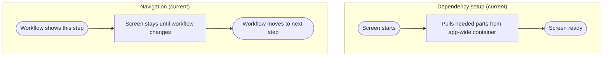

# View_Receiving_LoadEntry - Dependency & Navigation Review

Last Updated: 2026-01-30

## Summary
- This screen pulls its parts and focus helper from a global app lookup (deprecated).
- Movement into and out of this screen is controlled elsewhere.

## Dependency setup issues
- Uses a global lookup instead of a clear handoff from the workflow.
- The focus helper is a hidden dependency that is not obvious to users.
- If the lookup fails, the screen can load without expected behavior.

## Navigation issues
- The screen does not define entry or exit actions.
- Navigation is handled outside the screen, making the flow harder to trace.

## Impact
- Hidden dependencies make issues harder to diagnose.

## Recommended direction (plain language)
- Have the workflow provide this screen what it needs directly.
- Keep navigation decisions centralized for consistency.

