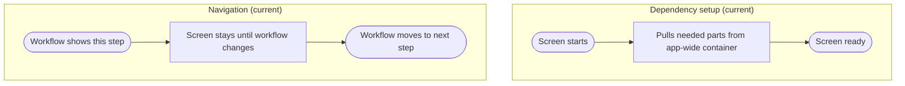

# View_Receiving_ModeSelection - Dependency & Navigation Review

Last Updated: 2026-01-30

## Summary
- This screen pulls what it needs from a global app lookup at runtime (deprecated).
- Movement into and out of this screen is controlled elsewhere.

## Dependency setup issues
- Uses a global lookup instead of being clearly provided what it needs.
- If the lookup fails, the screen can appear without the expected data or behavior.
- This approach is hard to swap or test.

## Navigation issues
- The screen does not state how users get here or where they go next.
- Navigation is managed outside the screen without a single visible owner.

## Impact
- Troubleshooting is harder because setup and navigation are spread out.

## Recommended direction (plain language)
- Have the workflow supply this screen what it needs up front.
- Keep navigation decisions in one place so the path is easy to follow.

