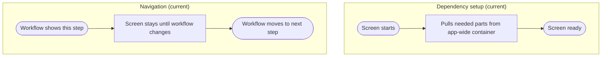

# View_Receiving_POEntry - Dependency & Navigation Review

Last Updated: 2026-01-30

## Summary
- This screen pulls its main parts and focus helper from a global app lookup (deprecated).
- Movement into and out of this screen is controlled elsewhere.

## Dependency setup issues
- Uses a global lookup for required parts instead of a clear handoff.
- The focus helper is also pulled the same way, so the screen has hidden dependencies.
- If the lookup fails, the screen can load without expected behavior.

## Navigation issues
- The screen does not define how users arrive or leave.
- Navigation is handled outside the screen, which makes the flow harder to trace.

## Impact
- Hidden dependencies increase the chance of inconsistent behavior between environments.

## Recommended direction (plain language)
- Provide this screen what it needs through the workflow, not a global lookup.
- Keep navigation decisions centralized so the user path is easy to follow.

