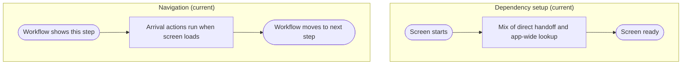

# View_Receiving_PackageType - Dependency & Navigation Review

Last Updated: 2026-01-30

## Summary
- This screen uses a mixed setup: sometimes parts are handed in directly, and sometimes it falls back to a global lookup (deprecated).
- Arrival actions run when the screen loads, not when navigation is explicitly confirmed.

## Dependency setup issues
- Mixed setup creates inconsistent behavior between usage paths.
- The global lookup fallback is deprecated and can hide missing dependencies.
- Users may see different results depending on how the screen is created.

## Navigation issues
- Arrival actions are tied to screen load timing, which can be inconsistent.
- Navigation remains outside this screen with no single visible owner.

## Impact
- Inconsistency makes it harder to diagnose issues or reproduce behavior.

## Recommended direction (plain language)
- Use one consistent setup path for this screen.
- Run arrival actions when navigation says the step is active, not just when it loads.

