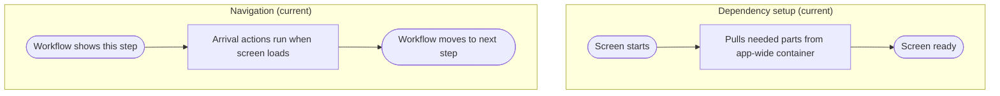

# View_Receiving_WeightQuantity - Dependency & Navigation Review

Last Updated: 2026-01-30

## Summary
- This screen pulls what it needs from a global app lookup at runtime (deprecated).
- Arrival actions run when the screen loads, not when navigation is explicitly confirmed.

## Dependency setup issues
- Uses a global lookup instead of being clearly provided what it needs.
- If the lookup fails, the screen can appear without expected behavior.
- The setup is harder to test or replace.

## Navigation issues
- Arrival actions are tied to screen load timing, which can be inconsistent.
- The navigation path is controlled outside this screen, not in a single visible place.

## Impact
- Users can see inconsistent behavior when screens load too early or too late.

## Recommended direction (plain language)
- Let the workflow provide this screen what it needs directly.
- Run arrival actions when navigation says the step is active, not just when it loads.

