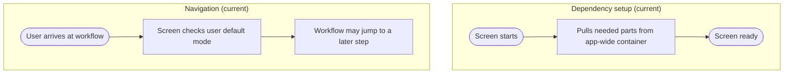

# View_Receiving_Workflow - Dependency & Navigation Review

Last Updated: 2026-01-30

## Summary
- This screen pulls what it needs from a global app lookup at runtime (deprecated).
- It makes navigation decisions itself based on user defaults.

## Dependency setup issues
- Uses a global lookup for key parts instead of a clear handoff.
- Pulls the same parts again during navigation, which can drift from the initial state.
- If the lookup fails, the screen can appear without expected behavior.

## Navigation issues
- Navigation decisions are made inside the screen rather than a single navigation owner.
- The screen can skip steps automatically, which hides the user path.

## Impact
- Navigation becomes harder to trace and explain to users.

## Recommended direction (plain language)
- Provide this screen what it needs directly from the workflow setup.
- Keep all step-jump decisions in one place so the path is predictable.

